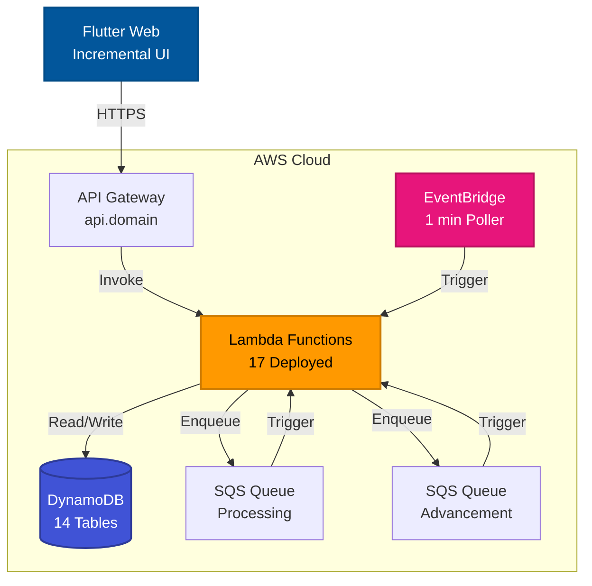
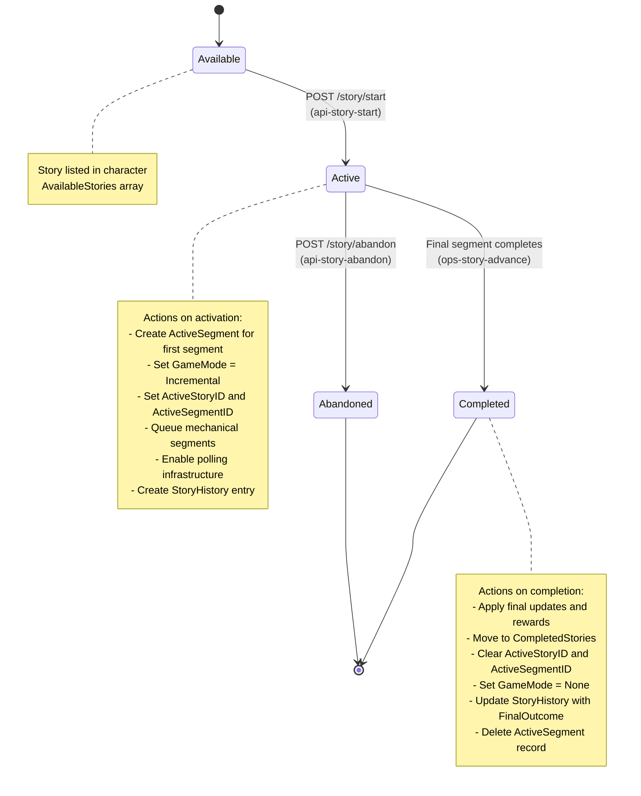
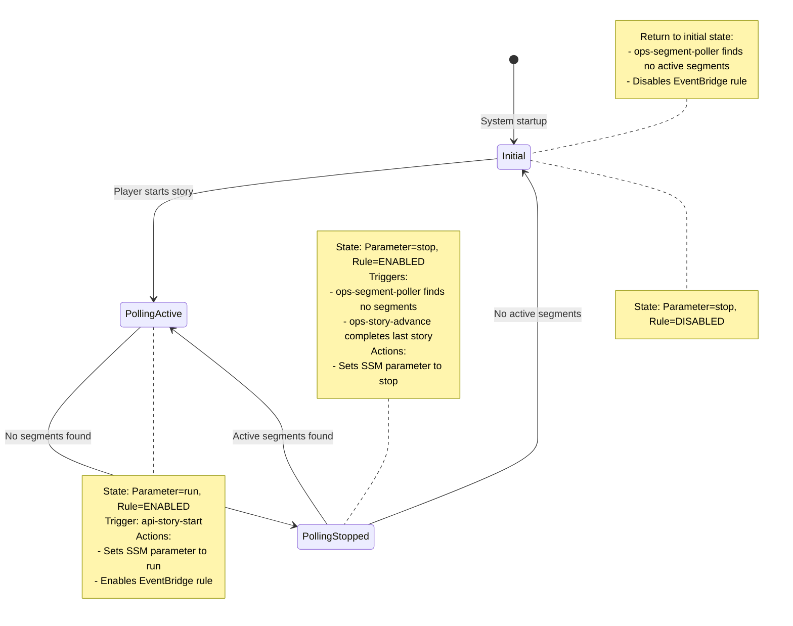
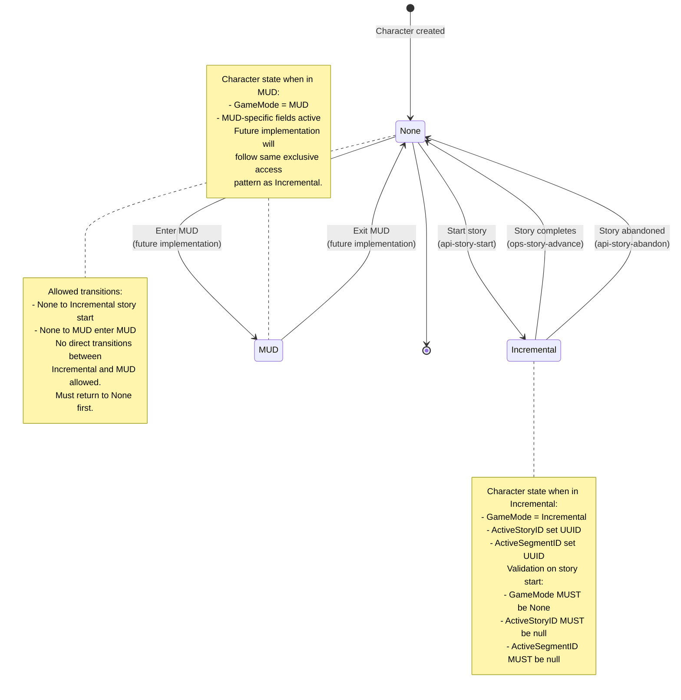
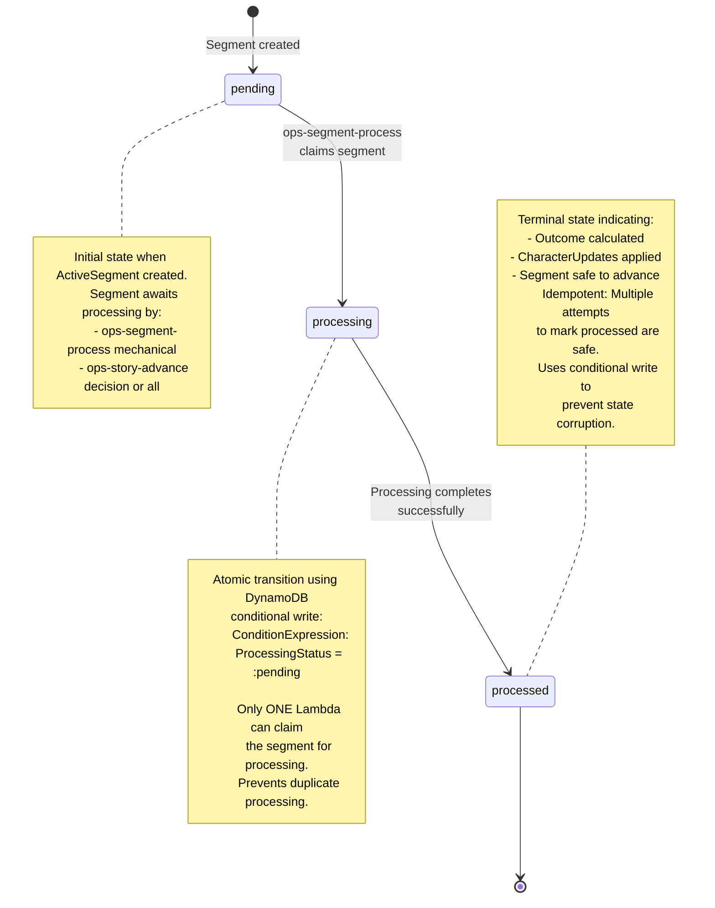
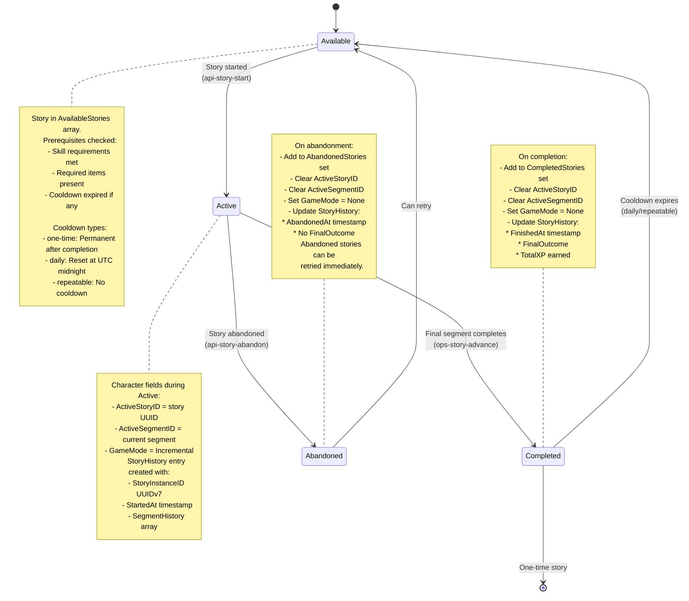
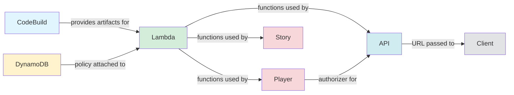

# Eidolon Engine Architecture

## Overview

The Eidolon Engine is a serverless multi-user game system built on AWS infrastructure, supporting both traditional MUD (Multi-User Dungeon) gameplay and incremental story-driven progression. The system uses a fully serverless architecture with DynamoDB for state persistence, Lambda for compute, and EventBridge for scheduled operations.

## System Architecture

### High-Level Architecture



### Infrastructure Components

**AWS Services:**

- **10 CDK Stacks**: CodeBuild, DynamoDB, Lambda, Player, Character, Story, S3, CloudWatch, API, Client
- **3 Deployment Modes**: MUD, Incremental, Hybrid (default)
- **18 Lambda Functions Total**: 17 deployed, 1 not deployed (cognito-player-delete reserved for future API)
- **14 DynamoDB Tables**: All with RemovalPolicy.RETAIN
- **2 SQS Queues**: Processing and advancement queues
- **1 EventBridge Rule**: 1-minute polling for segment completion

**Key Design Principles:**

- **Fixed Logical IDs**: Preventing resource recreation on updates
- **Server-Side Authority**: All game state in DynamoDB, no client-side state
- **Front-Loaded Processing**: Outcomes calculated at segment start, not completion
- **Automatic Recovery**: Multiple cleanup paths for failure scenarios
- **Account Isolation**: Separate AWS accounts per environment (dev/staging/prod)

## Core Subsystems

### 1. Incremental Story System

The incremental subsystem provides timer-based story progression with narrative gameplay.

**Processing Architecture:**

1. **Segment Creation**: When a story starts or advances, outcomes are immediately calculated
2. **Timer Management**: Segments have start/end times for client countdown display
3. **Polling System**: EventBridge triggers every minute to find completed segments
4. **Dual Queue Processing**:
   - Segment Processing Queue: Mechanical segments processed immediately when created
   - Story Advancement Queue: All segments processed when timer expires
5. **Result Application**: Pre-calculated outcomes applied and story advanced

**Story State Machine:**



**Segment Types:**

- **Mechanical Segments**: Skill challenges and/or combat, processed immediately via SQS
- **Decision Segments**: Player choices with optional weighted timeout branching

**Key Features:**

- Front-loaded outcome calculation for predictable client experience
- Weighted random branching with prerequisite gating
- Flexible narrative branching (any outcome can lead to any path)
- Automatic timeout recovery protects players from system failures

### 2. Database Schema

**14 DynamoDB Tables (all with RemovalPolicy.RETAIN):**

1. **players**: Player accounts and authentication data
2. **characters**: Character records with skills, attributes, inventory
3. **archetypes**: Character class templates and starting configurations
4. **rooms**: MUD room definitions and descriptions
5. **exits**: Room connections for MUD navigation
6. **items**: Item instances in character inventories
7. **prototypes**: Item templates for creation
8. **motd**: Message of the Day entries
9. **story**: Story prototype definitions
10. **segments**: Segment prototype definitions
11. **active_segments**: Running segment instances
12. **story_history**: Completed story records
13. **segment_history**: Archived segment instances
14. **opponents**: Combat opponent definitions

**Key Schema Patterns:**

- GSI for secondary access patterns (CharacterNameIndex, EndTimeIndex)
- Server-side state authority with no client caching
- ProcessingStatus field for idempotent segment processing
- GameMode field for exclusive mode access (None/MUD/Incremental)

See [schema.md](schema.md) for detailed table schemas.

### 3. Lambda Functions

**Shared Execution Role:**

All Lambda functions use `eidolon-lambda-execution-role` with:

- DynamoDB access via managed policy `eidolon-dynamodb-policy`
- CloudWatch Logs permissions
- Additional policies attached by dependent stacks

**Function Categories:**

**API Layer (13 functions):**

- `api-archetype-list`: List available archetypes
- `api-character-add`: Create new character with name validation
- `api-character-delete`: Delete character
- `api-character-get`: Retrieve character details with GameMode cleanup
- `api-character-list`: List player's characters
- `api-item-brief`: Get lightweight item metadata for IndexedDB caching
- `api-item-prototype`: Get complete item prototype definition
- `api-segment-decision`: Record player choice in decision segment
- `api-segment-history`: Get segment history
- `api-segment-status`: Get current segment status
- `api-story-abandon`: Mark story as abandoned and reset GameMode
- `api-story-history`: Get story history
- `api-story-start`: Initiate story and enable polling

**Operational Layer (3 functions):**

- `ops-segment-poller`: EventBridge-triggered poller (1-minute schedule)
- `ops-segment-process`: Process mechanical segments via SQS
- `ops-story-advance`: Advance story and create next segment via SQS

**Cognito Functions (2 functions):**

- `cognito-player-new`: PostConfirmation trigger for new accounts (deployed)
- `cognito-player-delete`: Player deletion handler (NOT DEPLOYED)

**Lambda Configuration:**

- **Runtime**: Python 3.12
- **Memory**: 128MB
- **Timeout**: 30 seconds
- **Layer**: `eidolon-dependencies` (shared Python packages)
- **Post-Deploy Updates**: Functions updated from S3 artifacts after CDK deployment

### 4. Queue Architecture

The dual-queue design separates immediate mechanical processing from timed segment advancement, enabling parallel processing while maintaining strict ordering guarantees.

**processing-queue (SQS Standard Queue):**

- Feeds `ops-segment-process` Lambda
- Handles mechanical segments only
- Message retention: 4 days
- Visibility timeout: 30 seconds
- Dead-letter queue after 3 retries

**advancement-queue (SQS Standard Queue):**

- Feeds `ops-story-advance` Lambda
- Handles all segment types for completion
- Message retention: 4 days
- Visibility timeout: 30 seconds
- Dead-letter queue after 3 retries

**Queue Flow:**

1. Mechanical segments queued IMMEDIATELY at creation to processing queue
2. All segments queued to advancement queue when EndTime reached
3. SQS triggers Lambda functions for asynchronous processing
4. Idempotent processing via ProcessingStatus prevents duplicates

### 5. Polling Infrastructure

**EventBridge Rule: `eidolon-story-poller`**

- Schedule: rate(1 minute)
- Target: `ops-segment-poller` Lambda
- State: DISABLED by default, enabled when stories start

**SSM Parameter: `/eidolon/story/config`**

- Stores polling state: "run" or "stop"
- Checked by poller each invocation
- Enables/disables polling based on active segment count

**Polling State Machine:**

The polling system automatically enables when stories start and disables when no active segments remain, optimizing costs while ensuring timely segment processing.



**Stuck Segment Recovery:**

- Segments stuck >5 minutes get retried
- ProcessingStatus reset to "pending" to allow reprocessing
- Maximum 3 retry attempts via DLQ
- Timeout past EndTime marked "exceptional" (player-favorable)

## Game Mechanics

### GameMode State Management

**Server-Authoritative State:**

- All game state stored in DynamoDB tables only
- Client maintains no authoritative state or calculations
- GameMode field prevents concurrent access between MUD and Incremental modes

**GameMode Values:**

- **None**: Character idle, can enter either mode
- **MUD**: Character active in traditional MUD gameplay
- **Incremental**: Character active in story progression

**Character GameMode State Machine:**



**Segment ProcessingStatus State Machine:**

DynamoDB conditional writes ensure atomic state transitions, preventing duplicate processing even under high concurrency.



**Story Lifecycle State Machine:**



**Automatic Recovery Paths:**

1. **Character Retrieval Cleanup**: `api-character-get` resets GameMode to None if no valid ActiveStoryID or ActiveSegmentID exists
2. **Polling System Recovery**: EventBridge triggers `ops-segment-poller` every minute to process expired segments and clean orphaned states
3. **Segment Processing Guarantee**: `ops-story-advance` ensures eventual processing of all segments

**Failure Recovery Scenarios:**

- **Client crash or network loss**: Next API call triggers automatic GameMode cleanup
- **Lambda timeout**: EventBridge ensures retry within 1 minute maximum
- **Orphaned segments**: Automatic timeout to exceptional outcome protects players
- **Maximum stuck time**: 2 minutes (1 EventBridge cycle plus processing time)

### Health and Wounds System

The wound tracking system models individual injuries that heal over time, creating realistic consequences and strategic healing mechanics.

**Health Calculation:**

Current health is calculated dynamically based on wound count.

```
Health = MaxHealth - len(Wounds)
```

Each wound is a map structure:

```json
{
  "DamageType": "lethal",
  "HealAt": "2025-01-15T20:00:00Z"
}
```

**Wound Types:**

- **Bashing**: Heal in 15 minutes (bruises, stunning)
- **Lethal**: Heal in 6 hours (serious injuries)
- **Aggravated**: Heal in 7 days (grievous wounds)

**Character States:**

- **Standing**: Health > 0, normal activity
- **Unconscious**: Health = 0 with at least one bashing wound
- **Dead**: Health = 0 with only lethal/aggravated wounds

**Cross-Mode Persistence:**

- Wounds received in either mode persist when switching
- Healing continues automatically regardless of active game mode
- Strategic timing of mode switches can optimize healing downtime

### Combat System

**Dual Action System:**

- Each combatant performs offensive and defensive actions per round
- Character uses best offensive skill (Arcane/Brawling/Melee/Archery)
- Defense determined by offensive choice (Parry for Melee, Dodge otherwise)

**Damage Application:**

- Success on opposed check = damage to opponent
- Sigma > 3.0 = critical hit (2 wounds)
- Normal hit = 1 wound
- Wound type from weapon (bashing/lethal/aggravated)

**Victory Conditions:**

- **Opponent Defeated**: Lethal wounds ≥ Health OR Total wounds ≥ Health × 2
- **Character Defeated**: Lethal wounds ≥ 5 OR Total wounds ≥ 10
- **Timeout**: Max rounds reached, opponent escapes (failure)

**Outcome Quality:**

- **Exceptional**: Victory with 0 wounds
- **Normal**: Victory with 1-2 wounds
- **Minimal**: Victory with 3+ wounds
- **Failure**: Opponent escapes or character incapacitated
- **Death**: Character reaches lethal wound threshold

### Experience System

**XP Calculation:**

- Base XP + difficulty modifier (abs(diff) × 0.5)
- Success penalty: 0 XP for failing easy checks
- Failure penalty: 50% XP for failing hard checks

**XP Distribution:**

- **Skill XP**: Full amount to used skill
- **Attribute XP**: 10% of skill XP to governing attribute

**XP Accumulation:**

- All checks in a segment accumulate XP
- Applied immediately during segment processing
- Persists across mode switches (MUD ↔ Incremental)

## Deployment Architecture

### Stack Dependencies



### Deployment Modes

**MUD Mode (9 Stacks):**

- Excludes Story Stack (no SQS/EventBridge)
- Includes S3 Scripts and CloudWatch for Lua support
- Portal frontend via `buildspec/portal.yml`

**Incremental Mode (8 Stacks):**

- Includes Story Stack for segment processing
- Excludes S3 Scripts and CloudWatch stacks
- Incremental frontend via `buildspec/incremental.yml`

**Hybrid Mode (10 Stacks - Default):**

- Includes all stacks for complete functionality
- Supports both MUD and Incremental gameplay
- Incremental frontend with mode selection

### Deployment Process

**Phase-Based Deployment:**

1. **CodeBuild Stack**: Build infrastructure and artifacts bucket
2. **DynamoDB Stack**: 14 tables with managed IAM policy
3. **Lambda Stack**: Layer, 15 functions deployed (16 total, cognito_player_delete excluded), shared execution role
4. **Player Stack**: Cognito User Pool with PostConfirmation trigger
5. **Character Stack**: Character-related Lambda resources
6. **Story Stack** (Incremental/Hybrid only): SSM, SQS, EventBridge
7. **S3 Stack** (MUD/Hybrid only): Scripts bucket with Lua upload
8. **CloudWatch Stack** (MUD/Hybrid only): Logging infrastructure
9. **API Stack**: API Gateway with Lambda integrations
10. **Client Stack**: CloudFront, S3, automated portal build
11. **Lambda Updates**: Update function code from S3 artifacts

**Key Deployment Features:**

- Fixed logical IDs prevent resource recreation
- CDK context pattern for all parameters
- No AWS API calls during CDK synthesis
- Automated end-to-end from infrastructure to portal
- Post-deployment Lambda updates from S3

### Multi-Account Strategy

**Environment Isolation:**

- **Development**: Separate AWS account for individual developer testing
- **Staging**: Dedicated AWS account for integration testing
- **Production**: Isolated AWS account for live system

**Benefits:**

- Complete isolation with no resource name conflicts
- Account-level security separation
- Clear cost attribution per environment
- No complex environment-based permissions needed

**Resource Naming:**

- Same names across accounts (account isolation eliminates conflicts)
- No environment prefixes needed
- Consistent configuration structure

## Error Handling and Recovery

### Concurrency Control

The ProcessingStatus state machine ensures atomic segment processing using DynamoDB conditional writes.

**ProcessingStatus State Machine:**

- **pending**: Mechanical segment awaiting processing
- **processing**: Segment claimed by Lambda for exclusive processing
- **processed**: Segment ready for advancement when timer expires

**Atomic Transitions:**

- DynamoDB conditional updates ensure only one Lambda processes each segment
- SQS provides at-least-once delivery with idempotent processing
- ProcessingStatus prevents duplicate processing

### Timeout Recovery

System failures are handled gracefully with player-favorable defaults to prevent indefinite waiting.

**Segment Timeout Protection:**

- Segments past EndTime marked exceptional (best outcome)
- Prevents indefinite waiting from system failures
- Player-favorable defaults protect user experience

**Stuck Segment Recovery:**

- Mechanical segments stuck over 5 minutes get retried
- ProcessingStatus reset to pending for reprocessing
- Maximum 3 retry attempts before DLQ

### Failure Modes

**Processing Failure:**

- Segment remains in processing state
- Poller eventually marks as exceptional
- Player protected from system errors

**Queue Message Loss:**

- Poller re-queues unprocessed segments
- Idempotent processing prevents duplicate effects
- History tables provide audit trail

**Lambda Timeout:**

- ProcessingStatus remains in processing state
- Poller detects stuck segment
- Automatic retry after 5 minutes

## Performance Optimization

**Database Access:**

- Pay-per-request DynamoDB pricing (no capacity planning)
- GSI queries for efficient secondary access patterns
- Conditional writes prevent race conditions

**Lambda Optimization:**

- Cold start caching of archetype data
- Shared layer for common dependencies
- 128MB memory sufficient for all functions
- 30-second timeout handles complex processing

**Queue Optimization:**

- Batch processing via SQS
- Auto-disable polling when no active stories
- Immediate queueing of mechanical segments eliminates latency

**Client Optimization:**

- Front-loaded processing eliminates runtime calculations
- Pre-calculated ClientEvents for entire segment duration
- Server-authoritative state eliminates client synchronization
- IndexedDB caching layer reduces API calls by 85-90%

**IndexedDB Cache Layer:**

The Flutter client implements an intelligent IndexedDB cache for three data domains:

- **Stories**: Historical preservation of completed narratives for offline access
- **Characters**: Smart caching with field-level updates (60+ API calls/hour → 5-10)
- **Items**: Two-tier prototype caching minimizes redundant item data fetches

See [Incremental Design](incremental-design.md#indexeddb-cache-layer-integration) for complete schema and implementation details.

## Security Considerations

**Authentication and Authorization:**

- Cognito User Pool (`eidolon-users`) for authentication
- API Gateway with Cognito authorizer
- JWT token validation on all protected endpoints

**IAM and Permissions:**

- Shared execution role: `eidolon-lambda-execution-role`
- Managed policies (no inline policies)
- Least privilege access per stack
- Fixed logical IDs prevent accidental recreation

**CORS Configuration:**

- Lambda-level CORS validation
- Environment variable configuration
- Credentials support for authenticated requests

**State Protection:**

- GameMode field only modifiable through authorized Lambdas
- Mode transitions require validation of game state
- ProcessingStatus state transitions prevent concurrent processing
- Conditional updates prevent race conditions

## Monitoring and Observability

**CloudWatch Integration:**

- All Lambda functions log to CloudWatch
- Structured logging with correlation IDs
- Error tracking with stack traces

**Metrics and Alarms:**

- Lambda execution metrics (duration, errors, throttles)
- DynamoDB metrics (read/write capacity, throttles)
- Queue metrics (message age, DLQ depth)
- Custom metrics for game events

**Note**: CloudWatch dashboards and alarms deferred until revenue generation.

## References

**Detailed Documentation:**

- [Incremental Design](incremental-design.md): Technical design details
- [Incremental Story](incremental-story.md): Story and segment state machines
- [Incremental Implementation](incremental-implementation.md): Flutter client architecture
- [Deployment Guide](deployment.md): Infrastructure deployment procedures
- [Schema Documentation](schema.md): DynamoDB table schemas
- [API Documentation](incremental-api.md): REST API endpoints
- [Architecture Diagrams](incremental-architecture-diagrams.md): Comprehensive Mermaid diagrams

**Deployment Infrastructure:**

- Region: us-east-1
- Deployment Mode: Hybrid
- Status: All systems deployed and tested
