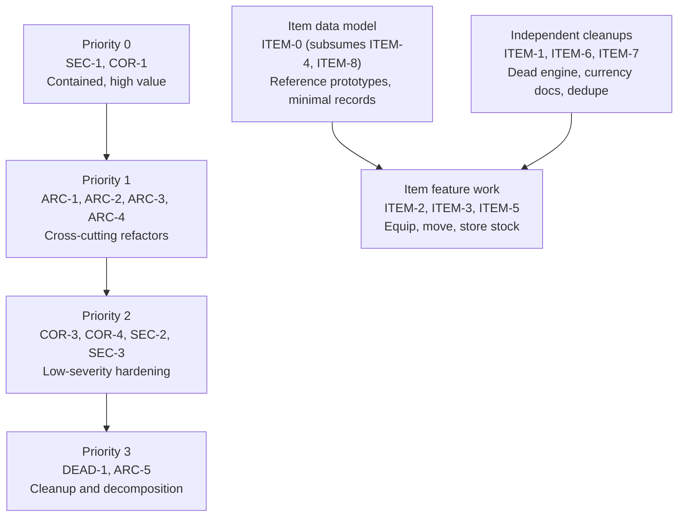
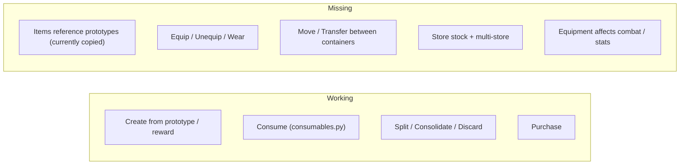

# Backend Remediation Plan

## Overview

This plan tracks remediation of findings from a systematic review of the Python
backend (`eidolon/` library and `lambda/` handlers). It covers security gaps,
correctness bugs, architectural inconsistencies, and dead code. Each item is
self-contained with a location, the problem, a concrete remediation, and
acceptance criteria so work can be picked up independently.

The backend is generally well-structured: write paths use DynamoDB conditional
expressions and transactions, SQS advancement is idempotent, and the code
follows the project standards (`.get()` access, `from err` chaining, narrow
`except` blocks). The non-item findings below are concentrated in a few specific
places and do not require a broad rewrite. The item subsystem is the exception:
it needs a foundational correction to its data model (see
[ITEM-0](#item-0-item-records-duplicate-the-prototype-instead-of-referencing-it)),
because items currently copy their prototype instead of referencing it. That
correction is the priority for items, and it is sequenced as small,
behavior-preserving steps rather than a single rewrite. The goal throughout this
plan is correct, root-cause fixes applied incrementally, not minimal patches.

## Table of Contents

- [Status Legend](#status-legend)
- [Findings Summary](#findings-summary)
- [Remediation Sequence](#remediation-sequence)
- [Item Subsystem Remediation](#item-subsystem-remediation)
  - [Item Subsystem Assessment](#item-subsystem-assessment)
  - [ITEM-0 Item records duplicate the prototype instead of referencing it](#item-0-item-records-duplicate-the-prototype-instead-of-referencing-it)
  - [ITEM-1 Remove the dead, divergent effects engine](#item-1-remove-the-dead-divergent-effects-engine)
  - [ITEM-2 Equipment subsystem is non-functional](#item-2-equipment-subsystem-is-non-functional)
  - [ITEM-3 No item move or transfer between containers](#item-3-no-item-move-or-transfer-between-containers)
  - [ITEM-4 Stackable records violate the documented schema](#item-4-stackable-records-violate-the-documented-schema)
  - [ITEM-5 Store stock and multi-store support are stubbed](#item-5-store-stock-and-multi-store-support-are-stubbed)
  - [ITEM-6 Currency design diverges from the documentation](#item-6-currency-design-diverges-from-the-documentation)
  - [ITEM-7 Duplicated stack-merge helper](#item-7-duplicated-stack-merge-helper)
  - [ITEM-8 Dual IsWorn and Equipped fields](#item-8-dual-isworn-and-equipped-fields)
- [Priority 0 - Security and Data Integrity](#priority-0---security-and-data-integrity)
  - [SEC-1 IDOR on api_item_brief](#sec-1-idor-on-api_item_brief)
  - [COR-1 Purchase does not refund on item failure](#cor-1-purchase-does-not-refund-on-item-failure)
- [Priority 1 - Architectural Consistency](#priority-1---architectural-consistency)
  - [ARC-1 Writes inside the read path](#arc-1-writes-inside-the-read-path)
  - [ARC-2 Two ownership mechanisms](#arc-2-two-ownership-mechanisms)
  - [ARC-3 HTTP status codes leak into the library](#arc-3-http-status-codes-leak-into-the-library)
  - [ARC-4 Two transaction-building conventions](#arc-4-two-transaction-building-conventions)
- [Priority 2 - Lower-Severity Correctness](#priority-2---lower-severity-correctness)
  - [COR-3 Combat reports damage not applied](#cor-3-combat-reports-damage-not-applied)
  - [COR-4 Atomic skill path bypasses the level cap](#cor-4-atomic-skill-path-bypasses-the-level-cap)
  - [SEC-2 CORS fails open on misconfiguration](#sec-2-cors-fails-open-on-misconfiguration)
  - [SEC-3 Player deletion id resolution](#sec-3-player-deletion-id-resolution)
- [Priority 3 - Dead Code and Maintainability](#priority-3---dead-code-and-maintainability)
  - [DEAD-1 Remove or fix unused helpers](#dead-1-remove-or-fix-unused-helpers)
  - [ARC-5 Function-length and module-size debt](#arc-5-function-length-and-module-size-debt)
- [Verification](#verification)

## Status Legend

- `[PENDING]` - not started
- `[IN PROGRESS]` - work underway
- `[DONE]` - implemented and verified
- `[WARNING]` - blocked or needs a decision before proceeding

## Findings Summary

| ID | Severity | Area | Location | Status |
| --- | --- | --- | --- | --- |
| SEC-1 | MEDIUM | Security | `lambda/api_item_brief.py` | [DONE] |
| COR-1 | MEDIUM | Correctness | `eidolon/store.py` | [DONE] |
| ITEM-0 | HIGH | Item / data model | `eidolon/items.py`, `eidolon/prototypes.py`, readers | [DONE] |
| ITEM-1 | HIGH | Item / dead code | `eidolon/item_effects.py` (deleted) | [DONE] |
| ITEM-2 | MEDIUM | Item / equipment | `eidolon/equipment.py`, `lambda/api_item_equip.py`, `lambda/api_item_unequip.py`, `eidolon/segment_combat.py` | [DONE] |
| ITEM-3 | MEDIUM | Item / containers | `eidolon/contents.py`, `lambda/api_item_move.py` | [DONE] |
| ITEM-4 | MEDIUM | Item / schema | `eidolon/items.py` | [DONE] |
| ITEM-5 | MEDIUM | Item / store | `eidolon/store.py`, `cf/eidolon-dynamo.yml` | [DONE] |
| ITEM-6 | LOW | Item / currency | `eidolon/currency.py`, `eidolon/store.py` | [DONE] |
| ITEM-7 | LOW | Item / duplication | `eidolon/store.py`, `eidolon/story_rewards.py` | [DONE] |
| ITEM-8 | LOW | Item / schema | `eidolon/items.py` | [DONE] |
| ARC-1 | DESIGN | Architecture | `eidolon/character_data.py` | [DONE] |
| ARC-2 | DESIGN | Architecture | `eidolon/character_data.py`, `eidolon/player.py` | [DONE] |
| ARC-3 | DESIGN | Architecture | `eidolon/lambda_handler.py` and library callers | [DONE] |
| ARC-4 | DESIGN | Architecture | `eidolon/dynamo.py`, `eidolon/consumables.py` | [DONE] |
| COR-3 | LOW | Correctness | `eidolon/segment_combat.py` | [DONE] |
| COR-4 | LOW | Correctness | `eidolon/character_data.py` | [DONE] |
| SEC-2 | LOW | Security | `eidolon/cors.py`, `eidolon/environment.py` | [DONE] |
| SEC-3 | LOW | Security | `lambda/cognito_player_delete.py` | [DONE] |
| DEAD-1 | CLEANUP | Maintainability | `eidolon/items.py`, `eidolon/player.py` | [DONE] |
| ARC-5 | CLEANUP | Maintainability | multiple | [DONE] |

## Remediation Sequence

The recommended order ships the security and data-integrity fixes first, because
they are independently correct and do not depend on the larger refactors. The
cross-cutting architectural items come next as deliberate, reviewed changes that
address root causes rather than symptoms - they are sequenced later for safety,
not deprioritized.



The item-subsystem track runs in parallel with the priority tracks, but has its
own internal order: correct the data model first
([ITEM-0](#item-0-item-records-duplicate-the-prototype-instead-of-referencing-it)),
because it is the root cause behind ITEM-4 and ITEM-8 and a precondition for
sound stacking and equipment. Build the feature work (ITEM-2 equip, ITEM-3 move,
ITEM-5 store) on the corrected model rather than on the current denormalized
records. ITEM-1 and ITEM-7 are independent and can proceed at any time. The
scope decisions are settled (recorded in each section): ITEM-2 builds equipment,
ITEM-5 enforces stock, ITEM-6 makes coins stackable items. ITEM-5, ITEM-6, and
COR-1 are coupled and implemented together - a purchase decrements store stock and
spends canonicalized coin-item stacks in the same atomic transaction.

Note: complete [DEAD-1](#dead-1-remove-or-fix-unused-helpers) and
[SEC-1](#sec-1-idor-on-api_item_brief) together, because the dead
`player_owns_item` helper is the intended guard that SEC-1 needs to wire in.
[ITEM-1](#item-1-remove-the-dead-divergent-effects-engine) shares the cleanup
goal of [DEAD-1](#dead-1-remove-or-fix-unused-helpers) (which covers the dead
`merge_stacks` helper and its incorrect UUIDv7 assumption); sequence them
together.

## Item Subsystem Remediation

This track addresses the item and inventory subsystems, which the review found
to be partially implemented and internally inconsistent: a rich data model and
design document exist, but several runtime capabilities are missing, one
effects engine is dead and divergent, and the implemented item records
contradict the documented schema.

### Item Subsystem Assessment

What works today:

- Creating items from prototypes and from story rewards.
- Consuming items (heal and essence effects) through `eidolon/consumables.py`,
  with race-safe transactional updates.
- Splitting, consolidating, and discarding stacks, with conditional-write
  guards against races.
- Purchasing stackable and non-stackable items, including merge-into-existing
  stacks on purchase.

What is missing or non-functional:

- **Items copy their prototype instead of referencing it.** `build_item_payload`
  snapshots the whole prototype onto every item, so the prototype is no longer
  the single source of truth: type properties are read inconsistently from two
  places, prototype edits never reach existing items, and the stackable /
  non-stackable invariants are enforced nowhere. This is the foundational item
  issue ([ITEM-0](#item-0-item-records-duplicate-the-prototype-instead-of-referencing-it)).
- **Equipment has no runtime behavior.** There is no equip, unequip, or wear
  handler, and combat derives ratings only from attributes and skills, so worn
  items, `WornOn`, `TraitMods`, and `Overrides` never affect outcomes.
- **No item move or transfer.** Container nesting is structurally read-only at
  runtime; nothing moves an item between containers or in and out of one.
- **A second, dead effects engine** (`eidolon/item_effects.py`) uses a
  different data model than the live engine and contains unimplemented stubs.
- **Store stock is stubbed** (checked but never decremented) and only a single
  hardcoded store is supported.
- **The implemented item schema diverges from the documentation** for stackable
  items, and the documented currency model (coins as stackable items) is not
  implemented.



### ITEM-0 Item records duplicate the prototype instead of referencing it

`[DONE]` - Severity: HIGH - Foundational; correct before the item feature
work (ITEM-2, ITEM-3, ITEM-5).

**Resolution:** Added `eidolon/prototypes.py` as the prototype-resolution layer
(below `items` and `contents` in the import graph, so no cycle): `get_prototype`
moved there, plus `item_is_container` and `item_is_stackable`, which are the
resolution layer the readers actually need (a general `resolve_item` overlay was
intentionally not added to avoid speculative dead code; introduce it when a
display path needs a full overlay). All item-record readers of type properties
now resolve through it - `consumables.py`, `contents.py`, `player.py`,
`player_character.py`, `store.py`, `story_rewards.py`, and the consolidate /
discard handlers - with tree-walk projections changed from `Container` to
`PrototypeID`. `build_item_payload` now writes minimal records: stackable
`{ItemID, PrototypeID, Quantity, OwnerID}`; non-stackable
`{ItemID, PrototypeID, OwnerID}` plus `Contents` (containers) and `IsWorn`
(wearables). Editing a prototype now changes the resolved properties of existing
items of that prototype.

**Location:** `eidolon/items.py:243-295` (`build_item_payload`); inconsistent
readers at `eidolon/consumables.py:423` and `:557` (`item.get("Stackable")`),
`eidolon/contents.py:73`, `:118` and `eidolon/player.py:262`
(`record.get("Container")`), `eidolon/store.py:308` (`record.get("Stackable")`);
contrasted with prototype-first readers at `eidolon/items.py:185`, `:187`,
`eidolon/consumables.py:279`, `:284`, and `eidolon/store.py:190`.

**The thesis.** The design (`documentation/item-system.md`) rests on one
principle: items are built from prototypes. A prototype is immutable, shared
game data (the PROTOTYPES table) that defines every type-level property - name,
mass, value, stackability, wearability, container-ness, consumable effects,
trait modifiers. An item is an instance that *references* a prototype by
`PrototypeID` and carries only what is unique to that instance:

- Stackable items are fungible and immutable. The document restricts them to
  `ItemID`, `PrototypeID`, `Quantity`, `OwnerID`, `LocationID` and nothing else,
  because every instance of a prototype is interchangeable and all type
  properties are read from the prototype.
- Non-stackable items are unique and mutable. They never carry `Quantity`; they
  carry base identity plus only the per-instance deltas that make them distinct
  (worn state, container `Contents`, and - by design - enchantment, condition,
  name overrides, history).

The purpose of the split is that the prototype is the single runtime source of
truth for type properties, and the item stores the minimum needed to identify,
place, and individuate it.

**What the code does instead.** `build_item_payload` snapshots the entire
prototype onto every item it mints, stackable or not - `Name`, `Description`,
`Mass`, `Value`, `Stackable`, `MaxStack`, `Quantity`, `Wearable`, `WornOn`,
`Verbs`, `Overrides`, `TraitMods`, `Container`, `CanPickUp`, `Metadata`,
`Consumable`, `ConsumableEffects`. Each item becomes a frozen, independent copy
of its prototype rather than a reference to it. This inverts the thesis and
produces four concrete failures:

1. **Two sources of truth, read inconsistently.** Type properties now live on
   both records, and the code reads them from different places. Stackability is
   resolved from the prototype in `get_item_brief` (`items.py:185`),
   `purchase_item` (`store.py:190`), and rewards (`story_rewards.py:149`), but
   from the item copy in `update_contents_for_consumption` (`consumables.py:423`)
   and in the consume transaction's decrement-vs-delete decision
   (`consumables.py:557`). Container-ness is read from the item copy in
   `contents.py:73`, `:118` and `player.py:262`. Consumable effects are resolved
   prototype-first with an item fallback (`consumables.py:284`). Whenever an
   item's copy and its prototype disagree, behavior depends on which path runs -
   in the worst case an item is deleted instead of decremented, or vice versa.
2. **Prototype edits do not propagate.** Because each item froze its prototype at
   creation, rebalancing a prototype's `Value`, `Mass`, `MaxStack`, effects, or
   trait mods never reaches already-minted items. The design assumes the
   opposite - prototypes are "immutable game data and safe to cache indefinitely"
   precisely because items resolve against them at read time.
3. **The stackable invariant is violated, so merging cannot work.** Real
   stackable records carry roughly twenty fields, so `merge_stacks`'
   `issubset(allowed_fields)` guard (`items.py:36-45`) always fails - fungibility
   is nominal only, and the dead helper could never merge a real record (DEAD-1).
4. **The non-stackable invariant is violated, so the two types are structurally
   identical.** Every item, including unique ones, receives `Quantity: 1` and the
   full field set, even though the document forbids `Quantity` on non-stackable
   items. The "core game design principle" that distinguishes the two types is
   not enforced anywhere in storage.

Note: this codebase tracks placement through the character-as-container
`Contents` tree and `OwnerID`, not the document's optional `LocationID`. The
minimal stackable record here is therefore `{ItemID, PrototypeID, Quantity,
OwnerID}`; the minimal non-stackable record is `{ItemID, PrototypeID, OwnerID}`
plus `Contents` for containers and `IsWorn` for equipment. ITEM-4 reconciles the
documented field list with this model.

**Remediation (incremental, behavior-preserving steps).** Restore the prototype
as the runtime source of truth and reduce item records to instance state. Do
this in order so each step is independently reviewable and verifiable; do not
attempt it as one large rewrite. The system is not in production, so there is no
data migration - but the code change still proceeds in stages.

1. **Introduce one resolution layer.** Add a module-level function in
   `eidolon/items.py` - for example `resolve_item(item)` - that fetches the
   prototype (via the cached `get_prototype`) and returns the prototype's type
   properties overlaid with the item's per-instance fields (`Quantity`,
   `Contents`, `IsWorn`, and any future deltas). Route every reader that needs a
   type property through it. This alone collapses the two-sources-of-truth
   problem and is behavior-preserving while records are still denormalized.
2. **Migrate the inconsistent readers.** Replace direct `item.get("Stackable")`
   / `record.get("Container")` reads (`consumables.py:423`, `:557`;
   `contents.py:73`, `:118`; `player.py:262`; `store.py:308`) with the resolved
   value, so stack and container decisions always agree with the prototype.
3. **Stop denormalizing at creation.** Change `build_item_payload` to write
   minimal records: stackable -> identity + `Quantity` + `OwnerID`;
   non-stackable -> identity + `OwnerID` + `Contents` (containers only) +
   `IsWorn` (equipment only). Drop the copied `Stackable`, `MaxStack`, `Mass`,
   `Value`, `Verbs`, `Overrides`, `TraitMods`, `Consumable`,
   `ConsumableEffects`, `CanPickUp`, `Metadata`, and the redundant `Equipped`.
   With step 1 in place, readers already resolve these from the prototype.
4. **Re-enable correct stacking and collapse duplicate fields.** With minimal
   records, fold in ITEM-4 (schema agreement) and ITEM-8 (single worn field), and
   revisit stack merging without the UUIDv7 assumption (DEAD-1).

Sequence the feature work (ITEM-2 equip, ITEM-3 move, ITEM-5 store) after step 3
so those features are built on minimal records and prototype resolution rather
than on the denormalized snapshot.

**Acceptance criteria:**

- Exactly one code path resolves an item's type properties, and it reads them
  from the prototype.
- Newly created stackable and non-stackable records match the documented
  (reconciled) minimal schemas.
- Editing a prototype changes the resolved properties of existing items of that
  prototype.
- No reader trusts an item-local copy of a prototype-owned property.

### ITEM-1 Remove the dead, divergent effects engine

`[DONE]` - Severity: HIGH (correctness risk through ambiguity)

**Resolution:** Deleted `eidolon/item_effects.py`. Its one reachable-in-spirit
capability - dice-notation amounts (`parse_dice_notation`) - was folded into the
live engine: `consumables.py` now has `parse_dice_notation` and
`resolve_effect_amount`, so a heal or essence effect's `Amount` may be a fixed
integer or a dice string like `"2d4+2"`. `NutritionValue` and `BuffDuration`
were non-functional stubs with no backing stat or subsystem; rather than
recreate dead code, they were deferred as future effects that need a real
mechanic (a satiation stat for nutrition; a temporary-modifier subsystem that
combat reads for buffs). `consumables.py` is now the single effects engine.

**Location:** `eidolon/item_effects.py` (entire module:
`apply_item_effects`, `apply_healing`, `parse_dice_notation`).

**Problem:** The live consumable path is `eidolon/consumables.py`
(`consume_item`, used by `api_item_consume.py`), which reads
`ConsumableEffects` with keys such as `healwounds` and `restoreessence` and
applies changes transactionally. `eidolon/item_effects.py` is an unreferenced
parallel engine that reads a different data model (`Metadata.HealingAmount` in
dice notation), heals "most recent first" instead of by wound-type priority,
writes non-transactionally, and explicitly logs `NutritionValue` and
`BuffDuration` as "not yet implemented." Keeping both invites a future change
to wire up the wrong one or to assume the dice-notation model is active.

**Remediation:** Delete `eidolon/item_effects.py`. There is no backwards
compatibility constraint, so it can be removed outright rather than deprecated.
If dice-notation amounts, nutrition, or buffs are genuinely wanted, add them as
new effect keys inside `consumables.py` so there is a single effects engine and
a single data model. Confirm no deployment packaging references the module.

**Acceptance criteria:**

- Exactly one consumable-effects engine remains (`consumables.py`).
- `item_effects.py` is gone, or its desired behavior is folded into
  `consumables.py` with the live `ConsumableEffects` data model.
- No "not yet implemented" effect stubs remain in shipped code.

### ITEM-2 Equipment subsystem is non-functional

`[DONE]` - Severity: MEDIUM

**Decision:** Build equipment (the descope alternative was rejected). Slot model:
hand slots plus a `WornSlots` body-slot map for race-safe one-item-per-slot
tracking. Combat effect: equipped items' `TraitMods` fold into effective
attributes and skills.

**Resolution:** Added `eidolon/equipment.py`. An item is equipped when a slot
references it and its `IsWorn` flag is set; `equip_item` / `unequip_item` commit
the slot occupancy and the worn flag in a single `transact_write_items` over two
records, each guarded by a conditional expression (the slot must be empty to
equip and must still hold the item to unequip, and the item must not already be
worn), so a slot and an item can never disagree about what is worn. Hand slots
use the character's `LeftHandID` / `RightHandID`; every other slot lives in a new
character `WornSlots` map (`{slot: ItemID}`), keyed by the prototype's `WornOn`
slot names. `POST /item/equip` and `POST /item/unequip` (handlers
`api_item_equip` / `api_item_unequip`) validate ownership via `character_get`
plus inventory placement, wearability, slot membership in `WornOn`, and current
worn state, and are wired into both CloudFormation templates (function, route,
invoke permission, deployment dependency) and the deployment update list.

Combat now consumes equipment: `process_combat_segment` builds its attributes and
skills through `equipment.compute_effective_combat_traits`, which sums each
equipped item's prototype `TraitMods` into the matching trait (an attribute mod
boosts the attribute, otherwise the mod applies to skills), so equipping a weapon
that grants, for example, `Strength +2` raises offensive and defensive ratings -
the measurable effect. `Overrides` has no defined stat semantics (the test data
uses it for verb aliases) and is intentionally reserved, not consumed. Starting
gear preserves the same invariant: `create_items_from_prototypes` assigns each
worn starting item the first free, valid slot and returns the assignments, and
`create_character` persists `WornSlots` (and any occupied hand slot), so archetype
equipment is effective from creation. `documentation/item-system.md` gained an
Equipment section and `documentation/schema.md` documents `WornSlots`.

**Location:** `eidolon/equipment.py`; `lambda/api_item_equip.py`,
`lambda/api_item_unequip.py`; combat at `eidolon/segment_combat.py:226`;
slot assignment at `eidolon/items.py` (`create_items_from_prototypes`) and
`eidolon/character_data.py` (`create_character`); routes in
`cf/eidolon-lambda-character.yml` and `cf/eidolon-api-gateway.yml`. Equipment
type properties (`Wearable`, `WornOn`, `TraitMods`, `Overrides`) resolve from the
prototype (ITEM-0); worn state is the item's `IsWorn` field.

**Problem:** Items carry equipment metadata and characters have `LeftHandID` /
`RightHandID` hand slots, but no endpoint or library function equips, unequips,
or wears an item at runtime. `IsWorn` is set only at character creation from
archetype starting items. Combat computes offensive and defensive ratings purely
from attributes and skills and never reads worn items, so equipment and
`TraitMods` have no mechanical effect. The data model advertises a feature that
does not work.

**Remediation:** Build the equipment subsystem.

- Add equip / unequip handlers that validate `Wearable`, the target slot
  (`WornOn` or hand slot), slot availability, and ownership, and persist the
  change with a conditional write.
- Have combat and any derived-stat calculation consume `TraitMods` / `Overrides`
  from currently worn items (resolved from the prototype per ITEM-0) so equipping
  has a measurable effect. This establishes the stat-application path that any
  future buff effect would also use.

**Acceptance criteria:**

- Equipping or unequipping an item changes a measurable outcome (combat or a
  derived stat).
- Each new handler enforces ownership and slot validation.

### ITEM-3 No item move or transfer between containers

`[DONE]` - Severity: MEDIUM

**Resolution:** Added `contents.move_item(character, item_id, destination_id)`
and the `POST /item/move` handler (`api_item_move`). A move relocates an item to
a new parent - another owned container or the character root (when the
destination is the character's own id). It validates the item is in the
character's tree and not currently worn (worn items must be unequipped first, so
the ITEM-2 invariant holds), that the destination is the character or an owned
container, that the move is not a no-op, and that it does not place a container
inside itself or one of its descendants (`destination_in_subtree`). The change is
a single `transact_write_items`: the source's Contents is rewritten with the item
removed (guarded by `contains(Contents, :item)`) and the destination's Contents
appends the item (guarded so it is not already present), so concurrent moves
cannot duplicate or lose the item. The handler and route are wired into both
CloudFormation templates and the deployment update list. Numeric container
capacity is not modeled anywhere yet, so capacity is treated as unbounded;
enforcement is left for when a capacity field exists.

**Location:** `eidolon/contents.py` (`move_item`, `build_move_transaction`,
`destination_in_subtree`, `typed_contents_target`); `lambda/api_item_move.py`;
routes in `cf/eidolon-lambda-character.yml` and `cf/eidolon-api-gateway.yml`.

**Problem:** The model supports nested containers, and the helpers can locate an
item and rewrite a parent's `Contents`, but only consume, discard, split, and
consolidate mutate the tree. There is no operation to move an item from one
container to another, or into and out of a container, so players cannot
reorganize inventory.

**Remediation:** Add an item-move operation that relocates an item to a new
parent (another container or the character root). Use `locate_item` to find the
current parent, validate the destination is an owned container with capacity,
and apply the change as a transaction that removes the ItemID from the old
parent's `Contents` and appends it to the new parent's `Contents`, each guarded
by a `contains` / existence precondition to stay race-safe. Reject moves that
would create a cycle (placing a container inside itself or a descendant).

**Acceptance criteria:**

- An owned item can be moved between containers atomically.
- Moves validate ownership, destination capacity, and cycle prevention.
- Concurrent moves cannot duplicate or lose the item.

### ITEM-4 Stackable records violate the documented schema

`[DONE]` - Severity: MEDIUM - The schema half of
[ITEM-0](#item-0-item-records-duplicate-the-prototype-instead-of-referencing-it).

**Resolution:** Implemented alongside ITEM-0 step 3 (minimal records).
`documentation/item-system.md` was reconciled: it now states the prototype is the
runtime source of truth, records the minimal stackable / non-stackable schemas,
notes that placement uses `OwnerID` plus the `Contents` tree (with `LocationID`
reserved and unused), and replaces the incorrect UUIDv7 `merge_stacks`
pseudocode with a description of the actual `load_top_level_stacks` merge path.

**Location:** `eidolon/items.py:263-295` (`build_item_payload`);
`documentation/item-system.md` (stackable schema and validation rules); dead
`merge_stacks` at `eidolon/items.py:14`.

**Problem:** The item-system document states stackable items are immutable and
may carry only the minimal field set, but `build_item_payload` writes the full
denormalized field set (`Name`, `Mass`, `Value`, `Wearable`, `MaxStack`, and
more) onto every item regardless of `Stackable`. This is the storage-level
symptom of
[ITEM-0](#item-0-item-records-duplicate-the-prototype-instead-of-referencing-it):
because the dead `merge_stacks` enforces the minimal-field rule, it refuses to
merge the real (over-populated) records, which is part of why it cannot be used
as written.

**Remediation:** This is settled by the thesis in ITEM-0, not an open decision:
make records minimal and resolve type properties from the prototype, rather than
denormalizing and editing the document to match. Concretely, when ITEM-0 step 3
rewrites `build_item_payload`, persist the reconciled minimal schemas - stackable
`{ItemID, PrototypeID, Quantity, OwnerID}` and non-stackable
`{ItemID, PrototypeID, OwnerID}` plus `Contents` (containers) and `IsWorn`
(equipment) - and update `documentation/item-system.md` so its field list matches
this codebase's `Contents`-tree placement model (which uses `OwnerID` and parent
`Contents` rather than the document's optional `LocationID`).

**Acceptance criteria:**

- Created stackable and non-stackable records match the reconciled documented
  schema.
- Any stack-merge logic is validated against actual created records.
- The document's placement model (`OwnerID` + `Contents`) matches the code.

### ITEM-5 Store stock and multi-store support are stubbed

`[DONE]` - Severity: MEDIUM

**Decision:** Enforce stock as authoritative mutable state, decremented
atomically with the currency / coin spend.

**Location:** `eidolon/store.py:118-182` (`purchase_item`), `:156` (hardcoded
store id), `:175-182` (stock check comments).

**Problem:** Stock is read and validated but never decremented; the comments
note all items are set to `Stock = -1` (unlimited) to avoid confusion, and the
store id is hardcoded to `general-store` with a `TODO` to support multiple
stores. The stock check is therefore misleading dead logic.

**Remediation:** Hold store stock in a DynamoDB store table and decrement it
inside the purchase transaction (`build_purchase_transaction`, added under
COR-1), so stock and currency commit together: a conditional decrement that fails
the whole transaction when stock is insufficient or has changed. Parameterize the
store identifier through the purchase and list APIs instead of hardcoding
`general-store`.

**Resolution:** Added a `STORES` DynamoDB table keyed by `(StoreID, PrototypeID)`
holding a single `Stock` attribute - the authoritative mutable count. Per
CLAUDE.md's config-vs-state separation, the store *catalog* (Price, MinLevel,
Category) stays in the JSON config; only mutable *stock* lives in the table. A
catalog `Stock` of `-1` means untracked / unlimited (no row, no decrement); any
finite value is stock-tracked. `get_store_items` overlays the live stock
(`get_store_stock_levels`) onto the catalog and filters on it. `purchase_item`
pre-checks the live count for a clear error and adds a conditional decrement
(`build_stock_decrement_op`, `Stock >= :qty`) to the purchase transaction, so
stock, coins, and goods commit together or not at all - an out-of-stock or raced
purchase cancels the whole transaction. The purchase and list APIs take a
`StoreID`. The table is defined in `cf/eidolon-dynamo.yml`, granted to the lambda
role in `cf/eidolon-roles.yml`, registered in `eidolon/dynamo.py` /
`eidolon/environment.py`, and seeded by `data_loader.store_store_stock` (a
conditional, seed-once write that never clobbers a live count). The transaction
assembly is covered by the purchase unit test. Multi-store is now a data concern
(add another `store_<id>.json` and seed it); no store id is hardcoded in the
purchase path.

**Acceptance criteria:**

- Stock is decremented atomically with the currency / coin spend; an out-of-stock
  or raced purchase fails the whole transaction with nothing committed.
- The purchase and list APIs accept and use a store identifier.

### ITEM-6 Currency design diverges from the documentation

`[DONE]` - Severity: LOW

**Decision:** Implement coins as stackable items (the scalar-only alternative was
rejected). Payment model: canonicalize the wallet on every change (treat coins as
a base-unit total and re-mint the minimal coin set for the new balance).

**Resolution:** Added `eidolon/currency.py`. Currency is held as stackable coin
items at the character's top-level Contents; a coin prototype is any prototype
carrying `Metadata.Denomination`, and its worth is the prototype's `Value` in
Fundamental Units (Bronze 10, Silver 120, Gold 2,400 - so every balance is a
multiple of 10). `wallet_total` derives the balance from the coin stacks (there is
no `Resources.Value` scalar), and `canonical_coin_quantities` decomposes a total
into the minimal coin set. `purchase_item` now pays with coins: `plan_coin_spend`
validates funds and plans the canonicalized post-payment wallet, and
`build_purchase_transaction` commits the goods records, the coin deletes/mints,
and a single character Contents update in one `transact_write_items` - so payment
and delivery still succeed or fail together (COR-1), now in coins. Each spent coin
stack delete is guarded by its expected quantity and the Contents rewrite by a
`contains` check on each spent coin, so a raced balance change cancels the
purchase. `credit_coins` grants currency the same way and is ready for reward and
drop paths (none award currency yet, per `documentation/currency.md`). The
purchase and list APIs accept a `StoreID`.

**Update (2026-06-12):** coins are now unbounded ordinary stackable items and
currency is granted through the standard item-reward path
(`currency.coin_rewards_for_amount` via `calculate_story_rewards`);
`credit_coins` was removed as superseded. See
`incremental-remediation-plan.md` COR-1. The canonicalization math and the
transaction assembly are covered by unit tests; `documentation/currency.md` was
reconciled to the coins-authoritative model. The pure FU base unit (prototype
`Value`) supersedes the plan's earlier "bronze-denomination" note.

**Remaining (ITEM-5):** the atomic *stock* decrement lands with the store table;
purchase currency is now coins, but stock is still validated against the JSON
catalog without a persistent decrement.

**Location:** `documentation/item-system.md` (and `documentation/currency.md`)
reference `eidolon/currency.py` and coins as stackable items; actual currency is
the scalar `character.Resources.Value` read in `eidolon/store.py:150`. No
`eidolon/currency.py` exists.

**Problem:** The documented currency model (fungible coin items, managed by a
currency module) is not implemented; currency is a single integer field. The
documentation describes a subsystem that does not exist.

**Remediation:** Create `eidolon/currency.py` implementing coins as stackable
items (per the ITEM-0 minimal-record model: `{ItemID, PrototypeID, Quantity,
OwnerID}`), with functions to total a character's coins, debit, and credit by
adding or removing coin stacks. Update the purchase path and any reward / drop
path to spend and grant coin items instead of mutating `Resources.Value`, and
reconcile `documentation/item-system.md` and `documentation/currency.md` with the
implementation. Coin denominations and any conversion are defined by prototypes.

This couples with COR-1 and ITEM-5: the purchase transaction must spend coin
stacks (conditional on sufficient coins) and decrement stock in the same atomic
`transact_write_items` call, replacing the scalar `Resources.Value` deduction.

**Acceptance criteria:**

- Currency is represented as stackable coin items consistent with the ITEM-0
  schema; `eidolon/currency.py` exists and is used by purchase and rewards.
- Code and documentation describe the same currency model; no doc references a
  module that does not exist.
- A purchase spends coins and decrements stock atomically (with COR-1 / ITEM-5).

### ITEM-7 Duplicated stack-merge helper

`[DONE]` - Severity: LOW

**Resolution:** Both private `_load_top_level_stacks` copies were removed and
replaced by one shared `load_top_level_stacks(top_level_ids, prototype_id)` in
`eidolon/items.py`, called by both `store.py` and `story_rewards.py`. The shared
helper resolves stackability through `item_is_stackable`, so buying and earning
the same stackable item now merge identically.

**Location:** `eidolon/store.py:294` and `eidolon/story_rewards.py:108`, both
named `_load_top_level_stacks` with different signatures.

**Problem:** The logic that finds existing top-level stacks to merge new items
into is duplicated across the purchase and reward paths, with divergent
signatures (`(top_level_ids, prototype_id)` versus
`(character_id, top_level_ids, prototype_id)`). Divergent copies drift over time
and produce inconsistent stacking behavior between buying and earning items.

**Remediation:** Extract a single shared helper (for example in
`eidolon/items.py`) that both purchase and reward creation call, and remove the
two private copies. Note: the project standards discourage private helpers; name
this a module-level function with a clear public name.

**Acceptance criteria:**

- One stack-finding implementation is shared by purchase and rewards.
- Buying and earning the same stackable item merge identically.

### ITEM-8 Dual IsWorn and Equipped fields

`[DONE]` - Severity: LOW

**Resolution:** `build_item_payload` no longer writes `Equipped`; `IsWorn` is the
single canonical worn-state field. Readers were updated accordingly
(`get_item_brief` and the consolidate handler no longer fall back to `Equipped`).

**Location:** `eidolon/items.py:280-282` (writes both); readers in
`eidolon/items.py:188`, `lambda/api_item_consolidate.py:79`.

**Problem:** `build_item_payload` writes both `IsWorn` and `Equipped` to the
same value, and readers check both with fallbacks. Two fields for one concept
invite drift if a future write updates only one.

**Remediation:** Pick `IsWorn` as canonical, stop writing `Equipped`, and update
readers to use `IsWorn` only. This is part of the minimal-record work in
[ITEM-0](#item-0-item-records-duplicate-the-prototype-instead-of-referencing-it)
step 3, which already stops copying redundant prototype fields. Coordinate with
ITEM-2; if equipment is descoped, this collapses into that cleanup.

**Acceptance criteria:**

- A single field represents worn state.
- No code writes both fields.

## Priority 0 - Security and Data Integrity

### SEC-1 IDOR on api_item_brief

`[DONE]` - Severity: MEDIUM

**Resolution:** `lambda/api_item_brief.py` now calls
`player_owns_item(player_id, item_id)` after UUID validation and returns
`404:Item not found` when the caller does not own the item, so the brief no
longer leaks another player's item metadata. This also makes `player_owns_item`
(and its dependency `character_contains_item`) live production code (DEAD-1).

**Location:** `lambda/api_item_brief.py:35-50`; helper at `eidolon/player.py:272`.

**Problem:** The handler verifies only that the caller exists
(`validate_player`), then returns `get_item_brief(item_id)` for any item ID.
An authenticated user can read another player's item metadata (`PrototypeID`,
`Container`, `Contents`, `IsWorn`, `Quantity`). The codebase already defines
`player_owns_item(player_id, item_id)` for this exact check, but it is never
called. Item IDs are random UUIDv4 so enumeration is impractical, but IDs leak
in other responses (for example consolidate returns `RemovedItemIDs`), so this
is a real authorization gap rather than a theoretical one.

**Remediation:** Gate the lookup behind ownership using the existing helper.
Add the check after format validation and before fetching the brief.

```python
from eidolon.player import player_owns_item, validate_player

# ... inside lambda_handler, after validate_uuid(item_id):
if not player_owns_item(player_id, item_id):
    logger.warning(f"Item access denied: {item_id} not owned by {player_id}")
    raise ValueError("404:Item not found")
```

Return `404` rather than `403` so the endpoint does not confirm the existence of
items the caller does not own. Audit the remaining item and segment read
endpoints (`api_item_prototype` is intentionally exempt because prototypes are
shared immutable game data) to confirm each one either verifies ownership or
operates only on shared data.

**Acceptance criteria:**

- A request for an item owned by a different player returns `404`.
- A request for an owned item returns the brief unchanged.
- `player_owns_item` is referenced by production code (no longer dead).

### COR-1 Purchase does not refund on item failure

`[DONE]` - Severity: MEDIUM

**Resolution:** Implemented Option 1 (single atomic transaction). `purchase_item`
now builds one `transact_write_items` call (`build_purchase_transaction`) that
combines the conditional currency deduction, the character `Contents` append, the
new item `Put`s, and each existing-stack quantity bump (guarded by its expected
quantity). Currency and inventory now commit together or not at all, so a partial
failure can never charge without delivering. A new canonical
`eidolon/dynamo.to_attribute_value` builds the typed values the low-level
transaction API requires (consume's private `dynamo_typed_value` can be pointed
at it under ARC-4). A `TransactionCanceledException` maps to a 409 retry.

**Update (ITEM-6):** the conditional `Resources.Value` deduction has been replaced
by a coin spend - `build_purchase_transaction` now deletes the spent coin stacks,
mints the canonicalized change, and rewrites Contents in the same transaction - so
the purchase remains atomic, now paying in coin items rather than a scalar.

**Location:** `eidolon/store.py:241-285`.

**Problem:** `purchase_item` deducts currency first with a conditional update
(race-safe), then persists items and appends them to `Contents`. On partial item
failure the failed IDs are dropped from the response, but currency is not
refunded, so the player pays the full `total_cost` and may receive fewer items
(or none, if `append_to_contents` raises after creation). The analogous path in
`api_item_split.py:64-74` already rolls back carefully; purchase should be
equally safe.

**Remediation:** Prefer making the purchase atomic so currency and inventory
succeed or fail together. Two acceptable approaches:

1. Build the currency deduction, new item puts, stack updates, and the
   `Contents` append into a single `dynamo.transact_write_items` call so the
   whole purchase commits atomically. This is the cleanest fix and matches the
   pattern already used for death and consumption.
2. If a single transaction is impractical because of item count, keep the
   current ordering but refund the unfulfilled portion: after the item writes,
   compute the cost of items that actually persisted and were appended, and if
   it is less than `total_cost`, issue a compensating conditional update that
   credits the difference back. Log the compensation explicitly.

Whichever approach is chosen, the success response must report the quantity and
cost the player actually received, not the requested amount.

**Acceptance criteria:**

- A simulated item-write failure leaves the player's currency consistent with
  the items actually granted (no net loss).
- The response `TotalCost`, `Quantity`, and `CurrencyRemaining` reflect the
  fulfilled purchase.
- Behavior is documented alongside the split rollback pattern for consistency.

## Priority 1 - Architectural Consistency

These items touch multiple call sites. Treat them as deliberate refactors with
their own review, not drive-by edits.

### ARC-1 Writes inside the read path

`[DONE]` - Severity: DESIGN

**Decision:** Make reads write-free with consistent healing across read paths.
`character_get` heals in memory only (for the derived `Health`) without writing;
a persisting heal runs on the mutating paths. `get_character` (used by combat /
segment processing) also applies healing, so the death / unconscious
determination stops counting expired wounds - an accepted gameplay change.

**Resolution:** Healing was split into a pure in-memory step and an explicit
persist. `heal_expired_wounds_in_memory(character)` filters expired wounds and
downgrades unconscious-to-standing in place with no write, returning whether
anything changed; `write_healed_wounds` and `persist_healed_wounds(character_id)`
persist it (fetch, heal, write only when changed); `fetch_character_record`
factors out the shared raw read. Both read paths now heal in memory only:
`character_get` no longer writes (it still validates ownership before healing),
and `get_character` - which previously did not heal at all - now heals in memory,
so the ops death / unconscious determination ignores wounds that should have
healed. Combat itself starts from an empty wound list and is unaffected by the
read change. The persisting heal runs on the mutating segment-processing tick:
`ops_segment_process` now fetches via `persist_healed_wounds`, removing expired
wounds from the stored list before new combat wounds are appended with
`list_append`, so expired wounds can neither accumulate in storage nor be
double-counted. `cleanup_expired_daily_stories` is a separate persist already
invoked explicitly from `api_character_get` rather than from the shared
ownership-check read, so it already matches the "mutate explicitly in the
handler" pattern and was left as-is.

**Location:** `eidolon/character_data.py:334` (`character_get`), `:106`
(`get_character`), `:237` (`heal_expired_wounds_in_memory`), `:304`
(`persist_healed_wounds`); `lambda/ops_segment_process.py:55`.

**Problem:** `character_get` is the ownership-check function used by most
handlers, including GET endpoints. It heals expired wounds and writes them back
to DynamoDB as a side effect, so nominal reads (`GET /character`,
`GET /store`, `GET /segment/status`) trigger writes and are not idempotent.

**Remediation:** Separate lazy healing from the read and ownership check.
Extract a `heal_expired_wounds(character)` function that returns the updated
character and performs the write only when wounds changed, and call it
explicitly from the handlers that should mutate state. Leave `character_get`
responsible for fetch, ownership validation, and the derived `Health` field
only. Coordinate this with ARC-2 since both reshape the same function.

**Acceptance criteria:**

- `character_get` performs no writes.
- Endpoints that rely on healing call the extracted function explicitly.
- Existing wound-healing behavior is preserved for those endpoints.

### ARC-2 Two ownership mechanisms

`[DONE]` - Severity: DESIGN

**Resolution:** `verify_character_ownership` was reimplemented to resolve
ownership from the character record's `PlayerID` (projection fetch on the
CHARACTERS table) - the same source of truth `character_get` uses - instead of
scanning the player's `CharacterList`. Both ownership checks now consult one
source, so they can no longer disagree if `CharacterList` and `PlayerID` drift.
The three callers (`api_story_history`, `api_segment_history`, `story_decision`)
are unchanged; a missing character now returns `False` rather than raising.

**Location:** `eidolon/character_data.py:295` (`character_get` checks
`character.PlayerID`); `eidolon/player.py:332` (`verify_character_ownership`
checks the player's `CharacterList`).

**Problem:** Handlers use one of two different ownership checks. If
`CharacterList` and `character.PlayerID` ever drift, the two disagree, and the
lighter check (`verify_character_ownership`) and heavier check (`character_get`)
encode different assumptions about the source of truth.

**Remediation:** Choose one authoritative ownership source (the
`character.PlayerID` field is the natural choice because it lives on the record
being acted upon) and route all checks through a single function. Where a
handler only needs a yes/no answer and not the full record, provide a light
wrapper that still consults the same source. Update segment and story-history
handlers accordingly.

**Acceptance criteria:**

- All ownership checks resolve through a single code path / source of truth.
- No handler depends on `CharacterList` and `character.PlayerID` agreeing.

### ARC-3 HTTP status codes leak into the library

`[DONE]` - Severity: DESIGN

**Resolution:** Added `eidolon/errors.py` with a typed hierarchy (`EidolonError`
base; `ValidationError` 400, `UnauthorizedError` 401, `PaymentRequiredError` 402,
`AccessDeniedError` 403, `NotFoundError` 404, `ConflictError` 409).
`authenticated_handler` maps `EidolonError` to its `status_code`, plain
`ValueError` to 400 (input validation), and `RuntimeError` to 500. The
`"NNN:message"` parser has been removed.

Migration was done in audited sub-batches, retyping each library raise together
with its callers so the internal `except ValueError` recovery paths
(`get_item_brief` in `api_item_discard`, `get_item_prototype_full` in
`get_store_items` and the consolidate grouping) were converted to
`except NotFoundError` in the same change. Migrated functions: `character_get`,
`get_character`-adjacent reads, `contents.write_contents`, the `consume_item`
path, the `purchase_item` / store path, and `get_item_brief` /
`get_item_prototype_full`. Every handler-local `"NNN:"` raise (the `401`
guards plus the story/segment/store/character-add cases) is now a typed
exception, and the dead `character_get` translation blocks were removed.

Plain input-validation `ValueError`s (for example "Invalid CharacterID format")
are intentionally left as-is; the decorator maps them to 400. Verified: no
`"NNN:"` raises remain, ruff passes, all modules byte-compile, and every lambda
handler imports without name/import errors. The ops/SQS workers use
`get_character` (still `ValueError`) and are unaffected.

**Location:** parser at `eidolon/lambda_handler.py:79-84`; status-prefixed
messages raised inside the library, for example `eidolon/store.py:260` and
`eidolon/contents.py:153`.

**Problem:** The `"NNN:message"` string convention encodes HTTP status codes
into `ValueError` messages, including inside `eidolon/`. This contradicts the
project rule that library functions raise exceptions and handlers convert them
to HTTP responses, and the parser is fragile: any message that happens to begin
with `digits:` is reinterpreted as a status code.

**Remediation:** Introduce a small exception hierarchy in the library (for
example `NotFoundError`, `ConflictError`, `ValidationError`, `AccessDeniedError`)
and raise those instead of status-prefixed strings. Map exception types to HTTP
status codes in `authenticated_handler`. Remove the string-prefix parsing once
callers are migrated. This is a forward-looking change with no backwards
compatibility constraint, so the prefix convention can be removed outright
rather than supported in parallel.

**Acceptance criteria:**

- Library functions raise typed exceptions, not status-prefixed strings.
- `authenticated_handler` maps exception types to status codes in one place.
- The `"NNN:message"` parser is removed.

### ARC-4 Two transaction-building conventions

`[DONE]` - Severity: DESIGN

**Resolution:** Standardized on one converter, `eidolon/dynamo.to_attribute_value`.
Consume's private `dynamo_typed_value` was removed and all three transaction
builders (consume, `apply_death_state`, and purchase) now produce every `Item`
field and `ExpressionAttributeValues` entry through it; `Key` values remain
literal typed dicts (always string UUIDs). The convention is documented on
`transact_write_items`, and its misleading high-level example was corrected.

**Location:** `eidolon/dynamo.py:593` (`transact_write_items` runs high-level
`clean_value`); `eidolon/consumables.py:102` (`dynamo_typed_value` builds
low-level typed values); `eidolon/character_data.py:629` passes raw `{"S": ...}`
dicts.

**Problem:** Two representations are mixed in transaction building. It works
today only because `clean_value` is incidentally idempotent on already-typed
string dicts; a float passed through the typed path would silently become a
`Decimal` instead of `{"N": ...}` and fail or corrupt the write.

**Remediation:** Standardize on one representation for transaction items. Prefer
having callers pass plain Python values and letting `transact_write_items` do
all cleaning, or alternatively require fully typed values everywhere and remove
the `clean_value` pass for transactions. Update `consumables.py` and
`character_data.apply_death_state` to the chosen convention and document it on
`transact_write_items`.

**Acceptance criteria:**

- One documented convention for transaction item values.
- Death, revive, and consume transactions use that convention.

## Priority 2 - Lower-Severity Correctness

### COR-3 Combat reports damage not applied

`[DONE]` - Severity: LOW

**Resolution:** `CharacterTook` is now computed from the actual change in
`len(player_wounds)` across the wound loop, so the unconscious-bashing branch
(which converts an existing wound instead of adding one) no longer reports
phantom wounds.

**Location:** `eidolon/segment_combat.py:226-247`.

**Problem:** When the character is unconscious and incoming damage is `bashing`,
the wound loop `continue`s without adding a wound (it converts an existing
bashing wound to lethal instead), but `round_results["Damage"]["CharacterTook"]`
is set to `damage` unconditionally afterward. The combat log can therefore
report wounds that were not actually added. Log-only impact; the persisted
wound list is correct.

**Remediation:** Track the number of wounds actually applied in the loop and
report that count, or compute `CharacterTook` from the change in
`len(player_wounds)` across the round.

**Acceptance criteria:**

- Reported `CharacterTook` matches the actual change to `player_wounds`.

### COR-4 Atomic skill path bypasses the level cap

`[DONE]` - Severity: LOW

**Resolution:** Investigation showed the unclamped atomic `ADD` path is the only
one used in production (every caller relies on the `current_character=None`
default, so the clamped `SET` path was the dead branch). Rather than give up the
atomic increment, the `ADD` update now requests `ReturnValues="UPDATED_NEW"` and
a new `clamp_levels_to_max` issues a corrective `SET` for any skill or attribute
that overflowed `MAX_SKILL_LEVEL`. Concurrency safety is preserved and the cap is
enforced.

**Follow-up fix (during ARC-5):** the clamp was initially wired to the wrong
argument - the caller passed `(response or {}).get("Attributes", {})` (just the
Attributes submap), but `clamp_levels_to_max` iterates the `("Skills",
"Attributes")` groups of the full `UPDATED_NEW` response, so it found neither and
never clamped anything - the cap was silently dead on the only production path.
The ARC-5 decomposition of `apply_character_updates` routes the clamp through
`execute_character_update`, which now passes the full response, so the cap is
genuinely enforced. A unit test covers the clamped-SET path.

**Location:** `eidolon/character_data.py` (`build_group_level_updates`,
`execute_character_update`, `clamp_levels_to_max`).

**Problem:** When `current_character` is not supplied, skill and attribute gains
use DynamoDB `ADD` (atomic increment) which does not enforce `MAX_SKILL_LEVEL`;
only the `SET` path (when current data is supplied) clamps to the max.

**Remediation:** Decide whether the atomic path is reachable for skill or
attribute increases in production. If it is, either always pass the current
character so the clamped `SET` path is used, or add a follow-up clamp. If it is
not reachable, simplify by removing the unclamped branch.

**Acceptance criteria:**

- Skill and attribute levels cannot exceed `MAX_SKILL_LEVEL` through any path.

### SEC-2 CORS fails open on misconfiguration

`[DONE]` - Severity: LOW

**Resolution:** With no `ALLOWED_ORIGINS` configured, `get_allowed_origin_header`
now returns `(None, False)` so the `Access-Control-Allow-Origin` header is omitted
(fail closed) instead of emitting `*`. An explicit `*` configuration still returns
`*` without credentials. `extract_origin` is now case-insensitive. The module and
`documentation/cors-configuration.md` were updated to match.

**Location:** `eidolon/cors.py:113-114`; default at
`eidolon/environment.py:75`.

**Problem:** When `ALLOWED_ORIGINS` is empty or unset, the handler returns
`Access-Control-Allow-Origin: *`. Credentials are correctly forced off in the
wildcard path, so this is not directly exploitable, but a misconfigured deploy
silently becomes permissive instead of refusing. A secondary nit:
`extract_origin` (`cors.py:62-63`) only checks `origin`/`Origin` casing, unlike
the case-insensitive `get_header` in `requests.py`.

**Remediation:** Fail closed when no origins are configured: omit the
`Access-Control-Allow-Origin` header rather than emitting `*`. Keep the explicit
`*` behavior only when an operator deliberately sets `ALLOWED_ORIGINS` to `*`.
Make origin extraction case-insensitive to match `get_header`. Confirm the
change against `documentation/cors-configuration.md`.

**Acceptance criteria:**

- Empty `ALLOWED_ORIGINS` produces no ACAO header.
- Explicit `*` configuration still returns `*` without credentials.
- Origin extraction is case-insensitive.

### SEC-3 Player deletion id resolution

`[DONE]` - Severity: LOW

**Resolution:** The Cognito/CloudWatch branch now carries an explicit comment
documenting the assumption that the user pool uses `sub` as the username (so
`requestParameters.username` is the PlayerID), and notes that a different
username attribute would require resolving the `sub` first. The API Gateway and
direct-invocation paths already use the authenticated `sub`. No behavior change;
the assumption is now documented per the acceptance criterion.

**Location:** `lambda/cognito_player_delete.py:77-94`.

**Problem:** The handler resolves `player_id` from four sources. Through API
Gateway it correctly prefers the authenticated `sub` (the `requestContext`
branch precedes the `body` branch, and API Gateway events always carry
`requestContext`), so a user cannot delete another account via the API. The
residual concern is the Cognito/CloudWatch branch using
`detail.requestParameters.username`: if the Cognito username is not identical to
the `sub` (`PlayerID`), deletion targets the wrong key.

**Remediation:** Confirm the Cognito user pool uses `sub` as the username (or
otherwise that the deletion event carries the `sub`). If usernames differ from
`sub`, resolve the `sub` explicitly before calling `delete_player_data`. Add a
comment documenting the assumption next to the branch.

**Acceptance criteria:**

- Deletion always targets the correct `PlayerID` regardless of trigger source.
- The username-equals-sub assumption is documented or removed.

## Priority 3 - Dead Code and Maintainability

### DEAD-1 Remove or fix unused helpers

`[DONE]` - Severity: CLEANUP

**Resolution:** `merge_stacks` was deleted (unused, and its UUIDv7 / allowed-field
premises were both wrong for UUIDv4 minimal records). `player_owns_item` and
`character_contains_item` are now referenced by production code via SEC-1, so
they are no longer dead.

**Location:** `eidolon/items.py:14` (`merge_stacks`); `eidolon/player.py:272`
(`player_owns_item`); `eidolon/player.py:221` (`character_contains_item`, used
only by `player_owns_item`).

**Problem:** All three are unreferenced by production code. `merge_stacks`
additionally encodes a wrong assumption: its comment relies on UUIDv7 timestamp
ordering, but items are minted with `uuid.uuid4()` (`items.py:323`, `:498`), so
its "keep the older stack" logic actually keeps the lexicographically smaller
ID. UUIDv7 is used for segments and stories, not items.

**Remediation:** Coordinate with SEC-1. Keep and wire in `player_owns_item`
(and its dependency `character_contains_item`) when SEC-1 lands; once
referenced, they are no longer dead. Delete `merge_stacks`, since it is unused
and broken on two counts: its premise relies on UUIDv7 ordering (items are
UUIDv4), and its allowed-field guard can never pass against today's denormalized
records (see
[ITEM-0](#item-0-item-records-duplicate-the-prototype-instead-of-referencing-it)).
If stack merging is desired, reintroduce it after ITEM-0 makes records minimal,
matching on `PrototypeID` and `Quantity` without relying on ID ordering for
recency. The dead module `eidolon/item_effects.py` is tracked separately under
[ITEM-1](#item-1-remove-the-dead-divergent-effects-engine); handle both in the
same cleanup pass.

**Acceptance criteria:**

- `merge_stacks` is removed.
- `player_owns_item` and `character_contains_item` are either referenced by
  production code (via SEC-1) or removed.

### ARC-5 Function-length and module-size debt

`[DONE]` - Severity: CLEANUP

**Resolution:** All five offenders are decomposed (behavior-preserving, verified
by lint, byte-compile, and unit tests on the extracted pure logic):

- `process_combat_segment` 256 -> 170 lines, extracting `load_opponent`,
  `apply_round_damage`, `check_round_outcome`, and `build_combat_state` (which
  also removed the result-dict duplicated four times).
- `get_segment_status_business_logic` 212 -> 56 lines, extracting
  `build_base_status_response`, `enrich_processed_result`,
  `enrich_segment_metadata`, `enrich_decision_data`, and `enrich_story_info`.
- `store.purchase_item` decomposed during the ITEM-6 rewrite (goods allocation
  extracted to `allocate_purchase`, alongside `build_purchase_transaction`).
- `character_data.apply_character_updates` extracting `build_group_level_updates`
  (the four near-duplicate skill/attribute ADD/SET branches collapsed into one
  group helper) and `execute_character_update`. This also fixed a latent COR-4 bug
  (see below).
- `story_decision.submit_decision_for_character` extracting
  `record_character_decision`, `build_completed_segment_response`,
  `build_next_segment_response`, and `advance_after_decision`; the required-id
  checks were lifted ahead of the segment write (strictly safer; only observable
  for malformed data).

**Location:** `eidolon/segment_combat.py` (`process_combat_segment`, ~250
lines), `lambda/api_segment_status.py` (`get_segment_status_business_logic`,
~210 lines), `eidolon/store.py` (`purchase_item`, ~175 lines),
`eidolon/story_decision.py` (`submit_decision_for_character`, ~140 lines),
`eidolon/character_data.py` (`apply_character_updates`, ~125 lines).

**Problem:** These functions exceed the 50-line guideline in the project
standards, which makes them harder to test and reason about. This is consistent
with debt already noted for the project.

**Remediation:** Decompose the largest offenders first. `process_combat_segment`
splits naturally into round setup, per-round resolution, damage application, and
victory checks. `get_segment_status_business_logic` splits into timing
computation, processed-result enrichment, and decision/story enrichment. Treat
each decomposition as an isolated, behavior-preserving refactor with its own
review.

**Acceptance criteria:**

- Targeted functions are reduced toward the guideline without behavior change.
- No regression in the corresponding endpoints.

## Verification

Run the project's standard checks after each change set:

```bash
ruff check eidolon/ lambda/
```

For each remediated item, exercise the affected endpoint or path against the
acceptance criteria listed for that item. Land Priority 0 items independently of
the cross-cutting refactors so the security and data-integrity fixes can ship
without waiting on the larger architectural work.

## Related Documentation

- `documentation/cors-configuration.md`
- `documentation/currency.md`
- `documentation/item-system.md`
- `documentation/inventory-complexity-analysis.md`
- `documentation/lambda-functions.md`
- `documentation/eidolon-library.md`
