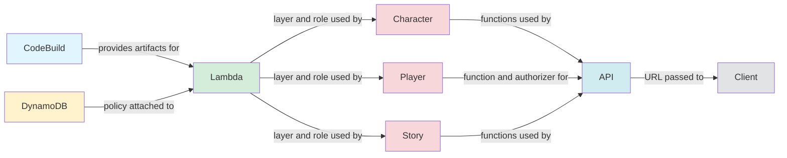

# Eidolon Engine Deployment Guide

This guide explains how to deploy the Eidolon Engine infrastructure using the modular CDK-based deployment system that replaced the monolithic 1800+ line deployment class.

## Prerequisites

- Python 3.12 or later (always use `python3` command)
- AWS CLI configured with appropriate credentials
- AWS CDK CLI installed: `npm install -g aws-cdk`
- Required Python packages: `pip3 install -r requirements/scripts-requirements.txt`
- AWS CDK Bootstrap: Run `cdk bootstrap aws://ACCOUNT-ID/REGION` if not already done
- Supported regions: us-east-1, us-east-2, us-west-2

## Quick Start

```bash
cd deployment
python3 deploy.py
```

The deployment will:

1. Check CDK bootstrap status
2. Collect deployment parameters (mode, domain, etc.)
3. Deploy 8–10 CDK stacks in sequence based on selected mode
4. Execute Lambda builds automatically
5. Update Lambda functions from S3 artifacts
6. Execute portal build via CodeBuild
7. Update config.yml with all resource identifiers

## System Architecture

This section is the canonical infrastructure overview referenced by other documentation.

- **10 CDK Stacks**: CodeBuild, DynamoDB, Lambda, Player, Character, Story, S3, CloudWatch, API, Client
- **3 Deployment Modes**: MUD, Incremental, Hybrid (default)
- **23 Lambda Functions Total**: 22 deployed, 1 not deployed (cognito-player-delete reserved for future API)
  - 12 Character Stack functions (character, archetype, item, store management)
  - 9 Story Stack functions (story, segment, decision processing)
  - 1 Player Stack function (cognito-player-new)
- **14 DynamoDB Tables**: All with RemovalPolicy.RETAIN
- **Fixed Logical IDs**: Preventing resource recreation on updates
- **Post-Deploy Updates**: Lambda functions automatically updated from S3

## Key Features

The deployment system provides:

- **Fixed Logical IDs**: Preventing resource recreation on stack updates
- **CDK Context Pattern**: All stacks use `-c` flags for parameters (no argparse)
- **AWS Access Isolation**: No AWS API calls during CDK synthesis
- **Automated End-to-End**: From infrastructure to portal deployment
- **Post-Deployment Operations**: Lambda updates, layer cleanup, trigger configuration
- **Production Tested**: All phases deployed and operational

## Deployment Modes

### MUD Mode (9 Stacks)

- **Frontend**: Portal app via `buildspec/portal.yml`
- **Excludes**: Story Stack (no SQS/EventBridge)
- **Includes**: S3 Scripts, CloudWatch logging
- **Use Case**: Traditional MUD experience only

### Incremental Mode (8 Stacks)

- **Frontend**: Incremental app via `buildspec/incremental.yml`
- **Excludes**: S3 Scripts, CloudWatch Stack
- **Includes**: Story Stack (SQS/EventBridge)
- **Use Case**: Story-driven incremental gameplay

### Hybrid Mode - Default (10 Stacks)

- **Frontend**: Incremental app via `buildspec/incremental.yml`
- **Includes**: All stacks for complete functionality
- **Use Case**: Full feature set with both game modes

## Stack Deployment Order

Refer other documents here rather than duplicating the sequence.

### Phase-Based Deployment

Stacks deploy in a specific order based on dependencies:

1. **CodeBuild Stack**: Build infrastructure and artifacts bucket
2. **DynamoDB Stack**: 14 tables with managed IAM policy
3. **Lambda Stack**: Shared layer and execution role (no functions deployed here)
4. **Player Stack**: Cognito User Pool, 1 Lambda function (cognito-player-new)
5. **Character Stack**: 7 Lambda functions (character APIs, item APIs, archetype)
6. **Story Stack** (Incremental/Hybrid only): 9 Lambda functions (story APIs, segment APIs, operations), SSM, SQS, EventBridge
7. **S3 Stack** (MUD/Hybrid only): Scripts bucket with Lua upload
8. **CloudWatch Stack** (MUD/Hybrid only): Logging infrastructure
9. **API Stack**: API Gateway with Lambda integrations
10. **Client Stack**: CloudFront, S3, automated portal build

Then (all modes): 11. **Lambda Function Updates**: Update function code from S3 artifacts

## Deployment Process

### Initial Setup

Follow the command sequence in [Quick Start](#quick-start); the CLI then prompts for:

1. **Deployment Mode**: MUD, Incremental, or Hybrid (default)
2. **Domain Configuration**: Domain name and Route53 Hosted Zone ID
3. **GitHub Settings**: Owner, repository, branch (for CodeBuild)
4. **S3 Buckets**: Artifacts and scripts bucket names
5. **Reply Email**: For Cognito notifications

### Parameter Priority

The system loads parameters in this order (highest to lowest priority):

1. **Environment variables** (e.g., `AWS_REGION`, `EIDOLON_S3_BUCKET`)
2. **`config.yml` values** (persistent configuration)
3. **`cdk.json` context values** (saved from previous runs)
4. **Interactive prompts** (only if TTY available)
5. **Hardcoded defaults** (fallback values)

### CDK Context Configuration

All parameters are passed via CDK context:

```python
# Example from deployment modules
context_args = [
    "-c", f"region={params.region}",
    "-c", f"deployment_mode={params.deployment_mode}",
    "-c", f"domain={params.domain}",
    "-c", f"api_host={params.api_host}",
    "-c", f"client_host={params.client_host}"
]
```

Each stack has its own app file (`app_*.py`) to prevent output contamination.

## CI/CD and Non-Interactive Deployment

The deployment script automatically detects interactive vs. non-interactive mode using `sys.stdin.isatty()`. In CI/CD environments without a TTY, all parameters must be provided via environment variables or configuration files.

### Environment Variables

All deployment parameters can be set via environment variables to enable automated deployments:

| Environment Variable      | Description                         | Required    | Example                  |
| ------------------------- | ----------------------------------- | ----------- | ------------------------ |
| `AWS_REGION`              | AWS region to deploy to             | Yes         | `us-east-1`              |
| `EIDOLON_DEPLOYMENT_MODE` | Deployment mode                     | No          | `incremental`            |
| `EIDOLON_S3_BUCKET`       | S3 artifacts bucket name            | Yes         | `eidolon-artifacts-prod` |
| `EIDOLON_SCRIPTS_BUCKET`  | S3 scripts bucket (mud/hybrid only) | Conditional | `eidolon-scripts-prod`   |
| `EIDOLON_CLIENT_BUCKET`   | S3 client bucket for portal         | Yes         | `eidolon-portal-prod`    |
| `GITHUB_OWNER`            | GitHub repository owner             | No          | `robinje`                |
| `GITHUB_REPO`             | GitHub repository name              | No          | `eidolon-engine`         |
| `GITHUB_BRANCH`           | GitHub branch to deploy             | No          | `develop`                |
| `EIDOLON_DOMAIN`          | Base domain for services            | Yes         | `darkrelics.net`         |
| `EIDOLON_HOSTED_ZONE_ID`  | Route53 hosted zone ID              | Yes         | `Z1234567890ABC`         |
| `EIDOLON_API_HOST`        | API subdomain                       | Yes         | `api`                    |
| `EIDOLON_CLIENT_HOST`     | Client subdomain                    | Yes         | `portal`                 |
| `EIDOLON_REPLY_EMAIL`     | Cognito reply email                 | No          | `contact@darkrelics.net` |

### Non-Interactive Mode Behavior

When running without a TTY (e.g., in CI/CD pipelines):

- **No prompts**: All parameters must be provided via environment variables or config files
- **No confirmations**: Deployment proceeds automatically (no "Proceed? [Y/n]" prompts)
- **Clear errors**: Missing required parameters raise `ValueError` with helpful messages
- **Logging**: Deployment logs indicate "non-interactive mode" for observability

### CI/CD Usage Example

Complete deployment in GitHub Actions, GitLab CI, or AWS CodePipeline:

```bash
# Set required environment variables
export AWS_REGION=us-east-1
export EIDOLON_S3_BUCKET=eidolon-artifacts-prod
export EIDOLON_CLIENT_BUCKET=eidolon-portal-prod
export EIDOLON_DOMAIN=darkrelics.net
export EIDOLON_HOSTED_ZONE_ID=Z1234567890ABC
export EIDOLON_API_HOST=api
export EIDOLON_CLIENT_HOST=portal
export EIDOLON_DEPLOYMENT_MODE=incremental

# Force non-interactive mode (optional - auto-detected)
python3 deployment/deploy.py < /dev/null
```

### Lambda-Only Updates in CI/CD

For faster deployments that only update Lambda function code:

```bash
export EIDOLON_S3_BUCKET=eidolon-artifacts-prod
python3 deployment/deploy.py --update-lambdas < /dev/null
```

### Backward Compatibility

The deployment script remains 100% backward compatible with manual workflows:

- Interactive mode works exactly as before
- All prompts still show default values
- Confirmation prompts still appear
- No behavior changes for existing users

## Post-Deployment Operations

### Automatic Lambda Updates

After CDK deployment, the system:

1. **Updates Lambda function code** from the latest S3 artifacts
2. **Re-associates each function** with the most recent published layer when needed
3. **Skips not-yet-deployed functions safely**, logging a warning instead of failing the deployment
4. **Configures Cognito triggers** for imported User Pools

### Portal Build Automation

The Client Stack automatically:

1. **Starts CodeBuild project** after infrastructure
2. **Monitors build progress** with phase updates
3. **Syncs to S3** and invalidates CloudFront
4. **Displays portal URL** on completion

## Database Utilities

The repository includes lightweight scripts for seeding and inspecting DynamoDB tables during development. Run them from the repo root; use `--region` to target a specific AWS account when needed.

- `database/data_loader.py` — Loads the JSON fixtures in `data/` (rooms, exits, archetypes, prototypes, opponents, stories) into DynamoDB. Defaults to `us-east-1`:
  ```bash
  python database/data_loader.py --region us-west-2
  ```
- `database/viewer.py` — Dumps table contents (default region `us-east-1`). Pass logical table names (e.g., `characters`, `story_history`) to limit the output:
  ```bash
  python database/viewer.py --region us-west-2 characters archetypes
  ```
- `database/motd.py` — Adds a Message of the Day entry (region default `us-east-1`):
  ```bash
  python database/motd.py "Welcome to Eidolon" --region us-west-2
  ```
- `database/create_item.py` — Interactive helper that clones an item prototype into the `items` table (region default `us-east-1`):
  ```bash
  python database/create_item.py --region us-west-2
  ```

Sample fixtures live under `data/` (`test_rooms.json`, `test_story.json`, etc.) and match the schemas described in `schema.md`.

## Critical Implementation Details

### Fixed Logical IDs

All resources use fixed logical IDs to prevent recreation:

```python
# Example from Lambda Stack
def _get_function_logical_id(self, function_name: str) -> str:
    logical_id_map = {
        "api-character-list": "ApiCharacterListFunction",
        "cognito-player-new": "CognitoPlayerNewFunction",
        # ... etc
    }
    return logical_id_map.get(function_name, ...)
```

### No AWS Access During Synthesis

Resource checks happen in deployment layer, not CDK:

```python
# WRONG - Fails during synthesis
if check_s3_bucket_exists(bucket_name):
    s3.Bucket.from_bucket_name(...)

# RIGHT - Use fixed IDs, let CDK handle
s3.Bucket(self, "FixedLogicalId", bucket_name=...)
```

### Configuration Files

#### config.yml (Operational Data)

Contains runtime configuration:

```yaml
Game:
  name: eidolon-engine
  PortalS3Bucket: eidolon-portal # Auto-detected or created
  ScriptsS3Bucket: eidolon-scripts # Auto-detected or created
  ScriptsS3Prefix: scripts
  PortalUrl: https://d1234567890.cloudfront.net # Portal URL via CloudFront

# Deployment mode configuration
Deployment:
  Mode: hybrid # Options: 'mud', 'incremental', or 'hybrid'

AWS:
  region: us-east-1
  contact_email: contact@darkrelics.net

# API configuration (unified for all modes)
API:
  Domain: darkrelics.net
  HostedZoneId: Z1234567890ABC
  Subdomain: api # api.darkrelics.net

# Client configuration (for CORS)
Client:
  Host: portal # Client subdomain (portal.darkrelics.net)
  # CORS origin is constructed as https://{Host}.{Domain}
  # API Gateway preflight uses this explicit origin
  # Lambda ALLOWED_ORIGINS env var set to this value

CloudFront:
  distribution_id: E1234567890ABC
  domain_name: d1234567890.cloudfront.net
  portal_url: https://d1234567890.cloudfront.net

Cognito:
  user_pool_id: us-east-1_xxxxxxxxx
  app_client_id: xxxxxxxxxxxxxxxxxxxx

# Unified DynamoDB tables (same for all deployment modes)
DynamoDB:
  Tables:
    Players: players
    Characters: characters
    Archetypes: archetypes
    Items: items
    Story: story # For incremental game story data
    Rooms: rooms
    Exits: exits
    Prototypes: prototypes
    Motd: motd

Logging:
  cloudwatch:
    log_group: /aws/eidolon/server
    metrics_namespace: eidolon/metrics
```

#### cdk.json (CDK Context)

Stores deployment parameters:

```json
{
  "context": {
    "region": "us-east-1",
    "deployment_mode": "hybrid",
    "domain": "darkrelics.net",
    "hosted_zone_id": "Z1234567890ABC",
    "github_owner": "robinje",
    "github_repo": "eidolon-engine",
    "github_branch": "develop",
    "s3_bucket": "eidolon-engine-lambda-542230992937"
  }
}
```

#### .cdk-state.json (Infrastructure State)

Tracks deployed resources and outputs (gitignored).

## Resource Naming

- **DynamoDB Tables** (14): `players`, `characters`, `rooms`, `exits`, `items`, `prototypes`, `archetypes`, `motd`, `story`, `segments`, `active_segments`, `story_history`, `segment_history`, `opponents`
- **Lambda Functions** (17 deployed, 18 total): `api-*`, `ops-*`, and `cognito-*` prefixed names (cognito-player-delete not deployed)
- **S3 Buckets**: `eidolon-engine-lambda-{account}`, `eidolon-scripts-{account}`, portal bucket
- **Cognito Pool**: `eidolon-users`
- **CloudWatch**: `/eidolon/server` log group
- **CDK Stack IDs**: Simple lowercase (`dynamodb`, `lambda`, `player`, etc.)
- **IAM**: Shared `eidolon-lambda-execution-role` with managed policies

## Lambda Infrastructure

### Shared Execution Role

All Lambda functions use a single execution role with:

- DynamoDB access via managed policy
- CloudWatch Logs permissions
- Additional policies attached by dependent stacks

### Environment Variables

```python
# Set in lambda_stack.py
"LOG_LEVEL": "INFO",  # Validated in eidolon/environment.py
"ALLOWED_ORIGINS": f"https://{client_host}.{domain}",
"CORS_ALLOW_CREDENTIALS": "true",
# DynamoDB table names from stack outputs
# Function-specific configs (SEGMENT_BATCH_SIZE, etc.)
```

### Post-Deployment Updates

Lambda functions are updated from S3 after CDK deployment:

```python
# Automatic update ensures latest code
lambda_client.update_function_code(
    FunctionName=function_name,
    S3Bucket=bucket_name,
    S3Key=f"{function_name}.zip"
)
```

## Known Issues and Solutions

### API Domain Configuration

The Flutter app expects domain without protocol:

```python
# Fixed in client_stack.py
"API_DOMAIN": codebuild.BuildEnvironmentVariable(
    value=f"{self.api_host}.{self.domain}"  # Not self.api_url
)
```

### DynamoDB Permissions

Must include `DescribeTable` action:

```python
# Fixed in dynamodb_stack.py
actions=[
    "dynamodb:DescribeTable",  # Required for table access
    "dynamodb:GetItem",
    "dynamodb:PutItem",
    # ... other actions
]
```

### Cognito Trigger Permissions

For imported User Pools, permissions set post-deployment:

```python
# In player.py - always check and add permissions
if current_trigger == lambda_arn:
    # Still need to check Lambda permissions
    # Don't return early
```

## Production Metrics

### Deployment Statistics

- **Total Stacks**: 10 independent CDK stacks
- **Lambda Functions**: 17 deployed (18 total, cognito-player-delete not deployed)
- **DynamoDB Tables**: 14 with RemovalPolicy.RETAIN
- **Module Size**: 94% under 300 lines, 100% under 1000 lines
- **Deployment Time**: Full deployment in under 15 minutes
- **Lessons Learned**: 140 documented and applied

## Buildspec Selection by Mode

### Portal Build (MUD Mode)

Using `buildspec/portal.yml`:

```yaml
# Builds from portal/ directory
# Deploys traditional MUD interface
# No story/incremental features
```

### Incremental Build (Incremental/Hybrid)

Using `buildspec/incremental.yml`:

```yaml
# Builds from incremental/ directory
# Includes story progression features
# Timer-based gameplay interface
```

### Automatic Execution

CodeBuild runs automatically after Client Stack:

1. **Build starts** immediately after infrastructure
2. **Real-time monitoring** with phase updates
3. **S3 sync** to portal bucket
4. **CloudFront invalidation** clears cache
5. **Portal URL** displayed on completion

## Module Organization

### Deployment Modules (`deployment/`)

- **deploy.py**: Main orchestrator (parameter collection, stack ordering)
- **utilities.py**: CDK deployment wrapper, validation helpers
- **dynamodb.py**: DynamoDB stack deployment and validation
- **codebuild.py**: Build infrastructure with automatic execution
- **lambda_functions.py**: Lambda deployment with S3 updates
- **character.py**: Character stack deployment and validation
- **player.py**: Cognito deployment with trigger configuration
- **story.py**: SQS/EventBridge deployment (mode-aware)
- **api.py**: API Gateway deployment
- **client.py**: CloudFront and portal build automation

### CDK App Files (`deployment/app_*.py`)

Each stack has its own app file:

- Prevents output contamination
- Uses CDK context for parameters
- No argparse, uses `try_get_context()`

## Stack Dependencies

### Direct Dependencies



### Mode-Specific Dependencies

**MUD Mode**:

- S3 Scripts → Server can read Lua scripts
- CloudWatch → Server writes logs

**Incremental/Hybrid**:

- Story → SQS triggers Lambda functions
- Story → EventBridge invokes poller

### Post-Deployment Operations

1. **Lambda Updates**: Force update from S3 artifacts
2. **Layer Cleanup**: Delete old versions
3. **Cognito Triggers**: Configure for imported pools
4. **S3 Policies**: Update for CloudFront access
5. **Portal Build**: Execute CodeBuild project

## Troubleshooting

### CDK Bootstrap Required

```bash
cdk bootstrap aws://ACCOUNT-ID/REGION
```

If you see "SSM parameter /cdk-bootstrap/hnb659fds/version not found":

- The account needs CDK bootstrap
- Bootstrap creates required roles and buckets
- Only needed once per account/region

### Resource Already Exists

With fixed logical IDs, CDK handles existing resources:

- Resources are updated, not recreated
- Data is preserved across deployments
- Use RemovalPolicy.RETAIN for safety

### Lambda Permission Issues

For Cognito triggers on imported pools:

```bash
# Manually add if needed
aws lambda add-permission \
  --function-name cognito-player-new \
  --statement-id CognitoInvokePermission \
  --action lambda:InvokeFunction \
  --principal cognito-idp.amazonaws.com \
  --source-arn arn:aws:cognito-idp:REGION:ACCOUNT:userpool/POOL_ID
```

### API URL Double HTTPS Issue

If you see `https://https://api.domain.com`:

```python
# Problem: API_DOMAIN set to full URL
# Solution: Pass domain only
"API_DOMAIN": f"{api_host}.{domain}"  # Not api_url
```

### LOG_LEVEL Validation

The system now validates LOG_LEVEL:

```python
# Accepts: "20", "INFO", "DEBUG", etc.
# Returns: Always a string name for logging module
LOG_LEVEL = _validate_log_level(os.environ.get("LOG_LEVEL", "INFO"))
```

### Layer Version Management

Phase 11 reuses the most recent published `eidolon-dependencies` layer. It does **not** publish new versions or prune historical ones; remove stale layer versions manually through the AWS console or CLI if needed.

## Environment Strategy

### Multi-Account Deployment Architecture

**Each deployment environment uses its own AWS account:**

- **Development**: Separate AWS account for individual developer testing
- **Staging**: Dedicated AWS account for integration testing
- **Production**: Isolated AWS account for live system

**Benefits:**

- **Complete Isolation**: No resource name conflicts between environments
- **Security**: Full account-level separation prevents cross-environment access
- **Cost Tracking**: Clear cost attribution per environment
- **IAM Simplicity**: No complex environment-based permissions needed

**Resource Naming:**

- **Same names across accounts**: All environments use identical resource names (`eidolon-api`, `characters`, etc.)
- **No prefixes needed**: Account isolation eliminates naming conflicts
- **Consistent configuration**: Same `config.yml` structure across environments

**Flutter Configuration Management:**

```dart
// Build-time environment configuration
const String apiDomain = String.fromEnvironment(
  'API_DOMAIN',
  defaultValue: 'api.darkrelics.net',  // Production default
);

// Environment-specific builds:
// Dev: flutter build web --dart-define=API_DOMAIN=api-dev.darkrelics.net
// Staging: flutter build web --dart-define=API_DOMAIN=api-staging.darkrelics.net
// Prod: flutter build web --dart-define=API_DOMAIN=api.darkrelics.net
```

**Deployment Process Per Account:**

1. **Bootstrap each account**: `cdk bootstrap aws://ACCOUNT-ID/REGION`
2. **Deploy with same parameters**: Same domain names, resource names, configuration
3. **Account-specific domains**: Use subdomain routing (api-dev.domain.com vs api.domain.com)
4. **Consistent resource names**: No prefixes needed due to account isolation

## Best Practices

### Architecture Guidelines

1. **Module Size**: Keep modules under 300 lines (1000 max)
2. **Fixed Logical IDs**: Prevent resource recreation
3. **CDK Context**: Use for all parameter passing
4. **Stack Isolation**: Separate app file per stack
5. **Post-Deploy Updates**: Always update Lambdas from S3
6. **Account Isolation**: Use separate AWS accounts for each environment

### Deployment Guidelines

1. **CDK Bootstrap First**: Required for each account/region
2. **Collect Input Upfront**: All prompts before execution
3. **Single Confirmation**: One approval for entire deployment
4. **Mode Selection**: Choose appropriate deployment mode
5. **Validate After Deploy**: Check resources with boto3

### Operational Guidelines

1. **Region Validation**: Only us-east-1, us-east-2, us-west-2
2. **RemovalPolicy.RETAIN**: For all stateful resources
3. **Managed Policies**: No inline policies
4. **Pattern Consistency**: Same patterns across all stacks

## Summary

The Eidolon Engine deployment system represents a complete transformation from a monolithic 1800+ line class to a clean, modular architecture with:

- **10 Independent CDK Stacks**: Each with focused responsibility
- **3 Deployment Modes**: MUD, Incremental, and Hybrid
- **Automated End-to-End**: Infrastructure to portal deployment
- **Production Tested**: All components operational
- **140 Lessons Applied**: Best practices throughout

The system demonstrates that complex infrastructure can be managed effectively with proper modularization, fixed logical IDs, and clear separation between CDK synthesis and AWS operations.

## CDK Development Notes

### Critical CDK Synthesis Limitations

Based on extensive production deployment experience, these patterns must be followed:

#### CDK Synthesis Constraints

- **No AWS Access During Synthesis**: CDK synthesis happens without AWS credentials. Any boto3 calls in CDK stack classes will fail. The deployment system uses boto3 in top-level deployment scripts for resource verification before CDK synthesis
- **Fixed Logical IDs Required**: Use fixed IDs like `"PortalBucket"` not dynamic ones to prevent resource recreation
- **CDK Tokens vs Strings**: `self.region` returns a token, not a string. Pass actual region values as parameters
- **No Runtime Imports**: All imports must be at module level. No dynamic imports or module injection

#### Resource Management Patterns

```python
# CORRECT: Fixed logical ID with RETAIN policy
bucket = s3.Bucket(
    self,
    "ArtifactsBucket",  # Fixed ID - won't change between deployments
    bucket_name=bucket_name,
    removal_policy=RemovalPolicy.RETAIN,
    auto_delete_objects=False,
)

# WRONG: Dynamic ID causes recreation
bucket = s3.Bucket(
    self,
    f"Bucket-{timestamp}",  # Changes every deployment!
    bucket_name=bucket_name,
)
```

#### Import Pattern for Existing Resources

```python
# In deployment module (has AWS access)
def deploy_stack(params):
    from stacks.stack_utilities import check_s3_bucket_exists
    bucket_exists = check_s3_bucket_exists(params.bucket, params.region)

    context_args = [
        "-c", f"bucket_exists={'true' if bucket_exists else 'false'}",
    ]
    return run_cdk_deploy("stack", params.region, app_command, context_args)

# In CDK stack
def __init__(self, scope, id, bucket_exists: bool = False, **kwargs):
    if bucket_exists:
        bucket = s3.Bucket.from_bucket_name(self, "Bucket", bucket_name)
    else:
        bucket = s3.Bucket(self, "Bucket", bucket_name=bucket_name,
                          removal_policy=RemovalPolicy.RETAIN)
```

#### Lambda Layer Version Management

Automated deployments reuse the latest published `eidolon-dependencies` layer but do not publish new versions or prune historical ones. When you intentionally roll a new layer, publish it manually (e.g. via the `lambda-layer` CodeBuild project) and delete obsolete versions through the console/CLI to stay within the 75-version limit.

#### Common Pitfalls to Avoid

1. **Square Bracket Dictionary Access**: Use `.get()` method for safe access
2. **Environment Variable Manipulation**: Pass region explicitly, don't rely on CDK environment
3. **Inline IAM Policies**: Always use managed policies
4. **Dynamic Resource Naming**: Causes resource recreation on every deployment
5. **Resource Checks in CDK**: Will always fail during synthesis
