# Incremental Subsystem Architecture Diagrams

This document provides visual architecture diagrams for the Eidolon Engine incremental subsystem using Mermaid.js.

## Table of Contents

1. [System Context (C4 Level 1)](#system-context-c4-level-1)
2. [Container Architecture (C4 Level 2)](#container-architecture-c4-level-2)
3. [Component Architecture (C4 Level 3)](#component-architecture-c4-level-3)
4. [State Machines](#state-machines)
5. [Hot Path Flows](#hot-path-flows)
6. [Data Flow Diagrams](#data-flow-diagrams)

---

## System Context (C4 Level 1)

The system context diagram shows how players interact with both game subsystems through a unified authentication layer.

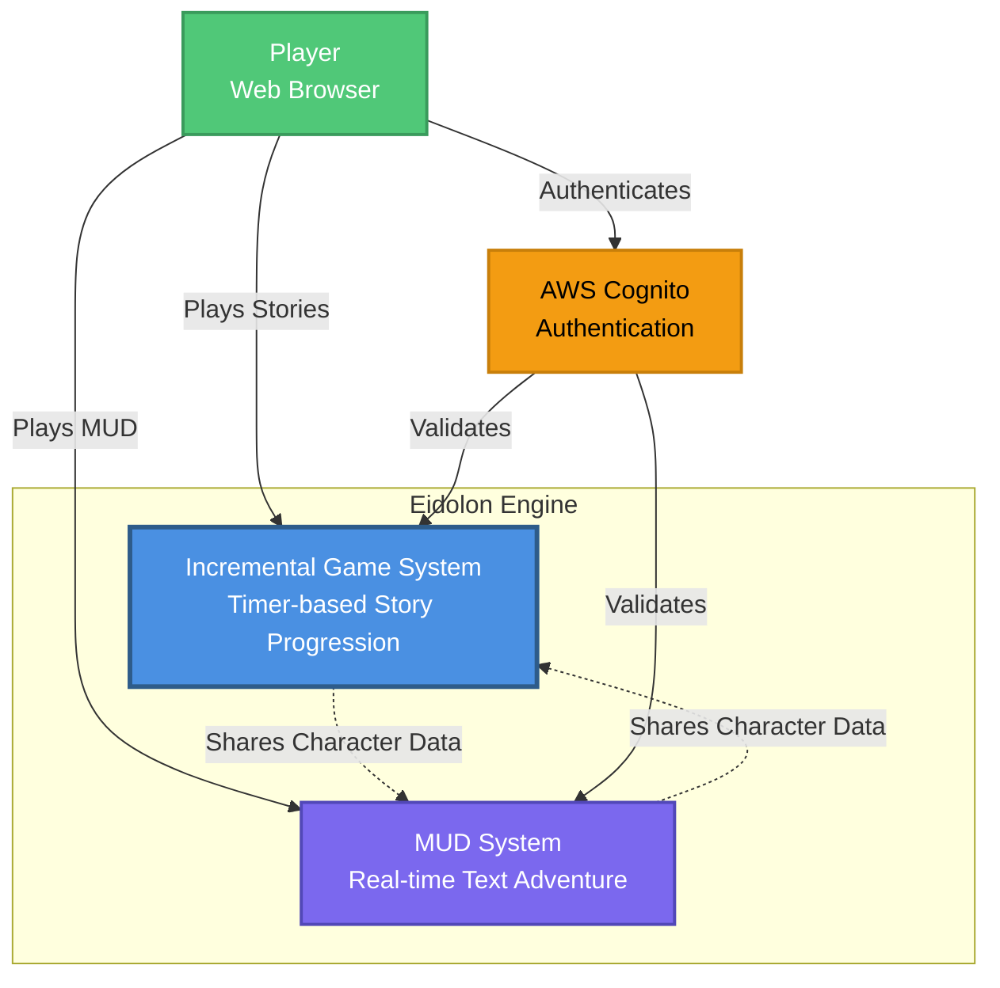

---

## Container Architecture (C4 Level 2)

The container architecture shows the major AWS services and how they interact to provide the incremental game system.

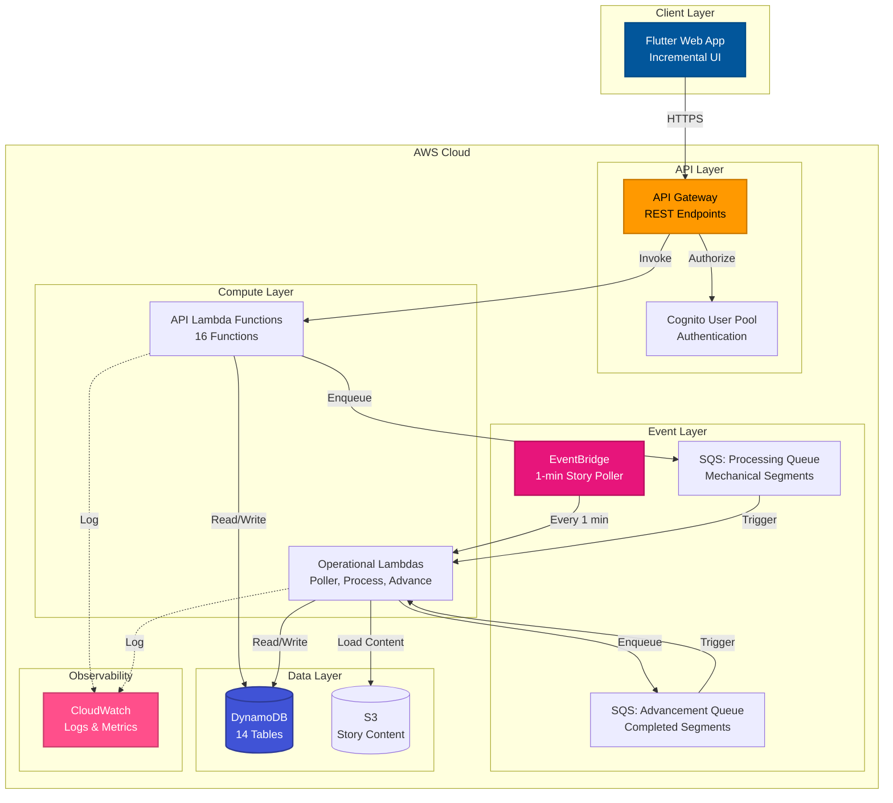

---

## Component Architecture (C4 Level 3)

### Lambda Functions & Eidolon Library

The component architecture details how Lambda functions interact with the shared eidolon library modules to implement game logic.

```mermaid
graph TB
    subgraph "API Lambda Functions"
        StoryStart[api-story-start<br/>POST /story/start]
        StoryAbandon[api-story-abandon<br/>POST /story/abandon]
        SegmentDecision[api-segment-decision<br/>POST /segment/decision]
        SegmentStatus[api-segment-status<br/>GET /segment/status]
        SegmentHistory[api-segment-history<br/>GET /segment/history]
        CharGet[api-character-get<br/>GET /character]
    end

    subgraph "Operational Lambda Functions"
        Poller[ops-segment-poller<br/>EventBridge Triggered]
        Process[ops-segment-process<br/>SQS Triggered]
        Advance[ops-story-advance<br/>SQS Triggered]
    end

    subgraph "Eidolon Library Modules"
        subgraph "State Management"
            SegState[segment_state.py<br/>ProcessingStatus FSM]
            StoryActive[story_active.py<br/>Story Activation]
            StoryComp[story_completion.py<br/>Story Completion]
        end

        subgraph "Processing Logic"
            SegProc[segment_processing.py<br/>Outcome Calculation]
            SegCombat[segment_combat.py<br/>Combat Resolution]
            SegChal[segment_challenges.py<br/>Skill Checks]
            Branching[branching.py<br/>Weighted Branching]
        end

        subgraph "Data Access"
            CharData[character_data.py<br/>Character CRUD]
            StoryRet[story_retrieval.py<br/>Story Loading]
            Items[items.py<br/>Inventory Mgmt]
            Dynamo[dynamo.py<br/>DDB Wrapper]
        end

        subgraph "Core Mechanics"
            Mechanics[mechanics.py<br/>XP & Skill System]
        end
    end

    StoryStart --> StoryActive
    StoryStart --> SegState
    StoryStart --> CharData

    Poller --> SegState
    Poller --> Dynamo

    Process --> SegProc
    Process --> SegCombat
    Process --> SegChal

    Advance --> StoryComp
    Advance --> Branching
    Advance --> Items

    SegProc --> Mechanics
    SegCombat --> Mechanics
    SegChal --> Mechanics

    style StoryStart fill:#4A90E2,stroke:#2E5C8A,stroke-width:2px,color:#fff
    style Poller fill:#E74C3C,stroke:#C0392B,stroke-width:2px,color:#fff
    style Process fill:#E67E22,stroke:#CA6F1E,stroke-width:2px,color:#fff
    style Advance fill:#16A085,stroke:#138D75,stroke-width:2px,color:#fff
```

---

## State Machines

### Character GameMode State Machine

The GameMode state machine enforces exclusive access to characters, preventing simultaneous play in both MUD and Incremental modes.

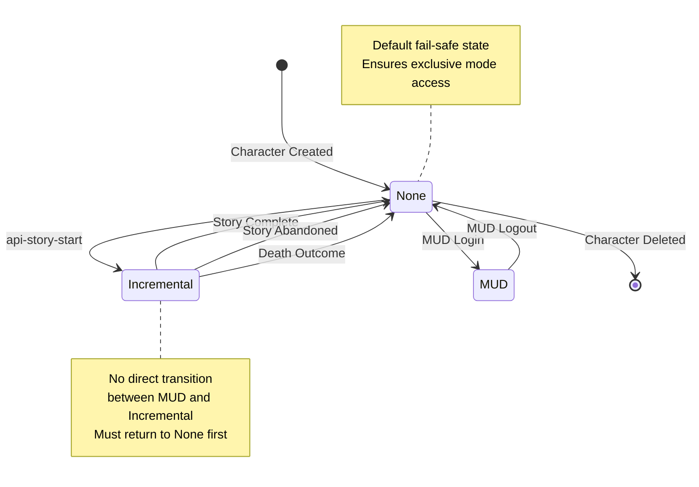

### Segment ProcessingStatus State Machine

The ProcessingStatus state machine uses atomic DynamoDB conditional writes to prevent duplicate processing of segments.

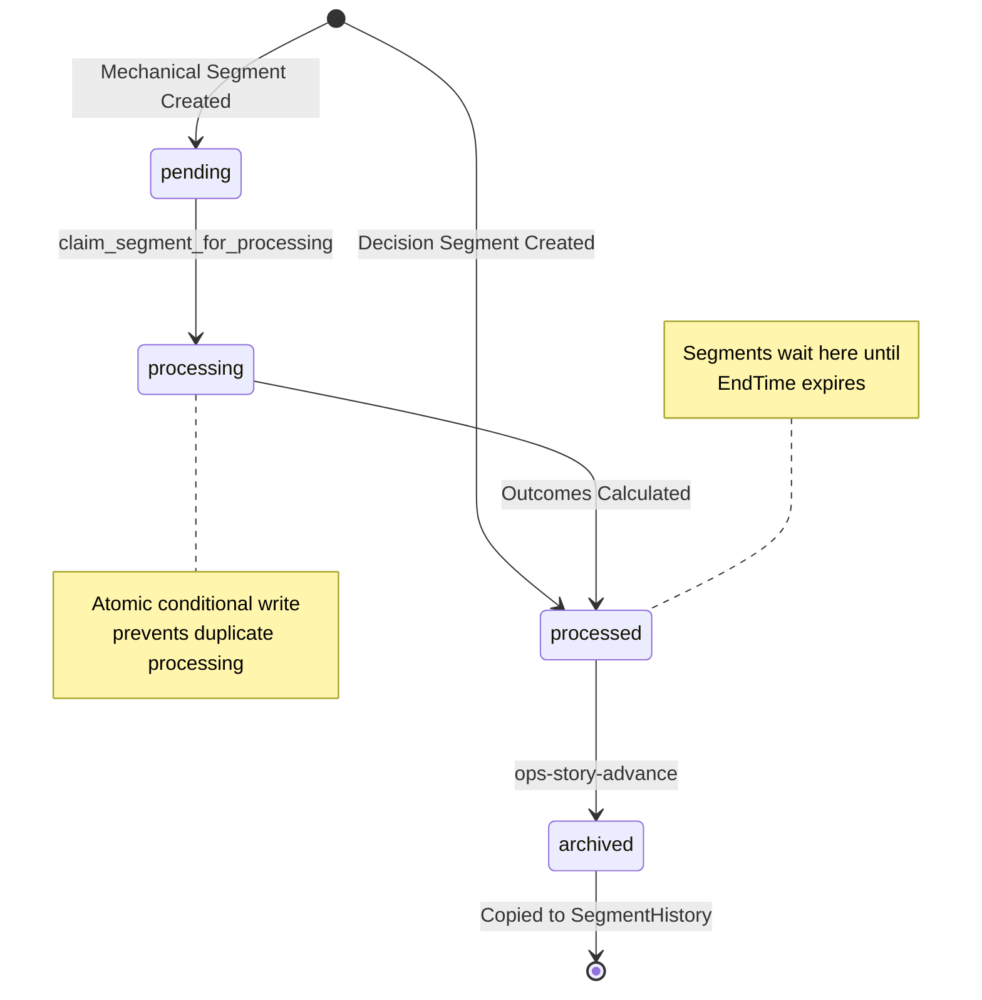

### Story Lifecycle State Machine

Stories transition from available to active when started, and eventually move to completed or abandoned based on player actions and outcomes.

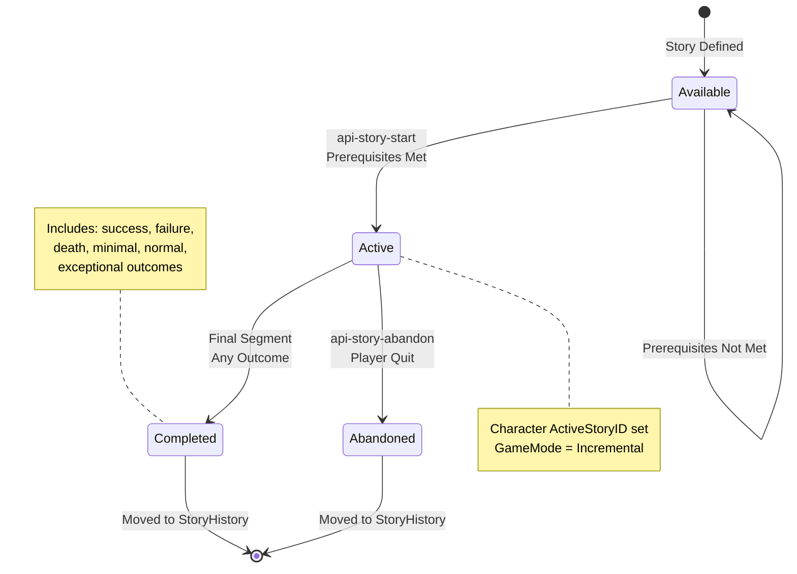

---

## Hot Path Flows

### Story Start Flow

The story start flow validates prerequisites, creates the first segment, and queues mechanical processing immediately.

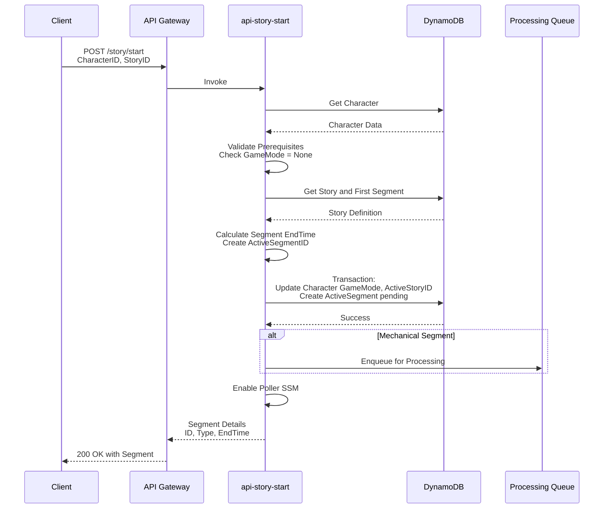

### Segment Processing Flow (Mechanical)

Mechanical segments are claimed atomically, processed to calculate outcomes, and marked as processed with results stored.

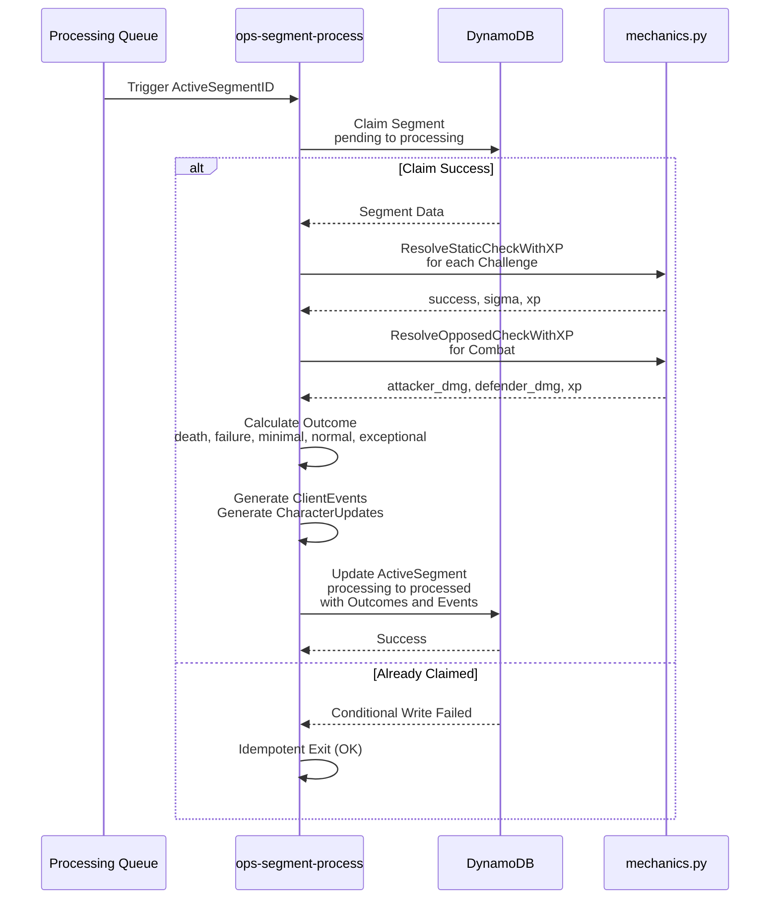

### Story Advancement Flow

The advancement flow finds completed segments via polling, applies character updates, and creates the next segment or completes the story.

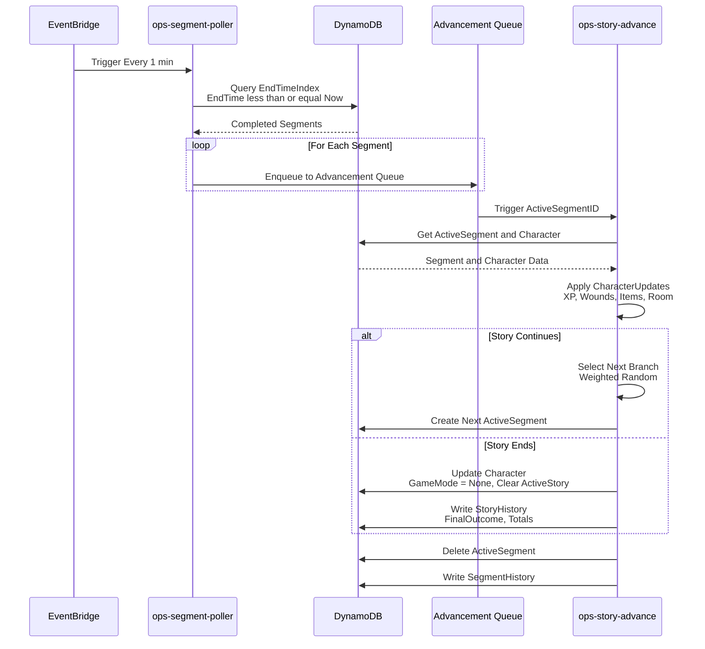

---

## Data Flow Diagrams

### DynamoDB Table Relationships

The entity relationship diagram shows how the 14 DynamoDB tables connect to support character progression and story tracking.

```mermaid
erDiagram
    PLAYERS ||--o{ CHARACTERS : owns
    CHARACTERS ||--o| ACTIVE_SEGMENTS : has_active
    CHARACTERS ||--o{ STORY_HISTORY : completed
    CHARACTERS ||--o{ SEGMENT_HISTORY : played
    CHARACTERS ||--o{ ITEMS : owns

    STORY ||--o{ SEGMENTS : contains
    SEGMENTS ||--o| ACTIVE_SEGMENTS : instantiated_as

    ARCHETYPES ||--o{ CHARACTERS : defines
    PROTOTYPES ||--o{ ITEMS : created_from
    OPPONENTS ||--o{ SEGMENTS : used_in

    PLAYERS {
        string PlayerID PK
        list CharacterList
        string Email
    }

    CHARACTERS {
        string CharacterID PK
        string PlayerID FK
        string GameMode
        string ActiveStoryID
        string ActiveSegmentID
        map Skills
        map Attributes
        list Wounds
        string RoomID
    }

    STORY {
        string StoryID PK
        string Title
        string StoryType
        string FirstSegmentID
        map Prerequisites
    }

    SEGMENTS {
        string StoryID PK
        string SegmentID SK
        string SegmentType
        number SegmentDuration
        map Results
        list Challenges
        map Combat
    }

    ACTIVE_SEGMENTS {
        string ActiveSegmentID PK
        string CharacterID GSI
        string ProcessingStatus
        number StartTime
        number EndTime GSI
        list ClientEvents
        map CharacterUpdates
        string Outcome
        map BranchMetadata
    }

    STORY_HISTORY {
        string CharacterID PK
        string StoryInstanceID SK
        string StoryID
        string FinalOutcome
        list SegmentHistory
        map SkillXPAwarded
        map AttributeXPAwarded
    }

    SEGMENT_HISTORY {
        string CharacterID PK
        string ActiveSegmentID SK
        string StoryInstanceID
        map CharacterUpdates
        string Outcome
        number ProcessedAt
        map BranchMetadata
    }
```

### Event Flow Architecture

The event-driven architecture uses EventBridge for time-based triggers and SQS queues for asynchronous processing of segments.

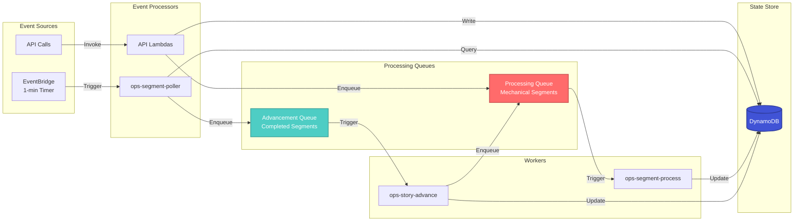

### Weighted Branching Flow

The weighted branching system filters branches by prerequisites, renormalizes weights, and uses cryptographic randomness for selection.

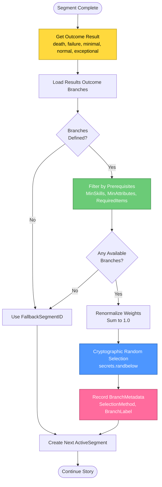

---

## Deployment Architecture

The deployment architecture shows the complete AWS infrastructure created by CDK and the CI/CD pipeline for story validation.

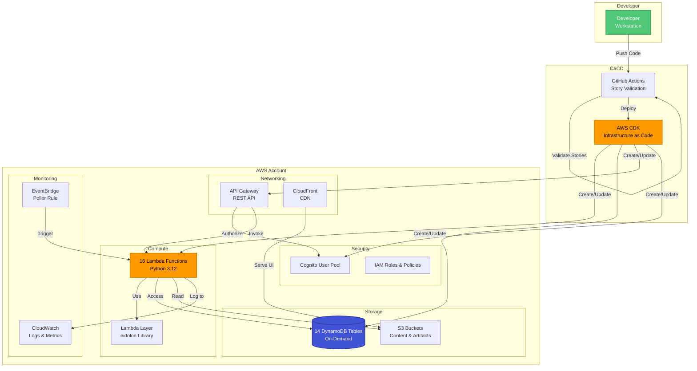

---

## Failure Recovery Patterns

The failure recovery pattern uses atomic claims, idempotent processing, and exponential backoff to handle errors gracefully.

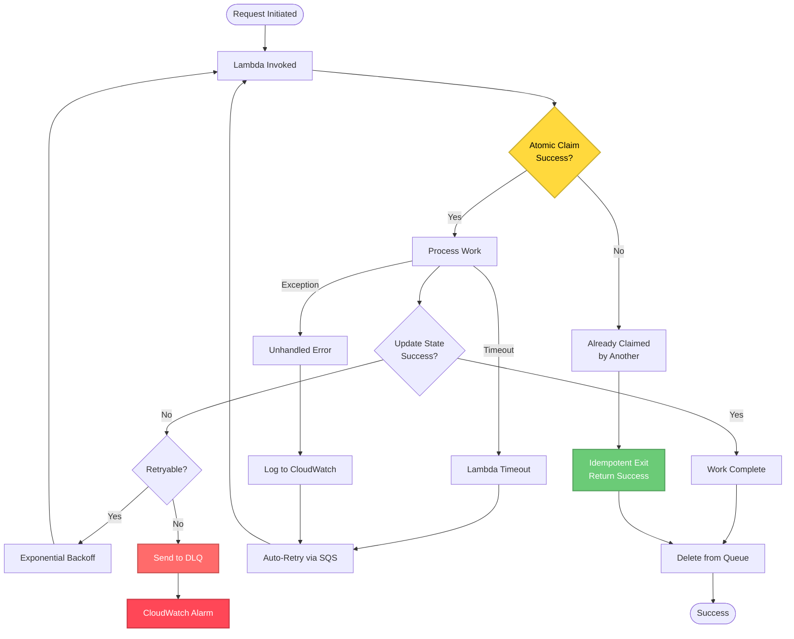

---

## Summary

These diagrams provide multiple views of the incremental subsystem architecture:

1. **C4 Diagrams** - System, Container, and Component levels for different audiences
2. **State Machines** - Formal state transition diagrams for GameMode, ProcessingStatus, and Story lifecycle
3. **Sequence Diagrams** - Hot path flows showing exact interaction patterns
4. **Entity Relationship** - DynamoDB table structure and relationships
5. **Data Flow** - Event-driven architecture and processing pipelines
6. **Deployment** - AWS infrastructure and CI/CD pipeline
7. **Failure Recovery** - Error handling and retry patterns

Each diagram uses Mermaid.js syntax and can be rendered in GitHub, documentation tools, or any Mermaid-compatible viewer.
