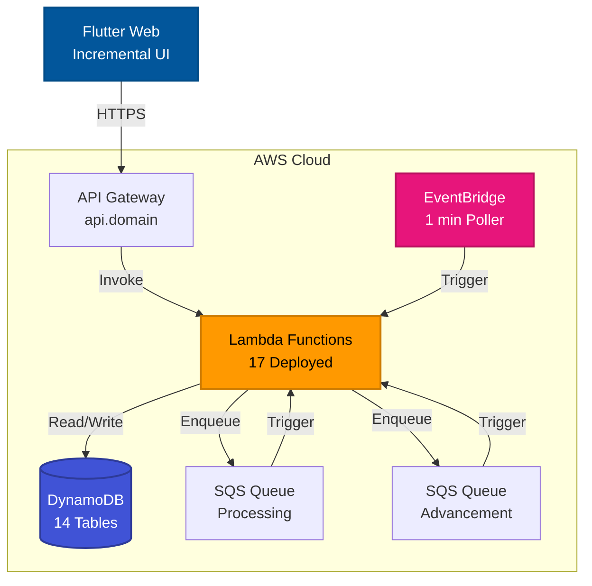

# Eidolon Engine Incremental Game Technical Design

## 1. Architecture Overview

### 1.1 System Architecture



**Infrastructure Context:** See [Deployment Guide](deployment.md#system-architecture) for the canonical infrastructure summary that all incremental components rely on.

### 1.2 Processing Architecture

The system uses a front-loaded processing model where all outcomes are calculated when segments start:

1. **Segment Creation**: When a story starts or advances, outcomes are immediately calculated
2. **Timer Management**: Segments have start/end times for client countdown display
3. **Polling System**: EventBridge triggers every minute to find completed segments
4. **Dual Queue Processing**:
   - Segment Processing Queue: Mechanical segments processed immediately when created
   - Story Advancement Queue: All segments processed when timer expires
5. **Result Application**: Pre-calculated outcomes applied and story advanced

### 1.3 GameMode Recovery & State Management

The system uses server-authoritative state with multiple automatic recovery mechanisms:

**Server-Side State Authority:**

- All game state stored in DynamoDB tables only
- Client maintains no authoritative state or calculations
- GameMode field prevents concurrent access between MUD and Incremental modes

**Automatic Recovery Paths:**

1. **Character Retrieval Cleanup**: `api-character-get` resets GameMode to "None" if no valid ActiveStoryID/ActiveSegmentID exists
2. **Polling System Recovery**: EventBridge triggers `ops-segment-poller` every minute to process expired segments and clean orphaned states
3. **Segment Processing Guarantee**: `ops-story-advance` ensures eventual processing of all segments

**Failure Recovery Scenarios:**

- **Client crash/network loss**: Next API call triggers automatic GameMode cleanup
- **Lambda timeout**: EventBridge ensures retry within 1 minute maximum
- **Orphaned segments**: Automatic timeout to "exceptional" outcome protects players
- **Maximum stuck time**: 2 minutes (1 EventBridge cycle + processing time)

## 2. API Design

### 2.1 RESTful Endpoints

All incremental APIs are catalogued in [Incremental API Documentation](incremental-api.md); this design guide references that contract instead of duplicating endpoint tables. Field names follow the JSON naming conventions defined in the [Style Guide](style-guide.md#json-field-naming-convention).

### 2.2 Request/Response Examples

The API uses JSON for all request and response payloads. When a player initiates a story, the client sends the character ID and desired story ID to the backend. The server validates prerequisites, ensures the character is not already in a game mode, and creates the first segment. The response includes timing information that allows the client to display an accurate countdown timer and the segment's status text for immediate display.

**Start Story Request:**

```json
POST /story/start
{
    "CharacterID": "char-uuid-456",
    "StoryID": "forest-adventure-uuid"
}
```

**Start Story Response:**

```json
{
  "Success": true,
  "Segment": {
    "ActiveSegmentID": "active-seg-uuid-123",
    "SegmentType": "decision",
    "StartTime": 1737000000,
    "EndTime": 1737000300,
    "SegmentActivity": "Choosing your path",
    "Duration": 300
  }
}
```

## 3. Lambda Function Specifications

### 3.1 Lambda Architecture Pattern

The Lambda architecture enforces a strict separation of concerns to improve testability and maintainability. Every Lambda function in the incremental system follows a two-layer pattern: the handler layer manages AWS-specific concerns like authentication extraction and CORS headers, while the business logic layer contains pure Python functions that can be tested without AWS dependencies. This pattern allows developers to unit test business logic in isolation and ensures that infrastructure changes don't affect core game mechanics. The handler always logs the invocation details for debugging and returns standardized responses using the eidolon library's response formatters.

Each Lambda follows a consistent pattern:

```python
def lambda_handler(event: dict, context: object) -> dict:
    """AWS Lambda entry point - handles infrastructure concerns."""
    # 1. Log invocation with request details
    # 2. Handle CORS preflight if needed
    # 3. Extract and validate authentication
    # 4. Parse and validate request
    # 5. Call business logic function
    # 6. Return formatted response with CORS headers

def business_logic(param1: str, param2: str) -> dict:
    """Pure business logic - testable without AWS dependencies."""
    # Uses eidolon library functions
    # Returns success/error dictionary
```

### 3.2 Core Lambda Functions

**Production Lambda Functions (17 Deployed, 18 Total):**

All functions use:

- Shared execution role: `eidolon-lambda-execution-role`
- DynamoDB managed policy with DescribeTable permission
- Fixed logical IDs preventing recreation on updates
- Post-deployment updates from S3 artifacts
- Environment variables for table names and configuration

**api-story-start**

- Validates character ownership and GameMode="None"
- Creates ActiveSegments record with calculated end time
- Generates ActiveSegmentID using UUIDv7 for time-based ordering
- Sends message to `eidolon-processing-queue` for mechanical segments
- Uses DynamoDB transaction to ensure atomicity
- Environment: `SEGMENT_QUEUE_URL` for SQS integration

**ops-segment-poller** (EventBridge triggered)

- EventBridge rule: `eidolon-story-poller` (1-minute schedule)
- Reads SSM parameter `/eidolon/story/config` for run/stop state
- Queries EndTimeIndex for segments where EndTime <= Now
- Sends ALL completed segments to `eidolon-advancement-queue`
- **GameMode Validation**: Checks characters for orphaned ActiveSegmentID/ActiveStoryID
- **Fail-Safe Cleanup**: Resets GameMode to "None" for characters with missing segments
- Manages polling state (auto-disable when no segments)

**ops-segment-process** (SQS triggered)

- Triggered by `eidolon-processing-queue`
- Processes mechanical segments only
- Uses MUD mechanics for calculations:
  - ResolveStaticCheckWithXP for skill challenges
  - ResolveOpposedCheckWithXP for combat encounters
- Generates ClientEvents array for display
- Stores results in ActiveSegments record
- Environment: `SEGMENT_BATCH_SIZE` for processing limits

**ops-story-advance** (SQS triggered)

- Triggered by `eidolon-advancement-queue`
- Claims segment with ProcessingStatus state transition to prevent duplicates
- Processes simple segments (decision) if not already processed
- Applies CharacterUpdates (XP, wounds, room changes)
- Creates next segment if story continues
- Resets GameMode="None" if story ends
- Writes to StoryHistory and SegmentHistory tables

## 4. Database Design

### 4.0 UUID Strategy

**Philosophical Approach**: UUID type selection follows clear decision criteria:

- **UUIDv7**: For anything requiring order, transient objects, or multi-record queries
  - `ActiveSegmentID` (time-based ordering for efficient polling)
  - `StoryInstanceID` (chronological story execution tracking)
  - Event IDs, session IDs, transaction IDs, audit records
- **UUIDv4**: For truly unique, persistent elements
  - `PlayerID`, `CharacterID`, `RoomID`, `ItemID`
  - `StoryID`, `SegmentID`, `OpponentID`, `ArchetypeID`

**Implementation**: In Python 3.12, use `uuid_extension.uuid7()` helper; native support planned for Python 3.14.

**Client Guidance**: Flutter clients should never generate UUIDs - always receive them from server to ensure proper type selection and avoid collisions.

Production deployment includes 14 DynamoDB tables with RemovalPolicy.RETAIN:

### 4.1 Table Usage

**Core Tables:**

- `players`: User accounts with CharacterList
- `characters`: Character data with GameMode field
- `archetypes`: Character classes (Player: true for player-available)
- `items`, `prototypes`: Item definitions
- `rooms`, `exits`: MUD world structure (shared)
- `motd`: Message of the day

**Story Tables (Incremental/Hybrid modes):**

- `story`: Immutable story definitions
- `segments`: Immutable segment templates
- `active_segments`: Runtime instances with pre-calculated results
- `story_history`: Completed story records
- `segment_history`: Completed segment records
- `opponents`: Combat opponent definitions

### 4.2 Global Secondary Indexes

- **CharacterID-index** on ActiveSegments: Query by character
- **EndTimeIndex** on ActiveSegments: Find ready segments
- **CharacterNameIndex** on Character: Name uniqueness

### 4.3 Transaction Patterns

Use DynamoDB transactions for critical operations:

- Story start (Character + ActiveSegments)
- Story completion (Character + History + Cleanup)

Avoid transactions for high-frequency operations:

- Segment processing (use idempotent design)
- XP updates (use conditional writes)

## 5. Processing Flows

### 5.1 Story Start Flow

```
1. Client: POST /stories/start
2. Lambda: Validate prerequisites and GameMode
3. Lambda: Transaction {
     - Update Character (GameMode, ActiveStoryID)
     - Create ActiveSegments record
   }
4. Lambda: If not decision segment:
     - Call ops_process_segment immediately
5. Lambda: Check/enable polling system
6. Lambda: Return segment details to client
```

### 5.2 Segment Processing Flow

```
1. EventBridge: Trigger ops_segment_poller every minute
2. Poller: Query EndTimeIndex for expired segments
3. Poller: Check processing status and handle by type:
   - Processed segments → Story Advancement Queue
   - Unprocessed mechanical → Mark exceptional → Advancement Queue
   - Unprocessed decision → Advancement Queue (natural fallbacks)
4. Poller: Find stuck mechanical segments (>5min old) → Processing Queue retry
5. SQS: Trigger ops_advance_story for advancement messages
6. SQS: Trigger ops_segment_process for retry messages
7. Advance: Apply CharacterUpdates and create next segment or complete story
```

### 5.3 Segment Timeout Behavior

#### **Processing Timeout Thresholds**

**Timeline for Mechanical Segments:**

- **0-5 minutes**: Normal processing window
- **5-15 minutes**: Stuck detection - retry if EndTime > 90 seconds remaining
- **EndTime reached**: Auto-mark as "exceptional" outcome (player protection)

**Timeline for Decision Segments:**

- **Any time**: No processing needed, advance with natural fallbacks
- **EndTime reached**: Apply DefaultDecision

#### **Timeout Resolution by Type**

| Segment Type   | Timeout Behavior | Outcome          | Player Impact           |
| -------------- | ---------------- | ---------------- | ----------------------- |
| **Mechanical** | Auto-exceptional | `"exceptional"`  | Best possible result    |
| **Decision**   | DefaultDecision  | Based on segment | Fallback choice applied |
| **Rest**       | Normal advance   | `"normal"`       | Healing time completed  |

#### **Player Protection Philosophy**

**"System failures should not punish players"** - Core design principle:

1. **Mechanical Processing Failure**: Player gets exceptional outcome (best rewards)
2. **Decision Timeout**: Player gets reasonable default choice
3. **Rest Timeout**: Player gets normal healing benefit
4. **No Punishment**: Technical issues never result in death/failure outcomes

#### **Stuck Segment Recovery**

**Detection Criteria** (from `segment_polling.py:49-67`):

```python
# Mechanical segments that are:
StartTime < (now - 300)           # 5+ minutes old (stuck threshold)
EndTime > (now + 90)              # 90+ seconds remaining (retry window)
ProcessingStatus IN (pending, processing)  # Not processed yet
SegmentType = "mechanical"        # Only mechanical can get stuck
```

**Recovery Process**:

1. **Reset ProcessingStatus** to "pending"
2. **Resend to Processing Queue** for retry
3. **Limited Window**: Only retry if ≥90 seconds before EndTime
4. **Final Fallback**: If still unprocessed at EndTime → exceptional outcome

### 5.3 Mechanical Segment Flow

```
1. Determine segment content (challenges and/or combat)
2. For skill challenges:
   - Execute ResolveStaticCheckWithXP for each attempt
   - Accumulate results and XP
3. For combat encounters:
   - Load opponent from Opponents table
   - Simulate rounds using ResolveOpposedCheckWithXP
   - Track wounds and determine victory/defeat
4. Generate ClientEvents array with all results
5. Calculate final outcome based on performance
```

## 6. Game Mechanics Integration

### 6.1 Skill Checks

All skill checks use MUD mechanics functions:

```python
# Narrative challenges
result = ResolveStaticCheckWithXP(
    character,
    skill="perception",
    attribute="agility",
    difficulty=8
)
# Returns: (success, sigma, skill_xp, attribute_xp)

# Combat actions
result = ResolveOpposedCheckWithXP(
    attacker, defender,
    "melee", "strength",  # Attacker
    "dodge", "agility"    # Defender
)
```

### 6.2 Outcome Calculation

Mechanical segment outcomes combine all challenge and combat results:

For skill challenges (based on average sigma):

- Death: Any sigma ≤ -3.0 or average < -2.0
- Failure: Average -2.0 to -0.5
- Minimal: Average -0.5 to 0.5
- Normal: Average 0.5 to 1.5
- Exceptional: Average > 1.5

For combat encounters (based on wounds):

- Death: Health reaches 0
- Failure: Max rounds without victory
- Minimal: Victory with 3+ wounds
- Normal: Victory with 1-2 wounds
- Exceptional: Victory without wounds

When both exist in a segment, the worse outcome takes precedence.

### 6.3 Weighted Branching System

The story system supports weighted random branching with conditional prerequisites, allowing dynamic narrative paths based on character stats and items.

**Branch Structure:**

```json
{
  "Results": {
    "Normal": {
      "Branches": [
        {
          "NextSegmentID": "segment-abc",
          "Weight": 0.6,
          "Label": "successful_path",
          "Prerequisites": {
            "MinSkills": { "perception": 5 },
            "MinAttributes": { "intelligence": 3 },
            "RequiredItems": ["torch-prototype"]
          }
        },
        {
          "NextSegmentID": "segment-def",
          "Weight": 0.4,
          "Label": "alternate_path"
        }
      ],
      "FallbackSegmentID": "segment-fallback"
    }
  }
}
```

**Branch Selection Process:**

1. Filter branches by prerequisites (skills, attributes, items)
2. Renormalize weights for available branches
3. Use cryptographically secure random selection
4. Apply fallback if no branches pass prerequisites
5. Track selection in BranchMetadata for analytics

**Weighted Decision Timeouts:**

Decision segments can use weighted random selection on timeout instead of fixed defaults:

```json
{
  "SegmentType": "decision",
  "DecisionOptions": {
    "choice1": { "NextSegmentID": "seg-1" },
    "choice2": { "NextSegmentID": "seg-2" }
  },
  "TimeoutBehavior": {
    "Type": "weighted",
    "Branches": [
      { "Decision": "choice1", "Weight": 0.7 },
      { "Decision": "choice2", "Weight": 0.3 }
    ]
  }
}
```

**Branch Tracking:**

All branch selections are stored in `BranchMetadata`:

- `SelectionMethod`: How branch was chosen (weighted_random, prerequisite_fallback, player_decision)
- `BranchLabel`: Analytics label for the branch
- `BranchIndex`: Which branch was selected
- `TotalBranches`: How many branches were defined
- `AvailableBranches`: How many passed prerequisites
- `RandomSeed`: Seed used (testing only)

This metadata is stored in both `ActiveSegments` and `SegmentHistory` tables for tracking player paths.

### 6.4 Wound System

Full MUD wound implementation:

- Each damage point creates wound map: {DamageType, HealAt}
- Damage types: bashing (15min), lethal (6hr), aggravated (7d)
- Health = MaxHealth - len(wounds)
- Wounds persist across game modes

## 7. Client Integration

### 7.1 Flutter Architecture

The Flutter client follows a restructured architecture that prioritizes user experience and efficient resource usage. The application flow moves from authentication through character selection to a unified game screen with persistent character and inventory panels. The architecture emphasizes responsive design with desktop-first considerations while maintaining mobile compatibility.

```
incremental/lib/
├── screens/
│   ├── login_screen.dart
│   ├── registration_screen.dart
│   ├── password_reset_screen.dart
│   ├── character_screen.dart      # Character management (create/delete/select)
│   ├── game_screen.dart           # Three-panel responsive layout
│   └── account_settings_screen.dart
├── widgets/
│   ├── game/
│   │   ├── character_panel.dart   # Left panel - always visible
│   │   ├── inventory_panel.dart   # Right panel - always visible
│   │   └── story_panel.dart       # Center panel - dynamic content
│   ├── story/
│   │   ├── active_story_widget.dart    # Active story with segments
│   │   ├── available_stories_widget.dart # Story selection cards
│   │   └── story_history_widget.dart   # Completed stories (chronological)
│   └── shared/
│       ├── loading_dialog.dart    # "Entering game" confirmation
│       └── responsive_layout.dart # Breakpoint handling
├── services/
│   ├── api_service.dart
│   └── auth_service.dart
├── models/
│   ├── character.dart
│   ├── story.dart
│   ├── active_segment.dart
│   └── segment_outcome.dart
└── providers/
    ├── auth_provider.dart
    ├── character_provider.dart
    └── segment_provider.dart
```

### 7.2 User Interface Flow

**Navigation Flow:**

1. **Authentication** → Login/Registration screens
2. **Character Screen** → Select, create, or delete characters
3. **Loading Dialog** → "Entering game" confirmation reduces perceived load time
4. **Game Screen** → Three-panel layout with persistent character/inventory

**Responsive Design Breakpoints:**

- **Desktop** (≥1200px): Three-column layout `[Character | Story | Inventory]`
- **Tablet** (≥768px): Collapsible sidebars with story focus
- **Mobile** (<768px): Tab/drawer navigation for panels

**Story Panel States:**

- **Active Story**: Story card, abandon button, current segment, segment history
- **No Active Story**: Available stories grid (default view)
- **History View**: Chronologically ordered completed stories (most recent first)

### 7.3 State Management

The application uses Provider pattern with IndexedDB-backed intelligent caching:

- **AuthProvider**: Authentication state and session management
- **CharacterProvider**: Character data caching via IndexedDB with smart update patterns
- **InventoryProvider**: Complex inventory relationship management with container support
- **StoryProvider**: Historical story preservation and narrative journey curation
- **SegmentProvider**: Active segment state and polling coordination

#### **IndexedDB Cache Layer Integration**

The client implements an intelligent cache layer using IndexedDB that provides:

- **Character Data**: Smart caching with field-level updates to reduce API calls from 60+/hour to 5-10/hour
- **Inventory Management**: Relational storage enabling container hierarchies, item search, and equipment optimization
- **Story Preservation**: Complete narrative history with search, analytics, and offline access
- **Performance Optimization**: 85-90% reduction in API calls while maintaining server-authoritative design

#### **IndexedDB Schema Design**

The database is named "EidolonDB" version 1, containing five object stores organized into three data domains:

**1. Stories Store - Historical Preservation**

Preserves completed story history with rich metadata for narrative journey curation. Each record represents a completed story instance containing the full story outcome, segment history references, and XP totals.

- **Key Path**: `['characterId', 'storyInstanceId']` (composite key)
- **Indexes**:
  - `by-character`: Query all stories for a player
  - `by-completion-date`: Chronological display (`['characterId', 'completedAt']`)
  - `by-outcome`: Filter by result type (`['characterId', 'finalOutcome']`)
  - `by-story-type`: Categorize story experiences (`['characterId', 'storyType']`)

**2. Story Segments Store - Segment History Storage**

Archives individual segment instances with complete narrative data and outcomes. Each record is keyed by the combination of character ID, story instance ID, and active segment ID.

- **Key Path**: `['characterId', 'storyInstanceId', 'activeSegmentId']` (composite key)
- **Indexes**:
  - `by-story-instance`: Load all segments for a specific playthrough (`['characterId', 'storyInstanceId']`)
  - `by-segment-type`: Filter mechanical vs decision segments (`['characterId', 'segmentType']`)
  - `by-outcome`: Analyze performance patterns (`['characterId', 'outcome']`)

**3. Characters Store - Primary Character Storage**

Serves as the primary cache for character data. Each record is keyed by the character ID and contains the full character object along with metadata for cache management.

- **Key Path**: `characterId`
- **Indexes**:
  - `by-player`: Find all characters belonging to a player (`playerId`)
  - `by-last-updated`: Cache invalidation strategies (`lastUpdated`)

**4. Items Store - Item Instance Storage**

Caches individual item instances belonging to characters. Each item record contains only essential data: the item UUID and its prototype UUID.

- **Key Path**: `itemId`
- **Indexes**:
  - `by-character`: Retrieve all items for a specific character (`characterId`)

**5. Item Prototypes Store - Item Template Storage**

Caches complete prototype definitions for all items. Each prototype record contains the full item template including name, description, stats, requirements, and special properties.

- **Key Path**: `prototypeId`
- **Indexes**:
  - `by-last-fetched`: Cache invalidation strategies (`lastFetched`)

#### **Data Flow Pattern**

```
Server Updates → IndexedDB Cache → Provider State → UI Components
     ↑                   ↓
     └── Smart Refresh ←───┘

- Server provides authoritative state changes
- IndexedDB organizes and relates data locally
- Providers manage UI state from IndexedDB
- Smart refresh patterns minimize server requests
```

Character and inventory panels maintain instant responsiveness with IndexedDB data, while the story panel provides rich historical context. This approach eliminates loading states for cached data while preserving server authority for all game logic.

#### **Smart Update Strategies**

The IndexedDB system uses domain-specific update patterns to minimize server requests while maintaining data consistency:

**Stories Domain - Completion-Triggered Preservation:**

When a story completes, the client immediately preserves the narrative data before the server clears the active state. This involves fetching the complete story history using `GET /story/history` and `GET /segment/history`, then storing both records in their respective IndexedDB object stores. The system performs this preservation in the background after triggering the UI update, ensuring no user-visible latency.

**Characters Domain - Field-Level Updates:**

Rather than fetching complete character records for every change, the system applies incremental field updates during active gameplay. When segment responses contain `CharacterUpdates`, the client retrieves the cached character, applies only the specified changes (XP, wounds, health, essence), and updates the cached record. Full character refreshes occur only at character selection and story completion, reducing API calls by 90%.

**Inventory Domain - Relationship-Aware Caching:**

The two-tier item caching strategy separates item instances from their prototype definitions. When loading inventory, the client first fetches lightweight item briefs (UUID + PrototypeID), then checks IndexedDB for cached prototypes. Only missing prototypes require server fetches. This approach dramatically reduces network calls since many items share common prototypes (e.g., multiple health potions all reference the same prototype).

#### **Error Handling and Resilience**

The IndexedDB cache layer implements a three-tier fallback strategy for graceful degradation:

**Three-Tier Fallback Pattern:**

For each data domain, the system attempts access in order:
1. **Primary**: Read from IndexedDB cache for instant display
2. **Fallback**: Fetch fresh data from server API on cache failure
3. **Graceful Degradation**: Return empty state or stale cache as last resort

**Stories Domain Fallback:**
- IndexedDB fails → fetch via `GET /story/history` → return empty array if server fails
- Story history is non-critical, so empty state provides acceptable experience

**Characters Domain Fallback:**
- IndexedDB fails → fetch via `GET /character` → use stale cache if server fails
- Character data is critical, so stale data better than no data

**Inventory Domain Fallback:**
- IndexedDB fails → fetch all item details via server → return empty inventory if server fails
- Inventory display degrades gracefully with "unable to load items" message

**Database Corruption Recovery:**

When IndexedDB corruption is detected, the client clears the corrupted domain's data and reinitializes the database. For story history, the system attempts to preserve cached stories before clearing. For character and inventory data, the system falls back to fresh server fetches. This ensures users never lose access to game functionality even with client-side storage issues.

### 7.4 Client Polling Strategy

**CRITICAL**: The client follows a **server-authoritative design** - the server determines all timing and state transitions. Clients never make assumptions about segment progression or implement complex retry logic.

#### **Core Polling Principles**

1. **Server Authority**: Always trust server timing and state
2. **Single Polling Loop**: Only one timer, one source of truth (GameScreen only)
3. **Single API Endpoint**: GET /segment/status provides all needed data
4. **Server-Guided Timing**: Use PollAfter field from response, not fixed intervals
5. **Incremental Updates**: Apply CharacterUpdates from segment response to local cache
6. **Minimal Character Fetches**: Only at character selection and story completion
7. **Simple Error Handling**: Retry with exponential backoff, stop after 3 consecutive errors

#### **Why Polling Architecture is Optimal**

**Serverless Compatibility:**

- Lambda functions cannot maintain persistent WebSocket connections
- Stateless design - each API call is independent with no connection state
- Auto-scaling works naturally with distributed polling load

**Story Timing Alignment:**

- Segments last 1-60 minutes - real-time updates unnecessary
- Server provides exact EndTime timestamps - no client guesswork needed
- Natural polling cadence matches story progression rhythm

**Battery Efficiency (When Correctly Implemented):**

- 60-second intervals more efficient than persistent connections
- No WebSocket keepalive overhead draining battery continuously
- App can fully background/sleep between polls
- Server timing eliminates client-side calculations

**Fault Tolerance:**

- Temporary network issues don't break story state
- Simple recovery - next successful poll resumes normally
- No complex WebSocket reconnection logic required
- Graceful degradation with intermittent connectivity

#### **Actual Implementation (StoryPollingService)**

See `incremental/lib/services/story_polling_service.dart` for complete implementation.

**Key Behaviors:**

1. **Immediate Check**: GET /segment/status called immediately after story start (not delayed)
2. **Server-Guided Delay**: Uses PollAfter field from response for next check timing
3. **Processing Status Handling**:
   - If ProcessingStatus="pending": Wait until PollAfter time
   - If ProcessingStatus="processed" with TimeRemaining > 0: Wait for timer to expire
   - If ProcessingStatus="processed" with TimeRemaining = 0: Segment complete
4. **Incremental Updates**: Applies CharacterUpdates from segment response to IndexedDB cache via CharacterRepository
5. **Deduplication**: Tracks last reloaded segment ID to avoid duplicate updates
6. **Story Completion**: When ActiveSegmentID becomes null, refreshes character from server and stops polling
7. **Error Handling**: Consecutive error counter with max 3 failures before stopping

**Pattern:**
```dart
// Simplified view - see actual file for complete implementation
_runtime.startPolling(
  characterId: characterId,
  onStatusUpdate: (status) {
    // Update UI with segment status (ProcessingStatus, TimeRemaining, etc.)
  },
  onSegmentComplete: (segmentUpdates) {
    // Apply incremental character updates from CharacterUpdates field
    characterRepository.updateCharacterFromSegment(characterId, segmentUpdates);
  },
  onStoryComplete: () {
    // Refresh character from server, stop polling
  },
);
```

#### **Polling Flow by Segment Type**

**All Segment Types Use Same Pattern:**

1. GET /segment/status - returns TimeRemaining and ActiveSegmentID
2. Check if story complete (ActiveSegmentID == null)
3. Wait server-specified TimeRemaining
4. Repeat until story complete

**Decision Segments**: Server provides timing - client waits and polls normally
**Mechanical Segments**: Server processes outcomes - client waits and polls normally

**Why Single Endpoint Works:**
- GET /segment/status includes ActiveSegmentID (for completion detection)
- GET /segment/status includes TimeRemaining (server-calculated)
- GET /segment/status includes all narrative, outcomes, and effects
- GET /character only needed for initial story selection, not polling

#### **What NOT to Implement**

❌ **Client-side segment type switching logic**  
❌ **Multiple competing polling timers**  
❌ **Complex retry and backoff strategies**  
❌ **Local segment history management**  
❌ **Prediction of segment completion times**  
❌ **Exponential backoff for "missing" segments**

#### **Error Recovery**

**Actual Implementation** (from story_polling_service.dart):

- **Network/API Errors**: Increment consecutive error counter, retry after 30 seconds
- **404 "No active segment"**: Indicates story complete - stop polling
- **Maximum 3 Consecutive Errors**: Stop polling to prevent battery drain
- **Error Reset**: Successful API call resets error counter to 0

#### **Common Implementation Problems**

❌ **Dual Polling Systems**: Multiple timers competing for same resources (GameScreen + SegmentProvider)
❌ **API Call Explosion**: 10x more calls than necessary (10+ vs 2 per segment)
❌ **Race Conditions**: Multiple async operations updating UI state simultaneously
❌ **Complex Client Logic**: Attempting to predict server behavior instead of trusting it
❌ **Local State Management**: Maintaining segment history client-side instead of using server API

#### **Migration from Problematic Implementations**

**Replace Multiple Polling Systems** with single `StoryPollingService`:

```dart
// BEFORE: Complex dual polling in GameScreen
Future<void> _runStoryPolling() async {
  // 300+ lines of complex timing logic, backoff strategies,
  // local history management, race condition prone code
}

// BEFORE: Competing SegmentProvider polling
void _startPollingForProcessing(String characterId) {
  _pollingTimer = Timer.periodic(Duration(seconds: 60), (timer) async {
    // More complexity that conflicts with GameScreen
  });
}

// AFTER: Single, cadence-driven orchestration
final pollingService = StoryPollingService(apiService: apiService);
// Start after POST /story/start updates UI with first segment
pollingService.start(
  character: character,
  onCharacterReloaded: (updated) { /* setState(updated) */ },
  onStatusUpdated: (status) { /* merge status into ActiveSegment for reveal */ },
  onStoryComplete: (_) { /* show completion and load /segment/history */ },
  onError: (err) { /* optional toast + retry affordance */ },
);

// Actual Implementation (StoryPollingService):
// - Immediate status check after story start
// - Server PollAfter field guides next check timing (not fixed intervals)
// - Incremental character updates from segment CharacterUpdates (not GET /character)
// - Full character fetch only at story completion
```

**Benefits of Correct Implementation**:

- **70% fewer API calls** (2 vs 10 per segment)
- **No race conditions** (single source of truth)
- **Better battery life** (eliminates aggressive polling)
- **Simplified debugging** (one polling loop to understand)
- **Reliable story progression** (server-authoritative design)

## 8. Infrastructure

### 8.1 AWS Services (Story Stack - Incremental/Hybrid Only)

**Lambda Functions:**

- 17 total functions deployed (18 total, 1 not deployed)
- Python 3.12 runtime with eidolon library layer
- Shared execution role with DynamoDB access
- Post-deployment updates from S3 artifacts

**DynamoDB Tables:**

- 14 tables deployed via DynamoDB Stack
- Pay-per-request pricing
- Point-in-time recovery enabled
- RemovalPolicy.RETAIN for data persistence

**Story Stack Components:**

- **EventBridge**: Rule `eidolon-story-poller` (1-minute schedule, disabled by default)
- **SQS Queues**:
  - `eidolon-processing-queue`: For immediate mechanical segment processing
  - `eidolon-advancement-queue`: For all segment advancement when timers expire
- **SSM Parameter**: `/eidolon/story/config` for poller state
- **IAM Policies**: Managed policies for Lambda-SQS integration

### 8.2 Cost Optimization

For 10,000 concurrent users:

- Lambda: ~$80-120/month (reduced by 67% with 30-sec polling)
- DynamoDB: ~$150-200/month (efficient GSI usage)
- EventBridge: <$1/month (single rule)
- SQS: ~$5-10/month
- **Total: ~$235-335/month**

### 8.3 Monitoring

CloudWatch metrics:

- Lambda duration and errors
- Segment processing times
- Stuck segment detection
- Story completion rates
- API response times

## 9. Security

### 9.1 Authentication

- All APIs require Cognito JWT tokens
- Character ownership verified via PlayerID
- GameMode prevents concurrent access

### 9.2 Data Validation

- UUID format validation
- Business rule enforcement
- Server-side outcome calculation
- Rate limiting on endpoints

## 10. Deployment

### 10.1 CDK Deployment Architecture

Incremental mode uses the shared deployment system described in [Deployment Guide](deployment.md#stack-deployment-order); this document focuses on design implications rather than repeating the stack list.

**Lambda Stack Implementation:**

```python
# From lambda_stack.py - Fixed logical IDs prevent recreation
# Note: This is a simplified view. Actual deployment splits functions across Character, Player, and Story stacks.
# See deployment/stacks/character_stack.py, player_stack.py, story_stack.py for actual deployment.

lambda_configs = [
    # Character Stack (7 functions)
    ("api-archetype-list", "api_archetype_list.lambda_handler"),
    ("api-character-add", "api_character_add.lambda_handler"),
    ("api-character-delete", "api_character_delete.lambda_handler"),
    ("api-character-get", "api_character_get.lambda_handler"),
    ("api-character-list", "api_character_list.lambda_handler"),
    ("api-item-brief", "api_item_brief.lambda_handler"),
    ("api-item-prototype", "api_item_prototype.lambda_handler"),
    # Player Stack (1 function)
    ("cognito-player-new", "cognito_player_new.lambda_handler"),
    # Story Stack (9 functions)
    ("api-segment-decision", "api_segment_decision.lambda_handler"),
    ("api-segment-history", "api_segment_history.lambda_handler"),
    ("api-segment-status", "api_segment_status.lambda_handler"),
    ("api-story-abandon", "api_story_abandon.lambda_handler"),
    ("api-story-history", "api_story_history.lambda_handler"),
    ("api-story-start", "api_story_start.lambda_handler"),
    ("ops-segment-poller", "ops_segment_poller.lambda_handler"),
    ("ops-segment-process", "ops_segment_process.lambda_handler"),
    ("ops-story-advance", "ops_story_advance.lambda_handler"),
]
# Total: 17 deployed (cognito-player-delete exists but not deployed)
```

**Portal Build Automation:**

- CodeBuild uses `buildspec/incremental.yml`
- Builds from `incremental/` directory
- Syncs to S3 and invalidates CloudFront
- Portal URL displayed on completion

### 10.2 Environment Variables

All Lambda functions receive standardized environment variables:

**Common Variables (from lambda_stack.py):**

```python
"APPLICATION_NAME": "eidolon-engine"
"LOG_LEVEL": "INFO"  # Validated by eidolon/environment.py
"ALLOWED_ORIGINS": f"https://{client_host}.{domain}"
"CORS_ALLOW_CREDENTIALS": "true"
"CORS_ALLOW_HEADERS": "Content-Type,X-Amz-Date,Authorization,..."
"CORS_ALLOW_METHODS": "GET,POST,PUT,DELETE,OPTIONS"
"CORS_MAX_AGE": "86400"
```

**DynamoDB Table Names:**

```python
"players_table": "players"
"characters_table": "characters"
"archetypes_table": "archetypes"
"items_table": "items"
"prototypes_table": "prototypes"
"story_table": "story"
"segments_table": "segments"
"active_segments_table": "active_segments"
"story_history_table": "story_history"
"segment_history_table": "segment_history"
"opponents_table": "opponents"
```

**Story Stack Integration (Incremental/Hybrid):**

```python
"SEGMENT_QUEUE_URL": "https://sqs.{region}.amazonaws.com/{account}/eidolon-processing-queue"
"STORY_ADVANCEMENT_QUEUE_URL": "https://sqs.{region}.amazonaws.com/{account}/eidolon-advancement-queue"
"SSM_POLLER_STATE_PARAMETER": "/eidolon/story/config"
"SEGMENT_BATCH_SIZE": "10"  # For ops-segment-process
```

### 10.3 Production Deployment Status

**Deployment Metrics:**

- **10 CDK Stacks**: All operational in production
- **17 Lambda Functions**: Deployed with fixed logical IDs (18 total, cognito-player-delete not deployed)
- **14 DynamoDB Tables**: Created with RemovalPolicy.RETAIN
- **Module Size**: 94% under 300 lines (modular architecture)
- **Deployment Time**: Full deployment in under 15 minutes
- **Lessons Applied**: 140 documented improvements implemented

**Key Implementation Details:**

- Fixed logical IDs prevent resource recreation
- Post-deployment Lambda updates from S3
- Automated portal build via CodeBuild
- CORS handled at Lambda level with environment variables
- Cognito trigger permissions managed post-deployment
