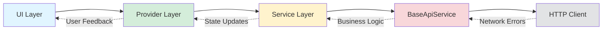

# Eidolon Engine Incremental Game Implementation Guide

This guide provides detailed technical information, code examples, and specific configurations for the production-deployed Incremental Game system. For the shared deployment architecture (stack counts, Lambda inventory, DynamoDB tables), see the canonical overview in [Deployment Guide](deployment.md#system-architecture).

## Table of Contents

1. [Database Implementation](#1-database-implementation)
2. [Lambda Function Implementation](#2-lambda-function-implementation)
3. [Game Mechanics Implementation](#3-game-mechanics-implementation)
4. [Combat System Details](#4-combat-system-details)
5. [Processing Flow Implementation](#5-processing-flow-implementation)
6. [Client Implementation](#6-client-implementation)
7. [Infrastructure Configuration](#7-infrastructure-configuration)
8. [Error Handling Patterns](#8-error-handling-patterns)
9. [Testing Guidelines](#9-testing-guidelines)
10. [Performance Optimization](#10-performance-optimization)

## 1. Database Implementation

### 1.1 Complete Table Examples

These examples show the complete JSON structure of database records as they appear in DynamoDB. The ActiveSegments record demonstrates how all segment processing results are stored together, including pre-calculated outcomes, client events for display, and character updates to be applied when the segment completes.

#### ActiveSegments Record Example

This complete example shows how segment processing results are stored, including pre-calculated outcomes, client events for progressive display, and character updates that will be applied when the segment completes.

**Important**: ActiveSegmentID must be generated using UUIDv7 to ensure proper time-based ordering and efficient querying. In Python 3.12, use the repo's uuid helper (uuid_extension.uuid7); native uuidv7 will be adopted when upgrading to Python 3.14.

```json
{
  "ActiveSegmentID": "550e8400-e29b-41d4-a716-446655440000", // UUIDv7 format required
  "CharacterID": "7d793dc0-5e27-4a68-b40e-8f52ae06ad8e",
  "PlayerID": "a4b5c6d7-e8f9-0a1b-2c3d-4e5f6a7b8c9d",
  "StoryID": "forest-adventure-001",
  "StoryTitle": "The Whispering Woods",
  "SegmentID": "seg-forest-002a",
  "SegmentType": "mechanical",
  "SegmentTitle": "Walking through the dark forest",
  "StartTime": 1737000300,
  "EndTime": 1737003900,
  "ProcessedAt": 1737000305,
  "ProcessingStatus": "processed",
  "NextSegmentID": "seg-forest-003",
  "Outcome": "minimal",
  "ClientEvents": [
    {
      "Title": "Into the Woods",
      "Description": "The morning mist clings to the forest floor..."
    },
    {
      "Title": "Perception Challenge",
      "Description": "You scan the forest for hidden dangers..."
    }
  ],
  "CharacterUpdates": {
    "Wounds": [
      {
        "DamageType": "bashing",
        "HealAt": "2025-01-15T14:30:00Z"
      }
    ],
    "SkillXP": {
      "perception": 0.375,
      "survival": 0.75
    },
    "AttributeXP": {
      "agility": 0.0375,
      "strength": 0.075
    }
  },
  "ChallengeResults": [
    { "Skill": "perception", "Success": true, "Sigma": 0.82 },
    { "Skill": "perception", "Success": false, "Sigma": -0.45 }
  ]
}
```

#### Mechanical Segment Definition Example

Mechanical segments can contain both skill challenges and combat encounters. This structure shows how mechanical segments support both types of challenges, with combat configuration linking to the Opponents table and specifying different narrative results based on performance.

```json
{
  "StoryID": "forest-adventure-001",
  "SegmentID": "seg-combat-goblin-001",
  "SegmentType": "mechanical",
  "SegmentActivity": "Fighting the goblin scout",
  "SegmentTitle": "Engaged in combat",
  "SegmentDuration": 120,
  "NextSegmentID": "seg-forest-004",
  "Combat": {
    "OpponentID": "a7b8c9d0-1e2f-3a4b-5c6d-7e8f9a0b1c2d",
    "MaxRounds": 15,
    "Environment": {
      "lighting": "dim",
      "terrain": "muddy"
    }
  },
  "Results": {
    "Death": {
      "Narrative": "The goblin's blade finds your heart...",
      "Effects": { "Room": 0 }
    },
    "Failure": {
      "Narrative": "Exhausted, you retreat from battle...",
      "Effects": { "Room": 5 }
    },
    "Minimal": {
      "Narrative": "You defeat the goblin but suffer grievous wounds...",
      "Effects": { "Room": 7, "Items": ["goblin-pouch-001"] }
    },
    "Normal": {
      "Narrative": "Your combat training prevails...",
      "Effects": { "Room": 7, "Items": ["goblin-pouch-001", "rusty-blade-001"] }
    },
    "Exceptional": {
      "Narrative": "You dispatch the goblin without a scratch!",
      "Effects": {
        "Room": 7,
        "Items": ["goblin-pouch-001", "rusty-blade-001", "goblin-ear-001"]
      }
    }
  }
}
```

### 1.2 Index Specifications

DynamoDB Global Secondary Indexes (GSIs) enable efficient queries on non-primary key attributes. These indexes are critical for the polling system to find expired segments and for ensuring character name uniqueness across all players.

#### Global Secondary Indexes

These index definitions enable efficient queries for finding segments by character, discovering expired segments for processing, and enforcing character name uniqueness across the entire player base.

```yaml
CharacterID-index:
  PartitionKey: CharacterID
  ProjectionType: ALL
  Purpose: Query all active segments for a character

EndTimeIndex:
  PartitionKey: EndTime
  ProjectionType: ALL
  Purpose: Find segments ready for processing
  QueryPattern: EndTime <= currentTime + 15

CharacterNameIndex:
  PartitionKey: CharacterName
  ProjectionType: KEYS_ONLY
  Purpose: Ensure character name uniqueness
```

### 1.3 DynamoDB Update Examples

The story start process uses sequential operations with eventual consistency. If a failure occurs after creating the active segment but before updating the character, the ops-segment-poller will detect and clean up orphaned segments.

#### Story Start Process

The story start creates the active segment first, then updates the character state. Any orphaned segments from failures are handled by the background poller, avoiding complex rollback logic.

```python
from uuid_extension import uuid7  # Repo-provided helper for UUIDv7 IDs

def start_story(character_id, story_id, segment_data):
    # Generate UUIDv7 for the active segment
    segment_data['ActiveSegmentID'] = str(uuid7())

    # 1. Create active segment first
    dynamodb.put_item(
        TableName=ACTIVE_SEGMENTS_TABLE,
        Item=segment_data,
        ConditionExpression='attribute_not_exists(ActiveSegmentID)'
    )

    # 2. Update character state
    # If this fails, ops-segment-poller will clean up the orphaned segment
    dynamodb.update_item(
        TableName=CHARACTER_TABLE,
        Key={'CharacterID': {'S': character_id}},
        UpdateExpression='SET GameMode = :mode, ActiveStoryID = :story, ActiveSegmentID = :segment',
        ExpressionAttributeValues={
            ':mode': {'S': 'Incremental'},
            ':story': {'S': story_id},
            ':segment': {'S': segment_data['ActiveSegmentID']}
        },
        ConditionExpression='GameMode = :none OR (GameMode = :incremental AND attribute_not_exists(ActiveStoryID))',
        ExpressionAttributeValues={
            ':none': {'S': 'None'},
            ':incremental': {'S': 'Incremental'}
        }
    )

    # 3. Queue mechanical segments (send only ActiveSegmentID)
    if segment_data['SegmentType'] == 'mechanical':
        sqs.send_message(
            QueueUrl=SEGMENT_QUEUE_URL,
            MessageBody=segment_data['ActiveSegmentID']  # Plain string, not JSON
        )
```

## 2. Lambda Function Implementation

### 2.1 Lambda Handler Pattern

All 16 Lambda functions follow this standardized pattern with shared execution role and environment variables. Functions are deployed with fixed logical IDs to prevent recreation and are updated from S3 artifacts post-deployment.

```python
import json
import logging
from decimal import Decimal
from eidolon.logger import logger  # Uses validated LOG_LEVEL from environment
from eidolon.responses import create_response, not_found_response
from eidolon.environment import *  # Table names and configuration

def lambda_handler(event, context):
    """Standard Lambda handler pattern for all functions."""

    # Handle OPTIONS preflight
    if event.get('httpMethod') == 'OPTIONS':
        return create_response(200, {})

    try:
        # Extract player ID from authorizer
        player_id = event['requestContext']['authorizer']['claims']['sub']

        # Parse request body if POST
        body = {}
        if event.get('body'):
            body = json.loads(event['body'])

        # Extract query parameters if GET
        character_id = None
        if event.get('queryStringParameters'):
            character_id = event['queryStringParameters'].get('characterId')

        # Call business logic
        result = process_story_request(
            player_id=player_id,
            character_id=character_id or body.get('CharacterID'),
            story_id=body.get('StoryID')
        )

        # Return response
        logger.info("Request completed")

        return create_response(
            result['StatusCode'],
            result['Body']
        )

    except Exception as e:
        logger.error("Lambda error", exc_info=True)
        return create_response(500, {"Error": "Internal server error"})
```

### 2.2 Common Validation Patterns

These validation functions ensure data integrity and proper authorization throughout the system. They provide reusable patterns for UUID validation, character ownership verification, and game mode checking that prevent common security issues and data corruption.

```python
def validate_uuid(value, field_name):
    """Validate UUID format."""
    import re
    uuid_pattern = re.compile(
        r'^[0-9a-f]{8}-[0-9a-f]{4}-[0-9a-f]{4}-[0-9a-f]{4}-[0-9a-f]{12}$',
        re.IGNORECASE
    )
    if not uuid_pattern.match(value):
        raise ValueError(f"Invalid {field_name} format")

def check_game_mode(character, required_mode="None"):
    """Verify character is in correct game mode."""
    current_mode = character.get('GameMode', 'None')
    if current_mode != required_mode:
        return create_response(409, {
            "Error": f"Character is in {current_mode} mode, must be in {required_mode} mode"
        })
    return None
```

### 2.3 Segment Processing Implementation

This function handles the core segment processing logic for mechanical segments. It includes safeguards against duplicate processing, proper status tracking, and comprehensive error handling to ensure segments are processed exactly once with reliable outcome storage.

```python
def process_segment(active_segment_id):
    """Process a mechanical segment (which may contain skill challenges and/or combat)."""
    segment = get_active_segment(active_segment_id)
    if not segment:
        logger.error(f"Segment not found: {active_segment_id}")
        return {"Success": False, "Error": "Segment not found"}

    # Skip if already processed
    if segment.get('ProcessingStatus') == 'processed':
        logger.info(f"Segment already processed: {active_segment_id}")
        return {"Success": True, "Skipped": True}

    # Mark as processing
    update_processing_status(active_segment_id, 'processing')

    try:
        if segment['SegmentType'] == 'mechanical':
            result = process_mechanical_segment(segment)
        else:
            raise ValueError(f"Unknown segment type: {segment['SegmentType']}")

        # Store results
        update_segment_results(active_segment_id, result)
        update_processing_status(active_segment_id, 'processed')

        return {"Success": True, "Result": result}

    except Exception as e:
        logger.error(f"Segment processing failed", exc_info=True)
        update_processing_status(active_segment_id, 'failed', str(e))
        return {"Success": False, "Error": str(e)}
```

### 2.4 Mechanical Segment Processing

The `process_mechanical_segment` function handles both skill challenges and combat encounters within a single segment. This unified approach allows for more dynamic storytelling where challenges and combat can be interwoven based on player performance.

```python
def process_mechanical_segment(segment):
    """Process a mechanical segment containing skill challenges and/or combat."""
    segment_definition = get_segment_definition(
        segment['StoryID'],
        segment['SegmentID']
    )

    character = get_character(segment['CharacterID'])

    # Initialize results
    client_events = []
    character_updates = {
        'SkillXP': {},
        'AttributeXP': {},
        'Wounds': []
    }
    challenge_results = []

    # Process skill challenges if present
    if 'Challenges' in segment_definition:
        for challenge in segment_definition['Challenges']:
            result = resolve_skill_challenge(character, challenge)
            challenge_results.extend(result['results'])

            # Accumulate XP
            for skill, xp in result['totalSkillXP'].items():
                character_updates['SkillXP'][skill] = character_updates['SkillXP'].get(skill, 0) + xp
            for attr, xp in result['totalAttributeXP'].items():
                character_updates['AttributeXP'][attr] = character_updates['AttributeXP'].get(attr, 0) + xp

            # Create client event
            for r in result['results']:
                client_events.append({
                    'Title': challenge.get('Title', f"{skill.title()} Challenge"),
                    'Description': challenge.get('Description', '')
                })

    # Process combat if present
    if 'Combat' in segment_definition:
        combat_result = simulate_combat(character, segment_definition['Combat'])

        # Add combat events
        client_events.extend(combat_result['events'])

        # Add wounds from combat
        character_updates['Wounds'].extend(combat_result['wounds'])

        # Include combat results in outcome calculation
        challenge_results.extend(combat_result['challenge_results'])

    # Determine overall outcome based on all challenges
    outcome = calculate_mechanical_outcome(challenge_results)

    # Apply narrative and effects from outcome
    outcome_def = segment_definition['Results'][outcome]

    # Add narrative event
    client_events.insert(0, {
        'Title': segment_definition.get('Title', 'Story Progress'),
        'Description': outcome_def['Narrative']
    })

    # Apply outcome effects
    if 'Room' in outcome_def.get('Effects', {}):
        character_updates['Room'] = outcome_def['Effects']['Room']

    return {
        'Outcome': outcome,
        'ClientEvents': client_events,
        'CharacterUpdates': character_updates,
        'ChallengeResults': challenge_results,
        'NextSegmentID': segment_definition.get('NextSegmentID')
    }
```

# Eidolon Engine Incremental Game Implementation Guide

This guide provides detailed technical information, code examples, and specific configurations for the production-deployed Incremental Game system. For the shared deployment architecture (stack counts, Lambda inventory, DynamoDB tables), see the canonical overview in [Deployment Guide](deployment.md#system-architecture).

## Table of Contents

1. [Database Implementation](#1-database-implementation)
2. [Lambda Function Implementation](#2-lambda-function-implementation)
3. [Client Architecture](#3-client-architecture)
4. [State Management](#4-state-management)
5. [API Service Layer](#5-api-service-layer)
6. [Polling System](#6-polling-system)
7. [UI Architecture](#7-ui-architecture)
8. [Error Handling](#8-error-handling)
9. [Testing Guidelines](#9-testing-guidelines)
10. [Performance Optimization](#10-performance-optimization)

## 3. Client Architecture

### 3.1 Service Layer Architecture

The client follows a layered service architecture with clear separation of concerns:

#### Core Services

**ApiService** - Primary API client extending BaseApiService:

- Handles all HTTP communication with retry logic and authentication
- Provides typed methods for each API endpoint
- Includes response parsing and validation
- Uses rate limiting for API calls

**StoryPollingService** - Server-authoritative polling system:

- Stream-based event system for real-time updates
- Handles segment completion detection and story state changes
- Implements exponential backoff for error recovery
- Follows server timing exactly (no client-side predictions)

**AuthService** - Authentication management:

- JWT token management and refresh
- Cognito integration for user authentication
- Secure token storage and validation

**Supporting Services:**

- **NotificationService**: User notifications and feedback
- **RateLimiter**: API call rate limiting and throttling
- **CacheService**: Response caching and offline support

### 3.2 Model Layer

#### Character Model

The Character model represents server-side progression with client-side display logic:

```dart
class Character {
  final String id;
  final String name;
  final String archetypeId;
  final String archetypeName;
  final double health;
  final double maxHealth;
  final double essence;
  final double maxEssence;
  final Map<String, double> attributes;    // Server-calculated values
  final Map<String, double> skills;        // Server-calculated values
  final Map<String, int> resources;        // Integer resources (gold, supplies)
  final Map<String, String> inventory;     // Slot -> ItemID mapping
  final Map<String, dynamic> inventoryDetails; // Enriched item data
  final Map<String, dynamic> progress;     // Story progress flags
  Map<String, dynamic>? storyState;        // Current story position
  final String? activeStoryID;             // Server-provided story ID
  final String? activeSegmentID;           // Server-provided segment ID
  final String gameMode;                   // "MUD" or "Incremental"
  final DateTime lastUpdated;
  final List<String> availableStories;
  final List<String> abandonedStories;
  final List<String> completedStories;
  final List<Map<String, dynamic>>? availableStoriesDetails;

  // Display-only calculations
  int getEffectiveScore(String skill, String attribute) {
    final skillValue = skills[skill] ?? 0.0;
    final attributeValue = attributes[attribute] ?? 0.0;
    return (skillValue + attributeValue).floor();
  }
}
```

**Key Design Principles:**

- All progression calculations happen server-side
- Client models are display-only with safe parsing
- Story state includes both active story and segment data
- Server provides `activeStoryID` and `activeSegmentID` directly

#### ActiveSegment Model

Represents the current segment state with timing and narrative data:

```dart
class ActiveSegment {
  final String id;
  final String segmentId;
  final String segmentType;        // "mechanical", "decision"
  final String status;             // "active", "completed"
  final DateTime startTime;
  final DateTime endTime;
  final Map<String, dynamic> data; // Segment-specific data
  final bool isExpired;            // Client-side expiration check

  bool get isExpired => DateTime.now().isAfter(endTime);
}
```

### 3.3 Provider Pattern State Management

The client uses the Provider pattern for reactive state management with SharedPreferences persistence:

#### CharacterProvider

Manages character state with automatic persistence and error recovery:

```dart
class CharacterProvider extends BaseProvider {
  Character? _character;
  ActiveSegment? _activeSegment;

  // Persistence with error recovery
  Future<void> updateCharacter(Character newCharacter) async {
    await executeAsyncVoid(() async {
      // Persist to storage FIRST
      await _prefs.setString(_characterKey, jsonEncode(newCharacter.toJson()));

      // Update in-memory state after successful persistence
      _character = newCharacter;
    });
  }

  // Automatic data recovery on startup
  Future<void> _loadFromStorage() async {
    try {
      final characterJson = _prefs.getString(_characterKey);
      if (characterJson != null) {
        _character = Character.fromJson(jsonDecode(characterJson));
      }
    } catch (characterError) {
      // Clear corrupted data and continue
      await _prefs.remove(_characterKey);
      _character = null;
    }
    notifyListeners();
  }
}
```

**Provider Architecture Benefits:**

- Reactive UI updates through ChangeNotifier
- Automatic persistence with corruption recovery
- Async operation handling with loading states
- Centralized state validation and business logic

## 4. State Management

The Incremental client implements a sophisticated Provider-based state management architecture built on Flutter's ChangeNotifier pattern. This system provides reactive UI updates, persistent storage, error handling, and proper resource disposal across all application state.

### 4.1 Provider Architecture Overview

The app uses a hierarchical Provider structure with dependency injection, where each provider extends `BaseProvider` for consistent behavior:

```dart
void main() {
  runApp(
    MultiProvider(
      providers: [
        ChangeNotifierProvider(create: (_) => AuthProvider()),
        ChangeNotifierProvider(create: (_) => ThemeProvider()),
        ChangeNotifierProxyProvider<AuthProvider, CharacterProvider>(
          create: (context) => CharacterProvider(prefs: prefs),
          update: (context, auth, previous) => previous ?? CharacterProvider(prefs: prefs),
        ),
        ChangeNotifierProxyProvider<AuthProvider, SegmentProvider>(
          create: (context) => SegmentProvider(),
          update: (context, auth, previous) => previous ?? SegmentProvider(),
        ),
      ],
      child: const MyApp(),
    ),
  );
}
```

### 4.2 BaseProvider Foundation

All providers extend `BaseProvider`, which provides common functionality for async operations, loading states, error handling, and disposal safety:

```dart
abstract class BaseProvider extends ChangeNotifier {
  bool _isLoading = false;
  String? _error;
  bool _disposed = false;

  bool get isLoading => _isLoading;
  String? get error => _error;

  @protected
  Future<T> executeAsync<T>(Future<T> Function() operation) async {
    if (_disposed) return Future.error('Provider disposed');

    _setLoading(true);
    _setError(null);

    try {
      final result = await operation();
      _setLoading(false);
      return result;
    } catch (e) {
      _setError(e.toString());
      _setLoading(false);
      rethrow;
    }
  }

  void _setLoading(bool loading) {
    _isLoading = loading;
    if (!_disposed) notifyListeners();
  }

  void _setError(String? error) {
    _error = error;
    if (!_disposed) notifyListeners();
  }

  @override
  void dispose() {
    _disposed = true;
    super.dispose();
  }
}
```

**Key Features:**

- **Async Operation Safety**: `executeAsync` wraps operations with loading/error state management
- **Disposal Safety**: Prevents state updates after disposal to avoid memory leaks
- **Error Propagation**: Captures and exposes errors for UI display
- **Loading States**: Provides reactive loading indicators

### 4.3 AuthProvider - Authentication State Management

`AuthProvider` manages Cognito-based authentication with status tracking and automatic initialization:

```dart
enum AuthStatus { uninitialized, authenticated, unauthenticated, loading }

class AuthProvider extends BaseProvider {
  AuthStatus _status = AuthStatus.uninitialized;
  User? _user;

  AuthStatus get status => _status;
  User? get user => _user;

  Future<void> _initializeAuth() async {
    await executeAsync(() async {
      try {
        final user = await Amplify.Auth.getCurrentUser();
        _user = user;
        _status = AuthStatus.authenticated;
      } on AuthException {
        _status = AuthStatus.unauthenticated;
      }
    });
  }

  Future<void> signIn(String email, String password) async {
    await executeAsync(() async {
      await Amplify.Auth.signIn(username: email, password: password);
      await _initializeAuth();
    });
  }

  Future<void> signOut() async {
    await executeAsync(() async {
      await Amplify.Auth.signOut();
      _user = null;
      _status = AuthStatus.unauthenticated;
    });
  }
}
```

**Key Features:**

- **Status Tracking**: Four-state authentication status (uninitialized/authenticated/unauthenticated/loading)
- **Automatic Initialization**: Checks auth state on startup
- **Cognito Integration**: Direct Amplify Auth integration
- **Error Handling**: Failed sign-in attempts properly handled

### 4.4 CharacterProvider - Character State with Persistence

`CharacterProvider` manages character data with SharedPreferences persistence and corruption recovery:

```dart
class CharacterProvider extends BaseProvider {
  static const String _characterKey = 'current_character';
  static const String _activeSegmentKey = 'active_segment';
  final SharedPreferences _prefs;

  Character? _character;
  ActiveSegment? _activeSegment;

  Character? get character => _character;
  ActiveSegment? get activeSegment => _activeSegment;

  Future<void> updateCharacter(Character character) async {
    // Persist-first pattern: save to storage before updating state
    await _prefs.setString(_characterKey, jsonEncode(character.toJson()));
    _character = character;
    notifyListeners();
  }

  Future<void> _loadFromStorage() async {
    final characterJson = _prefs.getString(_characterKey);
    if (characterJson != null) {
      try {
        _character = Character.fromJson(jsonDecode(characterJson));
      } catch (e) {
        // Corruption recovery: clear invalid data
        await _prefs.remove(_characterKey);
        _character = null;
      }
    }

    final segmentJson = _prefs.getString(_activeSegmentKey);
    if (segmentJson != null) {
      final segment = ActiveSegment.fromJson(jsonDecode(segmentJson));
      if (segment.isExpired) {
        await _prefs.remove(_activeSegmentKey);
      } else {
        _activeSegment = segment;
      }
    }
  }

  int getEffectiveScore(String skill, String attribute) {
    if (_character == null) return 0;

    final skillValue = _character!.skills[skill] ?? 0;
    final attributeValue = _character!.attributes[attribute] ?? 0;
    final wounds = _character!.wounds.length;

    return skillValue + attributeValue - wounds;
  }
}
```

**Key Features:**

- **Persist-First Pattern**: Saves to SharedPreferences before updating in-memory state
- **Corruption Recovery**: Automatically clears and recovers from invalid stored data
- **Segment Expiration**: Cleans up expired segments on load
- **Effective Score Calculation**: Combines skills, attributes, and wound penalties

### 4.5 SegmentProvider - Active Segment Coordination

`SegmentProvider` manages active segment state and coordinates with the polling system:

```dart
class SegmentProvider extends BaseProvider {
  ActiveSegment? _activeSegment;
  bool _isPolling = false;

  ActiveSegment? get activeSegment => _activeSegment;
  bool get isPolling => _isPolling;

  Future<void> loadCurrentStory(String characterId) async {
    await executeAsync(() async {
      final character = await _apiService.getCharacterById(characterId);
      _activeSegment = character?.activeSegment;
      _isPolling = _activeSegment != null;
    });
  }

  Future<void> completeSegment(String characterId, String decision) async {
    await executeAsync(() async {
      await _apiService.submitDecision(
        characterId: characterId,
        decision: decision,
      );

      // Clear local state immediately
      _activeSegment = null;
      _isPolling = false;
    });
  }
}
```

**Key Features:**

- **Polling Coordination**: Tracks polling state for UI feedback
- **Server State Loading**: Fetches current segment state from server
- **Decision Submission**: Handles user decisions with immediate local state clearing
- **Error Recovery**: Leverages BaseProvider error handling for failed operations

### 4.6 ThemeProvider - Theme Management with Persistence

`ThemeProvider` manages application theming with SharedPreferences persistence and system UI updates:

```dart
class ThemeProvider extends BaseProvider {
  static const String _themeKey = 'theme_mode';
  ThemeMode _themeMode = ThemeMode.system;
  final SharedPreferences _prefs;

  ThemeMode get themeMode => _themeMode;

  Future<void> _initializeTheme() async {
    final stored = _prefs.getString(_themeKey);
    if (stored != null) {
      _themeMode = ThemeMode.values.firstWhere(
        (mode) => mode.name == stored,
        orElse: () => ThemeMode.system,
      );
    }
  }

  Future<void> setThemeMode(ThemeMode mode) async {
    _themeMode = mode;
    await _prefs.setString(_themeKey, mode.name);
    await _updateSystemChrome();
    notifyListeners();
  }

  Future<void> _updateSystemChrome() async {
    final isDark = _themeMode == ThemeMode.dark ||
        (_themeMode == ThemeMode.system &&
         MediaQuery.of(context).platformBrightness == Brightness.dark);

    SystemChrome.setSystemUIOverlayStyle(
      isDark ? SystemUiOverlayStyle.light : SystemUiOverlayStyle.dark,
    );
  }
}
```

**Key Features:**

- **System Integration**: Respects system theme preference when set to system mode
- **Persistence**: Remembers user theme choice across app restarts
- **System UI Updates**: Updates status bar and navigation bar colors
- **Safe Initialization**: Handles invalid stored values gracefully

### 4.7 SharedPreferences Integration Patterns

All providers follow consistent SharedPreferences patterns for data persistence:

```dart
// Pattern 1: Simple value storage
await _prefs.setString(key, value);
final value = _prefs.getString(key);

// Pattern 2: JSON object storage with error handling
Future<void> _saveObject(String key, dynamic object) async {
  try {
    await _prefs.setString(key, jsonEncode(object.toJson()));
  } catch (e) {
    // Handle serialization errors
  }
}

Future<T?> _loadObject<T>(String key, T Function(Map<String, dynamic>) fromJson) async {
  final jsonStr = _prefs.getString(key);
  if (jsonStr == null) return null;

  try {
    final json = jsonDecode(jsonStr);
    return fromJson(json);
  } catch (e) {
    // Corruption recovery
    await _prefs.remove(key);
    return null;
  }
}

// Pattern 3: Expiration-based cleanup
Future<void> _loadWithExpiration(String key, Duration maxAge) async {
  final stored = _prefs.getString(key);
  if (stored == null) return;

  final data = jsonDecode(stored);
  final timestamp = DateTime.parse(data['timestamp']);

  if (DateTime.now().difference(timestamp) > maxAge) {
    await _prefs.remove(key);
  } else {
    // Use the data
  }
}
```

### 4.8 Server-Authoritative Design

**Core Principle:** All state transitions are determined by the server. The client never predicts or modifies story state.

**Client Responsibilities:**

- Display current server state
- Send user decisions to server
- Poll for server-determined state changes
- Handle server-provided timing exactly

**Server Responsibilities:**

- Determine all segment outcomes and timing
- Calculate XP and character updates
- Provide exact timing for client polling
- Maintain authoritative game state

**Provider Integration:**

The Provider system integrates seamlessly with server-authoritative design:

```dart
// CharacterProvider - displays server state
class CharacterProvider extends BaseProvider {
  // Server state is loaded and displayed, never modified locally
  Future<void> refreshCharacter(String characterId) async {
    await executeAsync(() async {
      final serverCharacter = await _apiService.getCharacterById(characterId);
      // Update local state to match server
      _character = serverCharacter;
    });
  }
}

// SegmentProvider - coordinates with polling
class SegmentProvider extends BaseProvider {
  // Polling system provides server-determined updates
  void onPollingUpdate(Character updatedCharacter) {
    _activeSegment = updatedCharacter.activeSegment;
    notifyListeners();
  }
}
```

This Provider-based architecture ensures reactive UI updates, persistent state management, proper error handling, and seamless integration with the server-authoritative design pattern.

## 5. Service Layer Architecture

The Incremental client implements a comprehensive service layer that handles authentication, API communication, caching, notifications, rate limiting, and polling. This layered architecture ensures clean separation of concerns, consistent error handling, and optimal performance.

### 5.1 BaseApiService - HTTP Foundation

`BaseApiService` provides the foundation for all HTTP communication with consistent authentication, error handling, and request/response processing:

```dart
abstract class BaseApiService {
  final AuthService _authService;
  final http.Client _httpClient;
  final String baseUrl;

  BaseApiService({
    required AuthService authService,
    required this.baseUrl,
    http.Client? httpClient,
  }) : _authService = authService,
       _httpClient = httpClient ?? http.Client();

  Future<Map<String, String>> getHeaders() async {
    final token = await _authService.getIdToken();
    if (token == null) {
      throw Exception('Not authenticated');
    }
    return {
      'Content-Type': 'application/json',
      'Authorization': 'Bearer $token',
    };
  }

  Future<T> executeRequest<T>({
    required String method,
    required String endpoint,
    Map<String, dynamic>? body,
    Map<String, String>? queryParams,
    T Function(Map<String, dynamic>)? parser,
    bool returnRawResponse = false,
  }) async {
    // Comprehensive request execution with error handling
  }

  // Helper methods for GET, POST, PUT, DELETE, PATCH
  Future<T> get<T>(String endpoint, {Map<String, String>? queryParams, T Function(Map<String, dynamic>)? parser});
  Future<T> post<T>(String endpoint, {Map<String, dynamic>? body, Map<String, String>? queryParams, T Function(Map<String, dynamic>)? parser});
  // ... other HTTP methods
}
```

**Key Features:**

- **Authentication Integration**: Automatic JWT token retrieval and header injection
- **Error Handling**: Typed exceptions (ApiException, NotFoundException, UnauthorizedException)
- **Request Logging**: Debug logging for development troubleshooting
- **Response Parsing**: Flexible parsing with optional custom parsers
- **HTTP Method Support**: Complete REST API support (GET, POST, PUT, DELETE, PATCH)

### 5.2 AuthService - Cognito Authentication

`AuthService` manages AWS Cognito authentication with secure token storage and session management:

```dart
class AuthService {
  late final CognitoUserPool userPool;
  CognitoUser? _currentUser;
  CognitoUserSession? _session;
  final FlutterSecureStorage _secureStorage = const FlutterSecureStorage();

  static const String _accessTokenKey = 'access_token';
  static const String _idTokenKey = 'id_token';
  static const String _refreshTokenKey = 'refresh_token';
  static const String _userEmailKey = 'user_email';

  Future<void> initialize() async {
    // Cognito configuration validation and setup
  }

  Future<CognitoUser> signIn(String email, String password) async {
    // Authentication with fallback auth flows
  }

  Future<String?> getIdToken() async {
    // Token retrieval with automatic refresh
  }

  Future<void> signOut() async {
    // Secure sign-out with token cleanup
  }
}
```

**Key Features:**

- **Cognito Integration**: Full AWS Cognito User Pool support with SRP and USER_PASSWORD_AUTH fallback
- **Secure Storage**: FlutterSecureStorage for encrypted token persistence
- **Session Management**: Automatic token refresh and session validation
- **Error Mapping**: User-friendly error messages for Cognito exceptions
- **Configuration Validation**: Environment variable validation with development fallbacks

**Authentication Flow:**

1. **Sign Up**: Email verification with resend capability
2. **Sign In**: Multi-flow authentication (SRP → fallback to password auth)
3. **Session Persistence**: Automatic token storage and restoration
4. **Token Refresh**: Background session renewal
5. **Sign Out**: Global sign-out with secure cleanup

### 5.3 ApiService - Game-Specific API Methods

`ApiService` extends `BaseApiService` to provide game-specific API operations:

```dart
class ApiService extends BaseApiService {
  // Character Management
  Future<Map<String, dynamic>> addCharacter({
    required String name,
    required String archetype,
  }) async {
    return post<Map<String, dynamic>>(
      '/character',
      body: {'CharacterName': name, 'ArchetypeName': archetype},
    );
  }

  Future<Character?> getCharacterById(String characterId) async {
    try {
      final json = await get<Map<String, dynamic>>(
        '/character',
        queryParams: {'CharacterID': characterId},
      );

      final characterData = json['Character'] as Map<String, dynamic>;
      // Story state enrichment from server response
      final activeStory = json['ActiveStory'] as Map<String, dynamic>?;
      final activeSegment = json['ActiveSegment'] as Map<String, dynamic>?;

      if (activeStory != null && activeSegment != null) {
        characterData['StoryState'] = {
          'Story': activeStory,
          'ActiveSegment': activeSegment,
        };
      }

      return Character.fromJson(characterData);
    } catch (e) {
      if (e is NotFoundException) return null;
      rethrow;
    }
  }

  // Story Operations
  Future<Map<String, dynamic>> startStory({
    required String characterId,
    required String storyId,
  }) async {
    return post<Map<String, dynamic>>(
      '/story/start',
      body: {'CharacterID': characterId, 'StoryID': storyId},
    );
  }

  Future<Map<String, dynamic>> submitDecision({
    required String characterId,
    required String decision,
  }) async {
    return post<Map<String, dynamic>>(
      '/segment/decision',
      body: {'CharacterID': characterId, 'Decision': decision},
    );
  }
}
```

**Key Features:**

- **Typed API Methods**: Strongly-typed methods for all game operations
- **Error Translation**: HTTP status codes mapped to user-friendly exceptions
- **Response Enrichment**: Automatic story state assembly from server responses
- **Validation Integration**: Input validation and response parsing
- **Comprehensive Coverage**: Character CRUD, story operations, segment management

### 5.4 CacheService - Local Data Caching

`CacheService` provides intelligent local caching with TTL and memory management:

```dart
class CacheService {
  static const Duration _defaultTTL = Duration(minutes: 5);
  static const Duration _defaultCleanupThreshold = Duration(hours: 24);

  late SharedPreferences _prefs;
  final Map<String, dynamic> _memoryCache = {};
  final Map<String, DateTime> _memoryCacheTimestamps = {};
  Duration _cleanupThreshold = _defaultCleanupThreshold;

  Future<void> initialize() async {
    _prefs = await SharedPreferences.getInstance();
    await _cleanExpiredCache();
  }

  Future<void> set(String key, dynamic value, {Duration ttl = _defaultTTL}) async {
    // Dual-layer caching: memory + persistent storage
    _memoryCache[key] = value;
    _memoryCacheTimestamps[key] = DateTime.now();

    final jsonString = jsonEncode(value);
    await _prefs.setString('cache_$key', jsonString);
    await _prefs.setString('cache_ts_$key', DateTime.now().toIso8601String());

    // Auto-expiry with Timer
    if (ttl != Duration.zero) {
      Timer(ttl, () => remove(key));
    }
  }

  T? get<T>(String key, {Duration? maxAge}) {
    // Memory cache first, then persistent cache
    if (_memoryCache.containsKey(key)) {
      final timestamp = _memoryCacheTimestamps[key];
      if (timestamp != null && _isValid(timestamp, maxAge)) {
        return _memoryCache[key] as T?;
      }
    }

    // Check persistent cache with validation
    final jsonString = _prefs.getString('cache_$key');
    final timestampString = _prefs.getString('cache_ts_$key');

    if (jsonString != null && timestampString != null) {
      final timestamp = DateTime.parse(timestampString);
      if (_isValid(timestamp, maxAge)) {
        final value = jsonDecode(jsonString);
        _memoryCache[key] = value;
        _memoryCacheTimestamps[key] = timestamp;
        return value as T?;
      }
    }

    return null;
  }

  Future<void> _cleanExpiredCache() async {
    // Periodic cleanup to prevent memory leaks
    final cutoff = DateTime.now().subtract(_cleanupThreshold);
    final keys = _prefs.getKeys();

    for (final key in keys) {
      if (key.startsWith('cache_ts_')) {
        final timestampString = _prefs.getString(key);
        if (timestampString != null) {
          final timestamp = DateTime.parse(timestampString);
          if (timestamp.isBefore(cutoff)) {
            final cacheKey = key.replaceFirst('cache_ts_', '');
            await remove(cacheKey);
          }
        }
      }
    }
  }
}
```

**Key Features:**

- **Dual-Layer Caching**: Fast memory cache with persistent SharedPreferences fallback
- **TTL Support**: Configurable time-to-live with automatic expiration
- **Memory Management**: Periodic cleanup to prevent memory leaks
- **Type Safety**: Generic methods with compile-time type checking
- **Async Operations**: Non-blocking cache operations

**Caching Patterns:**

```dart
// Simple caching
await _cache.set('user_profile', profileData, ttl: Duration(hours: 1));

// Cached async operations
class CachedData<T> {
  Future<T> get({bool forceRefresh = false}) async {
    if (!forceRefresh) {
      final cached = _cache.get<T>(key, maxAge: ttl);
      if (cached != null) return cached;
    }
    final data = await fetcher();
    await _cache.set(key, data, ttl: ttl);
    return data;
  }
}
```

### 5.5 NotificationService - In-App Notifications

`NotificationService` provides animated, contextual in-app notifications:

```dart
class NotificationService {
  static void showSegmentComplete({
    required BuildContext context,
    required String segmentType,
    String? outcome,
  }) {
    final message = _getCompletionMessage(segmentType, outcome);
    final icon = _getCompletionIcon(segmentType, outcome);
    final color = _getCompletionColor(segmentType, outcome);

    showCustomNotification(
      context,
      message: message,
      icon: icon,
      color: color,
      duration: const Duration(seconds: 3),
    );
  }

  static void showCustomNotification(
    BuildContext context, {
    required String message,
    String? subtitle,
    IconData? icon,
    Color? color,
    Duration duration = const Duration(seconds: 3),
  }) {
    final overlay = Overlay.of(context);

    late OverlayEntry overlayEntry;
    overlayEntry = OverlayEntry(
      builder: (context) => _NotificationOverlay(
        message: message,
        subtitle: subtitle,
        icon: icon ?? Icons.info,
        color: color ?? Theme.of(context).colorScheme.primary,
        duration: duration,
        onDismiss: () => overlayEntry.remove(),
      ),
    );

    overlay.insert(overlayEntry);
  }
}

class _NotificationOverlay extends StatefulWidget {
  // Animated notification overlay with auto-dismiss
  @override
  Widget build(BuildContext context) {
    return Positioned(
      top: MediaQuery.of(context).padding.top + 16,
      left: 16,
      right: 16,
      child: SlideTransition(
        position: _slideAnimation,
        child: FadeTransition(
          opacity: _fadeAnimation,
          child: Container(
            // Gradient background with animations
            decoration: BoxDecoration(
              gradient: LinearGradient(
                begin: Alignment.topLeft,
                end: Alignment.bottomRight,
                colors: [
                  Theme.of(context).colorScheme.surface,
                  Theme.of(context).colorScheme.surface.withValues(alpha: 0.95),
                ],
              ),
              borderRadius: BorderRadius.circular(12),
              border: Border.all(
                color: widget.color.withValues(alpha: 0.3),
                width: 2,
              ),
            ),
            child: // Notification content with animations
          ).animate()
            .shimmer(delay: 500.ms, duration: 1000.ms),
        ),
      ),
    );
  }
}
```

**Key Features:**

- **Contextual Notifications**: Different styles for segment completion, rewards, errors
- **Smooth Animations**: Slide-in, fade, scale, and shimmer effects using flutter_animate
- **Auto-Dismiss**: Configurable duration with manual dismiss option
- **Theme Integration**: Respects app theme colors and typography
- **Accessibility**: Proper semantic labeling and keyboard navigation

**Notification Types:**

- **Segment Complete**: Shows segment type, outcome, and appropriate icon/color
- **Story Complete**: Displays story title and final outcome
- **Rewards**: Animated XP, gold, item notifications
- **Errors**: User-friendly error messages with retry options

### 5.6 RateLimiter - API Call Rate Limiting

`RateLimiter` prevents excessive API calls with intelligent queuing and backoff:

```dart
class RateLimiter {
  static const Duration humanDrivenInterval = Duration(seconds: 15);
  static const Duration automatedInterval = Duration(seconds: 60);

  final Map<String, DateTime> _lastCallTimes = {};
  final Map<String, Timer?> _pendingTimers = {};
  final Map<String, Completer<void>?> _pendingCompleters = {};

  Future<T> executeHumanDriven<T>(
    String key,
    Future<T> Function() action, {
    bool throwOnRateLimit = false,
  }) async {
    final lastCall = _lastCallTimes[key];
    final now = DateTime.now();

    if (lastCall != null) {
      final elapsed = now.difference(lastCall);
      final remaining = humanDrivenInterval - elapsed;

      if (remaining > Duration.zero) {
        if (throwOnRateLimit) {
          throw RateLimitException(
            'Please wait ${remaining.inSeconds} seconds before trying again',
            remaining: remaining,
          );
        }

        // Queue the action to run when rate limit expires
        return _queueAction(key, action, remaining);
      }
    }

    _lastCallTimes[key] = now;
    return await action();
  }

  Future<T> executeAutomated<T>(
    String key,
    Future<T> Function() action,
  ) async {
    // Similar logic but with automated interval and always queues
  }

  Future<T> _queueAction<T>(
    String key,
    Future<T> Function() action,
    Duration delay,
  ) async {
    // Cancel existing queued action and create new one
    _pendingTimers[key]?.cancel();
    _pendingCompleters[key]?.completeError(
      RateLimitException('Cancelled by new request', remaining: Duration.zero),
    );

    final completer = Completer<T>();
    _pendingCompleters[key] = completer as Completer<void>;

    _pendingTimers[key] = Timer(delay, () async {
      try {
        _lastCallTimes[key] = DateTime.now();
        final result = await action();
        completer.complete(result);
      } catch (e) {
        completer.completeError(e);
      } finally {
        _pendingTimers.remove(key);
        _pendingCompleters.remove(key);
      }
    });

    return completer.future;
  }
}
```

**Key Features:**

- **Dual Rate Limits**: Separate intervals for human-driven (15s) and automated (60s) actions
- **Intelligent Queuing**: Actions queue instead of failing when rate limited
- **Memory Management**: Automatic cleanup to prevent memory leaks
- **Request Cancellation**: New requests cancel pending queued actions
- **Global Instance**: Singleton for app-wide rate limiting

**Rate Limiting Strategy:**

```dart
class GlobalRateLimiter {
  static const String getCharacter = 'api_get_character';
  static const String startStory = 'api_start_story';
  static const String submitDecision = 'api_submit_decision';
  // ... other API endpoints

  Future<T> executeHumanDriven<T>(String key, Future<T> Function() action) {
    return _limiter.executeHumanDriven(key, action);
  }

  Future<T> executeAutomated<T>(String key, Future<T> Function() action) {
    return _limiter.executeAutomated(key, action);
  }
}
```

### 5.7 StoryPollingService - Server-Authoritative Polling

`StoryPollingService` implements server-authoritative polling with stream-based event delivery:

```dart
enum PollingEventType { characterUpdated, storyCompleted, error }

class PollingEvent {
  final PollingEventType type;
  final dynamic data;
  PollingEvent(this.type, [this.data]);
}

class StoryPollingService {
  final ApiService _apiService;
  final StreamController<PollingEvent> _eventController = StreamController<PollingEvent>.broadcast();
  Timer? _pollTimer;
  bool _isPolling = false;
  String? _currentCharacterId;

  Stream<PollingEvent> get events => _eventController.stream;

  Future<void> startPolling(String characterId) async {
    if (_isPolling && _currentCharacterId == characterId) return;

    stopPolling();
    _currentCharacterId = characterId;
    _isPolling = true;

    await _runPollingLoop(characterId);
  }

  Future<void> _runPollingLoop(String characterId) async {
    int consecutiveErrors = 0;
    const maxConsecutiveErrors = 3;

    // Initial 60-second wait for server processing
    await Future.delayed(const Duration(seconds: 60));

    while (_isPolling) {
      try {
        // Get character state
        final character = await _apiService.getCharacterById(characterId);
        _eventController.add(PollingEvent(PollingEventType.characterUpdated, character));

        // Check for story completion
        if (character?.activeSegmentID == null) {
          _eventController.add(PollingEvent(PollingEventType.storyCompleted));
          break;
        }

        // Get server timing
        final segmentStatus = await _apiService.getSegmentStatus(characterId: characterId);
        final timeRemaining = segmentStatus['TimeRemaining'] as int? ?? 0;

        // Wait server-specified time
        if (timeRemaining > 0) {
          await Future.delayed(Duration(seconds: timeRemaining));
        }
      } catch (e) {
        consecutiveErrors++;

        if (consecutiveErrors >= maxConsecutiveErrors) {
          _eventController.add(PollingEvent(PollingEventType.error,
            'Connection failed after $maxConsecutiveErrors attempts'));
          break;
        }

        // Retry delay
        await Future.delayed(const Duration(seconds: 30));
      }
    }
  }

  void stopPolling() {
    _isPolling = false;
    _pollTimer?.cancel();
  }
}
```

**Key Features:**

- **Server Authority**: Polling cadence determined entirely by server timing
- **Stream-Based Events**: Reactive event delivery for UI updates
- **Error Recovery**: Automatic retry with exponential backoff
- **Resource Management**: Proper cleanup and disposal
- **Completion Detection**: Story completion detected by server state

**Polling Flow:**

1. **Initial Wait**: 60 seconds for server processing
2. **Character Check**: Fetch latest character state
3. **Completion Check**: Detect story completion (activeSegmentID == null)
4. **Timing Wait**: Wait server-specified duration
5. **Repeat**: Continue until story completion or error threshold

### 5.8 Service Integration Patterns

The service layer follows consistent integration patterns across the application:

**Dependency Injection:**

```dart
void main() {
  // Initialize services in dependency order
  final authService = AuthService();
  await authService.initialize();

  final apiService = ApiService(authService: authService);
  final cacheService = CacheService();
  await cacheService.initialize();

  final rateLimiter = GlobalRateLimiter();
  final notificationService = NotificationService();
  final pollingService = StoryPollingService(apiService: apiService);

  // Provide to widget tree
  runApp(
    MultiProvider(
      providers: [
        Provider.value(value: authService),
        Provider.value(value: apiService),
        Provider.value(value: cacheService),
        Provider.value(value: rateLimiter),
        Provider.value(value: notificationService),
        Provider.value(value: pollingService),
      ],
      child: const MyApp(),
    ),
  );
}
```

**Error Handling Chain:**



**Performance Optimizations:**

- **Caching**: Reduces API calls for frequently accessed data
- **Rate Limiting**: Prevents server overload and improves UX
- **Background Processing**: Non-blocking operations with proper error handling
- **Memory Management**: Automatic cleanup and resource disposal
- **Connection Pooling**: HTTP client reuse for efficient connections

This comprehensive service layer ensures reliable, performant, and maintainable communication between the Flutter client and backend services while providing an excellent user experience.

## 6. Polling System

### 6.1 Stream-Based Polling Service

The actual polling implementation uses Dart streams for reactive updates:

```dart
enum PollingEventType { characterUpdated, storyCompleted, error }

class PollingEvent {
  final PollingEventType type;
  final dynamic data;
  PollingEvent(this.type, [this.data]);
}

class StoryPollingService {
  final ApiService _apiService;
  final StreamController<PollingEvent> _eventController = StreamController<PollingEvent>.broadcast();
  Timer? _pollTimer;
  bool _isPolling = false;
  String? _currentCharacterId;

  Stream<PollingEvent> get events => _eventController.stream;

  Future<void> startPolling(String characterId) async {
    if (_isPolling && _currentCharacterId == characterId) return;

    stopPolling();
    _currentCharacterId = characterId;
    _isPolling = true;

    await _runPollingLoop(characterId);
  }

  Future<void> _runPollingLoop(String characterId) async {
    // Initial 60-second wait for server processing
    await Future.delayed(const Duration(seconds: 60));

    while (_isPolling) {
      try {
        // Get character state
        final character = await _apiService.getCharacterById(characterId);
        _eventController.add(PollingEvent(PollingEventType.characterUpdated, character));

        // Check for story completion
        if (character?.activeSegmentID == null) {
          _eventController.add(PollingEvent(PollingEventType.storyCompleted));
          break;
        }

        // Get server timing
        final segmentStatus = await _apiService.getSegmentStatus(characterId: characterId);
        final timeRemaining = segmentStatus['TimeRemaining'] as int? ?? 0;

        // Wait server-specified time
        if (timeRemaining > 0) {
          await Future.delayed(Duration(seconds: timeRemaining));
        }
      } catch (e) {
        // Error handling with retry logic
        if (e.toString().contains('404')) {
          _eventController.add(PollingEvent(PollingEventType.storyCompleted));
          break;
        }
        await Future.delayed(const Duration(seconds: 30)); // Retry delay
      }
    }
  }

  void stopPolling() {
    _isPolling = false;
    _pollTimer?.cancel();
  }
}
```

### 6.2 Game Screen Integration

The GameScreen consumes polling events reactively:

```dart
class _GameScreenState extends State<GameScreen> {
  late StoryPollingService _pollingService;
  StreamSubscription<PollingEvent>? _pollingSubscription;

  @override
  void initState() {
    super.initState();
    _pollingService = StoryPollingService(apiService: _apiService);

    // Reactive event handling
    _pollingSubscription = _pollingService.events.listen((event) {
      switch (event.type) {
        case PollingEventType.characterUpdated:
          final character = event.data as Character;
          setState(() => _character = character);
          break;

        case PollingEventType.storyCompleted:
          _showStoryCompletionDialog();
          break;

        case PollingEventType.error:
          setState(() => _error = event.data as String);
          break;
      }
    });
  }

  Future<void> _handleStorySelect(StoryMetadata story) async {
    // Start story
    await _apiService.startStory(characterId: _character!.id, storyId: story.storyID);

    // Start polling for the new story
    _pollingService.startPolling(_character!.id);
  }
}
```

## 7. Complete UI Architecture

### 7.1 Screen Hierarchy and Navigation

The Incremental client implements a comprehensive screen hierarchy with proper navigation flow and state management:

#### Authentication Flow Screens

**LoginScreen** - Primary authentication entry point:

- Email/password form with validation
- Password visibility toggle
- Forgot password navigation
- Navigation to registration
- Post-login message handling via route arguments
- Automatic navigation to home on successful login

**RegistrationScreen** - Multi-step account creation:

- Two-step process: registration → email verification
- Password strength validation (8+ chars, uppercase, lowercase, number, special char)
- Email verification code input
- Resend verification code functionality
- Automatic navigation to login after verification

**PasswordResetScreen** - Password recovery initiation:

- Email input for reset code request
- Navigation to password reset confirmation
- Back to login navigation

**PasswordResetConfirmScreen** - Password recovery completion:

- Verification code input
- New password creation with strength validation
- Password confirmation matching
- Resend code functionality
- Automatic navigation to login after reset

#### Main Application Screens

**CharacterScreen** - Character management hub:

- Character list display with status indicators
- Character creation dialog with archetype selection
- Character deletion with confirmation dialogs
- Character selection with loading states
- Navigation to game screen with pre-loaded character data
- App bar actions: refresh, settings, sign out
- Floating action button for character creation

**StorySelectionScreen** - Story selection interface:

- Available stories list with metadata display
- Story availability status (available/cooldown)
- Story type chips (one-time, daily, repeatable)
- Estimated duration display
- Cooldown timer formatting
- Story initiation with loading states
- Navigation to game screen after story start

**GameScreen** - Main gameplay interface (detailed in section 6.2):

- Responsive panel-based layout
- Stream-based polling integration
- Device-aware rendering (mobile/tablet/desktop)

**AccountSettingsScreen** - User account management:

- User email display
- Theme selection (light/dark/system)
- Keyboard shortcuts help
- Change password navigation
- Account deletion with double confirmation
- Sign out functionality

### 7.2 Shared Widget Architecture

The client uses a comprehensive shared widget library for consistent UI patterns:

#### Core Shared Widgets

**LoadingDialog** - Standardized loading states:

- Title, message, and subtitle support
- Barrier dismissible control
- Consistent loading UI across screens

**ErrorBoundary** - Error containment and recovery:

- Flutter error catching and display
- User-friendly error messages
- Graceful degradation on errors

**ResponsiveLayout** - Device-aware layout system:

- Device type detection (mobile/tablet/desktop)
- Adaptive widget rendering
- Panel-based responsive design

**KeyboardShortcutHelp** - Accessibility features:

- Keyboard shortcut documentation
- Modal help display
- Consistent shortcut handling

**StateWrapper** - State management utilities:

- Loading state handling
- Error state display
- Retry functionality integration

#### Navigation and Routing

The app implements named route navigation with argument passing:

```dart
// Route definitions
'/': (context) => const CharacterScreen(),
'/login': (context) => const LoginScreen(),
'/register': (context) => const RegistrationScreen(),
'/forgot-password': (context) => const PasswordResetScreen(),
'/password-reset-confirm': (context) => const PasswordResetConfirmScreen(),
'/game': (context) => const GameScreen(),
'/account-settings': (context) => const AccountSettingsScreen(),
'/story-selection': (context) => StorySelectionScreen(character: character),
```

**Navigation Patterns:**

- `pushNamed` for forward navigation
- `pushReplacementNamed` for screen replacement
- `pushNamedAndRemoveUntil` for root navigation after auth
- Route arguments for data passing between screens

### 7.3 Form Validation and User Input

#### Validation Architecture

All forms implement consistent validation patterns:

```dart
class ValidationPatterns {
  static String? validateEmail(String? value) {
    if (value == null || value.isEmpty) {
      return 'Please enter your email';
    }
    if (!RegExp(r'^[\w-\.]+@([\w-]+\.)+[\w-]{2,4}$').hasMatch(value)) {
      return 'Please enter a valid email';
    }
    return null;
  }

  static String? validatePassword(String? value) {
    if (value == null || value.isEmpty) {
      return 'Please enter a password';
    }
    if (value.length < 8) {
      return 'Password must be at least 8 characters';
    }
    // Additional complexity requirements
  }

  static String? validatePasswordConfirmation(String? value, String original) {
    if (value == null || value.isEmpty) {
      return 'Please confirm your password';
    }
    if (value != original) {
      return 'Passwords do not match';
    }
    return null;
  }
}
```

#### Input Field Patterns

Consistent input field implementation across screens:

```dart
TextFormField(
  controller: _controller,
  decoration: InputDecoration(
    labelText: 'Field Label',
    border: const OutlineInputBorder(),
    prefixIcon: const Icon(Icons.icon_name),
    suffixIcon: IconButton(
      icon: Icon(_isVisible ? Icons.visibility_off : Icons.visibility),
      onPressed: () => setState(() => _isVisible = !_isVisible),
    ),
  ),
  obscureText: !_isVisible, // For password fields
  keyboardType: TextInputType.emailAddress, // Context-appropriate
  textInputAction: TextInputAction.next, // Proper action chaining
  validator: ValidationPatterns.validateEmail,
  onFieldSubmitted: (_) => _handleSubmit(), // Keyboard navigation
),
```

### 7.4 Dialog and Modal Patterns

#### Confirmation Dialogs

Standardized confirmation patterns for destructive actions:

```dart
Future<bool> _showConfirmationDialog({
  required String title,
  required String content,
  String confirmText = 'Confirm',
  String cancelText = 'Cancel',
}) async {
  return await showDialog<bool>(
    context: context,
    barrierDismissible: false, // Prevent accidental dismissal
    builder: (context) => AlertDialog(
      title: Text(title),
      content: Text(content),
      actions: [
        TextButton(
          onPressed: () => Navigator.of(context).pop(false),
          child: Text(cancelText),
        ),
        FilledButton(
          onPressed: () => Navigator.of(context).pop(true),
          style: FilledButton.styleFrom(
            backgroundColor: Theme.of(context).colorScheme.error,
          ),
          child: Text(confirmText),
        ),
      ],
    ),
  ) ?? false;
}
```

#### Loading States in Dialogs

Modal loading states for async operations:

```dart
Future<void> _performAsyncOperation() async {
  LoadingDialog.show(
    context: context,
    title: 'Operation Title',
    message: 'Performing operation...',
    barrierDismissible: false,
  );

  try {
    await _asyncOperation();
    LoadingDialog.hide(context);
    // Success handling
  } catch (e) {
    LoadingDialog.hide(context);
    // Error handling
  }
}
```

### 7.5 Theme and Styling Architecture

#### Theme Provider Integration

Dynamic theme switching with persistence:

```dart
class ThemeProvider extends ChangeNotifier {
  ThemeMode _themeMode = ThemeMode.system;

  ThemeMode get themeMode => _themeMode;

  Future<void> setThemeMode(ThemeMode mode) async {
    _themeMode = mode;
    await _prefs.setString('theme_mode', mode.name);
    notifyListeners();
  }
}
```

#### Theme Mode Selector Widget

UI for theme selection in settings:

```dart
class ThemeModeSelector extends StatelessWidget {
  @override
  Widget build(BuildContext context) {
    return Consumer<ThemeProvider>(
      builder: (context, themeProvider, child) {
        return DropdownButton<ThemeMode>(
          value: themeProvider.themeMode,
          items: const [
            DropdownMenuItem(value: ThemeMode.system, child: Text('System')),
            DropdownMenuItem(value: ThemeMode.light, child: Text('Light')),
            DropdownMenuItem(value: ThemeMode.dark, child: Text('Dark')),
          ],
          onChanged: (mode) {
            if (mode != null) {
              themeProvider.setThemeMode(mode);
            }
          },
        );
      },
    );
  }
}
```

### 7.6 Accessibility and Keyboard Navigation

#### Keyboard Shortcuts Implementation

Global keyboard shortcut handling:

```dart
class KeyboardShortcutHandler {
  static Map<LogicalKeySet, Intent> get shortcuts => {
    LogicalKeySet(LogicalKeyboardKey.keyR, LogicalKeyboardKey.control): const RefreshIntent(),
    LogicalKeySet(LogicalKeyboardKey.keyS, LogicalKeyboardKey.control): const SettingsIntent(),
    LogicalKeySet(LogicalKeyboardKey.escape): const BackIntent(),
  };

  static Map<Type, Action<Intent>> get actions => {
    RefreshIntent: CallbackAction(onInvoke: (intent) => _handleRefresh()),
    SettingsIntent: CallbackAction(onInvoke: (intent) => _handleSettings()),
    BackIntent: CallbackAction(onInvoke: (intent) => _handleBack()),
  };
}
```

#### Screen Reader Support

Semantic labeling and accessibility:

```dart
ListTile(
  leading: const Icon(Icons.person),
  title: const Text('Email'),
  subtitle: Text(userEmail ?? 'Not available'),
  semanticLabel: 'User email: ${userEmail ?? "not set"}',
),
```

### 7.7 Error Handling and User Feedback

#### Snackbar Patterns

Consistent error and success messaging:

```dart
class FeedbackMessenger {
  static void showSuccess(BuildContext context, String message) {
    ScaffoldMessenger.of(context).showSnackBar(
      SnackBar(
        content: Text(message),
        backgroundColor: Colors.green,
        behavior: SnackBarBehavior.floating,
      ),
    );
  }

  static void showError(BuildContext context, String message) {
    ScaffoldMessenger.of(context).showSnackBar(
      SnackBar(
        content: Text(message),
        backgroundColor: Theme.of(context).colorScheme.error,
        behavior: SnackBarBehavior.floating,
        action: SnackBarAction(
          label: 'Retry',
          onPressed: () => _handleRetry(),
        ),
      ),
    );
  }
}
```

#### Loading States

Comprehensive loading state management:

```dart
class LoadingStateBuilder extends StatelessWidget {
  final bool isLoading;
  final Widget Function() builder;
  final Widget? loadingWidget;

  @override
  Widget build(BuildContext context) {
    if (isLoading) {
      return loadingWidget ?? const Center(child: CircularProgressIndicator());
    }
    return builder();
  }
}
```

### 7.8 Performance Optimizations

#### List Virtualization

Efficient rendering for large lists:

```dart
ListView.builder(
  itemCount: items.length,
  itemBuilder: (context, index) {
    return CharacterCard(
      key: ValueKey(items[index].id), // Stable keys for performance
      character: items[index],
    );
  },
)
```

#### Image and Asset Optimization

Lazy loading and caching for assets:

```dart
class CachedImage extends StatelessWidget {
  final String url;
  final double? width;
  final double? height;

  @override
  Widget build(BuildContext context) {
    return Image.network(
      url,
      width: width,
      height: height,
      loadingBuilder: (context, child, loadingProgress) {
        if (loadingProgress == null) return child;
        return const CircularProgressIndicator();
      },
      errorBuilder: (context, error, stackTrace) {
        return const Icon(Icons.broken_image);
      },
    );
  }
}
```

This comprehensive UI architecture ensures consistent user experience, proper error handling, accessibility support, and performance optimization across all screens in the Incremental client application.

## 8. Error Handling

### 8.1 Typed Exception Hierarchy

The client uses typed exceptions for different error categories:

```dart
class IncrementalException implements Exception {
  final String message;
  final String? code;
  final dynamic details;

  IncrementalException(this.message, {this.code, this.details});
}

class ApiException extends IncrementalException {
  final int statusCode;

  ApiException(String message, this.statusCode, {String? code, dynamic details})
      : super(message, code: code, details: details);
}

class ValidationException extends IncrementalException {
  ValidationException(String message, {String? field})
      : super(message, code: 'VALIDATION_ERROR', details: {'field': field});
}

class NotFoundException extends ApiException {
  NotFoundException(String resource)
      : super('$resource not found', 404, code: 'NOT_FOUND');
}
```

### 8.2 Error Handler Service

Centralized error handling with user-friendly messages:

```dart
class ErrorHandler {
  static String getUserFriendlyMessage(dynamic error, {BuildContext? context}) {
    if (error is ApiException) {
      switch (error.statusCode) {
        case 401: return 'Please sign in again';
        case 403: return 'You don\'t have permission for this action';
        case 404: return 'The requested item was not found';
        case 409: return 'This action conflicts with the current state';
        case 429: return 'Please wait a moment before trying again';
        default: return 'A server error occurred';
      }
    }

    if (error is ValidationException) {
      return 'Please check your input and try again';
    }

    if (error is NetworkException) {
      return 'Please check your internet connection';
    }

    return 'An unexpected error occurred';
  }
}
```

### 8.3 Retry Logic with Backoff

Automatic retry for transient failures:

```dart
Future<T> retryWithBackoff<T>(
  Future<T> Function() operation, {
  int maxAttempts = 3,
  Duration initialDelay = const Duration(seconds: 1),
}) async {
  for (int attempt = 0; attempt < maxAttempts; attempt++) {
    try {
      return await operation();
    } catch (e) {
      if (attempt == maxAttempts - 1) rethrow;

      final delay = initialDelay * math.pow(2, attempt);
      await Future.delayed(delay);
    }
  }
  throw Exception('Unreachable');
}
```

## 9. Testing Guidelines

**Project Policy:** This project does NOT implement unit tests for backend code. See `documentation/unit-tests.md` for rationale. Flutter client uses built-in widget/integration testing.

### 9.1 Flutter Widget Test Patterns

Flutter provides widget testing for UI components:

```dart
class TestApiService {
  @test
  void testGetCharacterSuccess() {
    final mockClient = MockClient();
    final apiService = ApiService(
      authService: mockAuthService,
      httpClient: mockClient,
    );

    when(mockClient.get(any)).thenAnswer((_) async =>
      http.Response('{"Character": {"CharacterID": "test"}}', 200)
    );

    final character = await apiService.getCharacterById('test');
    expect(character?.id, equals('test'));
  }
}
```

**Note:** Flutter client testing is appropriate because it validates UI behavior, not business logic.

### 9.2 Flutter Integration Test Patterns

Full app integration testing:

```dart
void main() {
  IntegrationTestWidgetsFlutterBinding.ensureInitialized();

  testWidgets('complete story flow', (tester) async {
    await tester.pumpWidget(const MyApp());

    // Navigate to character selection
    await tester.tap(find.text('Select Character'));
    await tester.pumpAndSettle();

    // Select character
    await tester.tap(find.text('TestCharacter'));
    await tester.pumpAndSettle();

    // Start story
    await tester.tap(find.text('Start Story'));
    await tester.pumpAndSettle();

    // Verify polling starts and UI updates
    expect(find.text('Processing...'), findsOneWidget);
  });
}
```

## 10. Performance Optimization

### 10.1 Memory Management

Efficient state management with proper disposal:

```dart
class GameScreen extends StatefulWidget {
  @override
  void dispose() {
    _pollingSubscription?.cancel();
    _pollingService.dispose();
    super.dispose();
  }
}
```

### 10.2 Network Optimization

Rate limiting and caching for API efficiency:

```dart
class GlobalRateLimiter {
  static const getCharacter = 'get_character';
  static const startStory = 'start_story';

  final Map<String, DateTime> _lastCallTimes = {};
  final Map<String, Duration> _minIntervals = {
    getCharacter: const Duration(seconds: 1),
    startStory: const Duration(seconds: 5),
  };

  Future<T> executeAutomated<T>(String operation, Future<T> Function() action) async {
    final now = DateTime.now();
    final lastCall = _lastCallTimes[operation];

    if (lastCall != null) {
      final timeSinceLastCall = now.difference(lastCall);
      final minInterval = _minIntervals[operation] ?? Duration.zero;

      if (timeSinceLastCall < minInterval) {
        await Future.delayed(minInterval - timeSinceLastCall);
      }
    }

    _lastCallTimes[operation] = DateTime.now();
    return action();
  }
}
```

### 10.3 UI Performance

Efficient rendering with proper key usage:

```dart
class StoryPanel extends StatelessWidget {
  final List<Map<String, dynamic>> segmentHistory;

  @override
  Widget build(BuildContext context) {
    return ListView.builder(
      key: const PageStorageKey('story_panel'),
      itemCount: segmentHistory.length,
      itemBuilder: (context, index) {
        final segment = segmentHistory[index];
        return SegmentCard(
          key: ValueKey(segment['ActiveSegmentID']),
          segment: segment,
        );
      },
    );
  }
}
```

## 4. Combat System Details

**Note:** Combat is now handled within mechanical segments, which can contain both skill challenges and combat encounters. The combat system described here is integrated into the mechanical segment processing flow.

### 4.1 Combat Round Processing

Combat simulation executes round-by-round using the MUD's opposed check mechanics. Each round includes attack resolution, damage calculation if successful, and wound application. Environmental factors like dim lighting or difficult terrain apply realistic modifiers to create tactical depth in encounters.

```python
def simulate_combat_round(attacker, defender, round_num, environment):
    """Simulate one round of combat."""
    # Apply environmental modifiers
    attack_modifier = 0
    defense_modifier = 0

    if environment.get('lighting') == 'dim':
        attack_modifier -= 1
    if environment.get('terrain') == 'muddy':
        defense_modifier -= 1

    # Attack roll
    hit_result = ResolveOpposedCheckWithXP(
        attacker, defender,
        "melee", "strength",  # Attacker skills
        "dodge", "agility"    # Defender skills
    )

    round_event = {
        "round": round_num,
        "attackRoll": {
            "attacker": attacker['Name'],
            "sigma": round(hit_result['sigma'], 2),
            "hit": hit_result['success']
        }
    }

    if hit_result['success']:
        # Damage roll - note this uses ResolveOpposedCheck (no XP)
        damage_result = ResolveOpposedCheck(
            attacker, defender,
            "melee", "strength",
            "toughness", "endurance"
        )

        # Calculate wounds
        damage = max(0, int(damage_result['sigma']))
        if damage > 0:
            wounds = []
            weapon_type = attacker.get('WeaponType', 'bashing')

            for _ in range(damage):
                heal_time = calculate_heal_time(weapon_type)
                wounds.append({
                    "DamageType": weapon_type,
                    "HealAt": heal_time
                })

            round_event['damage'] = {
                "amount": damage,
                "type": weapon_type,
                "wounds": wounds
            }

    return round_event

def calculate_heal_time(damage_type):
    """Calculate when a wound will heal."""
    from datetime import datetime, timedelta

    heal_times = {
        'bashing': timedelta(minutes=15),
        'lethal': timedelta(hours=6),
        'aggravated': timedelta(days=7)
    }

    heal_delta = heal_times.get(damage_type, timedelta(hours=6))
    heal_at = datetime.utcnow() + heal_delta
    return heal_at.isoformat() + 'Z'
```

### 4.2 Combat Outcome Determination

The combat outcome function evaluates the final state of battle, considering character health, opponent defeat, and round limits to determine whether the player achieved an exceptional victory, normal success, minimal success, failure, or death.

```python
def determine_combat_outcome(character_wounds, opponent_health, rounds_fought, max_rounds):
    """Determine combat outcome based on final state."""
    # Character death check
    character_health = character['MaxHealth'] - len(character_wounds)
    if character_health <= 0:
        return "death"

    # Victory conditions
    if opponent_health <= 0:
        # Check wounds for victory quality
        wound_count = len(character_wounds)
        if wound_count == 0:
            return "exceptional"
        elif wound_count <= 2:
            return "normal"
        else:
            return "minimal"

    # Timeout failure
    if rounds_fought >= max_rounds:
        return "failure"

    # Should not reach here
    logger.error("Combat ended without clear outcome")
    return "failure"
```

### 4.3 Special Damage Rules

This implementation handles the special damage conversion rules when characters are unconscious, automatically converting bashing damage to lethal and replacing existing bashing wounds with more severe damage types when appropriate.

```python
def apply_unconscious_damage(character, new_damage_type):
    """Handle damage to unconscious characters."""
    wounds = character.get('Wounds', [])

    # Count wound types
    bashing_indices = []
    for i, wound in enumerate(wounds):
        if wound['DamageType'] == 'bashing':
            bashing_indices.append(i)

    # New bashing damage to unconscious converts to lethal
    if new_damage_type == 'bashing':
        new_damage_type = 'lethal'

    # Lethal/aggravated replaces existing bashing first
    if new_damage_type in ['lethal', 'aggravated'] and bashing_indices:
        # Replace oldest bashing wound
        index_to_replace = bashing_indices[0]
        wounds[index_to_replace] = {
            'DamageType': new_damage_type,
            'HealAt': calculate_heal_time(new_damage_type)
        }
        return wounds

    # Otherwise add new wound
    wounds.append({
        'DamageType': new_damage_type,
        'HealAt': calculate_heal_time(new_damage_type)
    })
    return wounds
```

### 4.4 Healing Mechanics

Healing checks occur at the start of EVERY segment.

#### Healing Process

When any new segment is created (mechanical or decision), the system automatically:

2. Checks if the character is dead - dead characters do not heal
3. Removes wounds that have passed their `HealAt` timestamp (for living characters)
4. Updates the character's Wounds array
5. Logs the healing results

#### Healing System Notes

- **Healing at story start**: Wounds are healed when starting a new story (in `start_story()`)
- **Healing on character retrieval**: The `api_get_character` endpoint heals expired wounds before returning character data
- **Dead characters don't heal**: Characters with `CharState` of "dead" skip healing entirely
- **Healing is time-based**: Wounds heal based on their `HealAt` timestamp, not segment type
- **Non-blocking**: Healing failures don't prevent segment creation or character retrieval

This design ensures characters naturally recover over time regardless of segment type.

### 4.5 Combat System Redesign (Dual Action System)

**Status:** Proposed redesign to improve combat tactics and skill utilization

The current combat system has been evaluated and a redesign is proposed to better utilize character skills and provide more tactical depth. The new system introduces separate offensive and defensive actions per combat round.

**Key Design Decisions:**

- **All rounds processed at once** - no tick-based processing, async Lambda handles full combat
- **Character action determined at combat start** - consistency until inventory/magic systems enable dynamic choices
- **Combat awards XP** - both offensive and defensive skills gain experience
- **Critical hits at sigma > 3.0** - deals 2 wounds instead of 1
- **Opponent WeaponType used now** - determines wound type (lethal/bashing/aggravated)
- **Simultaneous resolution** - both combatants act each round, damage applied when: (offensive_success AND NOT defensive_success)
- **MaxRounds timeout = FAILURE** - opponent escapes if combat not resolved in time
- **Victory quality based on wounds** - 0 wounds = exceptional, 1-2 = normal, 3+ = minimal

#### 4.5.1 Design Principles

**Dual Action System**

Each combat round consists of:

1. **Character Offensive Action** - attempts to deal damage
2. **Character Defensive Action** - attempts to avoid damage
3. **Opponent Offensive Action** - attempts to deal damage
4. **Opponent Defensive Action** - attempts to avoid damage

**Action Resolution**

- **Offensive Success** AND **Defensive Failure** → Damage dealt
- **Offensive Failure** OR **Defensive Success** → No damage
- Both combatants resolve actions simultaneously each round
- Damage applied based on: `(attacker_offensive_success AND defender_defensive_failure)`

**Combat Processing**

- Process ALL rounds specified in `Combat.MaxRounds` in a single execution
- No tick-based processing - async Lambda handles full combat duration
- Character's best action determined once at combat start
- Action remains consistent throughout the encounter (until inventory/magic systems enable dynamic choices)

#### 4.5.2 Combat Actions

**Character Offensive Actions**

Character automatically selects the highest-rated combination:

| Action       | Calculation           | Notes          |
| ------------ | --------------------- | -------------- |
| **Arcane**   | Intelligence + Arcane | Magical attack |
| **Brawling** | Strength + Brawling   | Unarmed combat |
| **Melee**    | Strength + Melee      | Melee weapons  |
| **Archery**  | Agility + Archery     | Ranged weapons |

**Character Defensive Actions**

Defensive action is determined by offensive action chosen:

| Offensive Action          | Defensive Action | Calculation      |
| ------------------------- | ---------------- | ---------------- |
| Melee                     | **Parry**        | Strength + Parry |
| Arcane, Brawling, Archery | **Dodge**        | Agility + Dodge  |

**Rationale:** Melee combat allows blocking/parrying with weapon. Other styles require mobility/dodging.

**Opponent Actions**

Opponents use the same system but configured via opponent data.

#### 4.5.3 Combat Flow

**Combat Start Sequence:**

```
1. Determine character's best offensive action (calculated once)
2. Determine character's defensive action (based on offensive choice)
3. Get opponent's offensive/defensive actions from data
4. Process all MaxRounds rounds
```

**Per-Round Sequence:**

```
1. Character offensive check vs Opponent defensive rating → (char_off_success, char_off_sigma)
2. Opponent offensive check vs Character defensive rating → (opp_off_success, opp_off_sigma)
3. Character defensive check vs Opponent offensive rating → (char_def_success, char_def_sigma)
4. Opponent defensive check vs Character offensive rating → (opp_def_success, opp_def_sigma)
5. Apply damage:
   - Character takes damage IF (opp_off_success AND NOT char_def_success)
   - Opponent takes damage IF (char_off_success AND NOT opp_def_success)
6. Check victory conditions after damage applied
7. Log round results
8. Continue to next round or end combat
```

**Example Combat:**

```
Character: Wizard (determined at combat start)
  - Arcane (Int 3 + Arcane 1) = 4
  - Brawling (Str 1 + Brawling 0) = 1
  - Melee (Str 1 + Melee 0) = 1
  - Archery (Agi 1 + Archery 0) = 1
  → Best: Arcane (4)
  → Defense: Dodge (Agi 1 + Dodge 0) = 1

Opponent: Goblin Scout
  - Offensive: Melee (8)
  - Defensive: Parry (7)
  - WeaponType: lethal

Round 1 Resolution:
  1. Wizard Arcane (4) vs Goblin Parry (7) → SUCCESS, sigma=1.2
  2. Goblin Melee (8) vs Wizard Dodge (1) → SUCCESS, sigma=3.5 (CRITICAL!)
  3. Wizard Dodge (1) vs Goblin Melee (8) → FAILURE, sigma=-2.1
  4. Goblin Parry (7) vs Wizard Arcane (4) → SUCCESS, sigma=0.8

  Result:
  - Wizard attack: SUCCESS but Goblin PARRIED → No damage to goblin
  - Goblin attack: SUCCESS and Wizard FAILED DODGE → Damage to wizard
    - Sigma 3.5 > 3.0 → CRITICAL HIT → 2 wounds
    - WeaponType: lethal → 2 lethal wounds added to wizard
```

#### 4.5.4 Damage System

**Damage Amount**

- **Critical Hit** (sigma > 3.0) → 2 wounds
- **Normal Hit** (sigma ≤ 3.0) → 1 wound

**Wound Type**

- Determined by attacker's `WeaponType` attribute:
  - `"lethal"` → lethal wounds
  - `"bashing"` → bashing wounds
  - `"aggravated"` → aggravated wounds

**Experience Points**

- Combat actions MUST award XP for skill improvement
- Use XP-granting opposed check function (not the current `resolve_opposed_check()`)
- XP awarded for:
  - Offensive skill used (Arcane/Brawling/Melee/Archery)
  - Defensive skill used (Parry/Dodge)
- Both successful and failed checks grant XP based on difficulty

**Future Enhancements (With Inventory/Equipment)**

When inventory/equipment is implemented:

- Weapon damage bonuses (modify base damage)
- Armor damage reduction
- Special weapon effects (poison, fire, etc.)
- Equipment-based critical multipliers
- Shield bonuses to Parry

#### 4.5.5 Data Schema Changes

**Current Opponent Schema Issues**

The current opponent schema defines many fields that are unused:

```json
{
  "CombatRating": 8, // UNUSED - code expects Attributes.Strength
  "DefenseRating": 7, // UNUSED - code expects Skills.Dodge/Parry
  "DamageRating": 6, // UNUSED
  "Toughness": 5, // UNUSED
  "ArmorRating": 1, // UNUSED
  "WeaponType": "lethal", // UNUSED
  "WeaponDamage": 2, // UNUSED
  "Health": 6 // ONLY USED FIELD
}
```

**Proposed Opponent Schema (Immediate Implementation)**

```json
{
  "OpponentID": "...",
  "Name": "Goblin Scout",
  "Description": "...",

  // Combat ratings
  "OffensiveAction": "Melee",  // Arcane|Brawling|Melee|Archery
  "OffensiveRating": 8,        // Total skill for offense
  "DefensiveAction": "Parry",  // Parry|Dodge
  "DefensiveRating": 7,        // Total skill for defense

  "Health": 6,
  "WeaponType": "lethal",      // USED NOW: Determines wound type

  // Future use (when inventory ready)
  "WeaponDamage": 2,           // RESERVED for damage bonuses
  "ArmorRating": 1,            // RESERVED for damage reduction

  "LootTable": [...],
  "Tags": [...]
}
```

**Future Opponent Schema (With Inventory/Equipment)**

```json
{
  "OpponentID": "...",
  "Name": "Goblin Scout",

  // Full stat system (like characters)
  "Attributes": {
    "Strength": 2,
    "Agility": 2,
    "Intelligence": 1,
    "Endurance": 1
  },
  "Skills": {
    "Melee": 3,
    "Archery": 0,
    "Brawling": 1,
    "Arcane": 0,
    "Parry": 2,
    "Dodge": 1
  },

  "Health": 6,

  // Equipment (when inventory ready)
  "Equipment": [
    {
      "PrototypeID": "rusty-sword",
      "Slot": "mainhand",
      "DamageBonus": 2,
      "DamageType": "lethal"
    },
    {
      "PrototypeID": "leather-armor",
      "Slot": "torso",
      "ArmorRating": 1
    }
  ],

  "LootTable": [...],
  "Tags": [...]
}
```

#### 4.5.6 Implementation Plan

**Immediate Implementation**

✅ Can be implemented now

Changes needed:

1. **Remove COMBAT_ROUNDS_PER_TICK** and tick-based processing:

   - Process all rounds in `Combat.MaxRounds` in single execution
   - Remove `CombatState.Round` tracking between ticks
   - Simplify to full combat resolution

2. **Update `process_combat_segment()` function:**

   - Calculate character's best offensive action (once at combat start)
   - Determine character's defensive action (based on offensive choice)
   - Process all rounds with 4 opposed checks per round:
     - Character offensive vs Opponent defensive
     - Opponent offensive vs Character defensive
     - Character defensive vs Opponent offensive
     - Opponent defensive vs Character offensive
   - Apply damage based on: `(offensive_success AND NOT defensive_success)`
   - Use **XP-granting** opposed check function (not current `resolve_opposed_check()`)
   - Critical hits: sigma > 3.0 deals 2 wounds
   - Normal hits: sigma ≤ 3.0 deals 1 wound
   - Use opponent's `WeaponType` to determine wound type

3. **Update opponent data schema:**

   - Add `OffensiveAction` (Arcane|Brawling|Melee|Archery)
   - Add `OffensiveRating` (total skill value)
   - Add `DefensiveAction` (Parry|Dodge)
   - Add `DefensiveRating` (total skill value)
   - Use existing `WeaponType` field
   - Keep existing `Health`
   - Reserve `WeaponDamage` and `ArmorRating` for future use

4. **New helper functions:**

   ```python
   def get_character_best_offensive_action(attributes, skills) -> tuple[str, float]:
       """Determine character's best offensive action."""
       actions = {
           "Arcane": attributes.get("Intelligence", 0) + skills.get("Arcane", 0),
           "Brawling": attributes.get("Strength", 0) + skills.get("Brawling", 0),
           "Melee": attributes.get("Strength", 0) + skills.get("Melee", 0),
           "Archery": attributes.get("Agility", 0) + skills.get("Archery", 0),
       }
       best_action = max(actions.items(), key=lambda x: x[1])
       return best_action[0], best_action[1]

   def get_character_defensive_rating(offensive_action: str, attributes, skills) -> tuple[str, float]:
       """Determine character's defensive action and rating based on offensive action."""
       if offensive_action == "Melee":
           defensive_action = "Parry"
           rating = attributes.get("Strength", 0) + skills.get("Parry", 0)
       else:
           defensive_action = "Dodge"
           rating = attributes.get("Agility", 0) + skills.get("Dodge", 0)
       return defensive_action, rating
   ```

5. **Update victory conditions:**
   - Character reaches 0 health → DEATH outcome
   - Opponent defeated → Outcome based on wounds taken (exceptional/normal/minimal)
   - MaxRounds exceeded → Opponent escapes → FAILURE outcome

**Future Enhancements (With Inventory/Equipment)**

⏳ Requires inventory/equipment system

Changes for later:

1. Equipment modifiers:

   - Weapon damage bonuses from `WeaponDamage`
   - Armor damage reduction from `ArmorRating`
   - Equipment stat bonuses
   - Shield bonuses to Parry

2. Opponent full stats:

   - Use Attributes + Skills like characters (instead of ratings)
   - Equipment system for opponents
   - Dynamic action selection for opponents

3. Advanced combat features:
   - Enhanced critical hits with equipment multipliers
   - Special weapon abilities (reach, enchantments)
   - Status effects (poison, paralysis, bleeding)
   - Weapon durability
   - Combat maneuvers (disarm, trip, grapple)

#### 4.5.7 Migration Strategy

**Updating Existing Opponent Data**

1. Analyze current opponent stats
2. Map to new schema:
   - `CombatRating` → `OffensiveRating`
   - `DefenseRating` → `DefensiveRating`
   - Determine logical action types based on description/tags
3. Update all opponent records in test_opponents.json
4. Remove deprecated fields (but keep reserved fields)

**Backward Compatibility**

- Keep old fields during transition
- Provide fallback logic if new fields missing
- Log warnings for deprecated data usage

#### 4.5.8 Combat Outcome Determination

**Victory Conditions (checked after each round):**

Priority order:

1. **Character Death:** Character reaches 0 health → DEATH outcome
2. **Opponent Defeat:** Opponent reaches 0 health → Victory (quality based on wounds)
3. **Max Rounds:** All rounds completed without decisive outcome → FAILURE (opponent escapes)

**Victory Quality (when opponent defeated):**

Based on wounds taken by character during combat:

- **0 wounds** → EXCEPTIONAL outcome (flawless victory)
- **1-2 wounds** → NORMAL outcome (clean victory)
- **3+ wounds** → MINIMAL outcome (costly victory)

**Combat Log Structure:**

Each round logs:

```python
{
    "Round": 1,
    "CharacterOffensive": {
        "Action": "Arcane",
        "Rating": 4,
        "Success": True,
        "Sigma": 1.23
    },
    "CharacterDefensive": {
        "Action": "Dodge",
        "Rating": 1,
        "Success": False,
        "Sigma": -2.1
    },
    "OpponentOffensive": {
        "Action": "Melee",
        "Rating": 8,
        "Success": True,
        "Sigma": 3.5
    },
    "OpponentDefensive": {
        "Action": "Parry",
        "Rating": 7,
        "Success": True,
        "Sigma": 0.8
    },
    "Damage": {
        "CharacterTook": 2,     # Critical hit (sigma > 3.0)
        "CharacterWoundType": "lethal",
        "OpponentTook": 0,      # Attack was parried
        "OpponentWoundType": null
    }
}
```

#### 4.5.9 Benefits of Redesign

1. **Immediate implementation:** Works now without inventory system
2. **Clear upgrade path:** Natural enhancements when inventory/magic systems ready
3. **Full skill utilization:** All combat skills (Arcane, Brawling, Melee, Archery, Parry, Dodge) become meaningful
4. **Tactical depth:** Action selection matters, defensive actions provide counterplay
5. **XP progression:** Combat trains relevant skills through XP awards
6. **Balanced mechanics:** Both sides use same resolution system
7. **Testable:** Each component can be unit tested independently
8. **Scalable:** Async processing handles any combat duration
9. **Backward compatible:** Can migrate existing opponents with data transformation

#### 4.5.10 Current Implementation Issues

The existing combat system has these critical issues that the redesign addresses:

1. **Stat Schema Mismatch:** Code expects `Attributes.Strength` and `Skills.Melee` but opponents have `CombatRating` instead, causing opponents to always have 0 combat effectiveness.

2. **Unused Stats:** 8 of 9 opponent fields are defined but never used in combat calculations.

3. **No XP Awards:** Combat uses `resolve_opposed_check()` which doesn't award XP, preventing skill growth from combat experience.

4. **Tick-Based Processing:** Uses `COMBAT_ROUNDS_PER_TICK` to process combat in chunks, adding unnecessary complexity since async Lambda can handle full combat.

5. **Limited Skill Usage:** Only Strength+Melee and Agility+Dodge are used, ignoring Arcane, Brawling, Archery, and Parry skills.

6. **No Defensive Actions:** Character cannot actively defend - only opponent's accuracy determines if damage is taken.

7. **Inconsistent Constants:** Opponent attacks use hardcoded sigma thresholds instead of defined constants.

8. **Complex Damage Calculation:** Current system has multiple damage levels (1/2/3 wounds) based on sigma, making balance unpredictable.

## 5. Processing Flow Implementation

### 5.1 Polling System Implementation

The EventBridge-triggered polling function discovers segments ready for processing and manages the polling state through SSM parameters, automatically starting and stopping based on active segment presence to optimize costs.

````python
def segment_poller_handler(event, context):
    """EventBridge-triggered polling function (runs every minute)."""
    # Check SSM parameter
    ssm = boto3.client('ssm')
    param = ssm.get_parameter(Name='/eidolon/segment-poller-state')
    state = param['Parameter']['Value']

    current_time = int(time.time())
    next_poll_buffer = 90  # 60 seconds to next poll + 30 second buffer

    # Phase 1: Find ALL segments approaching expiry (within 90 seconds)
    expiring_segments = get_segments_approaching_expiry(current_time + next_poll_buffer)

    advancement_messages = []
    segments_marked_exceptional = 0

    for segment in expiring_segments:
        active_segment_id = segment['ActiveSegmentID']
        processing_status = segment.get('ProcessingStatus', 'pending')

        if processing_status == 'processed':
            advancement_messages.append({'body': active_segment_id})
        else:
            # Not processed in time - mark exceptional to protect player
            mark_segment_as_completed_exceptional(active_segment_id)
            advancement_messages.append({'body': active_segment_id})
            segments_marked_exceptional += 1

    # Phase 2: Find stuck mechanical segments with time to retry
    stuck_segments = get_stuck_mechanical_segments(current_time)

    processing_messages = []
    for segment in stuck_segments:
        active_segment_id = segment['ActiveSegmentID']
        processing_status = segment.get('ProcessingStatus', 'pending')

        if processing_status == 'processing':
            reset_segment_processing_status(active_segment_id)

        processing_messages.append({'body': active_segment_id})

    # Phase 3: GameMode Consistency Validation (NEW)
    orphaned_characters = validate_gamemode_consistency()

    # Send messages to appropriate queues
    if advancement_messages:
        send_message_batch(STORY_ADVANCEMENT_QUEUE_URL, advancement_messages)

    if processing_messages:
        send_message_batch(SEGMENT_QUEUE_URL, processing_messages)

    # Log any GameMode corrections
    if orphaned_characters:
        logger.info(f"Corrected GameMode for {len(orphaned_characters)} characters to None")

    # Manage polling state transitions
    if state == 'run':
        if not check_active_segments_exist():
            update_polling_state('stop', enable_rule=False)
    else:  # state == 'stop'
        if check_active_segments_exist():
            update_polling_state('run', enable_rule=True)

    return {'statusCode': 200}

def validate_gamemode_consistency():
    """
    Check for characters in GameMode=Incremental without valid ActiveSegmentID.
    Auto-correct to fail-safe GameMode=None.

    Returns:
        List of character IDs that were corrected
    """
    # Find characters in Incremental mode
    incremental_chars = dynamo.scan(
        TableName.CHARACTERS,
        FilterExpression='GameMode = :mode',
        ExpressionAttributeValues={':mode': 'Incremental'},
        ProjectionExpression='CharacterID, ActiveStoryID, ActiveSegmentID'
    )

    orphaned_characters = []

    for char in incremental_chars['items']:
        character_id = char['CharacterID']
        active_story_id = char.get('ActiveStoryID')
        active_segment_id = char.get('ActiveSegmentID')

        # Check if segment still exists in active_segments table
        if active_segment_id:
            segment_exists = dynamo.get_item(
                TableName.ACTIVE_SEGMENTS,
                Key={'ActiveSegmentID': active_segment_id}
            )

            if not segment_exists:
                # Orphaned - segment was deleted but character not updated
                logger.warning(f"Character {character_id} has orphaned ActiveSegmentID, correcting to None")
                orphaned_characters.append(character_id)

        elif not active_story_id or not active_segment_id:
            # Missing story/segment IDs while in Incremental mode
            logger.warning(f"Character {character_id} in Incremental mode without story/segment, correcting to None")
            orphaned_characters.append(character_id)

    # Batch correct all orphaned characters
    for character_id in orphaned_characters:
        try:
            dynamo.update_item(
                TableName.CHARACTERS,
                Key={'CharacterID': character_id},
                UpdateExpression='SET GameMode = :none REMOVE ActiveStoryID, ActiveSegmentID',
                ExpressionAttributeValues={':none': 'None'}
            )
        except Exception as err:
            logger.error(f"Failed to correct GameMode for {character_id}: {err}")

    return orphaned_characters

### 5.3 Segment Timeout Edge Cases

#### **Critical Timeout Scenarios**

**1. Processing Queue Failure:**
- **Scenario**: SQS processing queue unavailable during segment creation
- **Detection**: mechanical segments remain ProcessingStatus="pending" >5 minutes
- **Recovery**: Poller retries via `get_stuck_mechanical_segments()`
- **Fallback**: If no recovery by EndTime → exceptional outcome

**2. Advancement Queue Delay:**
- **Scenario**: Story advancement queue processes slowly
- **Detection**: Segments marked "processed" but not advanced
- **Recovery**: Normal advancement when queue processes (no special handling needed)
- **Impact**: Minimal - clients wait for server timing

**3. Lambda Function Cold Start:**
- **Scenario**: ops-segment-process experiences cold start delay
- **Detection**: ProcessingStatus stuck in "processing" >5 minutes
- **Recovery**: Poller calls `reset_segment_processing_status()` and retries
- **Fallback**: If reset fails or retries fail → exceptional outcome

**4. EventBridge Rule Disabled:**
- **Scenario**: Poller rule disabled during active segments
- **Detection**: No polling occurs, segments expire without advancement
- **Recovery**: Next API call triggers `ensure_polling_enabled()` to restart polling
- **Impact**: Segments may get exceptional outcomes until polling resumes

#### **Client-Server Timeout Coordination**

**Server Timeout Markers for Client UI:**

```python
# Add to segment status response
{
  "ProcessingStatus": "pending",        # pending/processing/processed
  "ElapsedMinutes": 6,                  # How long segment has been running
  "RetryAttempts": 2,                   # How many retry attempts made
  "AutoResolveAt": 1737003600,          # When exceptional will be applied
  "ExpectedOutcome": "exceptional"      # What outcome if auto-resolved
}
````

**Client Timeout Display Logic:**

```dart
String getProcessingMessage(Map<String, dynamic> status) {
  final processingStatus = status['ProcessingStatus'] as String? ?? 'pending';
  final elapsedMinutes = status['ElapsedMinutes'] as int? ?? 0;
  final segmentType = status['SegmentType'] as String? ?? 'unknown';

  if (segmentType != 'mechanical') {
    return 'Waiting for timer...';
  }

  switch (processingStatus) {
    case 'pending':
      if (elapsedMinutes < 5) return 'Processing your actions...';
      if (elapsedMinutes < 15) return 'Processing delayed - retrying...';
      return 'Resolving automatically soon...';

    case 'processing':
      if (elapsedMinutes > 10) return 'Processing delayed - system working...';
      return 'Processing your actions...';

    case 'processed':
      return 'Ready to advance!';

    default:
      return 'Processing...';
  }
}
```

#### **Monitoring and Alerting**

**Key Metrics to Track:**

- **Exceptional Outcome Rate**: High rate indicates processing problems
- **Stuck Segment Count**: Number of segments requiring retry
- **Processing Duration**: Average time from creation to processed status
- **Queue Depth**: SQS message counts for processing bottlenecks

**Alert Thresholds:**

- **>10% exceptional outcomes** in 1-hour window → Processing system health check
- **>50 stuck segments** at one time → SQS queue capacity issue
- **>90% mechanical segments** taking >5 minutes → Lambda memory/timeout adjustment needed

def get_segments_approaching_expiry(threshold_time):
"""Get ALL segments that will expire before next poll (90 seconds).

    These segments need advancement (if processed) or recovery (if not processed).
    NO ProcessingStatus filter - we need to handle all expiring segments.
    """
    response = dynamodb.query(
        TableName=ACTIVE_SEGMENTS_TABLE,
        IndexName='EndTimeIndex',
        KeyConditionExpression='#status = :status AND EndTime < :threshold',
        ExpressionAttributeNames={'#status': 'Status'},
        ExpressionAttributeValues={
            ':status': {'S': 'active'},
            ':threshold': {'N': str(threshold_time)}
        }
        # NO FilterExpression - get ALL segments approaching expiry
    )
    return response.get('Items', [])

def get_stuck_mechanical_segments(current_time):
"""Get mechanical segments stuck in pending/processing with time to retry.

    Criteria:
    - StartTime > 5 minutes ago (stuck threshold)
    - EndTime > 90 seconds from now (enough time to process)
    - ProcessingStatus in (pending, processing)
    - SegmentType = mechanical
    """
    five_minutes_ago = current_time - 300
    ninety_seconds_future = current_time + 90

    # Use scan since we need to filter on StartTime which isn't indexed
    response = dynamodb.scan(
        TableName=ACTIVE_SEGMENTS_TABLE,
        FilterExpression='#status = :status AND '
                        'SegmentType = :mechanical AND '
                        'StartTime < :old_time AND '
                        'EndTime > :min_time AND '
                        'ProcessingStatus IN (:pending, :processing)',
        ExpressionAttributeNames={'#status': 'Status'},
        ExpressionAttributeValues={
            ':status': {'S': 'active'},
            ':mechanical': {'S': 'mechanical'},
            ':old_time': {'N': str(five_minutes_ago)},
            ':min_time': {'N': str(ninety_seconds_future)},
            ':pending': {'S': 'pending'},
            ':processing': {'S': 'processing'}
        }
    )
    return response.get('Items', [])

````

### 5.2 SQS Message Processing

The system uses two SQS queues with different processing patterns:

1. **Segment Processing Queue**: Handles mechanical segments that require immediate processing when created
2. **Story Advancement Queue**: Handles all segments when their timers expire, processing simple segments and advancing stories

Both handlers use atomic claiming to prevent duplicate processing, returning failed messages to the queue for retry while tracking successful completions.

```python
def advance_story_handler(event, context):
    """Process segments from SQS queue."""
    successful = []
    failed = []

    for record in event['Records']:
        try:
            # Parse message - now just the ActiveSegmentID as a plain string
            active_segment_id = record['body'].strip()

            # Claim segment
            if not claim_segment_for_processing(active_segment_id):
                logger.warning(f"Could not claim segment: {active_segment_id}")
                failed.append(record['receiptHandle'])
                continue

            # Process segment
            process_segment_completion(active_segment_id)
            successful.append(record['receiptHandle'])

        except Exception as e:
            logger.error(f"Failed to process segment", exc_info=True)
            failed.append(record['receiptHandle'])

    # Return failed messages to queue
    if failed:
        return {
            'batchItemFailures': [
                {'itemIdentifier': receipt} for receipt in failed
            ]
        }

    return {'statusCode': 200}

def claim_segment_for_processing(active_segment_id):
    """Atomically claim a segment for processing using ProcessingStatus state transition."""
    try:
        dynamodb.update_item(
            TableName=ACTIVE_SEGMENTS_TABLE,
            Key={'ActiveSegmentID': {'S': active_segment_id}},
            UpdateExpression='SET ProcessingStatus = :processing',
            ExpressionAttributeValues={
                ':processing': {'S': 'processing'},
                ':pending': {'S': 'pending'}
            },
            ConditionExpression='attribute_exists(ActiveSegmentID) AND ProcessingStatus = :pending'
        )
        return True
    except ClientError as e:
        if e.response['Error']['Code'] == 'ConditionalCheckFailedException':
            return False
        raise
````

## 6. Client Implementation

### 6.1 Server-Authoritative Design

The Flutter client follows a server-authoritative design where all state determination happens on the server. The client maintains a simple polling loop and displays what the server provides without making any state decisions.

#### Key Principles

1. **Server Authority**: The server determines all state transitions. Clients never modify story state.
2. **Simple Polling**: Fixed cadence polling rather than dynamic intervals.
3. **Display-Only History**: Local segment history is maintained purely for UI display.
4. **Completion Detection**: Story completion is detected by checking `activeSegmentID == null`.

### 6.2 Polling Implementation

```dart
class GameScreen extends StatefulWidget {
  // ... widget code
}

class _GameScreenState extends State<GameScreen> {
  Character? _character;
  bool _isPolling = false;

  // Segment history for UI display only
  final List<Map<String, dynamic>> _segmentHistory = [];

  /// Simple polling loop following the server cadence
  Future<void> _runStoryPolling() async {
    if (_character?.activeSegmentID == null) {
      _isPolling = false;
      return;
    }

    debugPrint('Starting story polling loop');

    // Wait 60 seconds for initial processing
    await Future.delayed(const Duration(seconds: 60));

    while (_isPolling && _character?.activeSegmentID != null) {
      try {
        // Get segment status
        final status = await retryWithBackoff(
          () => _apiService.getSegmentStatus(
            characterId: _character!.id,
          ),
        );

        // Add to display history if processed
        if (status['ProcessingStatus'] == 'processed') {
          _addSegmentToHistory(status);
        }

        // Wait for segment to complete
        final timeRemaining = status['TimeRemaining'] as int? ?? 0;
        if (timeRemaining > 0) {
          await Future.delayed(Duration(seconds: timeRemaining));
        }

        // Get updated character
        await _loadCharacterData();

        // If story continues, wait for next segment processing
        if (_character?.activeSegmentID != null) {
          await Future.delayed(const Duration(seconds: 60));
        }
      } catch (e) {
        debugPrint('Error in polling loop: $e');
        // Continue polling after a delay
        await Future.delayed(const Duration(seconds: 5));
      }
    }

    debugPrint('Story polling loop ended');
    _isPolling = false;
  }

  /// Retry helper with exponential backoff
  Future<T> retryWithBackoff<T>(Future<T> Function() operation) async {
    for (int i = 0; i < 3; i++) {
      try {
        return await operation();
      } catch (e) {
        if (i == 2) rethrow;
        await Future.delayed(Duration(seconds: math.pow(2, i).toInt()));
      }
    }
    throw Exception('Unreachable');
  }
}
```

### 6.3 Combat Narrative Generation

Combat events use template-based narrative generation to create engaging descriptions from combat round data. The `CombatNarrative` utility class transforms structured combat data into dynamic, varied combat text.

#### System Architecture

**Backend (`eidolon/segment_combat.py`):**

- Stores `OpponentName` in CombatState for client use
- Provides full combat round data including offensive/defensive actions
- No server-side narrative generation - keeps backend data-focused

**Frontend (`incremental/lib/utils/combat_narrative.dart`):**

- Client-side template engine for combat narratives
- Generates text on-demand from combat data
- Easily modifiable templates without backend deployment

#### Implementation Files

**Backend:**

- `eidolon/segment_combat.py` - Adds `OpponentName` to CombatState (lines 134, 277, 291, 322, 336)

**Frontend:**

- `incremental/lib/utils/combat_narrative.dart` - Template-based narrative generator
- `incremental/lib/widgets/story/active_story_widget.dart` - Integration into active story display
- `incremental/lib/widgets/game/story_panel.dart` - Integration into completed segment cards
- `incremental/lib/widgets/segment_history_viewer.dart` - Integration into segment history viewer

#### Features

- **Template-based narratives** for all offensive actions (Melee, Brawling, Archery, Arcane)
- **Success/failure variations** with randomized templates for variety
- **Defensive action integration** (Dodge, Parry) appended to failed attacks
- **Severity descriptors** based on sigma values and damage dealt
- **Character/opponent name substitution** for personalized narratives
- **Universal integration** across active segments, completed segments, and history viewer

#### Client Integration

The combat narrative generator is integrated in multiple locations for consistent combat display:

**Active Story Display (`active_story_widget.dart`):**

```dart
import 'package:eidolon_incremental/utils/combat_narrative.dart';

// In _SimpleSegmentCard builder
final combatState = segment['CombatState'] as Map<String, dynamic>?;
final opponentName = combatState?['OpponentName'] as String?;

displayText = clientEvents
    .map((event) {
      if (event is Map<String, dynamic> && CombatNarrative.isCombatEvent(event)) {
        return CombatNarrative.generateEventNarrative(
          event,
          characterName: characterName ?? 'You',
          opponentName: opponentName,
        );
      }
      return event['Description']?.toString() ?? '';
    })
    .where((desc) => desc.isNotEmpty)
    .join('\n\n');
```

**Completed Segment Cards (`story_panel.dart`):**

```dart
String _extractSegmentNarrative(Map<String, dynamic> segment) {
  final clientEvents = segment['ClientEvents'] as List<dynamic>?;
  if (clientEvents != null && clientEvents.isNotEmpty) {
    final characterName = widget.character.name;
    final opponentName = _extractOpponentName(segment);

    final descriptions = clientEvents
        .map((event) {
          if (event is! Map<String, dynamic>) return event.toString();

          // Check if this is a combat event and use combat narrative
          if (CombatNarrative.isCombatEvent(event)) {
            return CombatNarrative.generateEventNarrative(
              event,
              characterName: characterName,
              opponentName: opponentName,
            );
          }

          return event['Description']?.toString() ?? '';
        })
        .where((text) => text.trim().isNotEmpty)
        .toList();

    return descriptions.join('\n\n');
  }
  // ... fallback logic
}

// Helper to extract opponent name from segment data
String _extractOpponentName(Map<String, dynamic> segment) {
  final opponentData = segment['Opponent'] as Map<String, dynamic>?;
  if (opponentData != null) {
    final name = opponentData['Name'] ?? opponentData['OpponentName'];
    if (name is String && name.isNotEmpty) return name;
  }

  // Check ClientEvents for opponent information
  final clientEvents = segment['ClientEvents'] as List<dynamic>?;
  if (clientEvents != null) {
    for (final event in clientEvents) {
      if (event is Map<String, dynamic> && CombatNarrative.isCombatEvent(event)) {
        final data = event['Data'] as Map<String, dynamic>?;
        final oppOffensive = data?['OpponentOffensive'] as Map<String, dynamic>?;
        if (oppOffensive != null) {
          final name = oppOffensive['Name'];
          if (name is String && name.isNotEmpty) return name;
        }
      }
    }
  }

  return 'the opponent';
}
```

**Segment History Viewer (`segment_history_viewer.dart`):**

```dart
Widget _buildEventSummary(Map<String, dynamic> event) {
  final eventType = event['eventType'] as String? ?? event['EventType'] as String?;

  // Use combat narrative for combat events
  String description;
  if (CombatNarrative.isCombatEvent(event)) {
    final characterName = _extractCharacterName(event);
    final opponentName = _extractOpponentNameFromEvent(event);
    description = CombatNarrative.generateEventNarrative(
      event,
      characterName: characterName,
      opponentName: opponentName,
    );
  } else {
    description = event['description'] as String? ?? event['Description'] as String? ?? '';
  }

  // ... render UI with description
}
```

#### Template Structure

Each offensive action has success and failure templates:

```dart
static const _offensiveTemplates = {
  'Melee': {
    'success': [
      '{attacker} swings their blade at {defender}, landing a {severity} strike',
      // ... more variations (4 per category)
    ],
    'failure': [
      '{attacker} swings at {defender}, but the attack is deflected',
      // ... more variations (4 per category)
    ],
  },
  // ... Brawling, Archery, Arcane (4 actions total)
};
```

Defensive actions (Dodge/Parry) are appended to failed attacks when the defense succeeds:

- "...but the attack is deflected **while the gremlin evades with quick reflexes**"
- "...but the attack is deflected **as you parry expertly**"

#### Example Output

**Input Data (from backend):**

```json
{
  "EventType": "combat",
  "Title": "Round 1",
  "Description": "Combat round",
  "Data": {
    "CharacterOffensive": { "Action": "Arcane", "Success": true, "Sigma": 2.5 },
    "OpponentDefensive": { "Action": "Dodge", "Success": false },
    "Damage": { "OpponentTook": 1 }
  }
}
```

**Generated Narrative:**

```
Arthos unleashes arcane energy that strikes the gremlin with solid power.
The gremlin swings their blade at Arthos, but the attack is deflected as Arthos parries expertly.
```

This creates varied, informative combat text that reflects both offensive actions and successful defensive maneuvers.

### 6.4 Progressive Event Display

This widget progressively reveals story events over the segment duration, creating an engaging narrative experience by timing event display to match the segment's progress rather than showing all events immediately.

```dart
class StoryEventDisplay extends StatefulWidget {
  final List<ClientEvent> events;
  final Duration segmentDuration;

  @override
  _StoryEventDisplayState createState() => _StoryEventDisplayState();
}

class _StoryEventDisplayState extends State<StoryEventDisplay> {
  int _currentEventIndex = 0;
  Timer? _eventTimer;

  @override
  void initState() {
    super.initState();
    _scheduleEventDisplay();
  }

  void _scheduleEventDisplay() {
    if (widget.events.isEmpty) return;

    // Calculate time per event
    final eventCount = widget.events.length;
    final msPerEvent = widget.segmentDuration.inMilliseconds ~/ eventCount;

    _eventTimer = Timer.periodic(
      Duration(milliseconds: msPerEvent),
      (timer) {
        setState(() {
          _currentEventIndex++;
        });

        if (_currentEventIndex >= eventCount) {
          timer.cancel();
        }
      }
    );
  }

  @override
  Widget build(BuildContext context) {
    return ListView.builder(
      itemCount: _currentEventIndex + 1,
      itemBuilder: (context, index) {
        return EventCard(event: widget.events[index]);
      },
    );
  }
}
```

### 6.5 Character Model Updates

The Flutter Character model now includes direct properties for story state, eliminating the need for complex state determination logic:

```dart
class Character {
  final String id;
  final String name;
  final String? activeStoryID;    // Currently active story ID
  final String? activeSegmentID;  // Currently active segment ID
  Map<String, dynamic>? storyState; // Detailed segment data for display
  // ... other fields

  /// Story completion is determined by server state
  bool get hasActiveStory => activeStoryID != null;
  bool get isStoryComplete => activeStoryID != null && activeSegmentID == null;

  factory Character.fromJson(Map<String, dynamic> json) {
    return Character(
      id: json['CharacterID'],
      name: json['CharacterName'],
      activeStoryID: json['ActiveStoryID'] as String?,
      activeSegmentID: json['ActiveSegmentID'] as String?,
      storyState: json['StoryState'] as Map<String, dynamic>?,
      // ... parse other fields
    );
  }
}
```

**Key Changes:**

- Added `activeStoryID` and `activeSegmentID` as direct properties
- Story completion detected via `activeSegmentID == null`
- Server provides these IDs directly in character response
- Client never modifies these values

## 7. Infrastructure Configuration

### 7.1 Production CDK Configuration

The Story Stack (deployed only in Incremental/Hybrid modes) provides SQS queues, EventBridge rule, and SSM parameter, aligning with the shared deployment system outlined in [Deployment Guide](deployment.md#stack-deployment-order).

```python
# From app_story.py - actual production configuration
from aws_cdk import Stack, Duration
from aws_cdk import aws_sqs as sqs
from aws_cdk import aws_events as events
from aws_cdk import aws_events_targets as targets
from aws_cdk import aws_ssm as ssm
from constructs import Construct

class StoryStack(Stack):
    def __init__(self, scope: Construct, stack_id: str, **kwargs):
        super().__init__(scope, stack_id, **kwargs)

        # SQS Queue for segment processing
        self.processing_queue = sqs.Queue(
            self, "ProcessingQueue",
            queue_name="eidolon-processing-queue",
            visibility_timeout=Duration.seconds(300),
            retention_period=Duration.days(14)
        )

        # SQS Queue for story advancement
        self.advancement_queue = sqs.Queue(
            self, "AdvancementQueue",
            queue_name="eidolon-advancement-queue",
            visibility_timeout=Duration.seconds(180),
            retention_period=Duration.days(14)
        )

        # SSM Parameter for configuration
        self.config_param = ssm.StringParameter(
            self, "ConfigParameter",
            parameter_name="/eidolon/story/config",
            string_value=json.dumps({"polling_enabled": False}),
            description="Story processing configuration"
        )

        # EventBridge rule (disabled by default)
        self.polling_rule = events.Rule(
            self, "PollingRule",
            rule_name="eidolon-story-poller",
            schedule=events.Schedule.rate(Duration.minutes(1)),
            enabled=False
        )

        # Note: Lambda functions are deployed via Lambda Stack
        # This stack only provides the infrastructure they use

        # Outputs for Lambda Stack
        CfnOutput(self, "ProcessingQueueUrl",
                  value=self.processing_queue.queue_url)
        CfnOutput(self, "AdvancementQueueUrl",
                  value=self.advancement_queue.queue_url)
        CfnOutput(self, "ConfigParameterName",
                  value=self.config_param.parameter_name)
```

### 7.2 Production Environment Variables

From lambda_stack.py, all Lambda functions receive these standardized environment variables:

```python
# Common environment variables for all Lambda functions
env_vars = {
    "APPLICATION_NAME": "eidolon-engine",
    "LOG_LEVEL": "INFO",  # Validated by eidolon/environment.py
    "ALLOWED_ORIGINS": f"https://{client_host}.{domain}",
    "CORS_ALLOW_CREDENTIALS": "true",
    "CORS_ALLOW_HEADERS": "Content-Type,X-Amz-Date,Authorization,...",
    "CORS_ALLOW_METHODS": "GET,POST,PUT,DELETE,OPTIONS",
    "CORS_MAX_AGE": "86400",

    # DynamoDB table names from stack outputs
    "players_table": "players",
    "characters_table": "characters",
    "archetypes_table": "archetypes",
    "items_table": "items",
    "prototypes_table": "prototypes",
    "story_table": "story",
    "segments_table": "segments",
    "active_segments_table": "active_segments",
    "story_history_table": "story_history",
    "segment_history_table": "segment_history",
    "opponents_table": "opponents",
    "rooms_table": "rooms",
    "exits_table": "exits",
    "motd_table": "motd"
}

# Function-specific additions
if function_name == "ops-segment-process":
    env["SEGMENT_BATCH_SIZE"] = "10"
    env["SEGMENT_QUEUE_URL"] = "https://sqs.{region}.amazonaws.com/{account}/eidolon-processing-queue"

if function_name == "ops-segment-poller":
    env["POLLING_INTERVAL"] = "60"
    env["SSM_POLLER_STATE_PARAMETER"] = "/eidolon/story/config"
    env["STORY_ADVANCEMENT_QUEUE_URL"] = "https://sqs.{region}.amazonaws.com/{account}/eidolon-advancement-queue"
```

## 8. Error Handling - Custom exceptions, resilience features, and error boundaries

The Incremental client implements comprehensive error handling across all layers, from custom typed exceptions to resilient retry logic and graceful error boundaries. This ensures robust user experience and reliable operation under various failure conditions.

### 8.1 Custom Exception Classes

The application uses a typed exception hierarchy for different error categories, enabling precise error handling and user-friendly messaging.

#### API Exception Hierarchy

```dart
/// Base API exception with status code support
class ApiException implements Exception {
  final String message;
  final int? statusCode;

  ApiException(this.message, {this.statusCode});

  @override
  String toString() => message;
}

/// Specialized API exceptions
class NotFoundException extends ApiException {
  NotFoundException(super.message) : super(statusCode: 404);
}

class UnauthorizedException extends ApiException {
  UnauthorizedException(super.message) : super(statusCode: 401);
}
```

#### Authentication Exceptions

```dart
/// Configuration validation errors
class ConfigurationException implements Exception {
  final String message;

  ConfigurationException(this.message);

  @override
  String toString() => message;
}

/// Sign-out operation failures
class AuthSignOutException implements Exception {
  final String message;

  AuthSignOutException(this.message);

  @override
  String toString() => message;
}
```

#### Auth Exception Mapping

The `AuthExceptionMapper` class provides user-friendly error messages for AWS Cognito exceptions:

```dart
class AuthExceptionMapper {
  static String mapToUserFriendlyMessage(dynamic error) {
    if (error is CognitoClientException) {
      switch (error.code) {
        case 'UserNotFoundException':
        case 'NotAuthorizedException':
          return 'Invalid email or password';
        case 'UserNotConfirmedException':
          return 'Please verify your email before signing in';
        case 'InvalidParameterException':
          if (error.message?.toLowerCase().contains('password') == true) {
            return 'Password must meet complexity requirements';
          }
          return 'Please check your input and try again';
        case 'UsernameExistsException':
          return 'The Player Account already exists.';
        case 'LimitExceededException':
          return 'Too many attempts. Please try again later';
        case 'InvalidPasswordException':
          return 'Password must meet complexity requirements';
        case 'CodeMismatchException':
          return 'Invalid verification code. Please try again';
        case 'ExpiredCodeException':
          return 'Verification code has expired. Please request a new one';
        default:
          return 'An error occurred. Please try again';
      }
    }
    return 'An unexpected error occurred. Please try again';
  }
}
```

#### Validation Exceptions

```dart
/// API validation errors
class ValidationException implements Exception {
  final String message;

  ValidationException(this.message);

  @override
  String toString() => 'ValidationException: $message';
}
```

#### Rate Limiting Exceptions

```dart
/// Rate limit exceeded with remaining time
class RateLimitException implements Exception {
  final String message;
  final Duration remaining;

  RateLimitException(this.message, {required this.remaining});

  @override
  String toString() => message;
}
```

### 8.2 Error Boundary Widgets

Flutter error boundaries catch and handle errors gracefully, preventing app crashes and providing user-friendly error displays.

#### ErrorBoundary Widget

The main error boundary catches both Flutter framework errors and async errors:

```dart
class ErrorBoundary extends StatefulWidget {
  final Widget child;
  final Widget Function(FlutterErrorDetails)? errorBuilder;
  final void Function(FlutterErrorDetails)? onError;

  const ErrorBoundary({
    super.key,
    required this.child,
    this.errorBuilder,
    this.onError,
  });

  @override
  State<ErrorBoundary> createState() => _ErrorBoundaryState();
}

class _ErrorBoundaryState extends State<ErrorBoundary> {
  FlutterErrorDetails? _errorDetails;

  @override
  void initState() {
    super.initState();
    _setupErrorHandling();
  }

  void _setupErrorHandling() {
    // Handle Flutter framework errors
    FlutterError.onError = (FlutterErrorDetails details) {
      if (mounted) {
        setState(() {
          _errorDetails = details;
        });
        widget.onError?.call(details);
      }

      if (kDebugMode) {
        FlutterError.presentError(details);
      }
    };

    // Handle async errors not caught by Flutter framework
    PlatformDispatcher.instance.onError = (error, stack) {
      if (mounted) {
        setState(() {
          _errorDetails = FlutterErrorDetails(
            exception: error,
            stack: stack,
            library: 'Async error',
            context: ErrorDescription('Uncaught async error'),
          );
        });
      }
      return true; // Handled
    };
  }

  void _resetError() {
    setState(() {
      _errorDetails = null;
    });
  }

  @override
  Widget build(BuildContext context) {
    if (_errorDetails != null) {
      return widget.errorBuilder?.call(_errorDetails!) ??
          DefaultErrorWidget(
            errorDetails: _errorDetails!,
            onRetry: _resetError,
          );
    }

    return widget.child;
  }
}
```

#### Default Error Widget

Provides user-friendly error display with retry functionality:

```dart
class DefaultErrorWidget extends StatelessWidget {
  final FlutterErrorDetails errorDetails;
  final VoidCallback? onRetry;

  const DefaultErrorWidget({
    super.key,
    required this.errorDetails,
    this.onRetry,
  });

  @override
  Widget build(BuildContext context) {
    final theme = Theme.of(context);

    return Scaffold(
      body: Center(
        child: Container(
          constraints: const BoxConstraints(maxWidth: 400),
          padding: const EdgeInsets.all(24),
          child: Column(
            mainAxisAlignment: MainAxisAlignment.center,
            children: [
              Container(
                padding: const EdgeInsets.all(16),
                decoration: BoxDecoration(
                  color: theme.colorScheme.errorContainer,
                  shape: BoxShape.circle,
                ),
                child: Icon(
                  Icons.error_outline,
                  size: 48,
                  color: theme.colorScheme.onErrorContainer,
                ),
              ),
              const SizedBox(height: 24),
              Text(
                'Something went wrong',
                style: theme.textTheme.headlineSmall?.copyWith(
                  fontWeight: FontWeight.bold,
                ),
              ),
              const SizedBox(height: 8),
              Text(
                'An unexpected error occurred. Please try again.',
                style: theme.textTheme.bodyMedium?.copyWith(
                  color: theme.colorScheme.onSurfaceVariant,
                ),
                textAlign: TextAlign.center,
              ),
              if (kDebugMode) ...[
                const SizedBox(height: 16),
                Container(
                  padding: const EdgeInsets.all(12),
                  decoration: BoxDecoration(
                    color: theme.colorScheme.surfaceContainerHighest,
                    borderRadius: BorderRadius.circular(8),
                  ),
                  child: SelectableText(
                    _getErrorMessage(),
                    style: theme.textTheme.bodySmall?.copyWith(
                      fontFamily: 'monospace',
                      color: theme.colorScheme.error,
                    ),
                  ),
                ),
              ],
              const SizedBox(height: 24),
              if (onRetry != null)
                FilledButton.icon(
                  onPressed: onRetry,
                  icon: const Icon(Icons.refresh),
                  label: const Text('Try Again'),
                ),
            ],
          ),
        ),
      ),
    );
  }

  String _getErrorMessage() {
    String message = errorDetails.exception.toString();
    if (message.length > 200) {
      message = '${message.substring(0, 200)}...';
    }
    return message;
  }
}
```

#### Widget-Level Error Boundary

For granular error containment within specific UI components:

```dart
class WidgetErrorBoundary extends StatelessWidget {
  final Widget child;
  final String? fallbackMessage;

  const WidgetErrorBoundary({
    super.key,
    required this.child,
    this.fallbackMessage,
  });

  @override
  Widget build(BuildContext context) {
    return Builder(
      builder: (context) {
        try {
          return child;
        } catch (error, stackTrace) {
          if (kDebugMode) {
            debugPrint('Widget Error: $error');
            debugPrintStack(stackTrace: stackTrace);
          }

          return _buildErrorWidget(context, error);
        }
      },
    );
  }

  Widget _buildErrorWidget(BuildContext context, Object error) {
    final theme = Theme.of(context);

    return Container(
      padding: const EdgeInsets.all(16),
      decoration: BoxDecoration(
        color: theme.colorScheme.errorContainer.withValues(alpha: 0.3),
        borderRadius: BorderRadius.circular(8),
        border: Border.all(
          color: theme.colorScheme.error.withValues(alpha: 0.5),
        ),
      ),
      child: Column(
        mainAxisSize: MainAxisSize.min,
        children: [
          Icon(
            Icons.warning,
            color: theme.colorScheme.error,
            size: 32,
          ),
          const SizedBox(height: 8),
          Text(
            fallbackMessage ?? 'Unable to load content',
            style: theme.textTheme.bodyMedium?.copyWith(
              color: theme.colorScheme.error,
            ),
            textAlign: TextAlign.center,
          ),
          if (kDebugMode) ...[
            const SizedBox(height: 8),
            Text(
              error.toString(),
              style: theme.textTheme.bodySmall?.copyWith(
                color: theme.colorScheme.onErrorContainer,
              ),
              maxLines: 2,
              overflow: TextOverflow.ellipsis,
            ),
          ],
        ],
      ),
    );
  }
}
```

### 8.3 Retry and Backoff Logic

The application implements exponential backoff for resilient API communication.

#### Flutter Retry Utility

```dart
/// Retry a function with exponential backoff
/// Retries up to 3 times with delays of 1s, 2s, 4s
Future<T> retryWithBackoff<T>(Future<T> Function() operation) async {
  for (int i = 0; i < 3; i++) {
    try {
      return await operation();
    } catch (e) {
      if (i == 2) rethrow; // Last attempt, propagate error
      final delay = math.pow(2, i).toInt(); // 1, 2, 4 seconds
      await Future.delayed(Duration(seconds: delay));
    }
  }
  throw Exception('Unreachable');
}
```

#### Usage in Polling Service

```dart
class StoryPollingService {
  Future<void> _runPollingLoop(String characterId) async {
    // ... polling setup ...

    while (_isPolling) {
      try {
        // Get segment status with retry
        final status = await retryWithBackoff(
          () => _apiService.getSegmentStatus(
            characterId: characterId,
          ),
        );

        // Process status updates
        // ...
      } catch (e) {
        debugPrint('Error in polling loop: $e');
        // Continue polling after a delay
        await Future.delayed(const Duration(seconds: 5));
      }
    }
  }
}
```

#### Python Exponential Backoff Decorator

```python
class ExponentialBackoff:
    """
    Decorator for retrying a database operation with exponentially increasing wait times.
    Based on AWS best practices: https://docs.aws.amazon.com/general/latest/gr/api-retries.html
    """

    def __init__(self, expected_errors=None, expected_error_factory=None, retry_count=8):
        self.retry_count = retry_count
        self.expected_errors = expected_errors if expected_errors else ()
        self.expected_error_factory = expected_error_factory or ExpectedDynamoErrors

    def __call__(self, func):
        @wraps(func)
        def wrapper(*args, **kwargs):
            success = False
            count = 0
            response = None

            while not success and count <= self.retry_count:
                if count > 0:
                    logger.info("DynamoDB exponential backoff retry")

                try:
                    response = func(*args, **kwargs)
                    success = True
                except self.expected_errors as err:
                    logger.info(f"DynamoDB expected error, retrying Error: {err}")
                    sleep(2 ** (count - 1) / 10)
                    count += 1
                except tuple(self.expected_error_factory.RETRY_ERRORS) as err:
                    logger.info(f"DynamoDB retry error Error: {err}")
                    sleep(2 ** (count - 1) / 10)
                    count += 1
                except ClientError as err:
                    error_code = err.response.get("Error", {}).get("Code", "")
                    if error_code in [
                        "ProvisionedThroughputExceededException",
                        "RequestLimitExceeded",
                        "InternalServerError",
                    ]:
                        logger.info("DynamoDB throttling error, retrying")
                        sleep(2 ** (count - 1) / 10)
                        count += 1
                    else:
                        logger.error(f"DynamoDB non-retryable client error Error: {err}", exc_info=True)
                        raise
                except Exception as err:
                    logger.error(f"DynamoDB unexpected error, cannot retry Error: {err}", exc_info=True)
                    raise

            if not success:
                logger.error("DynamoDB retry count exceeded")
                raise RuntimeError(f"Number of retries exceeded for {func.__name__}")

            return response

        return wrapper
```

### 8.4 UI Error Handling

The StateWrapper widget provides consistent error states and retry functionality across the application.

#### StateWrapper Widget

```dart
class StateWrapper extends StatelessWidget {
  final bool isLoading;
  final String? error;
  final bool isEmpty;
  final Widget child;
  final VoidCallback? onRetry;
  final String? emptyMessage;
  final String? emptyTitle;
  final IconData? emptyIcon;
  final Widget? loadingWidget;
  final Widget? errorWidget;
  final Widget? emptyWidget;
  final bool showLoadingOverlay;

  const StateWrapper({
    super.key,
    required this.child,
    this.isLoading = false,
    this.error,
    this.isEmpty = false,
    this.onRetry,
    this.emptyMessage,
    this.emptyTitle,
    this.emptyIcon,
    this.loadingWidget,
    this.errorWidget,
    this.emptyWidget,
    this.showLoadingOverlay = false,
  });

  @override
  Widget build(BuildContext context) {
    // Show error state
    if (error != null && error!.isNotEmpty) {
      return errorWidget ?? _buildDefaultError(context);
    }

    // Show empty state
    if (isEmpty && !isLoading) {
      return emptyWidget ?? _buildDefaultEmpty(context);
    }

    // Show loading state
    if (isLoading && !showLoadingOverlay) {
      return loadingWidget ?? _buildDefaultLoading(context);
    }

    // Show content with optional loading overlay
    if (showLoadingOverlay && isLoading) {
      return Stack(
        children: [
          child,
          _buildLoadingOverlay(context),
        ],
      );
    }

    // Show content
    return child;
  }

  Widget _buildDefaultError(BuildContext context) {
    final theme = Theme.of(context);

    return Center(
      child: Container(
        constraints: const BoxConstraints(maxWidth: 400),
        padding: const EdgeInsets.all(24),
        child: Column(
          mainAxisAlignment: MainAxisAlignment.center,
          children: [
            Icon(
              Icons.error_outline,
              size: 64,
              color: theme.colorScheme.error,
            ).animate()
              .fadeIn()
              .scale(begin: const Offset(0.8, 0.8), end: const Offset(1, 1)),
            const SizedBox(height: 16),
            Text(
              'Something went wrong',
              style: theme.textTheme.headlineSmall?.copyWith(
                color: theme.colorScheme.error,
              ),
              textAlign: TextAlign.center,
            ),
            const SizedBox(height: 8),
            Text(
              error!,
              style: theme.textTheme.bodyMedium,
              textAlign: TextAlign.center,
            ),
            if (onRetry != null) ...[
              const SizedBox(height: 24),
              FilledButton.icon(
                onPressed: onRetry,
                icon: const Icon(Icons.refresh),
                label: const Text('Try Again'),
              ),
            ],
          ],
        ).animate()
          .fadeIn(duration: 300.ms)
          .slideY(begin: 0.1, end: 0),
      ),
    );
  }

  // ... other state builders
}
```

### 8.5 Backend Error Responses

The backend provides consistent error response formatting with proper HTTP status codes.

#### Response Utilities

```python
def success_response(data=None, status_code: int = 200, headers=None) -> dict:
    """Create standardized success response for API Gateway."""
    response_headers = {"Content-Type": "application/json"}

    if headers:
        response_headers.update(headers)

    if data is None:
        body = json.dumps({"Success": True})
    elif isinstance(data, str):
        body = json.dumps({"Message": data})
    else:
        data = decimal_to_json_serializable(data)
        body = json.dumps(data)

    return {
        "statusCode": status_code,
        "headers": response_headers,
        "body": body,
    }

def error_response(error: str, status_code: int = 400, details=None, headers=None) -> dict:
    """Create standardized error response for API Gateway."""
    response_headers: dict = {"Content-Type": "application/json"}

    if headers:
        response_headers.update(headers)

    error_body: dict = {"Error": error}
    if details:
        error_body.update(details)

    return {
        "statusCode": status_code,
        "headers": response_headers,
        "body": json.dumps(error_body),
    }

def lambda_error(event: dict, err: Exception) -> dict:
    """Handle Lambda function errors with proper logging and CORS response."""
    logger.error(
        f"Unexpected error in lambda_handler {err}",
        exc_info=True,
    )

    return cors_handler.add_cors_headers(error_response("Internal server error", status_code=500), event)
```

#### Typed Backend Exceptions

```python
class IncrementalError(Exception):
    """Base exception for incremental game errors."""
    def __init__(self, message, status_code=500, details=None):
        super().__init__(message)
        self.StatusCode = status_code
        self.Details = details or {}

class ValidationError(IncrementalError):
    """Invalid request data."""
    def __init__(self, message, field=None):
        super().__init__(message, 400, {'Field': field})

class NotFoundError(IncrementalError):
    """Resource not found."""
    def __init__(self, resource_type):
        super().__init__(f"{resource_type} not found", 404)

class ConflictError(IncrementalError):
    """Resource state conflict."""
    def __init__(self, message):
        super().__init__(message, 409)
```

### 8.6 Database Resilience

The DynamoDB interface includes comprehensive retry logic and error handling.

#### DynamoDB Interface with Resilience

```python
class DynamoInterface:
    """Singleton interface for DynamoDB operations with retry logic."""

    @ExponentialBackoff(expected_error_factory=ExpectedDynamoErrors)
    def get_item(self, table_enum: TableName, key: dict, **kwargs) -> dict:
        """Get an item from a table with retry logic."""
        table = self.get_table(table_enum)

        try:
            response = table.get_item(Key=key, **kwargs)
        except ClientError as err:
            logger.error(f"Error getting item from DynamoDB for {table_enum.value} Error: {err}")
            raise

        item = response.get("Item", {})
        if not item:
            return {}

        result = decimal_to_float(item)
        return result

    @ExponentialBackoff(expected_error_factory=ExpectedDynamoErrors)
    def update_item(self, table_enum: TableName, **kwargs) -> dict:
        """Update an item with retry logic."""
        table = self.get_table(table_enum)

        try:
            response = table.update_item(**kwargs)
        except ClientError as err:
            if err.response.get("Error", {}).get("Code") == "ConditionalCheckFailedException":
                logger.error(f"Condition check failed for {table_enum.value} Error: {err}")
                raise
            logger.error(f"Error updating item in DynamoDB for {table_enum.value} Error: {err}")
            raise

        return response
```

### 8.7 Rate Limiting Error Handling

Rate limiting provides user feedback and queuing for API operations.

#### Rate Limiter with Error Handling

```dart
class RateLimiter {
  final Map<String, DateTime> _lastCallTimes = {};
  final Map<String, Duration> _minIntervals = {};
  final Map<String, Completer<void>?> _pendingCompleters = {};
  final Map<String, Timer> _pendingTimers = {};

  /// Execute human-driven action with rate limiting
  Future<T> executeHumanDriven<T>(String key, Future<T> Function() action) async {
    return _executeAction(key, action, const Duration(seconds: 15));
  }

  /// Execute automated action with rate limiting
  Future<T> executeAutomated<T>(String key, Future<T> Function() action) async {
    return _executeAction(key, action, const Duration(seconds: 60));
  }

  Future<T> _executeAction<T>(String key, Future<T> Function() action, Duration delay) async {
    final now = DateTime.now();
    final lastCall = _lastCallTimes[key];

    if (lastCall != null) {
      final timeSinceLastCall = now.difference(lastCall);
      final minInterval = _minIntervals[key] ?? Duration.zero;

      if (timeSinceLastCall < minInterval) {
        // Rate limited - queue the action
        return _queueAction(key, action, delay);
      }
    }

    // Execute immediately
    _lastCallTimes[key] = DateTime.now();
    return action();
  }

  Future<T> _queueAction<T>(String key, Future<T> Function() action, Duration delay) async {
    // Cancel existing queued action and create new one
    _pendingTimers[key]?.cancel();
    _pendingCompleters[key]?.completeError(
      RateLimitException('Cancelled by new request', remaining: Duration.zero),
    );

    final completer = Completer<T>();
    _pendingCompleters[key] = completer as Completer<void>;

    _pendingTimers[key] = Timer(delay, () async {
      try {
        _lastCallTimes[key] = DateTime.now();
        final result = await action();
        completer.complete(result);
      } catch (e) {
        completer.completeError(e);
      } finally {
        _pendingTimers.remove(key);
        _pendingCompleters.remove(key);
      }
    });

    return completer.future;
  }
}
```

#### Rate Limit Exception

```dart
class RateLimitException implements Exception {
  final String message;
  final Duration remaining;

  RateLimitException(this.message, {required this.remaining});

  @override
  String toString() => message;
}
```

### 8.8 Error Handling Integration Patterns

#### Service Layer Error Handling

```dart
class BaseApiService {
  Future<T> executeRequest<T>({
    required String method,
    required String endpoint,
    // ... other parameters
  }) async {
    try {
      // Build and execute request
      final response = await _httpClient.get(uri, headers: headers);

      if (response.statusCode >= 200 && response.statusCode < 300) {
        // Success handling
        return parser != null ? parser(json) : json as T;
      } else if (response.statusCode == 404) {
        throw NotFoundException('Resource not found');
      } else if (response.statusCode == 401) {
        throw UnauthorizedException('Unauthorized');
      } else {
        // Parse error message
        String errorMessage = 'Request failed with status ${response.statusCode}';
        try {
          final errorBody = jsonDecode(response.body) as Map<String, dynamic>;
          errorMessage = errorBody['Error'] ??
                        errorBody['error'] ??
                        errorBody['message'] ??
                        errorMessage;
        } catch (_) {
          // Use default error message if parsing fails
        }
        throw ApiException(errorMessage, statusCode: response.statusCode);
      }
    } catch (e) {
      if (e is ApiException) {
        rethrow;
      }
      debugPrint('API Error: $e');
      throw ApiException('Network error: $e');
    }
  }
}
```

#### UI Error Boundary Integration

```dart
class GameScreen extends StatefulWidget {
  @override
  Widget build(BuildContext context) {
    return ErrorBoundary(
      onError: (details) {
        debugPrint('GameScreen: ErrorBoundary caught error in GameScreen');
        // Log to analytics service
      },
      child: Scaffold(
        body: StateWrapper(
          isLoading: _isLoading,
          error: _error,
          onRetry: _loadData,
          child: _buildContent(),
        ),
      ),
    );
  }
}
```

This comprehensive error handling system ensures the Incremental client provides a robust, user-friendly experience even under failure conditions, with proper error containment, recovery mechanisms, and clear user feedback.

## 9. Testing Guidelines

**Project Policy:** This project does NOT implement unit tests. See `documentation/unit-tests.md` for rationale.

### 9.1 Integration Test Patterns (Backend)

Integration tests validate actual system behavior using local DynamoDB or test AWS accounts. These examples show the testing approach without relying on unit test mocking.

```python
# Example: Integration test with actual DynamoDB
# These tests use real AWS resources (local or test account)
import boto3
from decimal import Decimal

# Setup test database connection
dynamodb = boto3.resource('dynamodb', endpoint_url='http://localhost:8000')  # DynamoDB Local

def test_story_start_integration():
    """Integration test: Start story and verify state changes."""
    # Create test character in actual DynamoDB
    characters_table = dynamodb.Table('characters')
    test_character = {
        'CharacterID': 'integration-test-001',
        'PlayerID': 'test-player',
        'GameMode': 'None',
        'Skills': {'survival': Decimal('3')},
    }
    characters_table.put_item(Item=test_character)

    # Actually call the Lambda function or service layer
    from lambda.api_story_start import start_story
    result = start_story('integration-test-001', 'test-story-001', 'test-player')

    # Verify actual database changes
    updated_char = characters_table.get_item(Key={'CharacterID': 'integration-test-001'})
    assert updated_char['Item']['GameMode'] == 'Incremental'
    assert updated_char['Item']['ActiveStoryID'] == 'test-story-001'

    # Cleanup
    characters_table.delete_item(Key={'CharacterID': 'integration-test-001'})
```

### 9.2 Manual Testing Workflows

The primary testing approach is manual verification of system behavior:

**Story Flow Testing:**

1. Create test character via API
2. Start story via `POST /story/start`
3. Verify `GameMode = "Incremental"` in DynamoDB Characters table
4. Verify ActiveSegment created with `ProcessingStatus = "pending"`
5. Wait for segment to process
6. Verify `ProcessingStatus` transitions: `pending` → `processing` → `processed`
7. Check CloudWatch logs for state transition logging
8. Complete story and verify `GameMode` returns to `"None"`

**Concurrent Request Testing:**

1. Use `curl` or Postman to send 2+ simultaneous `/story/start` requests
2. Verify only one succeeds (others get 409 Conflict)
3. Check DynamoDB for conditional write metrics

**State Machine Validation:**

1. Attempt to start story with character already in Incremental mode (should fail)
2. Verify logs show GameMode validation
3. Test story abandonment resets GameMode correctly

### 9.3 Flutter Client Testing

Client testing uses Flutter's built-in test framework:
event = {} # EventBridge event
context = Mock()

        result = segment_poller_handler(event, context)

        assert result['processed'] == 2  # ready + stuck
        assert result['statusCode'] == 200

````

### 9.3 Load Testing

The Locust load testing script simulates realistic user behavior patterns including authentication, story browsing, and story starts, helping identify performance bottlenecks and validate system scalability under concurrent load.

```python
# locust_test.py
from locust import HttpUser, task, between
import random
import uuid

class IncrementalUser(HttpUser):
    wait_time = between(1, 5)

    def on_start(self):
        """Login and select character."""
        # Login flow
        response = self.client.post("/auth/login", json={
            "email": f"test{random.randint(1,1000)}@darkrelics.net",
            "password": "TestPassword123!"
        })
        self.token = response.json()['token']
        self.headers = {'Authorization': f'Bearer {self.token}'}

        # Get characters
        response = self.client.get("/characters", headers=self.headers)
        characters = response.json()['Characters']
        self.character_id = characters[0]['CharacterID']

    @task(3)
    def view_stories(self):
        """Check available stories."""
        self.client.get(
            f"/stories?characterId={self.character_id}",
            headers=self.headers
        )

    @task(1)
    def start_story(self):
        """Start a random story."""
        # Get available stories
        response = self.client.get(
            f"/stories?characterId={self.character_id}",
            headers=self.headers
        )
        stories = response.json()['Stories']

        if stories:
            story = random.choice(stories)
            self.client.post("/stories/start",
                json={
                    "CharacterID": self.character_id,
                    "StoryID": story['StoryID']
                },
                headers=self.headers
            )
````

## 10. Performance Optimization

### 10.1 DynamoDB Optimization

These optimization techniques reduce DynamoDB costs and improve performance through batch operations, projection expressions to minimize data transfer, and query limits that prevent excessive reads while maintaining application responsiveness.

```python
# Batch operations for efficiency
def batch_write_segments(segments):
    """Write multiple segments in batches."""
    dynamodb = boto3.resource('dynamodb')
    table = dynamodb.Table(ACTIVE_SEGMENTS_TABLE)

    with table.batch_writer() as batch:
        for segment in segments:
            batch.put_item(Item=segment)

# Projection expressions to reduce data transfer
def get_character_minimal(character_id):
    """Fetch only required character fields."""
    response = dynamodb.get_item(
        TableName=CHARACTER_TABLE,
        Key={'CharacterID': {'S': character_id}},
        ProjectionExpression='CharacterID, PlayerID, GameMode, ActiveStoryID, MaxHealth, Wounds'
    )
    return response.get('Item')

# Query optimization with limits
def query_active_segments_limited(character_id, limit=10):
    """Query with result limit."""
    response = dynamodb.query(
        TableName=ACTIVE_SEGMENTS_TABLE,
        IndexName='CharacterID-index',
        KeyConditionExpression='CharacterID = :char_id',
        ExpressionAttributeValues={
            ':char_id': {'S': character_id}
        },
        Limit=limit,
        ScanIndexForward=False  # Most recent first
    )
    return response.get('Items', [])
```

### 10.2 Lambda Optimization

Lambda performance optimizations include global client initialization for connection reuse, in-memory caching of frequently accessed data, and periodic warming to minimize cold start latency for better user experience.

```python
# Global initialization for connection reuse
dynamodb = boto3.client('dynamodb')
ssm = boto3.client('ssm')

# Cache frequently accessed data
story_cache = {}
CACHE_TTL = 300  # 5 minutes

def get_story_cached(story_id):
    """Get story with caching."""
    cache_key = f"story:{story_id}"
    cached = story_cache.get(cache_key)

    if cached and cached['expires'] > time.time():
        return cached['data']

    # Fetch from database
    story = get_story_from_db(story_id)

    # Update cache
    story_cache[cache_key] = {
        'data': story,
        'expires': time.time() + CACHE_TTL
    }

    return story

# Minimize cold starts
def warm_lambda_handler(event, context):
    """Periodic warming to prevent cold starts."""
    if event.get('source') == 'aws.events' and event.get('warmer'):
        return {'statusCode': 200, 'body': 'Lambda warmed'}

    # Regular processing
    return lambda_handler(event, context)
```

### 10.3 Cost Monitoring

Cost tracking implementation emits CloudWatch metrics for every DynamoDB operation, enabling detailed cost analysis and optimization opportunities by identifying high-frequency operations and potential architectural improvements.

```python
def emit_cost_metrics(operation, item_count=1):
    """Emit CloudWatch metrics for cost tracking."""
    cloudwatch = boto3.client('cloudwatch')

    cloudwatch.put_metric_data(
        Namespace='eidolon/incremental/costs',
        MetricData=[
            {
                'MetricName': 'DynamoDBOperations',
                'Dimensions': [
                    {
                        'Name': 'Operation',
                        'Value': operation
                    }
                ],
                'Value': item_count,
                'Unit': 'Count'
            }
        ]
    )

# Usage in code
def update_character_with_metrics(character_id, updates):
    """Update character and track costs."""
    result = dynamodb.update_item(
        TableName=CHARACTER_TABLE,
        Key={'CharacterID': {'S': character_id}},
        UpdateExpression=updates['expression'],
        ExpressionAttributeValues=updates['values']
    )

    # Track the operation
    emit_cost_metrics('UpdateItem', 1)

    return result
```

## Production Deployment Status

### Deployment Metrics

- Shared infrastructure metrics (stack counts, Lambda inventory, table list) live in [Deployment Guide](deployment.md#system-architecture)
- **2 SQS Queues**: Processing and advancement queues (Story Stack)
- **1 EventBridge Rule**: 1-minute polling (disabled by default)
- **Module Size**: 94% under 300 lines (modular architecture)
- **Deployment Time**: Full deployment in under 15 minutes

### Key Implementation Details

- **Fixed Logical IDs**: Prevent resource recreation on updates
- **Post-Deployment Updates**: Lambda functions updated from S3
- **Shared Execution Role**: `eidolon-lambda-execution-role`
- **Managed DynamoDB Policy**: Includes DescribeTable permission
- **CORS at Lambda Level**: Configured via environment variables
- **Automated Portal Build**: Via CodeBuild with `buildspec/incremental.yml`

### Stack Dependencies

See [Deployment Guide](deployment.md#stack-deployment-order) for the full stack sequencing across modes.

## Conclusion

This implementation guide reflects the production-deployed Incremental Game system and aligns with the shared infrastructure documented in the Deployment Guide. All code examples and configurations match the actual deployed infrastructure, providing a reliable reference for maintenance and enhancement.
