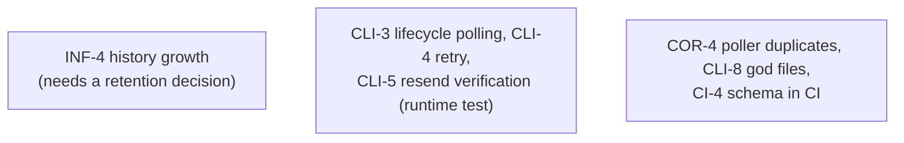

# Incremental Subsystem Remediation Plan

## Overview

This plan tracks remediation of findings from a systematic review of the
incremental game subsystem: the story/segment engine (`eidolon/`), the Lambda
API layer (`lambda/`), the Flutter client (`incremental/`), the deployment and
pipeline infrastructure (`cf/`, `buildspec/`, `scripts/`), CI workflows
(`.github/workflows/`), and the subsystem documentation. It is the companion to
`documentation/backend-remediation-plan.md`, which covered the Python backend's
item, store, and architectural findings and is complete; this review verified
that those fixes are still in place and focused on what that plan did not
cover.

Each item is self-contained with a location, the problem, a concrete
remediation, and acceptance criteria so work can be picked up independently.
Every load-bearing claim below was verified against the current code, not
carried over from documentation or issue history - several documented "known
issues" turned out to be fixed, and several documented "fixed" items turned out
to be incomplete.

## Assessment

The subsystem is in better shape than its own documentation says. The API layer
is consistently authenticated and ownership-checked (all 22 handlers derive
identity from the Cognito JWT; one ordering nit, COR-5). The engine's write
paths are race-safe and idempotent: segment claims, decision submission, story
completion, and purchases all use conditional writes or transactions. The
Flutter client has a clean Provider/controller/repository architecture, secure
token storage, and disciplined timer hygiene. Death and dead-character
prevention - listed as broken in `incremental.md` - are fixed and verified.

The real risks are concentrated in four places:

1. **Two player-facing correctness gaps.** At review time no gameplay path
   granted currency, leaving the store unusable in practice (COR-1, since
   resolved - see its section), and the daily-story cooldown check contains a
   dead branch caused by a timestamp type mismatch (COR-2).
2. **Zero meaningful test coverage where the game actually lives.** There are
   no Python tests at all for `eidolon/` or `lambda/`, the Flutter CI workflow
   analyzes only `portal/` and never runs `flutter test`, and the deploy
   pipeline builds and ships without any analysis or tests (CI track).
3. **Operational blind spots.** The SQS pipeline has no dead-letter queues and
   no CloudWatch alarms; history tables grow without bound; tables have no
   point-in-time recovery (INF track).
4. **Documentation rot.** Dead links, a stale "Known Issues" list, an API doc
   missing six implemented endpoints, docs describing a CDK deployment system
   that does not exist, and a stale duplicate `cloudformation/` tree (DOC
   track).

## Table of Contents

- [Status Legend](#status-legend)
- [Findings Summary](#findings-summary)
- [Remediation Sequence](#remediation-sequence)
- [Priority 0 - Engine Correctness](#priority-0---engine-correctness)
- [Priority 1 - Pipeline Operability](#priority-1---pipeline-operability)
- [Priority 2 - Client Robustness](#priority-2---client-robustness)
- [Test and CI Track](#test-and-ci-track)
- [Documentation Track](#documentation-track)
- [Verification](#verification)

## Decisions

Recorded owner decisions that shape this plan:

- **Coins are ordinary stackable items with unbounded stacks** (2026-06-12).
  Coin prototypes set `MaxStack: -1`; a MaxStack of zero or less means
  unbounded everywhere stacks are merged or split. Currency is granted through
  the standard item-reward path, and the special-case grant transaction
  (`credit_coins`) was removed. See COR-1's resolution.
- **Unit tests are deferred** (2026-06-12). While the system is still being
  shaped, tests would mostly lock in churn; revisit once gameplay stabilizes.
  CI-2 and CI-3 are deferred accordingly, and acceptance criteria elsewhere in
  this plan that call for unit tests are satisfied by manual verification for
  now.
- **Portal is out of scope** (2026-06-12). `portal/` exists solely for
  MUD-without-incremental deployments and is intentionally an independent app.
  No unification, shared-package extraction, or retirement work is planned;
  incremental-subsystem fixes target `incremental/` only. See DOC-5's
  resolution.
- **Minimize recurring AWS cost** (2026-06-12). No dead-letter queues, no
  CloudWatch alarms or SNS topics, and no DynamoDB point-in-time recovery.
  The database is the authoritative state and the poller is the recovery
  mechanism - SQS messages are disposable nudges, and the 24-hour queue
  retention deliberately matches the longest segment cycle. Observability is
  logs-based. Free-tier hardening (queue visibility timeouts,
  ReportBatchItemFailures, fail-fast code paths) is kept; anything with a
  recurring charge needs explicit owner approval first.

## Status Legend

- `[PENDING]` - not started
- `[IN PROGRESS]` - work underway
- `[DONE]` - implemented and verified
- `[DEFERRED]` - deliberately postponed by owner decision
- `[WARNING]` - blocked or needs a decision before proceeding

## Findings Summary

| ID | Severity | Area | Location | Status |
| --- | --- | --- | --- | --- |
| COR-1 | HIGH | Engine / economy | `eidolon/story_rewards.py`, `eidolon/currency.py` | [DONE] |
| COR-2 | MEDIUM | Engine / timers | `eidolon/story_validation.py`, `eidolon/state_machines.py` | [DONE] |
| COR-3 | MEDIUM | Engine / recovery | `eidolon/segment_polling.py` | [DONE] |
| COR-4 | LOW | Engine / poller | `lambda/ops_segment_poller.py` | [PENDING] |
| COR-5 | LOW | API / hardening | `lambda/api_story_history.py` | [DONE] |
| INF-1 | HIGH | Infra / SQS | `cf/eidolon-lambda-story.yml` | [DONE] |
| INF-2 | HIGH | Infra / observability | `cf/` templates | [DEFERRED] |
| INF-3 | MEDIUM | Infra / durability | `cf/eidolon-dynamo.yml` | [DEFERRED] |
| INF-4 | MEDIUM | Infra / data growth | history tables, `CompletedStories` | [PENDING] |
| INF-5 | MEDIUM | Infra / IaC hygiene | `cloudformation/`, `documentation/deployment.md` | [DONE] |
| INF-6 | LOW | Infra / tuning + docs | poller rule, queue timeouts | [DONE] |
| CLI-1 | MEDIUM | Client / errors | `incremental/lib/utils/error_handler.dart` | [DONE] |
| CLI-2 | MEDIUM | Client / network | `incremental/lib/services/base_api_service.dart` | [DONE] |
| CLI-3 | MEDIUM | Client / lifecycle | `incremental/lib/controllers/game_screen_controller.dart` | [PENDING] |
| CLI-4 | LOW | Client / network | `incremental/lib/utils/retry.dart` | [PENDING] |
| CLI-5 | LOW | Client / auth | resend-verification flow (issue #875) | [PENDING] |
| CLI-6 | LOW | Client / UI | `incremental/lib/widgets/game/inventory_panel.dart` | [DONE] |
| CLI-7 | CLEANUP | Client / dead code | four unused widgets (~1,600 lines) | [DONE] |
| CLI-8 | CLEANUP | Client / size debt | `game_screen.dart`, `game_screen_controller.dart` | [PENDING] |
| CI-1 | HIGH | CI / Flutter | `.github/workflows/flutter-analysis.yml` | [DONE] |
| CI-2 | HIGH | CI / Python | no Python tests exist | [DEFERRED] |
| CI-3 | MEDIUM | CI / Flutter coverage | `incremental/test/` | [DEFERRED] |
| CI-4 | MEDIUM | CI / story content | `story.schema.json` unused | [PENDING] |
| CI-5 | MEDIUM | CI / deploy pipeline | `buildspec/incremental.yml` | [DONE] |
| DOC-1 | MEDIUM | Docs / dead links | `incremental.md`, `README.md` | [DONE] |
| DOC-2 | MEDIUM | Docs / stale status | `incremental.md`, `README.md` | [DONE] |
| DOC-3 | MEDIUM | Docs / API drift | `incremental-api.md`, `incremental-openapi.yml` | [DONE] |
| DOC-4 | LOW | Docs / hygiene | `documentation/issues.md`, doc index | [DONE] |
| DOC-5 | DESIGN | Client / duplication | `incremental/` vs `portal/` shared screens | [DONE] |

## Remediation Sequence

Most of the plan has shipped: the engine correctness fixes (COR-1, COR-2,
COR-3, COR-5), the client fixes (CLI-1, CLI-2, CLI-6, CLI-7), the CI gates
(CI-1, CI-5), and the zero-cost infrastructure items (INF-1 resolved by
design decision, INF-5, INF-6 - the template changes take effect on the next
deploy). Tests (CI-2, CI-3) and the recurring-cost items (INF-2 alarms,
INF-3 PITR) are deferred by owner decision. What remains:



CLI-5 and the deployed-environment verification of the INF-6 changes pair
well with the next deploy; INF-4 is blocked on a retention decision.

## Priority 0 - Engine Correctness

### COR-1 No gameplay path grants currency

`[DONE]` - Severity: HIGH

**Resolution (per the unbounded-coins decision):** Coins are now ordinary
stackable items with unbounded stacks, and currency flows through the standard
item-reward path. `calculate_story_rewards` reads the reward tier's `currency`
amount (already present in every shipped story's `RewardTiers`) and converts it
into coin item entries via the new `currency.coin_rewards_for_amount` (greedy
split, largest denomination first; non-representable remainders are floored and
logged), so `apply_story_rewards` grants coins exactly like any other stackable
reward, merging into existing stacks. Unbounded stacks are now a first-class
concept: a prototype `MaxStack` of zero or less means no limit
(`items.stack_merge_quantity`, `distribute_into_stacks`), the coin prototypes
set `MaxStack: -1`, and the purchase, reward, and consolidate paths all honor
it. Unneeded code was removed: `credit_coins` (superseded by the item path),
the dead `can_add_to_stack` helper, `get_stack_space` (replaced by
`stack_merge_quantity`), the `MaxStack <= 0 -> 99` coercions, and the stale
`database/create_item.py` utility that minted denormalized item records.
`documentation/currency.md`, `item-system.md`, and
`incremental-implementation.md` were reconciled to this model. Verified by
ruff, byte-compile, and direct exercise of the stack-helper semantics;
unit tests deferred per the owner decision.

**Location:** `eidolon/story_rewards.py:45-80` (`calculate_story_rewards`),
`eidolon/currency.py:233` (`credit_coins`, zero production callers),
`documentation/currency.md:19`; coin prototypes exist only in
`data/test_prototypes.json:431-504`.

**Problem:** The coin economy built under ITEM-6/COR-1 of the backend plan is
complete on the *spending* side - purchases atomically spend canonicalized coin
stacks - but nothing ever grants coins. `calculate_story_rewards` returns
`{"items": [...]}` only; there is no currency key in any reward tier, and
`credit_coins` has no callers anywhere in production code (verified by grep).
No archetype starting gear and no story reward references a coin prototype. The
net effect is that players can never obtain currency, which makes the store
unusable in practice and keeps the headline known issue "currency rewards
broken" effectively true from the player's perspective, even though the
documentation trail (`release-five-report.md`, issue #726) records it as
complete.

**Remediation:** Wire currency into story rewards through the designed path:

1. Extend the story `RewardTiers` schema with a `Currency` amount (in
   Fundamental Units) per outcome tier, alongside `items`.
2. Have `calculate_story_rewards` surface it and `apply_story_rewards` call
   `credit_coins(character_id, amount_fu)` so granted coins are canonicalized
   into the minimal coin set, consistent with how purchases spend them.
3. Author currency rewards into at least one shipped story and seed the coin
   prototypes outside test data.
4. Update `documentation/currency.md` (which currently states "none do yet")
   and the story authoring docs/schema (`incremental/schemas/story.schema.json`)
   to include the currency field.

**Acceptance criteria:**

- Completing a story with a currency reward measurably increases the
  character's wallet total, in canonical coin stacks.
- `credit_coins` is referenced by production code.
- A unit test covers reward calculation and application including currency.
- `documentation/currency.md` no longer says no path awards currency.

### COR-2 Daily-story cooldown readers disagree on the CompletedAt type

`[DONE]` - Severity: MEDIUM

**Resolution:** `validate_story_available` now treats `CompletedAt` as the
Unix timestamp it actually is and allows the story when
`now_unix() - completed_at >= DAILY_STORY_COOLDOWN_SECONDS`; the dead
`fromisoformat` / calendar-date branch is gone, and an unreadable timestamp
still blocks to be safe. Both readers share the new
`DAILY_STORY_COOLDOWN_SECONDS` constant (`eidolon/constants.py`), so the
start-time check is correct on its own without depending on a prior
`GET /character`. Verified by ruff and byte-compile; unit tests deferred per
the owner decision.

**Location:** writer at `eidolon/state_machines.py:160-164` (Unix integer
timestamp); readers at `eidolon/story_validation.py:75-84`
(`datetime.fromisoformat`) and `eidolon/character_data.py:200-216` (integer
math); cleanup invoked from `lambda/api_character_get.py:45`.

**Problem:** `CompletedStories` entries are written with
`"CompletedAt": int(datetime.now(timezone.utc).timestamp())`. The cleanup path
(`cleanup_expired_daily_stories`) correctly does integer math against an
86,400-second cooldown. But `validate_story_available` - the check that runs at
story start - calls `datetime.fromisoformat(completed_at)` on that integer,
which always raises `TypeError`, is swallowed by the
`except (ValueError, TypeError): pass` at lines 82-83, and falls through to
`raise ValueError("Story available again tomorrow")`. The branch whose comment
says "cleanup may have missed this entry" is therefore dead code: a daily story
whose cooldown has fully expired is still rejected at start time unless a
`GET /character` call has run first to trim the entry as a side effect. The
intended grace check also uses calendar-date comparison
(`finished.date() < now.date()`) rather than the 24-hour rule, so even if the
parse worked, the two readers would disagree about when a daily story becomes
available.

**Remediation:** Unify on the stored representation and the 86,400-second
rule. In `validate_story_available`, treat `CompletedAt` as a Unix integer and
allow the story when `now_unix() - completed_at >= 86400`; delete the
`fromisoformat` / date-comparison logic. Keep `cleanup_expired_daily_stories`
as the storage trim, but the start-time check must be correct on its own,
without depending on a prior `GET /character`.

**Acceptance criteria:**

- A daily story completed more than 24 hours ago can be started even if no
  `GET /character` call has run in between.
- A daily story completed less than 24 hours ago is rejected, including just
  after midnight UTC.
- Both readers use the same field type and the same cooldown arithmetic, and a
  unit test covers the boundary.

### COR-3 Stuck-segment recovery cannot retry short or late-failing segments

`[DONE]` - Severity: MEDIUM

**Resolution:** Recovery is now relative to expected processing time, not
segment duration. The stuck scan fires once a segment has been
pending/processing for `SEGMENT_STUCK_RETRY_SECONDS` (60s, 2x the worker
timeout, down from 300s) with `SEGMENT_RETRY_MIN_REMAINING_SECONDS` (30s,
down from 60s) left before EndTime. Segments too short for that window get
their retry at expiry: the poller requeues an unprocessed mechanical segment
once - guarded by a new conditional `RecoveryAttempted` flag
(`segment_state.mark_segment_recovery_attempted`) so concurrent pollers
cannot double-queue - and resolves it exceptionally only on the next poll if
still unprocessed. The audit also surfaced and fixed a stranding bug: a
segment whose worker died after claiming it stayed `processing` forever
(the expiry path skipped it and the stuck scan's EndTime guard excluded it);
it is now resolved exceptionally once `SEGMENT_PROCESSING_GRACE_SECONDS`
(120s) past EndTime. The dead, divergent `SEGMENT_STUCK_THRESHOLD` /
`SEGMENT_RETRY_WINDOW` constants were replaced by the wired-in ones, and the
recovery behavior is documented in `incremental-story.md` (Error Recovery
and Edge Cases). Verified by ruff and byte-compile; unit tests deferred per
the owner decision.

**Location:** `eidolon/segment_polling.py:50-99`
(`get_stuck_mechanical_segments`); consumer in `lambda/ops_segment_poller.py`.

**Problem:** Recovery of mechanical segments stuck in `pending` or
`processing` requires `StartTime` more than 5 minutes old **and** `EndTime`
more than 60 seconds in the future. Two classes of segment can never be
retried under these constants: (a) segments with durations up to ~6 minutes,
which reach their `EndTime` before they have been "stuck" long enough to
qualify (the system supports durations from 1 minute), and (b) any segment
whose processing fails inside its final 60 seconds. Both fall through to the
approaching-expiry path and are advanced unprocessed instead of being given a
second processing attempt. There is also a query nuance: the recovery uses a
`scan` with `Limit`, which in DynamoDB bounds the items *examined* rather than
the items *matched*, so stuck segments can be missed in a single poll on a
large table (they are picked up on later polls only while they still satisfy
the time window).

**Remediation:** Make the retry window relative to the segment rather than
fixed: treat a segment as stuck once it has been in `pending`/`processing`
longer than a small multiple of the expected processing time (for example,
2x the processing Lambda timeout, i.e. about 60 seconds), independent of total
segment duration. Define explicitly - in `documentation/incremental-story.md` -
what advancement does with a segment that expires unprocessed, and verify that
outcome is acceptable (it should resolve the segment, not strand the story).
Add a unit test simulating a 1-minute segment whose first processing attempt
fails.

**Acceptance criteria:**

- A 1-minute mechanical segment whose first processing attempt fails gets at
  least one retry before its `EndTime`.
- A segment that expires unprocessed still advances the story deterministically,
  and the behavior is documented.

### COR-4 Poller can enqueue the same segment twice

`[PENDING]` - Severity: LOW

**Location:** `lambda/ops_segment_poller.py` (enqueue path);
`eidolon/segment_polling.py:15-47` (no claim before enqueue); mitigation at
`eidolon/segment_polling.py:181-193` (`claim_segment_for_processing`).

**Problem:** The poller queries segments approaching expiry and sends SQS
messages without marking them as queued, so overlapping poller invocations (or
an EventBridge redelivery) can enqueue the same segment twice. This is
*benign for correctness* - the processor claims each segment with an atomic
conditional transition before doing work, and advancement marks completion
conditionally - but it produces duplicate work and duplicate log noise that
makes the logs (the project's observability surface) harder to read.

**Remediation:** Either set a `QueuedAt` attribute with a conditional write
before enqueueing and skip segments claimed by a concurrent poller, or accept
the duplicates and explicitly downgrade failed-claim log lines to INFO with a
comment documenting that duplicate enqueues are expected and harmless. The
second option is acceptable; the current state (undocumented duplicates) is
not.

**Acceptance criteria:**

- Duplicate enqueues are either prevented or explicitly documented as expected,
  with log levels that do not trip error alarms.

### COR-5 Story-history handler returns before the ownership check

`[DONE]` - Severity: LOW

**Resolution:** The `verify_character_ownership` call now precedes the empty
`StoryInstanceIDs` early return, so every path through the handler validates
ownership first and unowned requests get 403 regardless of parameters.

**Location:** `lambda/api_story_history.py:97-105`.

**Problem:** When no `StoryInstanceIDs` are supplied, the handler returns an
empty 200 response before `verify_character_ownership` runs. No data leaks -
the response is identical for any character ID, owned or not, existing or not -
but this is the only handler where any code path skips the ownership check,
and it invites copy-paste of the wrong ordering into future handlers.

**Remediation:** Move the `verify_character_ownership` call above the empty
`StoryInstanceIDs` early return so every path through the handler validates
ownership first.

**Acceptance criteria:**

- All paths through the handler verify ownership before returning.
- Requests for unowned characters return 403 regardless of parameters.

## Priority 1 - Pipeline Operability

### INF-1 SQS queues have no dead-letter queues

`[DONE]` - Severity: HIGH

**Resolution (owner decision - no DLQs by design):** This finding assumed the
classic DLQ rationale, which does not apply to this architecture: the database
is the authoritative state and SQS messages are disposable nudges
(ActiveSegmentID strings) that the poller regenerates from table state, so a
lost or expired message costs nothing and a dead-lettered message would never
be worth replaying (the poller will already have resolved the segment). The
24-hour `MessageRetentionPeriod` was specifically chosen to match the longest
segment cycle. The design rationale is now recorded in the template comment,
`deployment.md` (Operations), and `cloudformation.md` (Pipeline Reliability),
so the original concern - that the failure mode was undocumented and looked
like an oversight - is addressed.

**Location:** `cf/eidolon-lambda-story.yml:23-41` (`ProcessingQueue`,
`AdvancementQueue` - no `RedrivePolicy`).

**Problem:** Neither pipeline queue has a DLQ. A message that consistently
fails (poison segment, malformed payload, persistent downstream error) is
redelivered repeatedly for the full 24-hour `MessageRetentionPeriod` - burning
Lambda invocations against `ReservedConcurrentExecutions: 5` - and then
disappears silently. There is no way to observe, inspect, or replay failed
messages, which compounds INF-2 (no alarms): the failure mode of the entire
async pipeline is invisible.

**Remediation:** Add a DLQ per queue with a `RedrivePolicy` of
`maxReceiveCount: 3` on both `ProcessingQueue` and `AdvancementQueue`. Retain
DLQ messages 14 days. Alarm on DLQ depth under INF-2. Document an operator
replay procedure (or a small redrive script) in the deployment docs.

**Acceptance criteria:**

- Both queues redrive to DLQs after 3 failed receives.
- A poison message lands in the DLQ instead of redelivering for 24 hours.
- DLQ depth is alarmed (INF-2).

### INF-2 No CloudWatch alarms on the async pipeline

`[DEFERRED]` - Severity: HIGH - Declined by owner decision (see
[Decisions](#decisions)): alarms and SNS carry recurring cost, and
observability for this project is logs-based by design. An implementation
(nine alarms plus an SNS topic in the story stack) was built and then removed
at the owner's direction before any deploy. Revisit only if operational
blindness becomes a real problem, with explicit cost approval first.

**Location:** `cf/eidolon-lambda-story.yml` (no `AWS::CloudWatch::Alarm`
resources); `cf/eidolon-cloudwatch.yml`; tracked as issue #603.

**Problem:** Nothing alerts when the pipeline degrades. Specifically
unmonitored: queue depth and oldest-message age on both queues, errors and
throttles on `ops-segment-process` (which runs with
`ReservedConcurrentExecutions: 5` and can throttle under load), errors on
`ops-story-advance` and `ops-segment-poller`, and failed EventBridge
invocations of the poller. Combined with INF-1, a stalled pipeline looks
identical to a healthy idle one until players report stories not advancing.

**Remediation:** Add alarms (SNS topic for notification) for: DLQ depth > 0
(after INF-1), `ApproximateAgeOfOldestMessage` over a few minutes on both
queues, Lambda `Errors` > 0 over 5 minutes and `Throttles` > 0 on the three
ops functions, and EventBridge `FailedInvocations` on the poller rule. Keep
thresholds conservative; tune after a burn-in period.

**Acceptance criteria:**

- A simulated processing failure (forced exception) raises an alarm within
  minutes without anyone watching logs.
- Throttling of `ops-segment-process` is independently visible.

### INF-3 No point-in-time recovery on DynamoDB tables

`[DEFERRED]` - Severity: MEDIUM - Declined by owner decision (see
[Decisions](#decisions)): PITR bills continuously per GB and was judged not
worth the recurring cost. Tables keep `DeletionProtectionEnabled`, and the
static game-data tables are reloadable from the repository via
`database/data_loader.py`; the decision is recorded in
`documentation/cloudformation.md` (Data Protection). A side benefit of
working this item: `cloudformation.md` still documented the deleted
`cloudformation/` tree (an INF-5 miss) and was rewritten to describe the live
`cf/` conventions.

**Location:** all table definitions in `cf/eidolon-dynamo.yml`.

**Problem:** Tables have `DeletionProtectionEnabled: true` but no
`PointInTimeRecoverySpecification` and no backup plan. Player data
(characters, items, story state) cannot be restored after data corruption, a
bad deploy, or an errant script; deletion protection only guards against
deleting the table itself.

**Remediation:** Enable PITR on the player-data tables (characters, items,
players, active_segments, story_history, segment_history, stores). Static
config-like tables (story, segments, archetypes, prototypes) are reloadable
from the repo via `database/data_loader.py` and may be excluded deliberately -
document the choice either way.

**Acceptance criteria:**

- PITR is enabled on all player-data tables.
- The decision for static tables is recorded in `documentation/cloudformation.md`.

### INF-4 Unbounded growth: history tables, CompletedStories, abandoned segment rows

`[PENDING]` - Severity: MEDIUM

**Location:** `cf/eidolon-dynamo.yml` (`story_history`, `segment_history` - no
TTL); `Character.CompletedStories` / `AbandonedStories` lists (issues #809,
#869); non-`active` rows in `active_segments` (the poller queries only
`Status = "active"`, `eidolon/segment_polling.py:33-37`).

**Problem:** Three growth paths have no bound. History tables accumulate one
record per story and per segment forever. The `CompletedStories` and
`AbandonedStories` lists live on the character record itself and march toward
DynamoDB's 400 KB item limit (one-time stories are kept permanently by design,
so heavy players will get there). And any `active_segments` row whose `Status`
leaves `"active"` (for example, abandoned) becomes invisible to the poller's
index query, so if any such rows are not deleted at transition time they
persist forever - audit the abandon/completion paths and confirm every
terminal transition deletes the row.

**Remediation:** Implement the trimming Lambda proposed in issue #869
(`ops-trim-history`): monthly schedule; cap `CompletedStories` /
`AbandonedStories` (keeping all one-time entries needed for replay
prevention); either TTL or archive-then-delete old history records (TTL via a
`TimeToLiveSpecification` attribute is the cheap option if history older than
N months is genuinely disposable - decide retention first). Add the
`active_segments` terminal-state audit as part of the same change.

**Acceptance criteria:**

- A character cannot grow its record toward the 400 KB limit through normal
  play.
- History retention is a stated policy enforced by code, not an accident.
- No terminal story flow leaves a row in `active_segments`.

### INF-5 Stale IaC tree and documentation describing a deployment system that does not exist

`[DONE]` - Severity: MEDIUM

**Resolution:** The stale `cloudformation/` tree is deleted (nothing outside
it referenced it except the cfn-lint workflow, which now lints the live
`cf/*.yml` - all 13 templates verified passing cfn-lint 1.35.1 before the
gate went live). `documentation/deployment.md` was rewritten from
`scripts/eidolon_deployment.py` itself: interactive CloudFormation
orchestration, the 12-stack mode matrix plus `eidolon-s3-scripts.yml`, the
mode/buildspec table, and config flow - keeping the `#quick-start` and
`#system-architecture` anchors other docs link to (three links to the
no-longer-existing `#stack-deployment-order` anchor were repointed).
`deployment-design.md` carries a superseded banner as a historical CDK
design record, and the remaining `deployment/stacks/` references in living
docs (`cors-configuration.md`, `incremental-design.md`,
`lambda-functions.md`, `figma-design-system-rules.md`) now cite the real
`cf/` templates. Historical snapshots (`issues.md`, `project-plan-01.md`)
were left intact.

**Location:** `cloudformation/` (11 stale templates; the live tree is `cf/`,
hardcoded at `scripts/eidolon_deployment.py:296`);
`documentation/deployment.md` (describes a "modular CDK-based deployment
system" with "10 CDK Stacks"); `documentation/issues.md` (cites
`deployment/stacks/*.py` paths that exist nowhere in the repo).

**Problem:** The repo carries two CloudFormation trees, and only `cf/` is
deployed. The stale `cloudformation/` tree is missing newer tables and Lambda
templates, so an edit applied there silently does nothing. Worse, the
deployment documentation describes a CDK architecture (`deployment/stacks/`)
that does not exist in the repository - a maintainer following the docs cannot
find the code, and issue history cites file paths that were never (or are no
longer) real.

**Remediation:** Delete `cloudformation/` (or move it under an `archive/`
prefix with a README stating it is dead). Rewrite
`documentation/deployment.md`'s architecture section to describe the actual
mechanism: `scripts/eidolon_deployment.py` deploying `cf/eidolon-*.yml`
templates. Sweep `documentation/` for `deployment/stacks/` references.

**Acceptance criteria:**

- One IaC tree exists (or the dead one is unambiguously marked).
- `deployment.md` describes the deployment mechanism that actually runs.

### INF-6 Undocumented adaptive polling design and queue-timeout tuning

`[DONE]` - Severity: LOW

**Resolution:** Queue visibility timeouts raised to 180s (6x the 30s consumer
timeout) and `ReportBatchItemFailures` enabled on both event source mappings -
which also activated a latent intent: `ops_story_advance` already returned
per-record `batchItemFailures` that Lambda had been silently ignoring without
the mapping setting (`ops_segment_process` deliberately returns none;
poller-driven recovery). The enable-failure mode is now fail-fast:
`ensure_polling_enabled` raises when the EventBridge rule cannot be enabled,
and `api-story-start` calls it before creating any story records, so the
request fails cleanly with nothing to roll back instead of minting a story
that can never advance (an SSM-parameter failure stays non-fatal because the
poller self-corrects it). The lifecycle documentation in
`incremental-story.md` (Polling Infrastructure) was corrected - stale 90s/5min
windows updated to the COR-3 constants, fail-fast behavior recorded - and
`incremental-design.md`'s poller section now points to it as canonical.

**Location:** `cf/eidolon-lambda-story.yml:397` (`State: DISABLED` on the
poller rule), `eidolon/polling.py:102-132` (`ensure_polling_enabled`, called
only by `api-story-start`); queue `VisibilityTimeout: 90` (lines 27, 37)
versus consumer timeouts of 30 seconds (lines 323, 361).

**Problem:** The EventBridge poller rule ships DISABLED on purpose: polling is
enabled dynamically when a story starts and disabled when idle, to save cost.
This review initially flagged it as "stories never advance" - which is exactly
how an operator reading only the template will read it. The design is sound
but undocumented, and it has one real failure mode handled only by a log line:
if `enable_rule` fails at story start, the story is created anyway and no
poller is running (`polling.py:121-124` returns without surfacing the error),
so segments sit unprocessed until some later story start succeeds in enabling
the rule. Separately, the queues' visibility timeout is 3x the consumer
timeout; the AWS-recommended multiple for Lambda event source mappings is 6x,
and the mappings do not use partial-batch failure reporting.

**Remediation:** Document the adaptive enable/disable lifecycle (who enables,
who disables, the SSM `run`/`stop` parameter) in `incremental-design.md`.
Make poller-enable failure visible: at minimum a metric/alarm hook under
INF-2, or fail the story start if the rule cannot be enabled and no poll is
scheduled. Raise visibility timeouts to 180 seconds and enable
`ReportBatchItemFailures` on both event source mappings so one bad record does
not force redelivery of a whole batch.

**Acceptance criteria:**

- The polling lifecycle is documented where an operator will look.
- A failed rule-enable at story start is observable (alarm or hard failure).
- Visibility timeout is at least 6x the consumer timeout and partial batch
  failures are reported.

## Priority 2 - Client Robustness

### CLI-1 Error-message filter rejects any message containing a colon (issue #876)

`[DONE]` - Severity: MEDIUM

**Resolution:** The final heuristic in `_isUserFriendlyMessage` no longer
rejects colons (now `message.length < 200`); genuinely technical shapes are
still caught by the existing term blocklist (`Exception`, `Error:`,
`Stack trace`, `instance of`, HTTP status codes) that runs first. Backend
validation messages now reach the user verbatim. Verified by
`flutter analyze`; issue #876's server side was already resolved by the
ARC-3 typed-error migration.

**Location:** `incremental/lib/utils/error_handler.dart:160`
(`_isUserFriendlyMessage`: `message.length < 100 && !message.contains(':')`).

**Problem:** Backend error messages containing a colon are classified as
"technical" and replaced with "An error occurred. Please try again later."
This is GitHub issue #876: users get a generic failure instead of actionable
validation feedback. Note the server side of that issue is already resolved -
the ARC-3 migration removed the `"NNN:message"` prefix convention, so library
errors now arrive as clean typed messages ("Character limit reached",
"Character name is not available") - which makes the client-side colon filter
the sole remaining cause, and an increasingly wrong heuristic.

**Remediation:** Replace the colon test with detection of genuinely technical
shapes: exception type names (`Exception`, `Error:` prefixes,
`instance of`), stack-trace markers, and excessive length. Add unit tests
(under CI-3) covering representative backend messages, including ones with
colons, asserting they pass through verbatim.

**Acceptance criteria:**

- A validation message from the backend reaches the user verbatim, with or
  without a colon.
- Stack traces and exception dumps still fall back to the generic message.
- Issue #876 can be closed against a test, not a guess.

### CLI-2 No HTTP request timeouts

`[DONE]` - Severity: MEDIUM

**Resolution:** Every request through `_sendOnce` now carries a 30-second
timeout (`BaseApiService.requestTimeout`, applied at the single choke point);
`TimeoutException` maps to an `ApiException` with a user-readable, retryable
message that passes the CLI-1 filter. Verified by `flutter analyze`.

**Location:** `incremental/lib/services/base_api_service.dart:187-272`
(`_sendOnce` - no timeout on any `http.Client` call).

**Problem:** No request in the client carries a timeout, so a stalled
connection blocks indefinitely (the polling loop waits on these futures). On
web - the deployed platform - a hung request can stall story progression UI
with no feedback until the browser gives up.

**Remediation:** Apply `.timeout(const Duration(seconds: 30))` (or a
per-request-class duration) at the `_sendOnce` choke point, map
`TimeoutException` into the existing `ApiException` hierarchy, and surface it
through `ErrorHandler` as a retryable "request timed out" message.

**Acceptance criteria:**

- Every API call fails within a bounded time on a dead connection.
- Timeouts surface as user-readable, retryable errors and are unit-tested.

### CLI-3 Polling ignores app lifecycle

`[PENDING]` - Severity: MEDIUM

**Location:** `incremental/lib/controllers/game_screen_controller.dart`
(starts polling, no `WidgetsBindingObserver`);
`incremental/lib/services/story_polling_service.dart`.

**Problem:** Polling starts when the game screen loads and stops only on
dispose or story completion. Backgrounding the app (or hiding the tab) does
not pause it, so the client polls the API indefinitely while invisible -
wasted requests and battery, and on resume the UI state can be a full poll
cycle stale rather than refreshing immediately.

**Remediation:** Register a `WidgetsBindingObserver`; on
`AppLifecycleState.paused`/`hidden` stop polling, on `resumed` do an immediate
status fetch and restart the polling schedule.

**Acceptance criteria:**

- No segment-status requests are issued while the app is backgrounded.
- Resuming triggers an immediate refresh, then normal cadence.

### CLI-4 No retry for transient failures; retry utility exists but is dead code

`[PENDING]` - Severity: LOW

**Location:** `incremental/lib/services/base_api_service.dart:171-184` (single
retry on 401 only); `incremental/lib/utils/retry.dart` (`retryWithBackoff`,
zero callers).

**Problem:** Only token-expiry 401s are retried. A single transient 5xx or
connection reset fails the operation immediately - noticeable during
multi-minute polling sessions on flaky networks. Meanwhile a ready-made
`retryWithBackoff` helper sits unused.

**Remediation:** Route idempotent requests (GETs; polling status calls)
through `retryWithBackoff` for 5xx/connection errors with 2-3 attempts. Do
*not* blanket-retry POSTs (decision submission and purchases are guarded
server-side by conditional writes, but client retries should still be
deliberate). Delete the helper if the decision is instead not to retry.

**Acceptance criteria:**

- Transient failures on read paths recover invisibly.
- `retry.dart` is either used or removed.

### CLI-5 Verify the resend-verification flow end to end (issue #875)

`[PENDING]` - Severity: LOW (verification task)

**Location:** `incremental/lib/screens/registration_screen.dart:127,338`,
`incremental/lib/providers/auth_provider.dart:103`,
`incremental/lib/services/auth_service.dart:392-398`; mirrored in `portal/`.

**Problem:** Issue #875 reports the resend-verification button does nothing.
The client plumbing is fully present and wired
(button -> provider -> service -> Cognito `resendConfirmationCode()`), so the
defect - if it still exists - is runtime: a swallowed Cognito error, an email
delivery problem, or Cognito user-pool configuration. This cannot be settled
by static review.

**Remediation:** Test against the deployed Cognito pool: register, request a
resend, observe delivery and any error surfaced. If a Cognito `ClientError`
comes back, ensure it propagates to a snackbar instead of being swallowed; if
the email is silently undelivered, investigate the pool's email configuration
(SES vs Cognito default sending limits). Fix in `incremental/` only - portal
is out of scope (see DOC-5); if the root cause is pool configuration rather
than client code, the fix benefits both apps anyway.

**Acceptance criteria:**

- Resend either works in the deployed environment or fails with a visible,
  actionable error; issue #875 updated with the finding.

### CLI-6 Inventory falls back to showing the raw item UUID

`[DONE]` - Severity: LOW

**Resolution:** The grid item's name fallback is now the "Unknown Item"
placeholder instead of the raw ItemID, so no UI path renders a bare UUID.

**Location:** `incremental/lib/widgets/game/inventory_panel.dart:902`
(`?? widget.itemId` fallback); enrichment failure path in
`incremental/lib/repositories/item_repository.dart`.

**Problem:** The "inventory shows UUIDs" known issue is fixed in the normal
path - the repository enriches items with prototype names - but when
enrichment fails (prototype fetch error returns an empty map) the panel falls
back to rendering the raw UUID.

**Remediation:** Fall back to a placeholder ("Unknown Item") instead of the
ID, and have the repository log enrichment failures so they are findable.
Close out the corresponding line in the stale known-issues list (DOC-2).

**Acceptance criteria:**

- No UI path renders a bare UUID to the player.

### CLI-7 Remove ~1,600 lines of dead story-display widgets

`[DONE]` - Severity: CLEANUP

**Resolution:** All four files deleted after re-verifying zero references
anywhere in `incremental/` (lib and test). The app analyzes clean without
them.

**Location:** `incremental/lib/widgets/active_story_display.dart` (454 lines),
`incremental/lib/widgets/mechanical_segment_display.dart` (649),
`incremental/lib/widgets/story_completion_screen.dart` (349),
`incremental/lib/widgets/story_history_display.dart` (167).

**Problem:** All four widgets have zero imports anywhere in `lib/` (verified
by grep); they were superseded by the `widgets/story/` versions wired into
`story_panel.dart`. They are refactoring leftovers that still cost reading and
maintenance time.

**Remediation:** Delete all four files and any tests that reference only them.

**Acceptance criteria:**

- The app builds and analyzes clean with the files removed.

### CLI-8 Decompose the game-screen god files

`[PENDING]` - Severity: CLEANUP

**Location:** `incremental/lib/screens/game_screen.dart` (~1,800 lines),
`incremental/lib/controllers/game_screen_controller.dart` (877 lines).

**Problem:** Both files far exceed the project's size guidance. The controller
is internally well-factored but mixes polling orchestration, character
refresh, segment-history management, and decision submission; the screen mixes
layout with composition for several panels.

**Remediation:** Extract along the existing seams - polling orchestration,
character refresh/timers, decision/abandon submission - as
behavior-preserving refactors, each landing with the unit tests added under
CI-3 (sequence after those tests exist so the refactor is protected).

**Acceptance criteria:**

- No behavior change; analyzer and tests pass; files trend toward the
  guideline.

## Test and CI Track

### CI-1 Flutter CI never analyzes the incremental app and never runs tests

`[DONE]` - Severity: HIGH

**Resolution:** The workflow now matrixes over `[portal, incremental]`
running `flutter pub get`, `dart format --output=none --set-exit-if-changed`,
and `flutter analyze` per app; the auto-commit machinery and its
`contents: write` permission are gone, so violations fail the check instead
of being silently pushed. Because the bot had never touched `incremental/`,
43 of its 86 Dart files were not format-clean - the tree was formatted
(whitespace-only) and six surfaced `curly_braces_in_flow_control_structures`
lints fixed so the new gates start green; both `dart format
--set-exit-if-changed` and `flutter analyze` verified passing locally for
incremental, and portal verified format-clean. `flutter test` joins the
matrix when the deferred test work resumes.

**Location:** `.github/workflows/flutter-analysis.yml:40-52` - triggers on
`portal/**` and `incremental/**` (lines 5-12) but every step runs with
`working-directory: portal`; no `flutter test` step exists for either app.

**Problem:** Changes to `incremental/` (76 source files - the deployed game
client) ship with no format check, no analyzer, and no tests run in CI; the
workflow's own trigger list implies coverage it does not provide. The
workflow also auto-commits `dart fix --apply` results, again for portal only.

**Remediation:** Convert the job to a matrix over `[portal, incremental]`
running `flutter pub get`, `dart format --set-exit-if-changed .`, and
`flutter analyze` in each app (`flutter test` joins the matrix when the
deferred test work resumes). Drop the auto-commit behavior in favor of failing
the check (auto-pushing fixes from CI mutates PRs and masks problems), and pin
the Flutter version rather than `"3.x"` so analyzer results are reproducible.

**Acceptance criteria:**

- A change to `incremental/` cannot merge without passing analyze for that
  app.

### CI-2 The Python engine has zero tests

`[DEFERRED]` - Severity: HIGH - Postponed by owner decision (see
[Decisions](#decisions)): while gameplay is still being shaped, tests would
mostly lock in churn. Revisit once the system works.

**Location:** no `test_*.py` or `*_test.py` exists anywhere in the repository
(verified); `.github/workflows/python-analysis.yml` runs lint/security gates
(which do correctly fail the build via the aggregation step at lines 85-96)
but no test step.

**Problem:** `eidolon/` (54 modules) and `lambda/` (27 handlers) - the entire
game engine, economy, and API - have no unit tests and no test runner in CI.
The backend remediation plan's items were verified by lint, byte-compile, and
manual exercise; nothing prevents regression of any of them. (Note: the
Go MUD server *does* have tests run in CI; the gap is specifically the
incremental backend.)

**Remediation:** Bootstrap `pytest` with a `tests/` package and moto (or
stubbed `dynamo`) fixtures, seeded by the tests required for COR-1, COR-2, and
COR-3 in this plan plus the pure logic that needs no AWS mocking at all
(`currency.canonical_coin_quantities`, `story_validation`,
`calculate_story_rewards`, combat math, `clamp_levels_to_max`). Add a
`pytest` job to `python-analysis.yml` as a blocking step. Grow coverage
opportunistically: every subsequent fix in this plan lands with a test.

**Acceptance criteria:**

- `pytest` runs in CI and gates merges.
- COR-1/COR-2/COR-3 land with tests proving the fix.
- The pure-logic modules listed above have direct unit coverage.

### CI-3 Critical Flutter surfaces are untested

`[DEFERRED]` - Severity: MEDIUM - Postponed by owner decision (see
[Decisions](#decisions)), same rationale as CI-2.

**Location:** `incremental/test/` - 9 test files against 76 source files; zero
tests for `auth_provider`/`auth_service`, `base_api_service`/`api_service`,
`story_polling_service`, `game_screen_controller`,
`character_repository`/`item_repository`, `error_handler`,
`segment_history_manager`.

**Problem:** The tested surfaces (character model, cache service, some
widgets) are real but peripheral; every business-critical flow - login, API
transport, polling state machine, game orchestration, cache fallback, error
mapping - is unprotected. The existing polling "test" pumps the widget and
asserts it exists.

**Remediation:** Add unit tests in priority order: `error_handler` (with
CLI-1), `base_api_service` with a mock `http.Client` (with CLI-2/CLI-4),
`story_polling_service` with `fakeAsync` (backoff, error thresholds, state
transitions), `auth_provider` with a mocked service, repositories with mocked
API/cache layers, then `game_screen_controller`. Each Priority 2 client fix
above lands with its test.

**Acceptance criteria:**

- The seven components listed have meaningful unit tests running under CI-1.

### CI-4 The story JSON schema is never enforced

`[PENDING]` - Severity: MEDIUM

**Location:** `incremental/schemas/story.schema.json` (referenced by nothing);
`.github/workflows/story-validation.yml:36` installs `jsonschema` but the
validators it runs (`scripts_python/validate_branching.py`,
`validate_story_content.py`) never import it; `database/data_loader.py` loads
stories without schema validation (issue #762).

**Problem:** Three definitions of "valid story" coexist: the JSON schema (used
only by a hand-rolled mini-validator in a Flutter test), the custom CI
validation scripts, and whatever the loader accepts. They can drift
independently, and a story that passes CI can still surprise the engine -
which matters more once COR-1 extends the reward schema.

**Remediation:** Make `story.schema.json` the single source of truth: validate
against it (via `jsonschema`) inside `validate_story_content.py` (the CI
already installs the package) and in `data_loader.py` before upload. Update
the schema in lockstep with COR-1's `Currency` reward field.

**Acceptance criteria:**

- A story violating the schema fails CI and fails the loader.
- The schema documents the current story format, including currency rewards.

### CI-5 The deploy pipeline builds and ships unverified code

`[DONE]` - Severity: MEDIUM

**Resolution:** `dart fix --apply` is removed from
`buildspec/incremental.yml` (PR-time CI enforces cleanliness instead), so the
deployed artifact is built from the commit as-is, and `flutter analyze` now
gates `pre_build` so a broken build aborts before the S3 sync.
(`buildspec/portal.yml` is untouched - portal is out of scope.)

**Location:** `buildspec/incremental.yml` - `pre_build` runs `flutter pub get`
and `dart fix --apply` (line 19); `build` compiles and `post_build` syncs to
S3 and invalidates CloudFront. No analyze, no test.

**Problem:** CodeBuild deploys whatever is in the branch with no quality gate,
and `dart fix --apply` at build time means the deployed artifact is built from
source that differs from the repository - fixes are applied in the build
container and never committed, so a build is not reproducible from the commit
it claims to ship.

**Remediation:** Remove `dart fix --apply` from the buildspec (CI-1 enforces
it at PR time instead) and add `flutter analyze` to `pre_build` so a broken
build cannot reach S3 (`flutter test` joins when the deferred test work
resumes).

**Acceptance criteria:**

- The deployed artifact is built from unmodified repository source.
- An analyzer error aborts the deploy before the S3 sync.

## Documentation Track

### DOC-1 Dead links to a status document that does not exist

`[DONE]` - Severity: MEDIUM

**Resolution:** All `INCREMENTAL-STATUS.md` references in living documents now
point at real sources (GitHub issues and this plan): `incremental.md`,
`incremental-implementation.md` (header, documentation list, and the
nonexistent `LAMBDA-REVIEW.md` / `FLUTTER-REVIEW.md` / `deployment/stacks`
references), `incremental-requirements.md`, `inventory-complexity-analysis.md`,
and `README.md`. The dead `#production-deployment-status` anchor in
`incremental.md` was removed. `project-plan-01.md`'s references were left
as-is: it is a dated historical record that already flags the document as
outdated (DOC-4 covers archiving such snapshots).

**Location:** `documentation/incremental.md:9` and
`documentation/incremental-implementation.md:3` link to
`INCREMENTAL-STATUS.md` (no such file); `README.md:140,146` links to
`documentation/INCREMENTAL-STATUS.md`; `documentation/incremental.md:82` links
to anchor `#production-deployment-status`, which exists in no document.

**Acceptance criteria:**

- Every relative link and anchor in the incremental docs resolves.

### DOC-2 Known-issues and status claims contradict the code

`[DONE]` - Severity: MEDIUM

**Resolution:** With COR-1 landed, every stale "broken" claim was rewritten to
the verified current state: `incremental.md`'s System Status, `README.md`'s
incremental-mode checklist and Current State paragraph (the economy loop is
now complete), `incremental-implementation.md`'s deployment status, currency
section (4.3), processing-flow step 14, and Resources-field known issue, and
`incremental-requirements.md`'s acceptance and gap lists. Remaining known
issues now point to GitHub issues and this plan instead of a frozen list.

**Location:** `documentation/incremental.md:13` ("Currency rewards broken,
dead character prevention broken, inventory display showing UUIDs");
`README.md` incremental-mode checklist (store "not implemented", item
consumption "not implemented", "immortal zombies").

**Problem:** Verified against code: dead-character prevention is fixed
(`story_validation.py:97-100`), death conditions are fixed, the store and item
consumption are implemented, and inventory UUID display is fixed in the normal
path (CLI-6 covers the fallback). The one claim that remained true was
currency - but for a different reason than documented (no grant path: COR-1,
now resolved). Stale status text sent this review chasing fixed bugs and would
do the same to any contributor.

**Acceptance criteria:**

- Status claims in `incremental.md` and `README.md` match the code as of the
  edit, including the precise currency situation.

### DOC-3 API documentation drift

`[DONE]` - Severity: MEDIUM

**Resolution:** `incremental-api.md`'s stale "Stack Operations (Future)"
section (which claimed split/consolidate were planned and repeated the wrong
UUIDv7 merge rule) was replaced with real documentation for all eight missing
endpoints - `/item/split`, `/item/consolidate`, `/item/discard`,
`/item/equip`, `/item/unequip`, `/item/move`, `/store/list`,
`/store/purchase` - with request/response shapes taken from the handlers and
library return values, plus the unbounded-stack rules. The OpenAPI spec's
`/story/abandon` now declares `CharacterID` in the request body, matching the
handler and client. YAML validated.

**Location:** `documentation/incremental-api.md` (missing
`/store/list`, `/store/purchase`, `/item/equip`, `/item/unequip`,
`/item/move`, `/item/discard`, `/item/consolidate`, `/item/split`);
`documentation/incremental-openapi.yml:422-435` declares `/story/abandon`'s
`CharacterID` as a query parameter while the handler reads it from the body
(`lambda/api_story_abandon.py:129-130`) and the client sends it in the body.

**Remediation:** Document the implemented endpoints in `incremental-api.md`
and fix the `/story/abandon` request definition in the OpenAPI spec to a
`requestBody`. Treat `cf/eidolon-api-gateway.yml` as the route inventory when
sweeping for other gaps (this review found the spec otherwise aligned across
21 endpoints).

**Acceptance criteria:**

- Every deployed route appears in both the API doc and the OpenAPI spec with
  the correct parameter locations.

### DOC-4 Stale point-in-time artifacts and missing doc index

`[DONE]` - Severity: LOW

**Resolution:** `documentation/README.md` now indexes every document by role -
current references vs dated historical records - naming this plan as the
authoritative status source. `issues.md` carries a historical-snapshot banner
noting that ten of its open issues were closed in the 2026-06-12 audit.
Historical files stay in place (no `archive/` move) so existing links keep
resolving; the index and banners carry the distinction instead.

**Location:** `documentation/issues.md` (a GitHub-issue audit snapshot dated
2025-10-19, including CDK paths that do not exist); ~30 documents in
`documentation/` with no index distinguishing current references from
historical reports.

**Remediation:** Move point-in-time reports (`issues.md`, the `release-*.md`
series) under `documentation/archive/` or add a dated snapshot banner; add a
short `documentation/README.md` index mapping each doc to its role (current
reference vs. historical record) and naming the authoritative status source.

**Acceptance criteria:**

- A newcomer can tell which documents describe the present system.

### DOC-5 Two Flutter apps share nine copy-pasted, drifting files

`[DONE]` - Severity: DESIGN

**Resolution (owner decision, 2026-06-12):** Portal is out of scope. It exists
solely for MUD-without-incremental deployments and is intentionally an
independent app, so the divergence between the two codebases is accepted, not
a defect to remediate. No shared package, consolidation, or retirement work is
planned. Practical consequences: incremental-subsystem fixes (including CLI-5
and any future auth/account work in this plan) target `incremental/` only, and
parity between the two apps is not a goal. The analysis below is preserved as
the factual record that informed the decision.

**Location:** `incremental/lib` (76 files) and `portal/lib` (22 files) share
nine relative paths: `main.dart`, `providers/theme_provider.dart`,
`services/auth_service.dart`, `services/api_service.dart`, and the
login / registration / password-reset (x2) / account-settings screens. No
package mechanism connects them.

**Measured drift (2026-06-12, `git diff --no-index --numstat`):** these are
same-named files, not same files. In every pair the changed lines outnumber
the common lines: `auth_service.dart` is 702 lines in incremental vs ~464 in
portal with only ~240 lines in common (+226/-464); `api_service.dart` is 441
vs ~105 (+126/-462); `registration_screen.dart` 350 lines with +180/-134;
`main.dart` 119 lines with +204/-91. The fork is architectural, not cosmetic:
incremental layers `AuthProvider` over an `AuthService`, while portal uses a
combined `AuthState` holding `TextEditingController`s; incremental has an MFA
setup flow portal lacks; portal carries web-hardening utilities incremental
lacks (`route_guard.dart`, `session_monitor.dart`, `security_config.dart`,
`input_sanitizer.dart`).

**Deployment reality:** exactly one client is deployed per environment. The
deployment mode selects the buildspec (`config.template.yml:112-113`,
`scripts/eidolon_deployment.py` step 15-16): `mud` builds the portal app,
`incremental` and `hybrid` build the incremental app, into the same CloudFront
distribution and CodeBuild project. The apps never coexist in a deployment;
portal is solely the mud-mode frontend. Functionally, portal is auth plus a
basic character list/create/delete screen
(`portal/lib/screens/character_management_screen.dart`) - a subset of the
incremental app's character management (archetype selection, mode
transitions) - plus the hardening utils.

**Problem:** Every auth or account fix must be designed twice against two
different architectures and verified twice - issue #875 (CLI-5) is exactly
this shape - and player-facing behavior already differs by deployment mode
(MFA setup exists only in incremental). The duplication tax recurs on every
change to login, registration, verification, password reset, or account
settings.

**Remediation options (decision needed before code):**

- **(a) Retire portal; one client for all modes - recommended.** Build the
  incremental app for mud mode too, with a build-time mode flag (the buildspec
  already passes `--dart-define`s) that hides incremental gameplay and leaves
  auth plus character management. Port portal's hardening utils if they are
  wanted, then delete `portal/` and `buildspec/portal.yml` and collapse the
  two-buildspec switch. Strongest end-state: an entire app and its 2x auth
  maintenance disappear. Hybrid mode already demonstrates the incremental
  client is the complete one, and portal's user-facing feature set is a subset.
  Costs: a mode flag plus a pass to hide game UI in mud mode; a port-or-drop
  decision per hardening util; mud-only deployments serve the larger bundle.
- **(b) Extract a shared package.** A path-dependency package for auth
  services, screens, and theme consumed by both apps. Honest cost: the two
  auth stacks are architecturally different, so this is a unification rewrite
  (effectively porting portal onto the incremental architecture) followed by
  an extraction - most of option (a)'s work while still keeping two apps, two
  buildspecs, and two verification surfaces. Only preferable if a separate
  lightweight mud-mode client is a product requirement.
- **(c) Accept the fork, codify dual maintenance.** Zero immediate work:
  document in `CONTRIBUTING.md` that auth/account changes apply to both apps
  and add a PR checklist line. The 2x tax and the behavioral drift between
  modes remain; acceptable as an interim posture while (a) is scheduled.

**Decision inputs:** (1) is mud-only mode a long-term supported product?
(2) may MUD players receive the incremental app shell with game UI hidden?
(3) are portal's hardening utils (session monitor, route guard, input
sanitizer) wanted in the surviving client?

**Acceptance criteria:**

- The decision is recorded here with rationale.
- If (a): `portal/` is deleted, mud mode builds the incremental app with a
  mode flag, and any kept hardening utils are ported; if (b): one auth stack
  consumed by both apps; if (c): the dual-maintenance rule is documented in
  `CONTRIBUTING.md`.

## Verification

Run the standard checks after each change set:

```bash
ruff check eidolon/ lambda/          # Python lint (existing gate)
pytest                               # once CI-2 lands
cd incremental && flutter analyze && flutter test
```

For each item, exercise the acceptance criteria listed above. The INF-6
template changes (visibility timeouts, ReportBatchItemFailures, fail-fast
polling enable) should be verified in a deployed environment after the next
run of `scripts/eidolon_deployment.py`.

## Related Documentation

- `documentation/backend-remediation-plan.md` - completed predecessor plan
- `documentation/incremental.md` and linked design docs
- `documentation/incremental-openapi.yml`
- `documentation/currency.md`
- `documentation/incremental-story.md`
