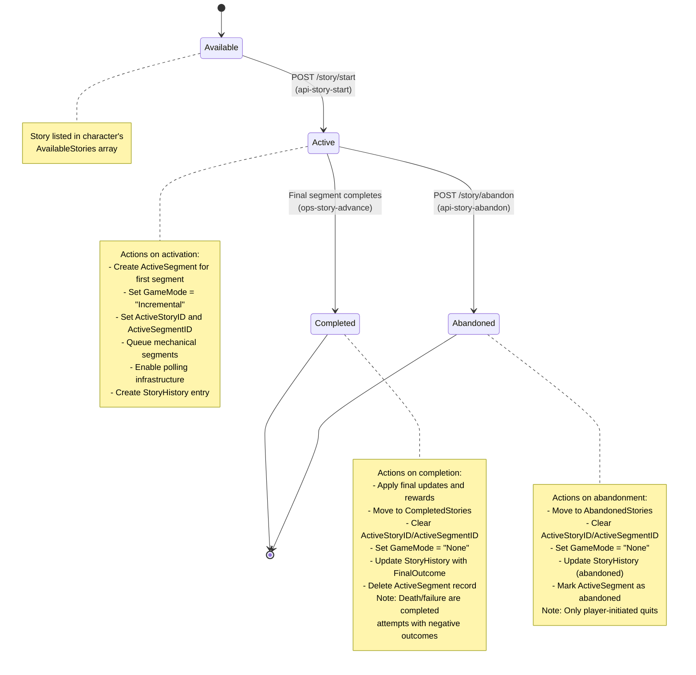
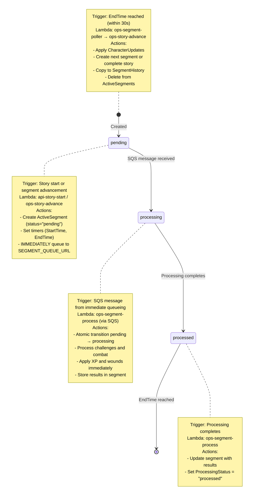
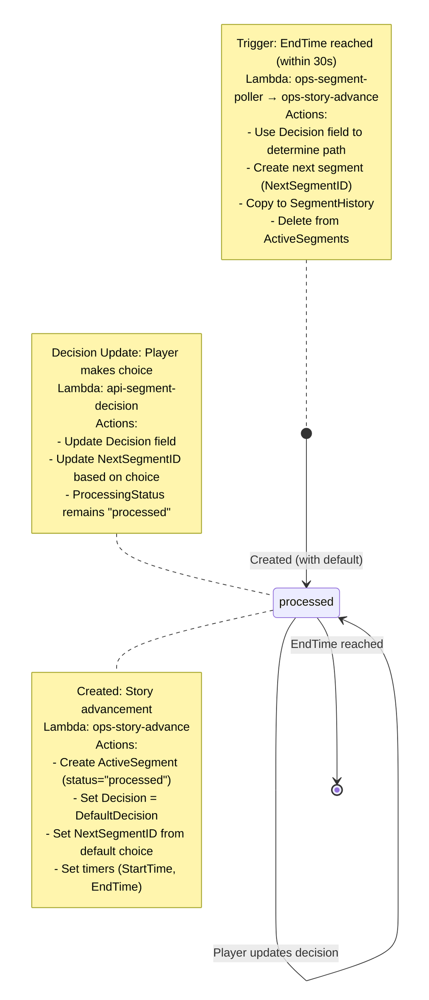
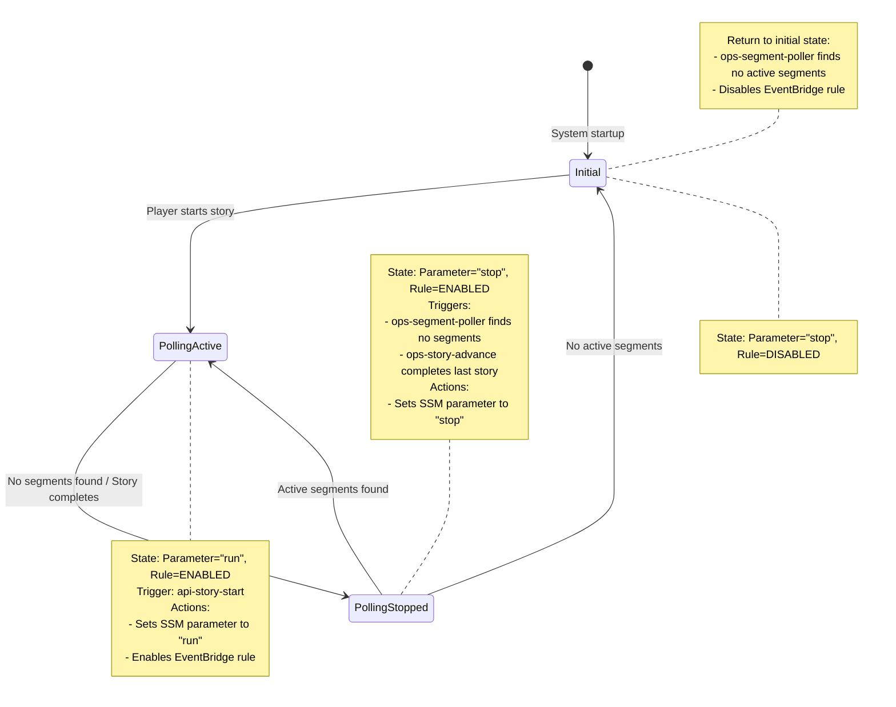

# Incremental Story and Segment State Machines

## Overview

The Eidolon Engine's incremental game mode features a story-driven progression system where characters navigate through interconnected segments that form complete narratives. Stories are composed of segments, which are time-based activities that advance automatically once initiated. This document describes the state machines that govern both stories and segments, as well as the Lambda functions that implement the state transitions.

### Core Concepts

- **Story**: A complete narrative arc available to characters based on their archetype and progress
- **Segment**: A single timed activity within a story (mechanical challenges or decisions) — see [Incremental Requirements](incremental-requirements.md#24-segment-types) for canonical definitions
- **Front-loaded Processing**: All outcomes are calculated when segments start, not when they end
- **Event-driven Advancement**: A polling system checks every minute for completed segments
- **Mode Exclusivity**: Characters can only be active in one game mode at a time (MUD or Incremental); refer to [Character Mode Workflow](incremental-mud-workflow.md) for the full lifecycle

### Production Infrastructure

The story system relies on the infrastructure described in the [Deployment Guide](deployment.md#system-architecture) and shares the same Lambda and DynamoDB resources referenced throughout that document.

## Schema Elements

### Story Table

The Story table contains prototype definitions for all available stories:

- **StoryID** (HASH): UUID of the story
- **Title**: Display title of the story
- **StoryType**: one-time, daily, or repeatable
- **FirstSegmentID**: Starting segment UUID
- **Prerequisites**: Requirements to start (skills, items)
- **BaseXPMultiplier**: XP modifier (default 0.5, must be < 1.0)

### Segments Table

The Segments table contains prototype definitions for all story segments:

- **StoryID** (HASH): Parent story UUID
- **SegmentID** (RANGE): Segment UUID
- **SegmentType**: decision or mechanical
- **SegmentDuration**: Time in seconds for completion
- **DecisionOptions**: For decision segments, maps choice ID to option data (Text, Description, Narrative, NextSegmentID)
- **Results**: For mechanical segments, outcome-specific branches (see Weighted Branching below)
- **Challenges**: List of skill/attribute challenges (mechanical segments only)
- **Combat**: Combat configuration if applicable (mechanical segments only)
- **TimeoutBehavior**: For decisions, optional weighted timeout branches

### ActiveSegments Table

The ActiveSegments table tracks currently running segment instances:

- **ActiveSegmentID** (HASH): Instance UUID
- **CharacterID** (GSI): Character UUID for querying
- **ProcessingStatus**: pending → processing → processed (then segment deleted)
- **StartTime/EndTime**: Unix timestamps defining the segment window
- **ClientEvents**: Pre-calculated event sequence for display
- **CharacterUpdates**: Changes to apply on completion
- **Outcome**: death/failure/minimal/normal/exceptional
- **BranchMetadata**: Branch selection tracking (SelectionMethod, BranchLabel, BranchIndex, etc.)

### StoryHistory Table

Records completed story attempts (one per character-story combination):

- **CharacterID** (HASH): Character UUID
- **StoryInstanceID** (RANGE): UUIDv7 for this story instance (unique per execution)
- **StoryID**: UUID of the story
- **FinalOutcome**: Overall story result (death/failure/minimal/normal/exceptional/abandoned)
- **SegmentHistory**: List of ActiveSegmentIDs in chronological order
- **SkillXPAwarded/AttributeXPAwarded**: Total XP earned from all segments

Note: Each story attempt creates a new StoryInstanceID. The system does not track attempt numbers.

### SegmentHistory Table

Archives completed segment instances:

- **CharacterID** (HASH): Character UUID
- **ActiveSegmentID** (RANGE): Instance UUID from ActiveSegments
- **StoryInstanceID**: UUIDv7 of the story instance from StoryHistory
- **CharacterUpdates**: All character changes applied (contains SkillXP and AttributeXP)
- **Outcome**: Final outcome of the segment
- **ProcessedAt**: Unix timestamp when outcomes were calculated
- **BranchMetadata**: Copy of branch selection tracking from ActiveSegments

## Story State Machine

### States

Stories exist in one of these states relative to a character:

1. **Available**: Listed in character's AvailableStories array
2. **Active**: Character has ActiveStoryID set
3. **Completed**: Listed in CompletedStories array
4. **Abandoned**: Listed in AbandonedStories array

### State Transitions



### Story Lifecycle

1. **Initialization** (from prototype):

   - Story definitions loaded from Story table
   - Available stories determined by archetype and prerequisites
   - Added to character's AvailableStories list

2. **Activation**:

   - Player selects story via api-story-start
   - First segment copied from Segments table
   - ActiveSegment instance created with calculated outcomes
   - Character state atomically updated

3. **Progression**:

   - Segments advance one by one
   - Each segment completion triggers next segment creation
   - Story remains active until terminal outcome or completion

4. **Completion**:
   - Final segment processed by ops-story-advance
   - All rewards and effects applied
   - Story moved to history tables
   - Character returned to idle state

## Segment State Machine

### Processing Status States

Segments use ProcessingStatus to track their processing state:

1. **pending**: Mechanical segments awaiting processing
2. **processing**: Mechanical segments currently being processed
3. **processed**: Segment ready for advancement when timer expires

**Note**: There is no "completed" ProcessingStatus. When a segment advances (timer expires),
it is deleted from ActiveSegments and archived to SegmentHistory. The segment lifecycle ends
at "processed" status.

### ProcessingStatus Concurrency Control

The ProcessingStatus field provides atomic state transitions to prevent duplicate processing:

- **false** (or absent): Segment available for processing
- **true**: Segment claimed by a Lambda instance for exclusive processing

This is implemented as a DynamoDB conditional update to ensure atomicity. Despite documentation
suggesting it would store a request ID, the implementation uses a simple boolean for efficiency.

### Complete State Transitions

#### Mechanical Segments



#### Decision Segments



### Segment Types and Processing

#### Mechanical Segments

- Contain exactly **one** mechanical challenge: either a single non-combat challenge OR a combat challenge
- **IMPORTANT**: Do not combine multiple challenges in one segment (no combat + skill check, no multiple skill checks)
- Queued IMMEDIATELY at creation to SEGMENT_QUEUE_URL
- Processed by ops-segment-process via SQS
- XP and wounds applied during processing
- Outcomes: death/failure/minimal/normal/exceptional

#### Decision Segments

Decision segments present player choices and contain no skill checks, combat, or mechanical calculations. All game mechanics belong in mechanical segments.

- Present story choices to the player
- Created with ProcessingStatus="processed" and default decision pre-applied
- Player can override decision via api-segment-decision before timer expires
- NextSegmentID is always set (either default or player's choice)
- Timer expiry uses whatever Decision is currently set
- Generate ClientEvents with narrative text to enrich segment history
- **No Difficulty ratings** - decision segments are for player choice, not mechanics

#### Challenge Outcome Design

Non-combat challenges should generally result in segment repetition on failure, allowing players to retry until they succeed or choose to abandon the story. However, certain challenge types warrant different outcomes based on narrative context:

**Repeatable Challenges** (default pattern):

- **Investigation challenges**: Failed investigation attempts should loop back to the same segment, allowing the player to retry
- **Puzzle challenges**: Failed puzzle attempts typically repeat the segment
- **Social challenges**: Failed persuasion or negotiation attempts generally allow retry
- **Skill checks without consequences**: Any challenge where failure doesn't change the physical situation

Example branching for investigation challenge:
```json
"Results": {
  "Failure": {
    "Narrative": "You search the room but find nothing useful...",
    "NextSegmentID": "same-segment-id"  // Repeat this segment
  },
  "Normal": {
    "Narrative": "You discover a hidden compartment...",
    "NextSegmentID": "next-segment-id"  // Progress forward
  }
}
```

**Progressive Challenges** (contextual branching):

- **Physical consequences**: Challenges where failure changes the situation should progress the story
- **Environmental hazards**: Failed navigation or tumbling challenges that result in falling or injury
- **Time-sensitive challenges**: Challenges where failure represents time passing or opportunity lost
- **Irreversible actions**: Attempts that cannot be undone once initiated

Example branching for tumbling while climbing:
```json
"Results": {
  "Failure": {
    "Narrative": "You lose your grip and tumble down through the branches...",
    "NextSegmentID": "forest-floor-segment"  // Earlier in story, different location
  },
  "Normal": {
    "Narrative": "You navigate the treetops successfully...",
    "NextSegmentID": "canopy-destination-segment"  // Continue upward
  }
}
```

**Design Principles**:

1. **Default to repetition**: Unless there's a narrative reason for progression, failed non-combat challenges should repeat
2. **Consider context**: Physical challenges with consequences (falling, injury, detection) should progress the story
3. **Provide alternatives**: If a segment doesn't repeat on failure, ensure the new path is interesting and not purely punitive
4. **Avoid dead ends**: Progressive failures should lead to viable story paths, not immediate death or story termination

#### Wound Healing

Wound healing is time-based and independent of segments. Wounds heal based on their type:

- Bashing wounds: heal after 15 minutes from infliction
- Lethal wounds: heal after 6 hours from infliction
- Aggravated wounds: heal after 7 days from infliction

### Flexible Branching Design

#### Outcome-Based Branching

The story system supports flexible narrative branching where any outcome can lead to different paths. Each segment's Results block maps outcomes to their consequences:

```json
"Results": {
  "Death": {
    "Narrative": "Your journey ends here...",
    "NextSegmentID": null  // Story ends
  },
  "Failure": {
    "Narrative": "You are captured by guards...",
    "NextSegmentID": "prison-escape-segment"  // Continue in prison
  },
  "Minimal": {
    "Narrative": "You barely succeed...",
    "NextSegmentID": "next-segment-wounded"  // Different path
  },
  "Normal": {
    "Narrative": "You succeed as expected...",
    "NextSegmentID": "next-segment-standard"  // Standard path
  },
  "Exceptional": {
    "Narrative": "Your exceptional performance is noted...",
    "NextSegmentID": "next-segment-bonus"  // Bonus path
  }
}
```

#### Non-Traditional Death Handling

Death outcomes don't always end the story. The system supports:

- **Ghost Stories**: Death leads to afterlife segments
- **Divine Intervention**: Death triggers resurrection paths
- **Underworld Journeys**: Death begins a new quest
- **Reincarnation**: Death leads to rebirth scenarios

Example:

```json
"Death": {
  "Narrative": "As darkness takes you, you feel your spirit rise...",
  "NextSegmentID": "ghost-revenge-segment-1",
  "Effects": {
    "State": "ghost"  // Character becomes a ghost
  }
}
```

#### Failure as Opportunity

Failure outcomes can open entirely new storylines:

- **Capture and Escape**: Failure leads to prison break stories
- **Redemption Arcs**: Failure triggers second chance narratives
- **Alternative Solutions**: Failure reveals hidden paths
- **Training Montages**: Failure leads to improvement segments

Example:

```json
"Failure": {
  "Narrative": "The master shakes his head. 'You need more training.'",
  "NextSegmentID": "training-montage-segment",
  "Effects": {
    "Room": 15  // Training grounds
  }
}
```

#### Weighted Branching with Prerequisites

The system supports weighted random branching where a single outcome can lead to multiple possible paths based on probability and character prerequisites. This allows for dynamic narrative variation and stat-gated content.

**Structure:**

```json
"Results": {
  "Normal": {
    "Narrative": "You examine the paths ahead...",
    "Branches": [
      {
        "NextSegmentID": "segment-easy",
        "Weight": 0.6,
        "Label": "common_path",
        "Prerequisites": {
          "MinSkills": {"perception": 3},
          "MinAttributes": {"intelligence": 2}
        }
      },
      {
        "NextSegmentID": "segment-hard",
        "Weight": 0.4,
        "Label": "challenging_path",
        "Prerequisites": {
          "MinSkills": {"perception": 7}
        }
      }
    ],
    "FallbackSegmentID": "segment-default"
  }
}
```

**Selection Process:**

1. **Filter by Prerequisites**: Check character skills, attributes, and required items
2. **Renormalize Weights**: Adjust weights for only the available branches
3. **Random Selection**: Use cryptographically secure random (secrets module)
4. **Apply Fallback**: If no branches pass prerequisites, use FallbackSegmentID
5. **Track Metadata**: Store selection details in BranchMetadata field

**Branch Metadata:**

All branch selections are tracked in the ActiveSegments and SegmentHistory records:

- `SelectionMethod`: weighted_random, prerequisite_fallback, player_decision, etc.
- `BranchLabel`: Analytics label from the selected branch
- `BranchIndex`: Which branch was selected (0-indexed)
- `TotalBranches`: How many branches were defined
- `AvailableBranches`: How many passed prerequisite checks
- `RandomSeed`: Seed used for selection (testing only)

**Weighted Decision Timeouts:**

Decision segments can use weighted random selection on timeout instead of a fixed default:

```json
{
  "SegmentType": "decision",
  "DecisionOptions": {
    "investigate": { "NextSegmentID": "seg-investigate" },
    "flee": { "NextSegmentID": "seg-flee" }
  },
  "TimeoutBehavior": {
    "Type": "weighted",
    "Branches": [
      { "Decision": "investigate", "Weight": 0.7 },
      { "Decision": "flee", "Weight": 0.3 }
    ]
  },
  "DefaultDecision": "flee"
}
```

If TimeoutBehavior is not specified, the system falls back to DefaultDecision.

**Validation:**

Use `scripts_python/validate_branching.py` to validate:

- Branch weights sum to 1.0 (tolerance: 0.001)
- NextSegmentIDs reference valid segments in the story
- Prerequisite structure is valid
- No circular dependencies exist

#### Branching Principles

1. **No Hardcoded Assumptions**: The system doesn't assume death or failure ends stories
2. **Narrative Freedom**: Designers control all branching through data
3. **Outcome Equality**: Any outcome can lead to any result
4. **Conditional Progression**: Different outcomes create different player experiences
5. **Stat-Based Gating**: Branches can require specific skills/attributes to unlock
6. **Probabilistic Variation**: Weighted branches create replay value

### Segment Lifecycle

1. **Creation** (from prototype):

   - Segment definition loaded from Segments table
   - ActiveSegment instance created with UUID
   - All outcomes calculated immediately (front-loaded)
   - ClientEvents generated for entire duration

2. **Processing** (mechanical only):

   - Poller detects segment ready for processing
   - Queued to SQS for ops-segment-process
   - Challenges evaluated, combat simulated
   - XP and wounds applied to character

3. **Waiting**:

   - Segment timer runs (SegmentDuration)
   - Client displays events over time
   - No server processing during wait

4. **Advancement**:

   - Poller detects EndTime reached
   - Queued to SQS for ops-story-advance
   - Character updates applied
   - Next segment created or story completed

5. **Archival**:
   - All segment data copied to SegmentHistory
   - ActiveSegment record deleted
   - History preserved for analytics

## Lambda Function Machinery

### Production Configuration

All Lambda functions are deployed with:

- **Runtime**: Python 3.12
- **Memory**: 128MB
- **Timeout**: 30 seconds
- **Shared Execution Role**: `eidolon-lambda-execution-role`
- **DynamoDB Policy**: `eidolon-dynamodb-policy` with DescribeTable permission
- **Fixed Logical IDs**: Preventing recreation on stack updates
- **Post-Deployment Updates**: Functions updated from S3 artifacts

### API Layer Functions

**api-story-start** (Logical ID: `ApiStoryStartFunction`):

- Validates prerequisites and character state
- Creates first ActiveSegment with pre-calculated outcomes
- Updates character to active game mode (GameMode="Incremental")
- Queues mechanical segments to `eidolon-processing-queue`
- **Polling Management**: Sets SSM parameter to "run" AND enables EventBridge rule
- Environment: `SEGMENT_QUEUE_URL` for SQS integration

**api-segment-decision** (Logical ID: `ApiSegmentDecisionFunction`):

- Records player choice in Decision field
- Sets DecisionMadeAt timestamp
- Returns confirmation to client

**api-story-abandon** (Logical ID: `ApiStoryAbandonFunction`):

- Marks story as abandoned
- Clears character active state
- Records in StoryHistory

### Processing Layer Functions

**ops-segment-poller** (Logical ID: `OpsSegmentPollerFunction`):

- **Trigger**: EventBridge rule `eidolon-story-poller` (1-minute schedule)
- Reads SSM parameter `/eidolon/story/config` for "run"/"stop" state
- Queries for segments with EndTime <= now
- Sends ALL completed segments to `eidolon-advancement-queue`
- **Polling State Management**:
  - If parameter="run" and no segments found: Sets parameter to "stop"
  - If parameter="stop": Checks for active segments
    - If active segments exist: Sets parameter back to "run"
    - If no active segments: Disables EventBridge rule
- Environment: `SSM_POLLER_STATE_PARAMETER` (defaults to `/eidolon/story/config`), queue URLs

**ops-segment-process** (Logical ID: `OpsSegmentProcessFunction`):

- **Trigger**: SQS `eidolon-processing-queue`
- Claims segment by transitioning ProcessingStatus to processing (prevents duplicates)
- Processes mechanical challenges and combat
- Applies XP and wounds immediately to character
- Updates segment with outcome and results
- **No polling management** - focused solely on segment processing
- Environment: `SEGMENT_BATCH_SIZE` for processing limits

**ops-story-advance** (Logical ID: `OpsStoryAdvanceFunction`):

- **Trigger**: SQS `eidolon-advancement-queue`
- Claims segment by checking ProcessingStatus for idempotency
- Processes simple segments (decision) if not already processed
- Applies deferred CharacterUpdates (combat rewards, story effects)
- Creates next segment or completes story
- **Polling Management**: When story completes (next_segment_id is None):
  - Checks if any active segments remain
  - If none: Sets SSM parameter to "stop" (does NOT touch EventBridge)
- Resets GameMode="None" when story completes
- Writes to story_history and segment_history tables

### Queue Architecture

**Production Queue Configuration**:

**eidolon-processing-queue** (SQS Standard Queue):

- URL: `https://sqs.{region}.amazonaws.com/{account}/eidolon-processing-queue`
- Feeds ops-segment-process Lambda
- Handles mechanical segments only
- Message retention: 4 days
- Visibility timeout: 30 seconds
- Dead-letter queue after 3 retries

**eidolon-advancement-queue** (SQS Standard Queue):

- URL: `https://sqs.{region}.amazonaws.com/{account}/eidolon-advancement-queue`
- Feeds ops-story-advance Lambda
- Handles all segment types for completion
- Message retention: 4 days
- Visibility timeout: 30 seconds
- Dead-letter queue after 3 retries

### Polling Infrastructure

**IMPORTANT: The Poller's Role**

The ops-segment-poller Lambda (triggered every minute by EventBridge) uses a **two-query approach** for different segment scenarios:

**Query 1 - Segments Approaching Expiry** (within 90 seconds):

- Finds ALL segments that will expire before the next poll (90-second buffer)
- For processed segments: Queues them to STORY_ADVANCEMENT_QUEUE for normal advancement
- For unprocessed segments: Marks them as "exceptional" (protecting players from failures), then queues for advancement

**Query 2 - Stuck Mechanical Segments**:

- Finds mechanical segments where:
  - StartTime > 5 minutes ago (stuck threshold)
  - EndTime > 90 seconds from now (enough time to retry)
  - ProcessingStatus is "pending" or "processing"
- Resets stuck "processing" segments to "pending"
- Re-queues them to SEGMENT_QUEUE_URL for retry

**The poller does NOT**:

- Initially queue mechanical segments (that happens immediately at creation)
- Process segments directly (all processing goes through SQS queues)
- Create segments (only api-story-start and ops-story-advance create segments)

**SSM Parameter** (`/eidolon/story/config`):

- Stores polling state: "run" or "stop" (string values, not JSON)
- Checked by poller each invocation
- **State Transitions**:
  - Set to "run" by: api-story-start, ops-segment-poller (when finding active segments)
  - Set to "stop" by: ops-story-advance (when completing last story), ops-segment-poller (when no segments to process)

**EventBridge Rule** (`eidolon-story-poller`):

- Schedule: rate(1 minute)
- Target: ops-segment-poller Lambda
- State: DISABLED by default
- **Enable/Disable Authority**:
  - api-story-start can enable the rule
  - ONLY ops-segment-poller can disable the rule (when parameter="stop" and no active segments)
- Race condition window: <100ms between final check and disable (acceptable)

### Polling State Flow

The polling system follows this state machine:



**Key Design Principles**:

- Separation of concerns: SSM parameter controls polling behavior, EventBridge rule controls execution
- Single responsibility: Each Lambda has specific polling authority
- Graceful degradation: System continues even if polling management fails
- Cost optimization: Automatic shutdown when no stories active

## Error Recovery and Edge Cases

### Timeout Recovery

- Segments past EndTime marked "exceptional"
- Gives players best possible outcome
- Prevents indefinite waiting

### Stuck Segment Recovery

- Mechanical segments stuck >15 minutes get retried
- ProcessingStatus reset to pending to allow reprocessing
- Maximum 3 retry attempts

### Concurrent Processing Prevention

- ProcessingStatus state machine prevents duplicate processing
- Atomic DynamoDB operations ensure consistency
- SQS provides at-least-once delivery

### Failure Modes

**Processing Failure**:

- Segment remains in processing state
- Poller eventually marks as exceptional
- Player protected from system errors

**Queue Message Loss**:

- Poller re-queues unprocessed segments
- Idempotent processing prevents issues
- History tables provide audit trail

**Lambda Timeout**:

- ProcessingStatus remains in processing state
- Poller detects stuck segment
- Automatic retry after 15 minutes

## Summary

The Eidolon Engine's incremental story system implements a robust state machine architecture that ensures reliable progression through narrative content. The front-loaded processing model calculates all outcomes when segments begin, allowing for predictable client experiences. The distributed Lambda architecture with SQS queuing provides scalability and fault tolerance, while the comprehensive history tracking enables analytics and debugging. The system prioritizes player experience by gracefully handling failures and providing automatic recovery mechanisms.

### Recovery and Fault Tolerance

The system provides automatic recovery through multiple mechanisms:

- EventBridge ensures processing continues even if individual Lambda invocations fail
- Server-side state authority eliminates client synchronization issues
- Multiple cleanup paths prevent players from getting permanently stuck
- All segments guaranteed to eventually process or timeout with player-favorable outcomes
