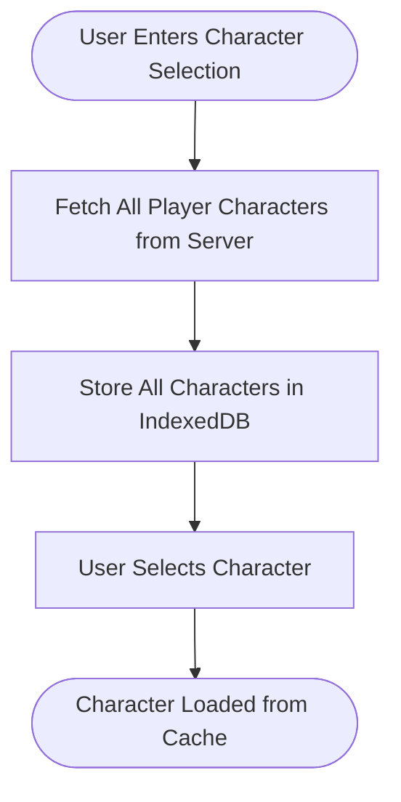
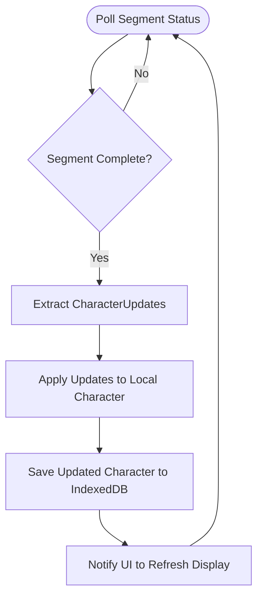
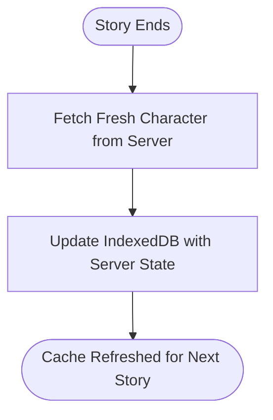

# Release Four Report - IndexedDB Character Caching

## Overview

This release implements client-side character data caching using IndexedDB to minimize server calls and improve performance. The system fetches complete character data at character selection and story completion, then maintains the local copy through incremental updates from segment status responses rather than fetching the full character record for each segment.

## Current State Analysis

### Existing Character Data Flow

1. **Character Loading**: Full character fetch via `GET /character?CharacterID={id}`
2. **Storage**: SharedPreferences for persistence, in-memory cache for session
3. **Updates**: Character reloaded at each segment boundary
4. **Polling**: Segment status checked every 60 seconds or per server guidance

### Performance Issues

- **Redundant Fetches**: Full character data retrieved for every segment transition
- **Network Overhead**: ~10-20KB per character fetch × dozens of segments per story
- **Latency**: 200-500ms per character fetch adds up during story progression
- **Battery Impact**: Excessive network calls on mobile devices

## Proposed Solution Architecture

### Core Principles

1. **Single Source of Truth**: Server remains authoritative for character state
2. **Incremental Updates**: Apply changes from segment responses to local copy
3. **Cache Refresh**: Fetch fresh data from server at story completion

### IndexedDB Schema Design

The database will be named "EidolonDB" version 1, containing three object stores to manage character data and items:

#### 1. Characters Store - Primary Character Storage

This object store will serve as the primary cache for character data. Each record will be keyed by the character ID and will contain the full character object along with metadata for cache management. The store will track when the character was last fetched from the server for cache freshness. Two indexes will enable efficient queries: one by player ID to find all characters belonging to a player, and another by last fetch time for cache invalidation strategies.

#### 2. Items Store - Item Instance Storage

The items store will cache individual item instances belonging to characters. Each item record will be keyed by its UUID and contain only the essential item data: the item UUID itself and the UUID of its prototype. This minimal storage approach reduces redundancy since the full item details are stored in the prototype. The store will include an index on character ID to efficiently retrieve all items belonging to a specific character.

#### 3. Item Prototypes Store - Item Template Storage

The item prototypes store will cache the complete prototype definitions for all items. Each prototype record will be keyed by its UUID and contain the full item template including name, description, stats, requirements, and any special properties. Since prototypes are shared across all instances of an item type, storing them separately eliminates duplication. The store will track when each prototype was last fetched to support cache invalidation strategies.

## Implementation Plan

### Design Principles

Following the project's philosophy, the implementation will prioritize:
- Simple, focused functions that do one thing well
- Clear interfaces and contracts between components
- Self-evident correctness through clean design
- Fail-fast with clear error messages
- Code that can be verified by inspection

### Phase 1: IndexedDB Infrastructure

#### 1.1 Database Service Implementation

The IndexedDB service will be implemented as a singleton service responsible for database initialization and management. During initialization, it will open a connection to the EidolonDB database with version 1.

When the database is opened for the first time or when the version changes, the service will create the necessary object stores. This involves establishing the three stores described in the schema design: characters, items, and item prototypes. Each store will be configured with its primary key path and appropriate indexes for efficient querying.

The service will provide methods for basic CRUD operations on each object store, handling transactions appropriately to ensure data consistency. It will also implement proper error handling for failed operations, falling back to fetching fresh data from the server if database operations fail.

#### 1.2 Character Repository Pattern

The character repository will serve as the primary interface for character data management, implementing a cache-first strategy to minimize server calls. The repository will coordinate between the IndexedDB service for local storage and the API service for server communication.

The repository will fetch complete character data from the server at two specific points: when entering the character selection screen (loading all of the player's characters), and after each story completes. This results in N+1 character fetches per session where N is the number of stories played. These fresh fetches ensure the cache starts with accurate data and remains synchronized. Only characters actually loaded in the incremental game will be stored in IndexedDB - characters created but never accessed will not be cached.

For segment updates during story gameplay, the repository will implement an incremental update strategy. When receiving character updates from a segment response, it will retrieve the current cached character state and apply only the changes specified in the segment update. This includes updating experience points for skills and attributes, modifying resource values, applying wounds, and adjusting health or essence values. After applying updates, the repository will update the cache with the new character state.

The repository will maintain consistency by ensuring all updates are atomic and properly sequenced, preventing race conditions during concurrent operations.

#### 1.3 Item Loading Process

The item loading system will implement an efficient two-tier caching strategy to minimize network calls when loading character inventory. The process begins when a character's items need to be displayed or when new items are received from segment updates.

When loading items, the system will first fetch the item brief for each item UUID. The item brief API call (`GET /item/brief?ItemID={id}`) returns only the essential data: the item's UUID and its prototype UUID. This lightweight response minimizes initial network overhead.

After receiving the item briefs, the system will check the local IndexedDB cache for each prototype UUID. For any prototypes not found in the cache, it will fetch them using the prototype API (`GET /item/prototype?PrototypeID={id}`). These prototype records contain the complete item template data including all properties, stats, and descriptions. Once fetched, prototypes are stored in IndexedDB for future use.

This process repeats for all items in the character's inventory, building up a local cache of prototypes over time. Since many items share the same prototype (for example, multiple health potions), this approach significantly reduces redundant network calls. A character with 20 items might only require fetching 5-10 unique prototypes.

When a segment response provides new items, the same loading process is triggered. The system fetches the item brief, checks for the prototype in the cache, and only fetches missing prototypes from the server. This ensures that item data remains consistent and up-to-date while minimizing network traffic.

### Phase 2: Story Lifecycle Integration

#### 2.1 Modified Story Polling Service

The story polling service will be modified to leverage the new IndexedDB caching system instead of fetching full character data for each segment. When processing a segment status response, the service will check if the segment is marked as processed and contains character updates.

Instead of requesting the complete character record from the server, the service will use the character repository's incremental update functionality. This will apply only the changes specified in the segment response to the locally cached character data. After applying updates, the service will notify the UI layer with the updated character information for immediate display.

When the service detects that a story has ended (indicated by the StoryComplete flag or a null ActiveSegmentID), it will fetch a fresh copy from the server which automatically becomes the new cached version. This ensures the cache remains accurate for the next story session.

### Phase 3: Deployment

The system will be deployed as a complete replacement with no migration required. The updated client will use IndexedDB for all character caching on web platforms. Users will simply log back in after deployment and the new caching system will initialize automatically.

## Testing Strategy

Per the project's testing policy (see documentation/unit-tests.md), this implementation focuses on integration testing and manual verification rather than unit tests. Well-designed, simple code with clear interfaces provides more value than comprehensive unit test coverage.

### 1. Integration Testing

Integration tests will validate the complete flow of character data through the system, ensuring all components work together correctly. The tests will simulate realistic game scenarios to verify system behavior under actual usage patterns.

The character caching tests will validate the complete story lifecycle:
- Fetch a character from the server at character selection
- Start a story and apply multiple segment updates to the local cache
- Verify incremental updates are applied correctly during gameplay
- Confirm the cache is refreshed from the server at story completion

Additional integration tests will cover edge cases such as network failures during server fetches and recovery from corrupted cache data.

### 2. Manual Testing

Critical user paths will be tested manually to verify:
- Character selection properly loads and caches data
- Segment updates correctly modify cached character state
- Story completion refreshes the cache from server
- Item loading follows the two-tier caching strategy

### 3. Browser Compatibility Testing

- Chrome 90+ (primary target)
- Firefox 88+
- Safari 14+
- Edge 90+
- Mobile Safari (iOS 14+)
- Chrome Mobile (Android)

## Performance Metrics

### Expected Improvements

| Metric | Current | Target | Improvement |
|--------|---------|--------|------------|
| Character fetches per session | 54 (18 per story × 3 stories) | 5 (2 at selection + 3 after stories) | 91% reduction |
| Network traffic | 200-400KB | 20-40KB | 90% reduction |
| Average segment latency | 500ms | 50ms | 90% reduction |
| Battery consumption | High | Low | Significant reduction |

## Cost Analysis for 10,000 Active Users

### Assumptions
- Average user plays 3 stories per day
- Average story has 18 segments
- Average player has 2 characters
- Character data size: 15KB per fetch
- Segment update size: 0.5KB per update
- AWS region: us-east-1

### Current Implementation Costs (Monthly)

**API Gateway Requests:**
- Character fetches: 10,000 users × 3 stories × 18 fetches × 30 days = 16,200,000 requests
- Segment status polls: 10,000 users × 3 stories × 18 segments × 30 days = 16,200,000 requests
- Total API requests: 32,400,000
- Cost: 32.4M × $1.00 per million = **$32.40**

**Lambda Invocations (GET /character):**
- Invocations: 16,200,000
- Average duration: 100ms at 128MB
- GB-seconds: 16.2M × 0.1s × 0.125GB = 202,500 GB-seconds
- Cost: 202,500 × $0.0000166667 = **$3.38**

**Data Transfer:**
- Character data: 16.2M × 15KB = 243GB
- Segment responses: 16.2M × 2KB = 32.4GB
- Total: 275.4GB
- Cost: 275.4GB × $0.09 = **$24.79**

**DynamoDB Reads:**
- Character table reads: 16.2M × 4KB units = 64.8M RCUs
- Cost: 64.8M × $0.00000025 = **$16.20**

**Current Monthly Total: $76.77**

### With IndexedDB Caching (Monthly)

**API Gateway Requests:**
- Character selection fetches: 10,000 users × 2 characters × 30 days = 600,000 requests
- Story completion fetches: 10,000 users × 3 stories × 30 days = 900,000 requests
- Segment status polls: 10,000 users × 3 stories × 18 segments × 30 days = 16,200,000 requests
- Item brief calls (est. 5 per story): 10,000 × 3 × 5 × 30 = 4,500,000 requests
- Item prototype calls (est. 2 new per story): 10,000 × 3 × 2 × 30 = 1,800,000 requests
- Total API requests: 24,000,000
- Cost: 24M × $1.00 per million = **$24.00**

**Lambda Invocations:**
- Character fetches: 1,500,000 × 100ms = 18,750 GB-seconds × $0.0000166667 = **$0.31**
- Item brief: 4,500,000 × 20ms = 11,250 GB-seconds × $0.0000166667 = **$0.19**
- Item prototype: 1,800,000 × 30ms = 6,750 GB-seconds × $0.0000166667 = **$0.11**
- Total Lambda: **$0.61**

**Data Transfer:**
- Character data: 1.5M × 15KB = 22.5GB
- Segment updates: 16.2M × 0.5KB = 8.1GB
- Item briefs: 4.5M × 0.2KB = 0.9GB
- Item prototypes: 1.8M × 2KB = 3.6GB
- Total: 35.1GB
- Cost: 35.1GB × $0.09 = **$3.16**

**DynamoDB Reads:**
- Character reads: 1.5M × 4KB = 6M RCUs = **$1.50**
- Item reads: 6.3M × 1KB = 6.3M RCUs = **$1.58**
- Total DynamoDB: **$3.08**

**New Monthly Total: $31.85**

### Cost Comparison Summary

| Component | Current | With Cache | Savings |
|-----------|---------|------------|---------|
| API Gateway | $32.40 | $24.00 | $8.40 (26%) |
| Lambda | $3.38 | $0.61 | $2.77 (82%) |
| Data Transfer | $24.79 | $3.16 | $21.63 (87%) |
| DynamoDB | $16.20 | $3.08 | $13.12 (81%) |
| **Total Monthly** | **$76.77** | **$30.85** | **$45.92 (60%)** |
| **Annual** | **$921.24** | **$370.20** | **$551.04** |

### Additional Considerations

**Benefits Not Captured in Direct Costs:**
- Reduced latency improves user experience and retention
- Lower battery usage on mobile devices
- Reduced server load allows better scaling
- Fewer DynamoDB hot partition risks

**Scaling Notes:**
- Savings scale linearly with user count
- At 100,000 users: ~$5,510/year savings
- At 1 million users: ~$55,100/year savings

## Implementation Status

### Phase 1: Foundation
- [ ] Create IndexedDB service
- [ ] Implement character repository

### Phase 2: Integration
- [ ] Integrate with story polling
- [ ] Implement segment update application

### Phase 3: Testing
- [ ] Integration tests
- [ ] Manual testing of critical paths
- [ ] Browser compatibility testing

### Phase 4: Deployment
- [ ] Deploy updated client
- [ ] Address any issues

## Risk Mitigation

### 1. Data Corruption
- **Risk**: Incomplete writes, browser crashes
- **Mitigation**: Overwrite corrupted data from server GET calls (server is authoritative)

### 2. Cache Staleness
- **Risk**: Local cache may become outdated
- **Mitigation**: Server is authoritative, fresh data fetched at character selection and story completion

## Success Criteria

1. **Performance**: 90% reduction in character API calls
2. **Reliability**: Cache correctly applies segment updates
3. **User Experience**: No perceivable latency during story progression
4. **Compatibility**: Works on 95% of target browsers

## Appendix A: API Changes

New endpoints required for item caching:
- `GET /item/brief?ItemID={id}` - Returns item UUID and prototype UUID only
- `GET /item/prototype?PrototypeID={id}` - Returns full prototype record

Existing endpoints:
- `GET /character?CharacterID={id}` - Used at character selection and story completion
- `GET /segment/status` - Primary data source for updates during story

## Appendix B: Data Flow Diagrams

The data flow through the IndexedDB caching system follows three primary paths corresponding to different stages of story gameplay:

### Character Selection Flow

### Segment Processing Flow

### Story Completion Flow

## Next Steps

1. Review and approve design
2. Implement IndexedDB infrastructure (Phase 1)
3. Complete story lifecycle integration (Phase 2)
4. Execute comprehensive testing (Phase 3)
5. Deploy updated client

---

*Document Version: 1.0*
*Created: 2024-10-16*
*Status: Planning Phase*