# Release 2 Report — Ironclad Beta: Security, Observability, and Production Readiness

**Date:** 2025-10-04 (Planning)
**Branch:** inc-25 (R2 work continues on R1 branch)
**Status:** Planning Phase
**Previous Release:** R1 (inc-24 - State Management and Atomic Updates completed on inc-25)

---

## Executive Summary

Release 2 focuses on production readiness: comprehensive security hardening, observability infrastructure, and operational documentation. This release prepares the Incremental subsystem for limited internal beta testing by implementing all critical pre-production requirements.

**Ship Gate:** Security audit passed with no critical findings, monitoring operational, internal beta-ready.

**Objectives:**
1. **Security Hardening** — WAF deployment, security audit, incident response plan
2. **Observability** — CloudWatch dashboards, alarms, structured logging
3. **Documentation** — Story authoring guides, troubleshooting, operations runbooks
4. **User Experience** — Character mode transitions, story browsing UI
5. **Testing & Validation** — Integration test suite for concurrent operations

**Target:** Internal beta with 10-50 users, no external exposure yet.

---

## R2 Task Categories

### Critical Path (Security) — 3 Tasks ✓ COMPLETED
- R2-SEC-1: WAF on CloudFront (#695) ✓
- R2-SEC-2: WAF on API Gateway (#694) ✓
- R2-SEC-3: WAF on Cognito (#693) ✓

### Deferred Until Principle Development Complete
- R2-SEC-4: Security Audit (#616) - Full audit deferred
- R2-DOC-1: Story Creation Guide (#729) - Deferred
- R2-DOC-2: Story Schema Reference (#729) - Deferred
- R2-DOC-3: Troubleshooting Guide (#729) - Deferred
- R2-DOC-4: Operations Runbook (#729) - Deferred
- R2-INF-2: Basic Cost Controls (#615) - Deferred
- R2-UX-2: Story Browsing UI (#606) - Deferred

### Deferred Until Revenue Generation
- R2-OBS-1: CloudWatch Dashboards (#603) - Deferred
- R2-OBS-2: CloudWatch Alarms - Deferred

### Medium Priority (UX) — 1 Task
- R2-UX-1: Character Management UI (#722)

### Medium Priority (Infrastructure) — 1 Task ✓ COMPLETED
- R2-INF-1: Cognito Email Fix (#703) ✓

### High Priority (Testing) — 3 Tasks
- R2-TEST-3: Idempotency Verification
- R2-TEST-1: Story Lifecycle Integration Tests
- R2-TEST-2: Concurrent Operations Tests

**Total:** 8 active tasks (4 completed, 4 remaining), 9 deferred tasks

**Deferral Policy:**
- **Security Audit, Documentation, Cost Controls, Story Browsing UI:** Deferred until principle development complete
- **Observability (Dashboards/Alarms):** Deferred until revenue generation
- **Structured Logging:** Deferred until programmatic log analysis needed

---

## Task Details

### R2-SEC-1: Implement WAF Rules for CloudFront [#695]

**Goal:** Protect CloudFront distribution from DDoS and common web attacks.

**Priority:** CRITICAL
**Status:** ✓ COMPLETED
**Issue:** https://github.com/robinje/eidolon-engine/issues/695

#### Implementation Summary

**Configuration File:** `waf/cloudfront-cdn.yml`

**Implemented Rules (2 active):**
1. **Rate Limiting** - 2000 requests/5min per IP
2. **AWS IP Reputation List** - Block known malicious IPs

**Rationale for Simplification:**
- CloudFront serves static read-only content (Flutter web app)
- No write operations to protect
- XSS/injection protection happens at build time, not CDN
- Bot Control removed ($10/month cost, minimal benefit for static content)
- Geo-blocking handled by CloudFront native features

**CDK Integration:**
```python
# deployment/stacks/client_stack.py
from . import waf_config

def _create_waf_web_acl(self):
    config = waf_config.load_waf_config("waf/cloudfront-cdn.yml")
    web_acl = waf_config.create_web_acl(
        scope="CLOUDFRONT",
        stack=self,
        config=config,
        construct_id="CloudFrontWebACL"
    )
    return web_acl

# Associate with CloudFront distribution
cloudfront.Distribution(
    ...,
    web_acl_id=self.web_acl.attr_arn
)
```

**Files Created:**
- `waf/cloudfront-cdn.yml` — CloudFront WAF configuration (2 rules)
- `deployment/stacks/waf_config.py` — WAF utility for YAML→CDK conversion
- `deployment/waf_compliance.py` — Compliance checker tool

**Files Modified:**
- `deployment/stacks/client_stack.py` — WAF creation and association

**Cost:** $7/month ($5 ACL + $2 rules)

---

### R2-SEC-2: Implement WAF Rules for API Gateway [#694]

**Goal:** Protect REST API endpoints from abuse and attacks.

**Priority:** CRITICAL
**Status:** ✓ COMPLETED
**Issue:** https://github.com/robinje/eidolon-engine/issues/694

#### Implementation Summary

**Configuration File:** `waf/api-gateway.yml`

**Implemented Rules (5 active):**
1. **Rate Limit Authenticated** - 100 requests/min per user token
2. **Rate Limit Anonymous** - 20 requests/min per IP
3. **Request Size Limit** - Block requests >10KB (not 512KB - actual max is ~1KB)
4. **AWS Core Rule Set** - XSS, command injection, path traversal protection
5. **AWS IP Reputation List** - Block known malicious IPs

**Rationale for Simplification:**
- Endpoint-specific limits removed (internal controls sufficient)
- SQL injection protection removed (DynamoDB, sanitized inputs)
- Request size reduced to 10KB (realistic for JSON payloads)

**CDK Integration:**
```python
# deployment/stacks/api_stack.py
from . import waf_config

def _create_api_waf_web_acl(self):
    config = waf_config.load_waf_config("waf/api-gateway.yml")
    web_acl = waf_config.create_web_acl(
        scope="REGIONAL",
        stack=self,
        config=config,
        construct_id="ApiGatewayWebACL"
    )
    return web_acl

def _associate_api_waf(self):
    stage_arn = f"arn:aws:apigateway:{self.region}::/restapis/{self.api.rest_api_id}/stages/{self.api.deployment_stage.stage_name}"
    wafv2.CfnWebACLAssociation(
        self, "ApiWafAssociation",
        resource_arn=stage_arn,
        web_acl_arn=self.api_web_acl.attr_arn
    )
```

**Files Created:**
- `waf/api-gateway.yml` — API Gateway WAF configuration (5 rules)

**Files Modified:**
- `deployment/stacks/api_stack.py` — WAF creation and association

**Cost:** $10/month ($5 ACL + $5 rules)

---

### R2-SEC-3: Implement WAF Rules for Cognito [#693]

**Goal:** Protect Cognito authentication endpoints from credential stuffing and brute force.

**Priority:** CRITICAL
**Status:** ✓ COMPLETED
**Issue:** https://github.com/robinje/eidolon-engine/issues/693

#### Implementation Summary

**Configuration File:** `waf/cognito.yml`

**Implemented Rules (2 active):**
1. **General Cognito API Rate Limit** - 20 requests/min per IP (covers all auth operations)
2. **AWS IP Reputation List** - Block known malicious IPs

**Rationale for Simplification:**
- Cannot scope down by Cognito operation (InitiateAuth, SignUp, etc.) - WAF sees all as same endpoint
- Single unified rate limit covers login/signup/password reset
- Bot Control removed ($10/month, plus $0.40/1000 CAPTCHA attempts)
- Cognito Advanced Security NOT enabled (extremely expensive: $0.05/login = $500/10k logins)
- Core Rule Set removed (no benefit for AWS-managed Cognito infrastructure)

**CDK Integration:**
```python
# deployment/stacks/api_stack.py (Cognito resources imported here)
from . import waf_config

def _create_cognito_waf_web_acl(self):
    config = waf_config.load_waf_config("waf/cognito.yml")
    web_acl = waf_config.create_web_acl(
        scope="REGIONAL",
        stack=self,
        config=config,
        construct_id="CognitoWebACL"
    )
    return web_acl

def _associate_cognito_waf(self):
    wafv2.CfnWebACLAssociation(
        self, "CognitoWafAssociation",
        resource_arn=self.cognito_user_pool_arn,
        web_acl_arn=self.cognito_web_acl.attr_arn
    )
```

**Key Discovery:**
- WAF **does** protect Cognito SDK authentication (not just Hosted UI)
- Protects public API operations: InitiateAuth, RespondToAuthChallenge, GetUser, etc.
- Uses `CfnWebACLAssociation` with User Pool ARN

**Files Created:**
- `waf/cognito.yml` — Cognito WAF configuration (2 rules)

**Files Modified:**
- `deployment/stacks/api_stack.py` — WAF creation and association (co-located with Cognito imports)

**Cost:** $7/month ($5 ACL + $2 rules)

---

## WAF Implementation Summary

**Total Implementation Complete:** All 3 WAF Web ACLs deployed

### Architecture

**File Structure:**
```
waf/
├── cloudfront-cdn.yml     # CloudFront WAF (2 rules)
├── api-gateway.yml        # API Gateway WAF (5 rules)
└── cognito.yml            # Cognito WAF (2 rules)

deployment/
├── waf_compliance.py      # Compliance checker tool
└── stacks/
    ├── waf_config.py      # YAML→CDK utility
    ├── client_stack.py    # CloudFront integration
    └── api_stack.py       # API Gateway + Cognito integration
```

**Utilities:**
- `waf_config.py` - Loads YAML configs, creates CDK Web ACLs, handles all rule types
- `waf_compliance.py` - Validates deployed WAFs match configurations, CLI tool: `python deployment/waf_compliance.py --check-all`

### Cost Analysis

| WAF | Rules | Fixed Cost | Variable Cost (per 1M requests) | Idle | 400M req/month |
|-----|-------|------------|----------------------------------|------|----------------|
| CloudFront | 2 | $7/month | $0.60 | $7 | $247 |
| API Gateway | 5 | $10/month | $0.60 | $10 | $250 |
| Cognito | 2 | $7/month | $0.60 | $7 | $247 |
| **Total** | **9** | **$24/month** | **$0.60/1M** | **$24** | **$264** |

**Cost Optimizations Made:**
- Removed Bot Control from all ACLs (saved $30/month)
- Removed SQL injection protection (DynamoDB, sanitized inputs)
- Removed geo-blocking from WAF (handled by CloudFront natively)
- Removed Anonymous IP List (VPN users are valid players)
- Removed Cognito Advanced Security (saved $500-5000/month at scale)

### Key Decisions

1. **Simplified Rate Limiting** - Single unified limits vs complex per-operation rules
2. **Static Content Protection** - Minimal rules for CloudFront (read-only CDN)
3. **Cost-Effective Security** - $24/month provides strong baseline protection
4. **YAML Configuration** - Easy to audit, modify, and maintain rules without code changes
5. **Cognito SDK Support** - Confirmed WAF protects SDK auth (InitiateAuth, etc.), not just Hosted UI

### Compliance & Validation

**Compliance Check:**
```bash
python deployment/waf_compliance.py --check-all
```

**Expected Output:**
- Validates deployed rules match YAML configurations
- Reports missing/extra rules
- Checks priority mismatches
- Verifies default actions

---

### R2-SEC-4: Conduct Comprehensive Security Audit [#616]

**Goal:** Identify and remediate all security vulnerabilities before beta.

**Priority:** CRITICAL
**Status:** ⏳ Pending
**Issue:** https://github.com/robinje/eidolon-engine/issues/616

#### Audit Scope

**1. IAM Permissions Audit**
- [ ] Review all Lambda execution roles for least privilege
- [ ] Verify no wildcards in production IAM policies
- [ ] Ensure cross-account access properly scoped
- [ ] Check S3 bucket policies prevent public access
- [ ] Validate DynamoDB table permissions (no over-permissioned roles)

**Current State:** Lambda role `eidolon-lambda-execution-role` grants:
- `dynamodb:*` on all eidolon tables (acceptable)
- `ssm:GetParameter` on `/eidolon/*` (acceptable)
- `sqs:*` on eidolon queues (acceptable)
- `events:EnableRule`, `events:DisableRule` on specific rule (acceptable)

**Action Items:**
- [ ] Verify no Lambda has `"*"` resource access
- [ ] Separate read-only Lambdas from write Lambdas (if applicable)

**2. Secrets Management**
- [ ] Verify no secrets in environment variables
- [ ] Check no API keys hardcoded in Lambda code
- [ ] Validate Cognito secrets stored in AWS Secrets Manager
- [ ] Ensure CloudFormation templates don't expose secrets in logs

**3. Data Protection**
- [ ] Verify DynamoDB tables have encryption at rest enabled
- [ ] Check S3 buckets have server-side encryption
- [ ] Validate CloudWatch Logs encrypted
- [ ] Ensure no PII logged in plain text

**4. Network Security**
- [ ] API Gateway uses TLS 1.2+ only
- [ ] CloudFront uses secure cipher suites
- [ ] Cognito HTTPS-only access
- [ ] No public subnet resources (Lambda in VPC if needed)

**5. Authentication & Authorization**
- [ ] Verify all API endpoints require Cognito authorizer
- [ ] Check no bypass routes exist
- [ ] Validate JWT signature verification on every request
- [ ] Test token expiration enforcement

**6. Input Validation**
- [ ] Review all Lambda input validation
- [ ] Check for SQL injection risks (none - using DynamoDB)
- [ ] Verify XSS prevention in returned data
- [ ] Test for path traversal in file operations

**Security Scanning Tools:**
```bash
# AWS Config Rules
aws configservice put-config-rule --config-rule file://security-rules.json

# Trusted Advisor checks
aws support describe-trusted-advisor-checks

# AWS Security Hub
aws securityhub enable-security-hub

# Dependency scanning
pip-audit
safety check
```

**Files to Create:**
- `documentation/security-audit-report.md` — Full audit findings
- `documentation/security-incident-response.md` — Incident response plan
- `scripts_python/security_scan.py` — Automated security check script

**Files to Modify:**
- `deployment/stacks/*.py` — Apply IAM least privilege fixes
- `eidolon/*.py` — Add input validation where missing

**Acceptance Criteria:**
- [ ] Security audit report completed
- [ ] No CRITICAL findings unresolved
- [ ] All HIGH findings resolved or documented with mitigation plan
- [ ] Automated security scanning integrated into CI/CD
- [ ] Incident response plan documented and reviewed

---

### R2-OBS-1: Create CloudWatch Dashboards [#603]

**Goal:** Provide real-time visibility into incremental game system health.

**Priority:** HIGH
**Status:** ⏳ Pending
**Issue:** https://github.com/robinje/eidolon-engine/issues/603

#### Dashboard Requirements

**Dashboard 1: Story Processing Overview**

Metrics:
- Stories started per minute (from api-story-start invocations)
- Stories completed per minute (from ops-story-advance completions)
- Active stories count (query ActiveSegments table)
- Average story duration (start to finish time)
- Story completion rate (completed / started)

**Dashboard 2: Segment Processing**

Metrics:
- Segments processed per minute
- Processing time per segment type (mechanical vs decision)
- Segment outcome distribution (exceptional/normal/minimal/failure/death)
- Stuck segment count (ProcessingStatus="processing" >5min)
- Poller invocation frequency

**Dashboard 3: Lambda Performance**

Metrics:
- Cold start duration by function
- Execution duration by function
- Error rate by function
- Concurrent executions
- Throttled requests

**Dashboard 4: DynamoDB Operations**

Metrics:
- Read/write capacity units consumed per table
- Throttled requests per table
- Query latency (p50, p95, p99)
- Item count trends (ActiveSegments, StoryHistory)

**Implementation:**

```python
# deployment/stacks/cloudwatch_stack.py (extend existing)
class CloudWatchStack(cdk.Stack):
    def create_incremental_dashboards(self):
        dashboard = cloudwatch.Dashboard(
            self, "IncrementalGameDashboard",
            dashboard_name="EidolonIncremental"
        )

        # Add widgets for metrics
        dashboard.add_widgets(
            cloudwatch.GraphWidget(
                title="Stories Started vs Completed",
                left=[story_start_metric, story_complete_metric]
            )
        )
```

**Custom Metrics to Add:**

```python
# In Lambda functions, emit custom metrics
import boto3
cloudwatch = boto3.client('cloudwatch')

# In api-story-start
cloudwatch.put_metric_data(
    Namespace='EidolonIncremental',
    MetricData=[{
        'MetricName': 'StoryStarted',
        'Value': 1,
        'Unit': 'Count'
    }]
)

# In ops-story-advance
cloudwatch.put_metric_data(
    Namespace='EidolonIncremental',
    MetricData=[{
        'MetricName': 'StoryCompleted',
        'Value': 1,
        'Unit': 'Count',
        'Dimensions': [
            {'Name': 'Outcome', 'Value': final_outcome}
        ]
    }]
)
```

**Files to Create:**
- `eidolon/metrics.py` — CloudWatch metrics helper module

**Files to Modify:**
- `deployment/stacks/cloudwatch_stack.py` — Add dashboard definitions
- `lambda/api_story_start.py` — Emit StoryStarted metric
- `lambda/ops_story_advance.py` — Emit StoryCompleted metric
- `lambda/ops_segment_process.py` — Emit SegmentProcessed metric
- `lambda/ops_segment_poller.py` — Emit PollerRun metric

**Acceptance Criteria:**
- [ ] 4 CloudWatch dashboards deployed and accessible
- [ ] All key metrics displaying data
- [ ] Dashboards visible in AWS Console
- [ ] Dashboard JSON exported for version control

---

### R2-OBS-2: Configure CloudWatch Alarms

**Goal:** Alert on critical system failures and performance degradation.

**Priority:** HIGH
**Status:** ⏳ Pending
**Dependencies:** R2-OBS-1 (dashboards must exist first)

#### Alarm Definitions

**Critical Alarms (Page on-call):**

1. **Lambda Errors Spike**
   - Condition: Error rate >5% over 5 minutes
   - Function: Any story/segment Lambda
   - Action: SNS topic → PagerDuty/email

2. **DynamoDB Throttling**
   - Condition: ThrottledRequests >10 in 5 minutes
   - Table: ActiveSegments, Characters
   - Action: SNS topic → alert (may need capacity increase)

3. **Poller Disabled Unexpectedly**
   - Condition: EventBridge rule disabled while ActiveSegments exist
   - Detection: Custom metric from poller
   - Action: SNS topic → immediate investigation

4. **SSM Parameter Stuck**
   - Condition: SSM="/eidolon/story/config" = "stop" for >5 minutes while segments exist
   - Detection: Custom metric from poller
   - Action: SNS topic → may indicate stuck state machine

**Warning Alarms (Email only):**

5. **High Segment Processing Time**
   - Condition: p95 processing duration >30 seconds
   - Function: ops-segment-process
   - Action: SNS topic → investigate performance

6. **Story Completion Rate Low**
   - Condition: Completion rate <50% over 1 hour
   - Metric: StoryCompleted / StoryStarted
   - Action: SNS topic → may indicate difficulty issues

7. **Cold Start Spike**
   - Condition: Average cold start >3 seconds
   - Function: api-story-start
   - Action: SNS topic → consider provisioned concurrency

**Implementation:**

```python
# deployment/stacks/cloudwatch_stack.py
def create_alarms(self):
    # Lambda error alarm
    lambda_error_alarm = cloudwatch.Alarm(
        self, "LambdaErrorAlarm",
        metric=lambda_function.metric_errors(period=Duration.minutes(5)),
        threshold=5,
        evaluation_periods=1,
        comparison_operator=cloudwatch.ComparisonOperator.GREATER_THAN_THRESHOLD,
        alarm_description="Lambda error rate exceeded threshold"
    )

    lambda_error_alarm.add_alarm_action(
        cloudwatch_actions.SnsAction(alarm_topic)
    )
```

**Files to Create:**
- `deployment/stacks/sns_stack.py` — SNS topics for alarms

**Files to Modify:**
- `deployment/stacks/cloudwatch_stack.py` — Add alarm definitions
- `deployment/deploy.py` — Add SnsStack to deployment order

**Acceptance Criteria:**
- [ ] All 7 alarms created and active
- [ ] SNS topics configured with email subscriptions
- [ ] Test alarm triggers (manually exceed threshold)
- [ ] Alarm notifications received successfully
- [ ] Runbook links added to alarm descriptions

---

### R2-DOC-1: Write Story Creation Guide [#729]

**Goal:** Enable content creators to write stories without developer assistance.

**Priority:** HIGH
**Status:** ⏳ Pending
**Issue:** https://github.com/robinje/eidolon-engine/issues/729

#### Document Outline

**File:** `documentation/story-creation-guide.md`

**Sections:**

1. **Introduction**
   - Purpose of the guide
   - Who should use it (content creators, game designers)
   - Prerequisites (JSON knowledge helpful but not required)

2. **Story Concepts**
   - What is a story in Eidolon Engine
   - Story types: one-time, daily, repeatable
   - Segments and branching narratives
   - Prerequisites and gating

3. **Writing Your First Story**
   - Step-by-step tutorial
   - Simple linear story example (3 segments)
   - Testing your story locally
   - Common pitfalls

4. **Segment Types**
   - Decision segments (player choice)
   - Mechanical segments (challenges, combat)
   - Rest segments (recovery, narrative pauses)

5. **Branching and Outcomes**
   - Defining outcome branches (exceptional/normal/minimal/failure/death)
   - Weighted random branching
   - DefaultDecision for timeouts

6. **Prerequisites and Unlocking**
   - Skill requirements (MinSkills)
   - Item requirements (RequiredItems)
   - Attribute requirements (MinAttributes)
   - Previous story requirements

7. **Rewards Configuration**
   - Skill XP awards
   - Attribute XP awards
   - Item rewards (from Prototypes)
   - Room transitions (teleportation)

8. **Validation Tools**
   - Running validate_story_content.py
   - Running validate_branching.py
   - Interpreting validation errors
   - Common validation failures

9. **Best Practices**
   - Balancing difficulty and rewards
   - Writing engaging narratives
   - Designing meaningful choices
   - Avoiding degenerate strategies
   - Playtesting recommendations

10. **Advanced Topics**
    - Combat configuration
    - Complex branching patterns
    - Story chains and series
    - Special effects (ghost state, etc.)

**Files to Create:**
- `documentation/story-creation-guide.md` — Main guide (estimated 1000+ lines)

**Acceptance Criteria:**
- [ ] Complete guide written and reviewed
- [ ] Includes 3+ example stories (simple, branching, combat)
- [ ] All validation tools documented
- [ ] Non-developer can follow and create working story

---

### R2-DOC-2: Write Story Schema Reference [#729]

**Goal:** Provide comprehensive field-by-field reference for story JSON format.

**Priority:** HIGH
**Status:** ⏳ Pending
**Issue:** https://github.com/robinje/eidolon-engine/issues/729

#### Document Outline

**File:** `documentation/story-schema-reference.md`

**Sections:**

1. **Story Table Fields**
   - StoryID (required, UUID format)
   - Title (required, string 1-100 chars)
   - StoryType (required, enum: "one-time" | "daily" | "repeatable")
   - FirstSegmentID (required, UUID reference)
   - Prerequisites (object with MinSkills, RequiredItems, MinAttributes)
   - BaseXPMultiplier (optional, default 1.0)
   - Description (optional, narrative summary)

2. **Segment Table Fields**
   - StoryID (required, partition key)
   - SegmentID (required, sort key, UUID)
   - SegmentType (required, enum: "mechanical" | "decision" | "rest")
   - SegmentDuration (required, seconds 60-86400)
   - SegmentTitle (required, display name)
   - SegmentActivity (required, present continuous verb phrase)

3. **Decision Segment Fields**
   - DecisionText (required, narrative prompt)
   - DecisionOptions (required, object mapping choice IDs to outcomes)
   - DefaultDecision (required, fallback choice ID)
   - DecisionOptions format (supports legacy string and rich object formats)

4. **Mechanical Segment Fields**
   - Challenges (array of skill/attribute checks)
   - Combat (combat configuration object)
   - Results (outcome mapping object)

5. **Challenge Configuration**
   - Skill vs Attribute challenges
   - Difficulty values (0-10 scale)
   - Multiple attempts configuration
   - Success thresholds

6. **Combat Configuration**
   - OpponentID (reference to Opponents table)
   - MaxRounds (combat duration limit)
   - CombatStyle (optional modifiers)

7. **Results and Branching**
   - Outcome types: "exceptional", "normal", "minimal", "failure", "death"
   - NextSegmentID for each outcome
   - Weighted random branches
   - Terminal outcomes (null NextSegmentID)

8. **Effects and Rewards**
   - SkillXP awards
   - AttributeXP awards
   - Items array (ItemPrototypeIDs)
   - Room (teleportation destination)

9. **Validation Rules**
   - Required field constraints
   - Data type validations
   - Reference integrity (segment IDs must exist)
   - Branching completeness (all outcomes must have next segment or be terminal)

**Files to Create:**
- `documentation/story-schema-reference.md` — Field reference (estimated 800+ lines)
- `incremental/schemas/story.schema.json` — Formal JSON schema (if not exists)

**Acceptance Criteria:**
- [ ] All fields documented with types, constraints, examples
- [ ] Includes JSON schema validation file
- [ ] Cross-referenced from Story Creation Guide

---

### R2-DOC-3: Write Troubleshooting Guide [#729]

**Goal:** Enable operators to diagnose and fix common issues.

**Priority:** HIGH
**Status:** ⏳ Pending
**Issue:** https://github.com/robinje/eidolon-engine/issues/729

#### Document Outline

**File:** `documentation/incremental-troubleshooting.md`

**Sections:**

1. **Common Issues**

   **Story Won't Start**
   - Symptom: api-story-start returns error
   - Causes: Character in wrong GameMode, prerequisites not met, story not in AvailableStories
   - Diagnosis: Check character GameMode, query Story prerequisites
   - Resolution: Clear GameMode, add story to AvailableStories

   **Story Stuck (Not Advancing)**
   - Symptom: Segment EndTime passed but no progress
   - Causes: Poller disabled, SSM stuck on "stop", segment not processed
   - Diagnosis: Check EventBridge rule status, read SSM parameter, query ActiveSegments
   - Resolution: Enable poller, reset SSM, re-queue segment

   **Character in Broken GameMode**
   - Symptom: Character has ActiveStoryID but no ActiveSegment
   - Causes: Orphaned segment deleted, race condition
   - Diagnosis: Query ActiveSegments for character
   - Resolution: Clear ActiveStoryID, set GameMode="None"

2. **Error Code Reference**
   - 400 Bad Request: Invalid input (check request body format)
   - 401 Unauthorized: JWT invalid or expired (re-authenticate)
   - 403 Forbidden: Prerequisites not met (check character stats)
   - 404 Not Found: Story/segment/character doesn't exist
   - 409 Conflict: State mismatch (character already in story, decision already submitted)
   - 500 Internal Server Error: Lambda error (check CloudWatch Logs)

3. **Performance Issues**
   - Slow API responses: Check Lambda cold starts, DynamoDB throttling
   - Segments processing slowly: Check ops-segment-process duration, queue depth
   - High costs: Review DynamoDB read/write units, Lambda invocation counts

4. **Data Recovery**
   - Recovering deleted story from StoryHistory
   - Restoring character from backup
   - Resetting stuck segments

5. **Diagnostic Queries**

   ```python
   # Check active segments for a character
   from eidolon.dynamo import dynamo, TableName
   segments = dynamo.query(
       TableName.ACTIVE_SEGMENTS,
       IndexName="CharacterID-index",
       KeyConditionExpression="CharacterID = :char_id",
       ExpressionAttributeValues={":char_id": character_id}
   )

   # Check polling state
   from eidolon.polling import get_polling_state
   state = get_polling_state()
   print(f"Polling state: {state}")

   # Find stuck segments
   from eidolon.segment_polling import get_stuck_mechanical_segments
   stuck = get_stuck_mechanical_segments(100)
   print(f"Found {len(stuck)} stuck segments")
   ```

**Files to Create:**
- `documentation/incremental-troubleshooting.md` — Troubleshooting guide (estimated 600+ lines)
- `scripts_python/diagnose_character.py` — Diagnostic script for character issues

**Acceptance Criteria:**
- [ ] All common issues documented with resolution steps
- [ ] Diagnostic queries provided and tested
- [ ] Recovery procedures validated
- [ ] Linked from operations runbook

---

### R2-DOC-4: Write Operations Runbook [#729]

**Goal:** Document production operational procedures.

**Priority:** HIGH
**Status:** ⏳ Pending
**Issue:** https://github.com/robinje/eidolon-engine/issues/729

#### Document Outline

**File:** `documentation/incremental-operations.md`

**Sections:**

1. **Story Deployment Procedures**
   - Using story_loader.py to upload stories
   - Testing stories in dev/staging environments
   - Deploying to production
   - Rollback procedures

2. **Monitoring and Observability**
   - CloudWatch dashboard locations
   - Key metrics to watch
   - Alarm response procedures
   - Log analysis with CloudWatch Insights

3. **Performance Tuning**
   - Lambda memory allocation guidelines
   - DynamoDB capacity planning
   - Provisioned concurrency decisions
   - Cost optimization strategies

4. **Incident Response**
   - Severity levels (Critical, High, Medium, Low)
   - On-call procedures
   - Escalation paths
   - Post-incident review process

5. **Backup and Recovery**
   - DynamoDB point-in-time recovery
   - Story content backups
   - Lambda function versioning
   - Configuration rollback

6. **Scaling Procedures**
   - Handling traffic spikes
   - Increasing DynamoDB capacity
   - Lambda concurrency limits
   - Cost impact analysis

7. **Security Incident Response**
   - Detecting security incidents
   - Containment procedures
   - Investigation process
   - Communication plan

8. **Maintenance Windows**
   - Scheduled maintenance procedures
   - Zero-downtime deployment
   - Blue/green deployment strategy
   - Database migration procedures

**Files to Create:**
- `documentation/incremental-operations.md` — Operations runbook (estimated 800+ lines)

**Acceptance Criteria:**
- [ ] All operational procedures documented
- [ ] Runbook reviewed by operations team
- [ ] Incident response plan validated
- [ ] Backup/recovery procedures tested

---

### R2-UX-1: Character Management UI [#722]

**Priority:** HIGH (Critical for R2 user experience)
**Status:** ✓ COMPLETED
**Issue:** https://github.com/robinje/eidolon-engine/issues/722

---

#### Why This Matters: The Player Experience Problem

**Current Situation:**
Players are confused about their character's state. They don't know:
- Whether their character is idle, in a story, or playing MUD
- How to start playing Incremental mode
- Whether they can switch modes or if they're locked
- What's happening with their active story (if any)
- When their current segment will complete

**The Frustration:**
Without clear UI, players experience:
- **Uncertainty:** "Am I in a story? Can I start one?"
- **Lost Progress:** Accidentally starting MUD while in a story
- **Missed Content:** Not realizing Incremental mode exists
- **Disengagement:** Can't find their way back to active stories
- **Support Burden:** Contacting admins to fix state issues

---

#### Player Objectives: What Players Need

**1. Situational Awareness**
Players need to instantly understand their character's current state:
- "My character is idle and ready for adventure"
- "I'm 20 minutes into a heist story"
- "I'm currently in the MUD fighting goblins"

**Why:** Without clear state indication, players make mistakes that break immersion and waste time.

**2. Mode Discovery**
Players need to discover that two game modes exist:
- Incremental (timer-based stories)
- MUD (real-time multiplayer)

**Why:** Many players will only know about one mode. The UI must expose both options equally, letting players choose their preferred play style.

**3. Frictionless Mode Switching**
Players need effortless transitions between modes:
- Idle → Start a story
- Idle → Join MUD
- Story complete → Back to idle or MUD

**Why:** High friction causes players to stick to one mode exclusively, missing half the game's content.

**4. Progress Visibility**
Players need to see story progression clearly:
- Which story they're playing
- What segment they're on
- How much time until the next event
- How far through the story they are

**Why:** Timer-based progression creates anxiety without visibility. "Did it freeze? Did I miss something?" Clear progress indicators build trust.

**5. State Recovery**
Players need to recover from errors gracefully:
- Resume after accidental app closure
- Fix orphaned story states
- Understand why an action failed

**Why:** Silent failures and unclear errors destroy player confidence. They stop playing rather than troubleshoot.

---

#### Player Desires: What Players Want

**1. Agency and Control**
Players want to feel in command:
- "I choose when to start a story"
- "I can abandon this story if I don't like it"
- "I decide which mode to play"

**Why It Matters:** RPG players value agency. Forced progression or unclear control schemes feel disrespectful.

**2. Character Connection**
Players want to see their character as alive and present:
- See their character's face/avatar
- Watch health/wounds change in real-time
- Feel their skills growing with XP bars
- See inventory accumulating

**Why It Matters:** Emotional investment drives retention. If the character feels like a spreadsheet, players disengage.

**3. Anticipation and Excitement**
Players want to feel excited about what's next:
- "15 minutes until I find out if the heist succeeds!"
- "Three great stories available to play"
- "My lockpicking just hit level 7!"

**Why It Matters:** Anticipation drives return visits. Countdown timers and available stories create "come back soon" hooks.

**4. Clarity Without Overwhelm**
Players want important info without clutter:
- See critical stats at a glance (health, wounds)
- Expand for details only when needed
- Quick access to inventory

**Why It Matters:** Information overload paralyzes decision-making. Progressive disclosure respects player attention.

**5. Aesthetic Pleasure**
Players want the UI to look and feel good:
- Smooth animations
- Satisfying interactions (tap feedback, transitions)
- Thematically appropriate (fantasy RPG aesthetic)

**Why It Matters:** Visual polish signals quality. Players judge the entire game by UI polish within the first 30 seconds.

---

#### How This Improves The Game

**1. Increases Play Frequency**
- **Visible timers** remind players to return ("23 minutes until segment completes")
- **Available stories** shown upfront reduce decision paralysis
- **Quick re-entry** to active stories lowers activation energy

**Result:** Players check the app 3-5x per day instead of 1x, increasing engagement by 300-400%.

**2. Reduces Support Burden**
- **Clear error messages** with recovery actions eliminate "I'm stuck" tickets
- **Visible state** prevents accidental mode conflicts
- **Orphaned state detection** auto-recovers from bugs

**Result:** Admin time freed from state management, focus shifts to content creation.

**3. Drives Mode Crossover**
- **Equal visibility** for Story/MUD modes encourages experimentation
- **Seamless switching** removes barriers to trying both
- **Shared character progression** visible across modes reinforces crossover value

**Result:** 50%+ of players try both modes instead of siloing in one, increasing perceived game depth.

**4. Builds Player Trust**
- **Transparent state** eliminates "black box" confusion
- **Predictable behavior** (timers, buttons, flows) creates confidence
- **Graceful error handling** shows system reliability

**Result:** Players invest more deeply (time, emotion, money) when they trust the system won't break.

**5. Enables Narrative Investment**
- **Story context visible** keeps narrative momentum ("I'm in the middle of 'The Locked Vault'")
- **Progress indicators** show story arc structure (80% through = climax approaching)
- **Continue vs Start** distinction honors player's active narrative

**Result:** Story completion rates increase from 30% to 70%+ because players maintain context and momentum.

**6. Creates Social Proof**
- **Visible progression** (skills, inventory, wounds) gives players screenshots to share
- **Mode badges** create status ("Look, I'm juggling both modes!")
- **Achievement visibility** (completed stories) drives comparison

**Result:** Organic social sharing increases as players have "showable" moments.

**7. Reduces Cognitive Load**
- **Single source of truth** eliminates need to remember state
- **Next action always clear** reduces decision fatigue
- **Contextual UI** (different panels per state) prevents option overload

**Result:** New players onboard faster (5 minutes vs 20), lower drop-off during first session.

**8. Enables Habit Formation**
- **Routine checking** becomes habitual with visible timers
- **Variable rewards** (story outcomes) trigger dopamine
- **Low friction re-entry** strengthens habit loop

**Result:** Daily active users (DAU) increase as checking becomes automatic behavior.

---

#### Design Philosophy

**Core Principle:** The character screen is the player's **home base** in the game world.

**Metaphor:** Think of it as the character's campfire between adventures:
- A place of safety and clarity
- Where you prepare for the next journey
- Where you reflect on progress
- Where you choose your next path

**Not:** A menu system, settings page, or data dashboard.

**Design Implications:**
- **Warm, inviting visuals** (not clinical or sterile)
- **Character-centric layout** (avatar/name prominent)
- **Narrative framing** ("Choose your adventure" not "Select mode")
- **Progression celebration** (level-up animations, skill gains)
- **Anticipation building** (countdown timers, available quests)

---

#### Success Metrics

**Engagement:**
- 50%+ of players check character screen daily
- Average 4+ sessions per day per active user
- 80%+ of players try both MUD and Incremental modes

**Comprehension:**
- <5% of players contact support about state confusion
- 90%+ of players successfully start a story on first attempt
- <1% orphaned state incidents

**Retention:**
- 70%+ story completion rate (up from ~30% without UI)
- 60%+ D7 retention (Day 7 return rate)
- 40%+ D30 retention

**Satisfaction:**
- 4.5+ star rating on app stores mentioning "easy to use"
- <2% negative reviews citing confusion
- Net Promoter Score (NPS) >50

---

#### Overview

---

#### Screen Layout & Components

**1. Character Header Section**

```
┌─────────────────────────────────────────────────┐
│  [Avatar]  Character Name                       │
│            Level X · Archetype                  │
│            [Mode Badge: Incremental/MUD/None]   │
└─────────────────────────────────────────────────┘
```

**Components:**
- **Character Avatar:** 80x80px circular image
- **Name/Level Display:** Primary text with level indicator
- **Mode Status Badge:**
  - "IDLE" (grey) - GameMode = "None"
  - "STORY MODE" (blue gradient) - GameMode = "Incremental"
  - "MUD ACTIVE" (green gradient) - GameMode = "MUD"
  - Animated pulse effect when active

**2. Character Stats Panel**

```
┌─────────────────────────────────────────────────┐
│  Health: ████████░░ 8/10                        │
│  Stamina: ██████████ 10/10                      │
│  Wounds: 2 bashing (healing in 12 min)          │
└─────────────────────────────────────────────────┘
```

**Components:**
- **Health/Stamina Bars:** Progress indicators with color coding
  - Green: >75%
  - Yellow: 25-75%
  - Red: <25%
- **Wound Display:** List of active wounds with heal timers
  - Real-time countdown (updates every minute)
  - Expandable for detailed wound info

**3. Skills & Attributes Summary**

```
┌─────────────────────────────────────────────────┐
│  Top Skills:                                    │
│  • Lockpicking 7.2 ████████░░                   │
│  • Stealth 6.5 ███████░░░                       │
│  • Athletics 5.8 ██████░░░░                     │
│                                                 │
│  [View All Skills →]                            │
└─────────────────────────────────────────────────┘
```

**4. Active Story/Segment Display** (if GameMode = "Incremental")

```
┌─────────────────────────────────────────────────┐
│  📖 ACTIVE STORY                                │
│                                                 │
│  "The Locked Vault"                             │
│  Current: Bypassing the Security System         │
│                                                 │
│  Time Remaining: 23:45                          │
│  [████████████████░░░░] 80% complete            │
│                                                 │
│  [Continue Story]  [Abandon Story]              │
└─────────────────────────────────────────────────┘
```

**Components:**
- **Story Title:** Large, prominent text
- **Current Segment:** Smaller subtitle showing SegmentActivity
- **Timer:** Live countdown to segment EndTime
- **Progress Bar:** Visual indicator of story completion
- **Action Buttons:**
  - "Continue Story" → Navigate to active story screen
  - "Abandon Story" → Confirm modal → API call

**5. Mode Selection Panel** (if GameMode = "None")

```
┌─────────────────────────────────────────────────┐
│  CHOOSE YOUR ADVENTURE                          │
│                                                 │
│  ┌───────────────────┐  ┌───────────────────┐  │
│  │  📖 Story Mode    │  │  ⚔️  MUD Mode     │  │
│  │                   │  │                   │  │
│  │  Timer-based      │  │  Real-time        │  │
│  │  narrative        │  │  multiplayer      │  │
│  │  progression      │  │  SSH access       │  │
│  │                   │  │                   │  │
│  │  [Start Story]    │  │  [Play MUD]       │  │
│  └───────────────────┘  └───────────────────┘  │
└─────────────────────────────────────────────────┘
```

**Interaction:**
- Cards have hover effect (elevation increase)
- Click "Start Story" → Navigate to story selection screen
- Click "Play MUD" → Show MUD connection instructions/link

**6. Inventory Quick View**

```
┌─────────────────────────────────────────────────┐
│  INVENTORY (12/30 items)                        │
│                                                 │
│  [🗡️] [🛡️] [🧪] [🧪] [📜] [🔑] [💰] [💰]        │
│                                                 │
│  [View Full Inventory →]                        │
└─────────────────────────────────────────────────┘
```

**Components:**
- **Item Icons:** 40x40px with item type visual
- **Capacity Indicator:** Current/max with progress bar
- **Quick Actions:** Long-press for item context menu

---

#### State Management

**Character State Provider:**

```dart
class CharacterProvider extends ChangeNotifier {
  Character? _character;
  bool _loading = false;
  String? _error;

  // Getters
  Character? get character => _character;
  bool get isLoading => _loading;
  String? get error => _error;

  // Computed properties
  GameMode get gameMode => _character?.gameMode ?? GameMode.none;
  bool get hasActiveStory => _character?.activeStoryId != null;
  bool get canStartStory => gameMode == GameMode.none;
  bool get canPlayMUD => gameMode == GameMode.none;

  // Actions
  Future<void> loadCharacter(String characterId) async {
    _loading = true;
    notifyListeners();

    try {
      _character = await ApiService.getCharacter(characterId);
      _error = null;
    } catch (e) {
      _error = e.toString();
    } finally {
      _loading = false;
      notifyListeners();
    }
  }

  Future<void> enterStoryMode() async {
    if (!canStartStory) {
      throw StateError('Cannot start story in current mode');
    }
    // Navigate to story selection
  }

  Future<void> continueStory() async {
    if (!hasActiveStory) {
      throw StateError('No active story to continue');
    }
    // Navigate to active story screen
  }

  Future<void> abandonStory() async {
    // Show confirmation dialog
    final confirmed = await showConfirmDialog();
    if (!confirmed) return;

    try {
      await ApiService.abandonStory(_character!.id);
      await loadCharacter(_character!.id); // Refresh
    } catch (e) {
      _error = e.toString();
      notifyListeners();
    }
  }
}
```

**Widget Tree:**

```
CharacterScreen
├── AppBar (with refresh button)
├── RefreshIndicator (pull-to-refresh)
└── Consumer<CharacterProvider>
    ├── LoadingIndicator (if loading)
    ├── ErrorWidget (if error)
    └── Column
        ├── CharacterHeaderCard
        │   ├── AvatarImage
        │   ├── NameLevelText
        │   └── ModeBadge
        ├── CharacterStatsCard
        │   ├── HealthBar
        │   ├── StaminaBar
        │   └── WoundsDisplay
        ├── SkillsSummaryCard
        ├── ActiveStoryCard (if hasActiveStory)
        │   ├── StoryTitle
        │   ├── SegmentStatus
        │   ├── CountdownTimer
        │   ├── ProgressBar
        │   └── ActionButtons
        ├── ModeSelectionCard (if canStartStory)
        │   ├── StoryModeCard
        │   └── MUDModeCard
        └── InventoryQuickView
```

---

#### Navigation Flows

**Flow 1: Start New Story**
```
Character Screen (GameMode=None)
  → Tap "Start Story" button
  → Navigate to StorySelectionScreen
  → User selects story
  → API: POST /story/start
  → Success: Navigate to ActiveStoryScreen
  → Character Screen shows "Active Story" panel
```

**Flow 2: Continue Active Story**
```
Character Screen (GameMode=Incremental, has ActiveStoryID)
  → Shows "Active Story" panel with countdown
  → Tap "Continue Story" button
  → Navigate to ActiveStoryScreen
  → Display current segment
```

**Flow 3: Abandon Story**
```
Character Screen (Active Story)
  → Tap "Abandon Story" button
  → Show confirmation dialog
    "Are you sure you want to abandon 'Story Name'?
     Progress will be lost and cannot be recovered."
  → User confirms
  → API: POST /story/abandon
  → Success: Refresh character (GameMode now "None")
  → Show success snackbar
  → Display mode selection panel
```

**Flow 4: Mode Locked (error case)**
```
Character Screen (GameMode=MUD)
  → User taps "Start Story"
  → Show warning modal:
    "Character is currently in MUD Mode
     Exit MUD session to play Story Mode"
  → [OK] button dismisses
```

---

#### Animations & Transitions

**1. Mode Badge Pulse** (when active)
```dart
AnimatedContainer(
  duration: Duration(milliseconds: 1500),
  curve: Curves.easeInOut,
  decoration: BoxDecoration(
    gradient: _isActive
      ? RadialGradient(colors: [Colors.blue[400]!, Colors.blue[700]!])
      : LinearGradient(colors: [Colors.grey[400]!, Colors.grey[600]!]),
    boxShadow: _isActive
      ? [BoxShadow(color: Colors.blue, blurRadius: 8, spreadRadius: 2)]
      : [],
  ),
)
```

**2. Story Card Expand** (on continue)
```dart
Hero(
  tag: 'story-${story.id}',
  child: StoryCard(...),
  // Animates from character screen to story screen
)
```

**3. Countdown Timer** (real-time updates)
```dart
TweenAnimationBuilder<Duration>(
  duration: remainingTime,
  tween: Tween(begin: remainingTime, end: Duration.zero),
  builder: (context, value, child) {
    return Text(formatDuration(value));
  },
)
```

**4. Page Transitions**
```dart
Navigator.push(
  context,
  PageRouteBuilder(
    pageBuilder: (context, animation, secondaryAnimation) => StoryScreen(),
    transitionsBuilder: (context, animation, secondaryAnimation, child) {
      return SlideTransition(
        position: Tween<Offset>(
          begin: Offset(1.0, 0.0),
          end: Offset.zero,
        ).animate(animation),
        child: child,
      );
    },
  ),
);
```

---

#### Error Handling & Edge Cases

**1. Network Errors**
```dart
try {
  await apiService.getCharacter(id);
} on NetworkException catch (e) {
  showSnackBar('No internet connection. Tap to retry.');
  // Enable manual retry button
} on ApiException catch (e) {
  if (e.statusCode == 401) {
    // Token expired, refresh auth
    await authService.refreshToken();
    await loadCharacter(id);
  } else {
    showErrorDialog(e.message);
  }
}
```

**2. Stale Data Detection**
```dart
// Auto-refresh if character data is >5 minutes old
if (DateTime.now().difference(_lastFetch) > Duration(minutes: 5)) {
  await loadCharacter(characterId, silent: true);
}
```

**3. Concurrent Modifications**
```dart
// Handle 409 Conflict (race condition)
if (response.statusCode == 409) {
  await loadCharacter(characterId); // Refresh state
  showSnackBar('Character state changed. Please try again.');
}
```

**4. Orphaned State Recovery**
```dart
// If ActiveStoryID exists but no ActiveSegmentID
if (character.activeStoryId != null && character.activeSegmentId == null) {
  logger.warning('Orphaned story state detected');
  showErrorBanner(
    'Story state inconsistent. Tap to recover.',
    action: () => apiService.recoverCharacterState(character.id),
  );
}
```

---

#### Testing Scenarios

**Unit Tests:**
- [ ] CharacterProvider state management
- [ ] Mode transition logic (canStartStory, canPlayMUD)
- [ ] Error handling for each API call
- [ ] Countdown timer accuracy

**Widget Tests:**
- [ ] Mode badge displays correct color/text for each GameMode
- [ ] Buttons visible/hidden based on state
- [ ] Story panel shows only when GameMode=Incremental
- [ ] Mode selection shows only when GameMode=None

**Integration Tests:**
- [ ] Start story flow (None → Incremental)
- [ ] Continue story navigation
- [ ] Abandon story flow (Incremental → None)
- [ ] Error recovery (409, network failure)
- [ ] Pull-to-refresh updates character state

**Manual Test Cases:**
- [ ] Character with active story (countdown updates every second)
- [ ] Character with wounds (heal timers display correctly)
- [ ] Character in MUD (mode badge shows green, buttons disabled)
- [ ] Rapid mode switching (no race conditions)
- [ ] Offline mode (graceful degradation)

---

#### Accessibility Considerations

**1. Screen Reader Support:**
```dart
Semantics(
  label: 'Character mode: ${gameMode.name}',
  button: true,
  onTap: gameMode == GameMode.none ? _startStory : null,
  child: ModeBadge(...),
)
```

**2. Color Blindness:**
- Mode badges include text labels, not just color
- Health bars use patterns in addition to color (stripes for low health)

**3. Font Scaling:**
- All text respects system font size settings
- Minimum tap target: 48x48px (Material guidelines)

**4. Keyboard Navigation:**
- Tab order: Header → Stats → Active Story → Mode Selection → Inventory
- Enter/Space activates buttons
- Escape dismisses modals

---

#### Files to Create

**New Files:**
```
incremental/lib/providers/
  └── character_provider.dart         # State management

incremental/lib/widgets/character/
  ├── character_header_card.dart      # Header with avatar/mode badge
  ├── character_stats_card.dart       # Health/stamina/wounds
  ├── skills_summary_card.dart        # Top skills display
  ├── active_story_card.dart          # Story status panel
  ├── mode_selection_card.dart        # Story/MUD mode chooser
  ├── inventory_quick_view.dart       # Item preview
  ├── mode_badge.dart                 # Animated status badge
  └── countdown_timer.dart            # Real-time timer widget
```

**Files to Modify:**
```
incremental/lib/screens/
  └── character_screen.dart           # Main screen rebuild

incremental/lib/services/
  └── api_service.dart                # Add abandonStory(), recoverState()

incremental/lib/models/
  ├── character.dart                  # Ensure all fields mapped
  └── game_mode.dart                  # Enum for None/Incremental/MUD

incremental/lib/utils/
  └── navigation.dart                 # Add story navigation helpers
```

---

#### Design Assets Needed

**Icons:**
- Story mode icon (book/scroll)
- MUD mode icon (sword/terminal)
- Health/stamina icons
- Wound type icons (bashing/lethal/aggravated)

**Animations:**
- Pulse effect for active mode badge (Lottie JSON)
- Story card expand transition
- Loading skeleton for character data

**Color Palette:**
```dart
// Mode colors
const modeIdle = Color(0xFF9E9E9E);      // Grey
const modeStory = Color(0xFF2196F3);     // Blue
const modeMUD = Color(0xFF4CAF50);       // Green

// Health indicators
const healthHigh = Color(0xFF4CAF50);    // Green
const healthMid = Color(0xFFFFC107);     // Amber
const healthLow = Color(0xFFF44336);     // Red
```

---

#### Performance Optimizations

**1. Lazy Loading:**
```dart
// Don't load full inventory until user taps "View Full Inventory"
ListView.builder(
  itemBuilder: (context, index) {
    if (index < 8) {
      return ItemIcon(items[index]);
    } else {
      return IconButton(
        icon: Icon(Icons.more_horiz),
        onPressed: () => Navigator.push(...),
      );
    }
  },
)
```

**2. Memoization:**
```dart
@override
Widget build(BuildContext context) {
  return Consumer<CharacterProvider>(
    builder: (context, provider, child) {
      // Child widgets that don't depend on provider
      // are built once and reused
      return Column(
        children: [
          CharacterHeader(provider.character),
          child!,  // Static widgets cached here
        ],
      );
    },
    child: InventoryQuickView(), // Built once
  );
}
```

**3. Image Caching:**
```dart
CachedNetworkImage(
  imageUrl: character.avatarUrl,
  placeholder: (context, url) => CircularProgressIndicator(),
  errorWidget: (context, url, error) => Icon(Icons.person),
  cacheKey: 'avatar_${character.id}',
  maxHeightDiskCache: 200,
)
```

---

#### Acceptance Criteria (Expanded)

**Functional:**
- [ ] Mode badge displays correct state for all GameModes
- [ ] Active story panel shows ONLY when GameMode=Incremental
- [ ] Mode selection shows ONLY when GameMode=None
- [ ] MUD active state disables story mode buttons
- [ ] "Continue Story" navigates to correct active segment
- [ ] "Abandon Story" shows confirmation, calls API, refreshes state
- [ ] Countdown timer updates every second, shows correct remaining time
- [ ] Pull-to-refresh updates character data
- [ ] Error states show user-friendly messages with retry options

**UI/UX:**
- [ ] All animations smooth (60fps minimum)
- [ ] Page transitions feel natural (slide from right)
- [ ] Touch targets minimum 48x48px
- [ ] Color contrast meets WCAG AA standards
- [ ] Screen reader announces all interactive elements
- [ ] Responsive layout works on phone (360px) and tablet (768px)

**Performance:**
- [ ] Initial render <500ms
- [ ] Character data fetch <2 seconds
- [ ] No jank during scrolling or animations
- [ ] Memory usage <100MB with character data loaded

**Reliability:**
- [ ] Handles network errors gracefully
- [ ] Recovers from 409 conflicts automatically
- [ ] Detects and fixes orphaned state
- [ ] Works offline with cached data (read-only)

---

**Dependencies:**
- Character GET API must return all necessary fields
- Story start/abandon APIs must be functional
- Navigation routing configured for story screens

**Critical Success Factors:**
- Mode badge must be immediately understandable
- Active story panel must show time remaining prominently
- Mode selection must feel like player choice, not forced decision
- Error recovery must be automatic wherever possible
- Performance must feel instant

---

#### Implementation Summary

**Completed:** October 5, 2025

**Approach Taken:**
Based on user requirements, implemented a minimal, surgical enhancement to the existing Flutter UI that addresses the core UX issues without overhauling the well-designed interface.

**Changes Delivered:**

1. **GameMode Status Badge** (Character Panel)
   - Displays current character state: IDLE (grey) / STORY (blue) / MUD (green)
   - Shows appropriate icon for each mode (hourglass/book/terminal)
   - Integrates cleanly into existing character header

2. **Wounds Indicator** (Character Panel)
   - Displays active wounds below Health/Essence bars
   - Orange warning styling with count by damage type (e.g., "2 bashing, 1 lethal")
   - Only appears when character has wounds

3. **Smart Story Availability** (Story Panel)
   - Stories automatically grey out when character is not idle (GameMode != 'None')
   - Uses existing visual styling for unavailable stories
   - Prevents confusion about why stories can't be started

4. **Character Model Updates**
   - Added `wounds` field: `List<Map<String, dynamic>>?`
   - Fixed `gameMode` default from `'Incremental'` to `'None'`
   - Updated documentation to reflect all three GameMode values

**Files Modified:**
- `lib/models/character.dart` - Added wounds field, fixed gameMode default
- `lib/widgets/game/character_panel.dart` - Added badge and wounds indicator
- `lib/widgets/story/available_stories_widget.dart` - Added gameMode check
- `test/models/character_test.dart` - Fixed bugs, added 5 new tests

**Testing:**
- ✅ All 13 unit tests passing for Character model
- ✅ Flutter analyzer: No issues found
- ✅ Edge cases covered: null/empty wounds, unknown GameMode values, malformed data
- ✅ Comprehensive test coverage for new wounds and gameMode features

**Scope Deferred (Per User Direction):**
- ❌ MUD/Story mode selection UI → Deferred to next MUD revision
- ❌ Active story panel changes → Current implementation acceptable
- ❌ Countdown timers on wounds → Not practical at this time
- ❌ Inventory changes → Separate project
- ❌ Skills/Attributes changes → Keep existing

**User Experience Improvements:**
1. **Immediate State Clarity** - Players instantly understand their current mode
2. **Prevented Mistakes** - Visual feedback prevents starting stories in wrong state
3. **Wound Visibility** - Players can see damage at a glance without navigating
4. **Consistent Design** - Follows existing UI patterns and color schemes

**Ship Gate Status:**
- ✅ Code complete and tested
- ✅ Analyzer passing
- ✅ Unit tests passing
- ⏳ User testing pending

---

### R2-UX-2: Implement Story Browsing UI [#606]

**Goal:** Allow players to browse and filter available stories.

**Priority:** DEFERRED
**Status:** ⏸️ Deferred until principle development complete
**Issue:** https://github.com/robinje/eidolon-engine/issues/606

**Rationale:** Story discovery is a quality-of-life feature. Core gameplay loop (character management → story selection → progression) works without advanced filtering. Players can still start stories from the character screen's available story list. This feature will be implemented once principle development is complete and user feedback identifies the most valuable filtering/search capabilities.

#### Implementation Requirements (Deferred)

**UI Components:**

1. **Story Grid/List View**
   - Grid layout on desktop (3 columns)
   - List layout on mobile (1 column)
   - Story cards with title, description, difficulty, duration

2. **Filtering**
   - By difficulty (Easy, Medium, Hard)
   - By duration (< 1hr, 1-4hrs, >4hrs)
   - By type (One-time, Daily, Repeatable)
   - By prerequisites met (Show locked vs unlocked)

3. **Search**
   - Search by story title
   - Search by description keywords
   - Real-time filtering as user types

4. **Story Card Details**
   - Title and hero image (if available)
   - Difficulty indicator (colored badge)
   - Estimated duration
   - Prerequisites (red = not met, green = met)
   - "Play" button (disabled if prerequisites not met)

**Data Flow:**

```dart
// Available stories already in character GET response
// No additional API call needed

class StoryBrowseScreen extends StatefulWidget {
  final List<Story> availableStories;
  final Character character;

  // Filter and display stories
}
```

**Filtering Logic:**

```dart
List<Story> _filterStories(List<Story> stories) {
  return stories.where((story) {
    // Apply filters
    if (_selectedDifficulty != null &&
        story.difficulty != _selectedDifficulty) {
      return false;
    }

    // Apply search
    if (_searchQuery.isNotEmpty &&
        !story.title.toLowerCase().contains(_searchQuery.toLowerCase())) {
      return false;
    }

    return true;
  }).toList();
}
```

**Files to Create (when implemented):**
- `incremental/lib/screens/story_browse_screen.dart` — Story browsing screen
- `incremental/lib/widgets/story_card.dart` — Individual story card widget

**Files to Modify (when implemented):**
- `incremental/lib/models/story.dart` — Add difficulty, duration properties
- `incremental/lib/screens/character_screen.dart` — Navigate to browse screen

**Acceptance Criteria (deferred):**
- Story grid displays all available stories
- Filters work correctly
- Search returns accurate results
- Prerequisites clearly indicated
- Locked stories show requirements
- "Play" button starts selected story

---

### R2-INF-1: Fix Cognito Email Validation Link [#703]

**Goal:** Fix broken validation link in Cognito confirmation emails.

**Priority:** MEDIUM
**Status:** ✓ COMPLETED
**Issue:** https://github.com/robinje/eidolon-engine/issues/703

#### Problem Statement

Users who close the browser/app before clicking the verification link cannot complete email verification.

**Root Cause:** Cognito default email template only shows one-time verification link. If user navigates away, they cannot complete verification.

#### Solution Implemented

**Dual-Method Email Template** - Provides both verification methods in email:
1. **One-click link** - Traditional email link verification
2. **Verification code** - 6-digit code for manual entry in app

**Implementation:**

**Files Created:**
- `data/cognito-verification-email.html` (3.7 KB) — Professional HTML email template
- `data/cognito-verification-email.txt` (640 B) — Plain text fallback template

**Files Modified:**
- `deployment/player.py` — Added template loading and user pool update functions
- `deployment/stacks/player_stack.py` — Loads templates for new user pools

**How It Works:**

1. **For New User Pools:**
   - CDK loads template from `data/cognito-verification-email.html`
   - Applies during user pool creation via `user_verification` parameter
   - Uses `VerificationEmailStyle.CODE` to include both link and code

2. **For Existing User Pools:**
   - After CDK deployment, `configure_user_pool_email_template()` runs
   - Checks current template vs new template
   - Updates via boto3 if different (idempotent)

**Deployment Integration:**

```bash
cd deployment
python3 deploy.py --mode player
```

Template automatically:
- Loaded from `data/cognito-verification-email.html`
- Applied to new user pools during creation
- Updated on existing user pools after deployment

**Email Template Features:**
- Cognito variables: `{##Verify Email##}` (link) and `{####}` (code)
- Professional, responsive HTML design
- Clear instructions for both methods
- 24-hour expiration clearly stated
- "Resend Code" instructions

**Testing:**
- [x] Email template created in `data/` directory
- [x] Template loaded during deployment
- [x] Applied to new user pools
- [x] Updates existing user pools
- [ ] Manual test: Sign up → close app → enter code → success

**Acceptance Criteria:**
- [x] Email template in `data/` directory
- [x] Integrated into `deploy.py` workflow
- [x] Two verification methods (link + code)
- [x] User can verify after closing app
- [x] Professional, responsive design
- [x] Zero additional cost

---

### R2-INF-2: Configure Basic Cost Controls [#615]

**Goal:** Set up cost monitoring and budget alerts to prevent runaway spending.

**Priority:** DEFERRED
**Status:** ⏸️ Deferred until principle development complete
**Issue:** https://github.com/robinje/eidolon-engine/issues/615

**Rationale:** Basic cost awareness can be achieved through AWS billing console monitoring during beta. Automated budget controls will be implemented once principle development is complete and cost patterns are established.

#### Implementation Requirements

**Budget Alerts:**

```python
# deployment/stacks/budget_stack.py (new)
import aws_cdk.aws_budgets as budgets

class BudgetStack(cdk.Stack):
    def create_monthly_budget(self):
        budget = budgets.CfnBudget(
            self, "MonthlyBudget",
            budget=budgets.CfnBudget.BudgetDataProperty(
                budget_type="COST",
                time_unit="MONTHLY",
                budget_limit=budgets.CfnBudget.SpendProperty(
                    amount=50,  # $50/month initial beta budget
                    unit="USD"
                ),
                budget_name="EidolonIncrementalBudget"
            ),
            notifications_with_subscribers=[
                budgets.CfnBudget.NotificationWithSubscribersProperty(
                    notification=budgets.CfnBudget.NotificationProperty(
                        notification_type="ACTUAL",
                        comparison_operator="GREATER_THAN",
                        threshold=80  # Alert at 80% of budget
                    ),
                    subscribers=[
                        budgets.CfnBudget.SubscriberProperty(
                            subscription_type="EMAIL",
                            address="ops@example.com"
                        )
                    ]
                )
            ]
        )
```

**DynamoDB Auto-Scaling:**

```python
# deployment/stacks/dynamodb_stack.py (modify)
# For high-traffic tables, add auto-scaling
active_segments_table.auto_scale_read_capacity(
    min_capacity=5,
    max_capacity=100
)
```

**Lambda Concurrency Limits:**

```python
# Set reserved concurrency to prevent runaway invocations
lambda_function = lambda_.Function(
    reserved_concurrent_executions=50  # Limit to 50 concurrent
)
```

**Cost Dashboard Widget:**

```python
# Add to CloudWatch dashboard (R2-OBS-1)
cost_widget = cloudwatch.SingleValueWidget(
    title="Estimated Monthly Cost",
    metrics=[
        cloudwatch.Metric(
            namespace="AWS/Billing",
            metric_name="EstimatedCharges",
            statistic="Maximum",
            period=Duration.hours(6)
        )
    ]
)
```

**Files to Create:**
- `deployment/stacks/budget_stack.py` — Budget and cost controls

**Files to Modify:**
- `deployment/stacks/dynamodb_stack.py` — Add auto-scaling to key tables
- `deployment/stacks/lambda_stack.py` — Add concurrency limits
- `deployment/deploy.py` — Add BudgetStack

**Acceptance Criteria:**
- [ ] Monthly budget configured and active
- [ ] Email alerts sent at 80% budget
- [ ] Auto-scaling enabled on ActiveSegments table
- [ ] Lambda concurrency limits prevent runaway costs
- [ ] Cost dashboard shows real-time spend

---

### R2-TEST-1: Create Integration Test Suite

**Goal:** Validate full story lifecycle with automated tests.

**Priority:** HIGH
**Status:** ⏳ Pending

#### Test Coverage

**Test Suite 1: Story Lifecycle**

```python
# tests/integration/test_story_lifecycle.py

def test_complete_story_flow():
    """Test full story from start to completion."""
    # 1. Start story
    response = api_story_start(character_id, story_id)
    assert response["ActiveSegmentID"]

    # 2. Wait for segment processing
    time.sleep(2)
    segment = api_segment_status(character_id)
    assert segment["ProcessingStatus"] == "processed"

    # 3. Advance through all segments
    while segment["Status"] == "active":
        # Wait for timer
        wait_until(segment["EndTime"])

        # Poll for advancement
        time.sleep(2)
        segment = api_segment_status(character_id)

    # 4. Verify completion
    character = api_character_get(character_id)
    assert character["GameMode"] == "None"
    assert story_id in character["CompletedStories"]

def test_decision_segment_flow():
    """Test decision segment with player choice."""
    # Start story with decision segment
    response = api_story_start(character_id, decision_story_id)

    # Submit decision before timeout
    decision_response = api_segment_decision(character_id, "option_a")
    assert decision_response["Accepted"] == True

    # Verify next segment created
    assert decision_response["NextSegment"]["ActiveSegmentID"]

def test_story_abandonment():
    """Test abandoning active story."""
    api_story_start(character_id, story_id)

    # Abandon mid-story
    api_story_abandon(character_id)

    # Verify state cleared
    character = api_character_get(character_id)
    assert character["GameMode"] == "None"
    assert story_id in character["AbandonedStories"]
```

**Test Suite 2: Error Handling**

```python
def test_start_story_while_active():
    """Test 409 error when starting story while one active."""
    api_story_start(character_id, story_id_1)

    # Attempt to start second story
    with pytest.raises(ConflictError):
        api_story_start(character_id, story_id_2)

def test_prerequisites_not_met():
    """Test 403 error when prerequisites not met."""
    # Story requires Lockpicking >= 5
    # Character has Lockpicking = 0
    with pytest.raises(ForbiddenError):
        api_story_start(character_id, locked_story_id)
```

**Files to Create:**
- `tests/integration/test_story_lifecycle.py` — Core lifecycle tests
- `tests/integration/test_decision_segments.py` — Decision-specific tests
- `tests/integration/test_error_handling.py` — Error condition tests
- `tests/integration/conftest.py` — Test fixtures and helpers

**Acceptance Criteria:**
- [ ] All lifecycle paths tested (start, complete, abandon)
- [ ] Decision segments tested
- [ ] Error conditions validated
- [ ] Tests run in CI/CD pipeline

---

### R2-TEST-2: Add Concurrent Operations Tests

**Goal:** Verify system handles race conditions correctly.

**Priority:** HIGH
**Status:** ⏳ Pending

#### Test Scenarios

**Concurrent Story Starts:**

```python
def test_concurrent_story_start():
    """Test multiple simultaneous story start attempts."""
    import concurrent.futures

    results = []
    with concurrent.futures.ThreadPoolExecutor(max_workers=5) as executor:
        futures = [
            executor.submit(api_story_start, character_id, story_id)
            for _ in range(5)
        ]
        results = [f.result() for f in futures]

    # Only one should succeed
    successes = [r for r in results if r.get("ActiveSegmentID")]
    failures = [r for r in results if r.get("Error")]

    assert len(successes) == 1
    assert len(failures) == 4
    assert all("already active" in f["Error"] for f in failures)
```

**Concurrent Decision Submissions:**

```python
def test_concurrent_decision_submit():
    """Test multiple decision submissions for same segment."""
    # Start story to decision segment
    api_story_start(character_id, decision_story_id)

    # Submit multiple decisions concurrently
    results = []
    with concurrent.futures.ThreadPoolExecutor(max_workers=3) as executor:
        futures = [
            executor.submit(api_segment_decision, character_id, f"option_{i}")
            for i in range(3)
        ]
        results = [f.result() for f in futures]

    # Only first should succeed
    successes = [r for r in results if r["Accepted"]]
    assert len(successes) == 1
```

**Files to Create:**
- `tests/integration/test_concurrent_operations.py` — Race condition tests

**Acceptance Criteria:**
- [ ] Concurrent story starts tested
- [ ] Concurrent decisions tested
- [ ] All race conditions resolved correctly
- [ ] No duplicate rewards or state corruption

---

### R2-TEST-3: Verify Idempotency

**Goal:** Ensure all operations are safely retryable.

**Priority:** HIGH
**Status:** ⏳ Pending

#### Test Cases

**Idempotent Segment Processing:**

```python
def test_segment_processing_idempotent():
    """Test segment processing is safe to retry."""
    # Start story
    api_story_start(character_id, story_id)
    segment_id = get_active_segment_id(character_id)

    # Manually trigger processing twice
    from lambda.ops_segment_process import lambda_handler

    event1 = {"Records": [{"body": segment_id}]}
    result1 = lambda_handler(event1, None)

    event2 = {"Records": [{"body": segment_id}]}
    result2 = lambda_handler(event2, None)

    # Second should no-op (segment already processed)
    # Verify no duplicate XP awarded
    character = api_character_get(character_id)
    # Check XP matches expected (not doubled)
```

**Idempotent Story Advancement:**

```python
def test_story_advancement_idempotent():
    """Test story advancement is safe to retry."""
    # Process segment to completion
    segment_id = complete_segment(character_id)

    # Trigger advancement twice
    from lambda.ops_story_advance import lambda_handler

    event1 = {"Records": [{"body": segment_id}]}
    result1 = lambda_handler(event1, None)

    event2 = {"Records": [{"body": segment_id}]}
    result2 = lambda_handler(event2, None)

    # Second should no-op (segment already deleted)
    # Verify no duplicate segment creation
```

**Files to Create:**
- `tests/integration/test_idempotency.py` — Idempotency tests

**Acceptance Criteria:**
- [ ] Segment processing idempotent
- [ ] Story advancement idempotent
- [ ] No duplicate rewards on retry
- [ ] State remains consistent

---

## R2 Exit Criteria

### Critical (Must Pass)

- [ ] **Security Audit Complete** — No critical findings, all high findings resolved
- [ ] **WAF Deployed** — CloudFront, API Gateway, Cognito protected
- [ ] **Monitoring Operational** — Dashboards visible, alarms configured and tested
- [ ] **Integration Tests Passing** — Full story lifecycle validated
- [ ] **Concurrent Operations Safe** — No race conditions, proper 409 errors

### High Priority (Should Pass)

- [ ] **UI Functional** — Mode transitions and story browsing working
- [ ] **Idempotency Verified** — All operations safely retryable
- [ ] **Cognito Fix** — Email validation improved (workaround acceptable for beta)

---

## Success Metrics

**Security:**
- 0 critical vulnerabilities
- WAF blocking >90% of attack traffic in tests

**Reliability:**
- Integration tests: 100% pass rate
- Idempotency tests: 100% pass rate

**Observability:**
- Dashboards: 4 dashboards deployed
- Alarms: 7 alarms configured and tested
- Log queries: <5 second response time for common queries

**Documentation:**
- 4 guides completed
- Internal reviewer can follow guides successfully

**User Experience:**
- Mode transitions: <3 second response time
- Story browsing: <2 second load time

---

## Post-R2 Items (Deferred to R3)

- Story content pipeline (#738)
- Twine converter (#640)
- Story validation hooks (#608)
- Admin CLI tools (#721)
- Story statistics tracking (#763)

---

## Appendix: Task Dependencies

```mermaid
graph TD
    SEC1[R2-SEC-1: WAF CloudFront]
    SEC2[R2-SEC-2: WAF API Gateway]
    SEC3[R2-SEC-3: WAF Cognito]
    SEC4[R2-SEC-4: Security Audit]

    OBS1[R2-OBS-1: Dashboards]
    OBS2[R2-OBS-2: Alarms]

    DOC1[R2-DOC-1: Creation Guide]
    DOC2[R2-DOC-2: Schema Reference]
    DOC3[R2-DOC-3: Troubleshooting]
    DOC4[R2-DOC-4: Operations Runbook]

    UX1[R2-UX-1: Character UI]
    UX2[R2-UX-2: Story Browse UI]

    INF1[R2-INF-1: Cognito Fix]
    INF2[R2-INF-2: Cost Controls]

    TEST1[R2-TEST-1: Integration Tests]
    TEST2[R2-TEST-2: Concurrent Tests]
    TEST3[R2-TEST-3: Idempotency]

    SEC4 --> SEC1
    SEC4 --> SEC2
    SEC4 --> SEC3

    OBS2 --> OBS1

    DOC3 --> OBS1
    DOC4 --> OBS1
    DOC1 --> DOC2

    INF2 --> OBS1

    TEST2 --> TEST1
    TEST3 --> TEST1

    style SEC1 fill:#90ee90
    style SEC2 fill:#90ee90
    style SEC3 fill:#90ee90
    style SEC4 fill:#ff6b6b
    style UX2 fill:#ff6b6b
    style INF2 fill:#ff6b6b
    style OBS1 fill:#ff6b6b
    style OBS2 fill:#ff6b6b
    style DOC1 fill:#ff6b6b
    style DOC2 fill:#ff6b6b
    style DOC3 fill:#ff6b6b
    style DOC4 fill:#ff6b6b
    style TEST1 fill:#95e1d3
```



---

**Document Status:** Planning Draft
**Last Updated:** 2025-10-04
**Next Review:** Upon R2 completion
